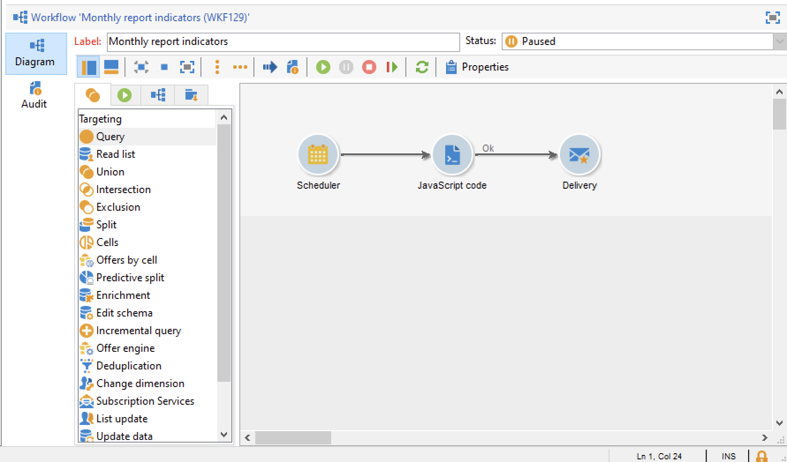

# 傳送報吿至清單{#sending-a-report-to-a-list}


此使用案例詳細說明了如何生成每月開箱即用 **[!UICONTROL Tracking indicators]** 以PDF格式報告，以及如何將其發送到收件人清單。


此使用案例的主要實施步驟是：

* 建立接收交貨的收件人清單(請參閱： [步驟1:建立收件人清單](#step-1--creating-the-recipient-list))。
* 建立交貨模板，使您每次執行工作流時都能生成新交貨(請參閱： [步驟2:建立交貨模板](#step-2--creating-the-delivery-template))。
* 建立工作流，使您能夠以PDF格式生成報告並將其發送到收件人清單(請參閱： [第3步：建立工作流](#step-3--creating-the-workflow))。

## 步驟1:建立收件人清單 {#step-1--creating-the-recipient-list}

轉到 **[!UICONTROL Profiles and targets]** 頁籤 **[!UICONTROL Lists]** 連結，然後 **[!UICONTROL Create]** 按鈕 選擇 **[!UICONTROL New list]** 並為要發送到的報告建立新收件人清單。


有關建立清單的詳細資訊，請參閱此。

## 步驟2:建立交貨模板 {#step-2--creating-the-delivery-template}

1. 轉到 **[!UICONTROL Resources > Templates > Delivery templates]** 的子目錄，並複製 **[!UICONTROL Email delivery]** 現成模板。

   

   有關建立交貨模板的詳細資訊，請參閱此。

1. 輸入各種模板參數：標籤、目標（先前建立的收件人清單）、主題和內容。

   

1. 每次執行工作流時， **[!UICONTROL Tracking indicators]** 報告已更新(請參閱 [第3步：建立工作流](#step-3--creating-the-workflow))。 要在交貨中包括報表的最新版本，您需要添加 **[!UICONTROL Calculated attachment]**:

   有關建立計算附件的詳細資訊，請參閱此。

   * 按一下 **[!UICONTROL Attachments]** 按一下 **[!UICONTROL Add]**，然後選擇 **[!UICONTROL Calculated attachment]**。

      

   * 轉到 **[!UICONTROL Type]** ，然後選擇第四個選項： **[!UICONTROL File name is computed during delivery of each message (it may then depend on the recipient profile)]**。

      

      在 **[!UICONTROL Label]** 欄位將不顯示在最終交貨中。

   * 轉到編輯區域，並輸入檔案的訪問路徑和名稱。

      

      >[!CAUTION]
      >
      >伺服器上必須存在該檔案。 其路徑和名稱必須與在 **[!UICONTROL JavaScript code]** 工作流的類型活動(請參閱： [第3步：建立工作流](#step-3--creating-the-workflow))。

   * 選擇 **[!UICONTROL Advanced]** 頁籤 **[!UICONTROL Script the name of the file name displayed in the mails sent]**。 轉到編輯區域，並輸入要在最終交貨中指定附件的名稱。

      

## 第3步：建立工作流 {#step-3--creating-the-workflow}

已為此用例建立了以下工作流。 它有三項活動：

* 一 **[!UICONTROL Scheduler]** 鍵入活動，使您每月執行一次工作流，
* 一 **[!UICONTROL JavaScript code]** 鍵入活動，使您能夠以PDF格式生成報表，
* 一個 **[!UICONTROL Delivery]** 鍵入使用先前建立的交貨模板的活動。



1. 現在轉到 **[!UICONTROL Administration > Production > Technical workflows]** 並建立新工作流。

   

1. 開始添加 **[!UICONTROL Scheduler]** 鍵入activity並配置它，以便工作流在當月的第一個星期一執行。

   

   有關配置調度程式的詳細資訊，請參閱 [調度程式](scheduler.md)。

1. 然後添加 **[!UICONTROL JavaScript code]** 鍵入活動。

   

   在編輯區域中輸入以下代碼：

   ```
   var reportName = "deliveryFeedback";
   var path = "/tmp/deliveryFeedback.pdf";
   var exportFormat = "PDF";
   var reportURL = "<PUT THE URL OF THE REPORT HERE>";
   var _ctx = <ctx _context="global" _reportContext="deliveryFeedback" />
   var isAdhoc = 0;
   
   xtk.report.export(reportName, _ctx, exportFormat, path, isAdhoc);
   ```

   使用以下變數：

   * **var reportName**:以雙引號輸入報表的內部名稱。 在本例中， **跟蹤指示器** 報告為「deliveryFeedback」。
   * **var路徑**:輸入檔案的保存路徑(&quot;tmp/files/&quot;)、要指定檔案的名稱(&quot;deliveryFeedback&quot;)和檔案副檔名(&quot;。pdf&quot;)。 在本例中，我們使用內部名稱作為檔案名。 值必須介於雙引號之間，並由&quot;+&quot;字元分隔。

      >[!CAUTION]
      >
      >檔案必須保存在伺服器上。 必須在 **[!UICONTROL General]** 的子菜單(請參閱： [步驟2:建立交貨模板](#step-2--creating-the-delivery-template))。

   * **var導出格式**:輸入檔案的導出格式(「PDF」)。
   * **var_ctx** （上下文）:在這個例子中，我們使用 **[!UICONTROL Tracking indicators]** 報告。

1. 通過添加 **[!UICONTROL Delivery]** 使用以下選項鍵入activity:

   * **[!UICONTROL Delivery]**:選擇 **[!UICONTROL New, created from a template]**，然後選擇以前建立的交貨模板。
   * 對於 **[!UICONTROL Recipients]** 和 **[!UICONTROL Content]** 欄位，選擇 **[!UICONTROL Specified in the delivery]**。
   * **[!UICONTROL Action to execute]**:選擇 **[!UICONTROL Prepare and start]**。
   * 取消檢查 **[!UICONTROL Generate an outbound transition]** 和 **[!UICONTROL Process errors]**。
   
