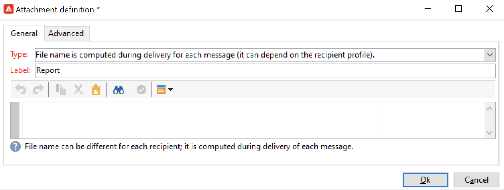

# 傳送報吿至清單{#send-a-report-to-a-list}

此使用案例詳細說明如何產生每月現成可用 **[!UICONTROL Tracking indicators]** 以PDF格式報表，以及如何將其傳送至收件者清單。


此使用案例的主要實作步驟為：

* 建立此報表的收件者清單。 [了解更多資訊](#step-1--create-the-recipient-list)。
* 建立傳送範本，此範本會在每次執行工作流程時建立新的傳送。 [了解更多資訊](#step-2--create-the-delivery-template)。
* 建立以PDF格式產生報表並將其傳送至收件者清單的工作流程。 [了解更多](#step-3--create-the-workflow)).

## 步驟1:建立收件者清單 {#step-1--create-the-recipient-list}

若要建立目標收件者清單，請遵循下列步驟：

1. 瀏覽至 **[!UICONTROL Profiles and targets]** ，按一下 **[!UICONTROL Lists]** 連結。
1. 按一下 **[!UICONTROL Create]** 按鈕。
1. 選擇 **[!UICONTROL New list]** 並為要發送到的報告建立新的收件人清單。

有關建立清單的詳細資訊，請參閱 [本節](../../v8/audiences/create-audiences.md).

## 步驟2:建立傳遞範本 {#step-2--create-the-delivery-template}

若要建立傳送範本，請遵循下列步驟：

1. 瀏覽至 **[!UICONTROL Resources > Templates > Delivery templates]** 節點，並複製 **[!UICONTROL Email delivery]** 內建範本。

   如需建立傳送範本的詳細資訊，請參閱 [本節](../../v8/send/create-templates.md).

1. 輸入模板參數：標籤、目標（先前建立的收件者清單）、主旨和內容。

   每次執行工作流程時， **[!UICONTROL Tracking indicators]** 報表已更新，如 [步驟3:建立工作流程](#step-3--creating-the-workflow))。

1. 若要在傳送中納入最新版本的報表，您必須新增 **[!UICONTROL Calculated attachment]**:

   * 按一下 **[!UICONTROL Attachments]** 連結，然後按一下 **[!UICONTROL Add]** 按鈕。 選取 **[!UICONTROL Calculated attachment...]**。

      

   * 在 **[!UICONTROL Type]** 下拉式清單中，選取最新選項： **[!UICONTROL File name is computed during delivery of each message (it may then depend on the recipient profile)]**.

      

      在 **[!UICONTROL Label]** 欄位不會顯示在最終傳送中。

   * 在文本區域中，輸入檔案的訪問路徑和名稱。

      

      >[!CAUTION]
      >
      >路徑和名稱必須與 **[!UICONTROL JavaScript code]** 工作流程的活動類型，如 [步驟3:建立工作流程](#step-3--creating-the-workflow).

   * 選取 **[!UICONTROL Advanced]** 標籤和檢查 **[!UICONTROL Script the name of the file name displayed in the mails sent]**. 在文字區域中，在最終傳送中輸入附件的名稱。

      

## 步驟3:建立工作流程 {#step-3--creating-the-workflow}

為此使用案例建立下列工作流程。


它使用三個活動：

* A **[!UICONTROL Scheduler]** 每月執行工作流程一次的活動，
* A **[!UICONTROL JavaScript code]** 活動，以PDF格式產生報表，
* A **[!UICONTROL Delivery]** 參考先前建立之傳送範本的活動。

若要建立此工作流程，請遵循下列步驟：

1. 瀏覽至 **[!UICONTROL Administration > Production > Technical workflows]** 節點，並建立新資料夾以儲存您的工作流程。
1. 建立新的工作流程。

   

1. 首先，新增 **[!UICONTROL Scheduler]** 輸入活動並加以設定，以便工作流程在當月的第一個星期一執行。

   

   有關配置調度程式的詳細資訊，請參閱 [排程器](scheduler.md).

1. 然後新增 **[!UICONTROL JavaScript code]** 類型活動。

   

   在編輯區域中輸入下列程式碼：

   ```sql
   var reportName = "indicators";
   var path = "/tmp/indicators.pdf";
   var exportFormat = "PDF";
   var reportURL = "<PUT THE URL OF THE REPORT HERE>";
   var _ctx = <ctx _context="global" _reportContext="deliveryFeedback" />
   var isAdhoc = 0;
   
   xtk.report.export(reportName, _ctx, exportFormat, path, isAdhoc);
   ```


   及下列變數：

   * **var reportName**:以雙引號輸入報表的內部名稱。 在此案例中， **追蹤指標** 報表為「deliveryFeedback」。
   * **var路徑**:輸入檔案的保存路徑(&quot;tmp&quot;)、要提供檔案的名稱(&quot;deliveryFeedback&quot;)和副檔名(&quot;。pdf&quot;)。 在此情況下，我們已使用內部名稱作為檔案名稱。 值必須在雙引號之間，並以&quot;+&quot;字元分隔。

      >[!CAUTION]
      >
      >檔案必須儲存在伺服器上。 您必須輸入與 **[!UICONTROL General]** 頁簽（如詳細說明） [此處](#step-2--create-the-delivery-template))。

   * **var exportFormat**:輸入檔案的匯出格式(「PDF」)。
   * **var_ctx** （內容）:在本例中，我們使用 **[!UICONTROL Tracking indicators]** 報告。

1. 完成，請新增 **[!UICONTROL Delivery]** 活動（包含下列選項）:

   

   * **[!UICONTROL Delivery]**:選取 **[!UICONTROL New, created from a template]**，並選取先前建立的傳送範本。
   * 若 **[!UICONTROL Recipients]** 和 **[!UICONTROL Content]** 欄位，選擇 **[!UICONTROL Specified in the delivery]**.
   * **[!UICONTROL Action to perform]**:選取 **[!UICONTROL Prepare and start]**.
   * 取消檢查 **[!UICONTROL Generate an outbound transition]** 和 **[!UICONTROL Process errors]** 選項。

1. 儲存您的變更並啟動工作流程。 訊息會在每月的第一個星期一，連同附加的報表傳送至收件者清單。