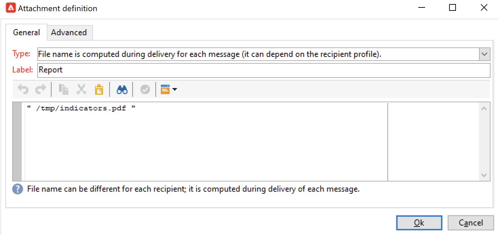

# 傳送報吿至清單{#send-a-report-to-a-list}

此使用案例詳細說明如何以PDF格式產生每月立即可用的&#x200B;**[!UICONTROL Tracking indicators]**&#x200B;報告，以及如何將其傳送給收件者清單。


此使用案例的主要實施步驟為：

* 建立此報告的收件者清單。 [了解更多](#step-1--create-the-recipient-list)。
* 建立傳遞範本，每次執行工作流程時都會建立新的傳遞。 [了解更多](#step-2--create-the-delivery-template)。
* 建立工作流程，以PDF格式產生報表並傳送至收件者清單。 [深入瞭解](#step-3--create-the-workflow))。

## 步驟1：建立收件者清單 {#step-1--create-the-recipient-list}

若要建立目標收件者清單，請遵循下列步驟：

1. 瀏覽至&#x200B;**[!UICONTROL Profiles and targets]**&#x200B;標籤，按一下&#x200B;**[!UICONTROL Lists]**&#x200B;連結。
1. 按一下 **[!UICONTROL Create]** 按鈕。
1. 選取&#x200B;**[!UICONTROL New list]**&#x200B;並為要傳送的報告建立新的收件者清單。

如需建立清單的詳細資訊，請參閱[本節](../../v8/audiences/create-audiences.md)。

## 步驟2：建立傳遞範本 {#step-2--create-the-delivery-template}

若要建立傳遞範本，請遵循下列步驟：

1. 瀏覽至Adobe Campaign總管的&#x200B;**[!UICONTROL Resources > Templates > Delivery templates]**&#x200B;節點，並複製&#x200B;**[!UICONTROL Email delivery]**&#x200B;內建範本。

   如需建立傳遞範本的詳細資訊，請參閱[本節](../../v8/send/create-templates.md)。

1. 輸入範本引數：標籤、目標（先前建立的收件者清單）、主旨與內容。

   每次執行工作流程時，都會更新&#x200B;**[!UICONTROL Tracking indicators]**&#x200B;報告，如[步驟3：建立工作流程](#step-3--creating-the-workflow)中所述。

1. 若要在傳遞中包含最新版本的報告，您必須新增&#x200B;**[!UICONTROL Calculated attachment]**：

   * 按一下&#x200B;**[!UICONTROL Attachments]**&#x200B;連結，然後按一下&#x200B;**[!UICONTROL Add]**&#x200B;按鈕旁的箭頭。 選取 **[!UICONTROL Calculated attachment...]**。

     

   * 在&#x200B;**[!UICONTROL Type]**&#x200B;下拉式清單中，選取最新的選項： **[!UICONTROL File name is computed during delivery of each message (it may then depend on the recipient profile)]**。

     

     在&#x200B;**[!UICONTROL Label]**&#x200B;欄位中輸入的值將不會出現在最終傳遞中。

   * 在文字區域中，輸入檔案的存取路徑和名稱。

     

     >[!CAUTION]
     >
     >路徑和名稱必須與在工作流程的&#x200B;**[!UICONTROL JavaScript code]**&#x200B;型別活動中輸入的路徑和名稱相同，如[步驟3：建立工作流程](#step-3--creating-the-workflow)中所述。

   * 選取&#x200B;**[!UICONTROL Advanced]**&#x200B;索引標籤並核取&#x200B;**[!UICONTROL Script the name of the file name displayed in the mails sent]**。 在文字區域中，輸入最終傳遞中的附件名稱。

     

## 步驟3：建立工作流程 {#step-3--creating-the-workflow}

針對此使用案例建立下列工作流程。


它會使用三個活動：

* 每月執行一次工作流程的&#x200B;**[!UICONTROL Scheduler]**&#x200B;活動，
* 以PDF格式產生報表的&#x200B;**[!UICONTROL JavaScript code]**&#x200B;活動，
* 參考先前建立之傳遞範本的&#x200B;**[!UICONTROL Delivery]**&#x200B;活動。

若要建置此工作流程，請遵循下列步驟：

1. 瀏覽至Campaign Explorer的&#x200B;**[!UICONTROL Administration > Production > Technical workflows]**&#x200B;節點，並建立新資料夾以儲存您的工作流程。
1. 建立新的工作流程。

   

1. 從新增&#x200B;**[!UICONTROL Scheduler]**&#x200B;型別活動並加以設定開始，讓工作流程在當月第一個星期一執行。

   

   如需設定排程器的詳細資訊，請參閱[排程器](scheduler.md)。

1. 然後新增&#x200B;**[!UICONTROL JavaScript code]**&#x200B;型別活動。

   

   在編輯區域中輸入下列程式碼：

   ```sql
   var reportName = "indicators";
   var path = "/tmp/indicators.pdf";
   var exportFormat = "PDF";
   var reportURL = "<PUT THE URL OF THE REPORT HERE>";
   var _ctx = <ctx _context="global" _reportContext="deliveryFeedback" />
   var isAdhoc = 0;
   
   xtk.report.export(reportName, _ctx, exportFormat, path, isAdhoc);
   ```


   ，並使用下列變數：

   * **var reportName**：以雙引號輸入報告的內部名稱。 在這種情況下，**追蹤指標**&#x200B;報告的內部名稱為「deliveryFeedback」。
   * **var路徑**：輸入檔案的儲存路徑(「tmp」)、您要提供檔案的名稱(「deliveryFeedback」)和副檔名(「.pdf」)。 在此案例中，我們使用內部名稱作為檔案名稱。 值必須位於雙引號之間，並以「+」字元分隔。

     >[!CAUTION]
     >
     >檔案必須儲存在伺服器上。 您必須為已計算的附件輸入與編輯視窗之&#x200B;**[!UICONTROL General]**&#x200B;索引標籤相同的路徑和名稱，如詳細的[此處](#step-2--create-the-delivery-template)所示。

   * **var exportFormat**：輸入檔案的匯出格式(「PDF」)。
   * **var _ctx** （內容）：在此案例中，我們在其全域內容中使用&#x200B;**[!UICONTROL Tracking indicators]**&#x200B;報告。

1. 使用下列選項新增&#x200B;**[!UICONTROL Delivery]**&#x200B;活動以完成：

   

   * **[!UICONTROL Delivery]**：選取&#x200B;**[!UICONTROL New, created from a template]**，然後選取先前建立的傳遞範本。
   * 針對&#x200B;**[!UICONTROL Recipients]**&#x200B;和&#x200B;**[!UICONTROL Content]**&#x200B;欄位，選取&#x200B;**[!UICONTROL Specified in the delivery]**。
   * **[!UICONTROL Action to perform]**：選取&#x200B;**[!UICONTROL Prepare and start]**。
   * 取消勾選&#x200B;**[!UICONTROL Generate an outbound transition]**&#x200B;和&#x200B;**[!UICONTROL Process errors]**&#x200B;選項。

1. 儲存變更並啟動工作流程。 該訊息會在該月的第一個星期一傳送至收件者清單，並附上報告。
