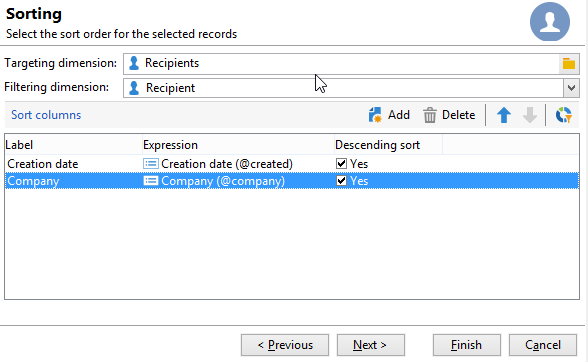

# 分割{#split}

**分割**&#x200B;型別的活動可讓您將目標分割成數個子集。 使用所有接收的結果建構目標：所有先前的活動都必須已完成，才能執行此活動。

此活動不會觸發入站母體的聯合。 如果數個轉變位於一個分割活動中，我們建議在它前面插入&#x200B;**[!UICONTROL Union]**&#x200B;活動。

>[!NOTE]
>
>無法對具有不同來源的資料表執行分割作業。 為此，您需要在&#x200B;**分割**&#x200B;活動之前新增&#x200B;**擴充**&#x200B;活動。

* 如需使用分割活動的範例，請參閱[本區段](targeting-workflows.md#create-subsets-using-the-split-activity)。
* 說明如何使用「分割」活動，以使用篩選條件將目標分割成不同母體的範例，請參閱[本節](cross-channel-delivery-workflow.md)。
* [此區段](javascript-scripts-and-templates.md)提供如何在分割活動中使用執行個體變數的範例。

若要設定此活動，請在&#x200B;**[!UICONTROL Subsets]**&#x200B;索引標籤中定義子集內容和標籤，然後在&#x200B;**[!UICONTROL General]**&#x200B;索引標籤中選擇目標維度。

## 建立子集 {#create-subsets}

若要建立子集：

1. 按一下比對欄位中的標籤，然後選取要套用的篩選器。
1. 若要篩選傳入母體，請選取&#x200B;**[!UICONTROL Add a filtering condition]**&#x200B;選項並按一下&#x200B;**[!UICONTROL Edit...]**&#x200B;連結。

   選取要套用至資料的篩選器型別，以將其納入此集。

   處理程式與&#x200B;**Query**&#x200B;型別活動的處理程式相同。

   >[!NOTE]
   >
   >您最多可以篩選兩個外部資料庫(FDA)中的資料。

1. 您可以指定要從目標擷取的最大記錄數，以建立子集。 若要這麼做，請核取&#x200B;**[!UICONTROL Limit the selected records]**&#x200B;選項並按一下&#x200B;**[!UICONTROL Edit...]**&#x200B;連結。

   精靈可讓您選擇此子集記錄的選擇模式。 [了解更多](#limit-the-number-of-subset-records)。

   

1. 您也可以&#x200B;**使用&#x200B;**[!UICONTROL Add]**按鈕**&#x200B;新增其他子集。

   

   >[!NOTE]
   >
   >如果未核取&#x200B;**[!UICONTROL Enable overlapping of output populations]**&#x200B;選項，則會以索引標籤的順序建立子集。 使用此視窗右上方的箭頭來移動它們。 舉例來說，如果第一個子集復原了初始母體的70%，則下一個子集只會將其選取條件套用至剩餘的30%，以此類推。

   對於每個建立的子集，外站轉變將會新增到分割活動中。

   

   您可以選擇產生單一出站轉變（例如使用區段代碼識別集合）：若要這麼做，請選取&#x200B;**[!UICONTROL General]**&#x200B;索引標籤中的&#x200B;**[!UICONTROL Generate subsets in the same table]**&#x200B;選項。

   完成後，每個子集的區段代碼會自動儲存在其他欄中。 您可在傳遞層級的個人化欄位中存取此欄。

## 限制子集記錄的數量 {#limit-the-number-of-subset-records}

如果您不想使用子集包含的整個母體，您可以限制它包含的記錄數。

1. 在子集編輯視窗中，核取&#x200B;**[!UICONTROL Limit the selected records]**&#x200B;選項並按一下&#x200B;**[!UICONTROL Edit...]**&#x200B;連結。
1. 選取您選擇的限制型別：

   * **[!UICONTROL Activate random sampling]**：此選項會採用記錄的隨機抽樣。 套用的隨機抽樣型別取決於資料庫引擎。
   * **[!UICONTROL Keep only the first records after sorting]**：此選項可讓您根據一或多個排序順序定義限制。 如果您選取&#x200B;**[!UICONTROL Age]**&#x200B;欄位作為排序標準，選取100作為限制，則只會保留最年輕的100位收件者。
   * **[!UICONTROL Keep the first ones after sorting (criteria, random)]**：此選項會結合前兩個選項。 它可讓您根據一或多個排序順序定義限制，然後在某些記錄具有與定義條件相同的值時，在第一筆記錄上套用隨機選擇。

     例如，如果您選取&#x200B;**[!UICONTROL Age]**&#x200B;欄位作為排序條件，然後定義了100的限制，但資料庫中2000個最年輕的收件者皆為18個，則會從這2000個收件者中隨機選取100個收件者。

   

1. 如果您想要定義排序標準，另一個步驟可讓您定義欄及排序順序。

   

1. 然後選擇資料限制方法。

   

   有幾種方法可以做到：

   * **[!UICONTROL Size (in %)]**：記錄的百分比。 例如，下列設定會擷取總母體的10%。

     百分比會套用至初始母體，而非活動結果。

   * **[!UICONTROL Size (as a % of the segment)]**：只與子集相關而不與初始母體相關的記錄百分比。
   * **[!UICONTROL Maximum size]**：記錄數上限。
   * **[!UICONTROL By data grouping]**：您可以根據入站母體的指定欄位中的值，設定記錄數限制。 [了解更多](#limit-the-number-of-subset-records-by-data-grouping)。
   * **[!UICONTROL By data grouping (in %)]**：您可以使用百分比，根據入站母體的指定欄位中的值，設定記錄數限制。 [了解更多](#limit-the-number-of-subset-records-by-data-grouping)。
   * **[!UICONTROL By data distribution]**：如果您的分組欄位有太多值，或您想避免為每個新的分割活動再次輸入值，Adobe Campaign可讓您設定&#x200B;**[!UICONTROL By data distribution]**&#x200B;限制（選用的分散式行銷模組）。 [了解更多](#limit-the-number-of-subset-records-per-data-distribution)。

1. 按一下&#x200B;**[!UICONTROL Finish]**&#x200B;以核准記錄選取條件。 然後定義的組態會顯示在編輯器的中間視窗中。

## 依資料分組限制子集記錄數量 {#limit-the-number-of-subset-records-by-data-grouping}

您可以依資料分組限制記錄數量。 此限制可使用固定值或百分比來執行。

例如，如果您選取&#x200B;**[!UICONTROL Language]**&#x200B;欄位作為群組欄位，則可以為每種語言定義記錄清單。

1. 選取資料限制值後，選取&#x200B;**[!UICONTROL By data grouping]**&#x200B;或&#x200B;**[!UICONTROL By data grouping (as a %)]**&#x200B;並按一下&#x200B;**[!UICONTROL Next]**。

   

1. 然後選取分組欄位（執行個體的&#x200B;**[!UICONTROL Language]**&#x200B;欄位）並按一下&#x200B;**[!UICONTROL Next]**。

   

1. 最後，指定資料分組臨界值（使用固定值或百分比，視先前選取的分組方法而定）。 若要為每個值設定相同的臨界值，例如，如果您要將每種語言的記錄數設為10，請選取&#x200B;**[!UICONTROL All data groupings are the same size]**&#x200B;選項。 若要為每個值設定不同的限制，請選取&#x200B;**[!UICONTROL Limitations by grouping value]**&#x200B;選項。 這可讓您針對英文、法文等選擇不同的限制。

   

1. 按一下&#x200B;**[!UICONTROL Finish]**&#x200B;以核准限制並返回編輯分割活動。

## 限制每個資料分佈的子集記錄數 {#limit-the-number-of-subset-records-per-data-distribution}

如果您的分組欄位包含太多值，或您想避免為每個新的分割活動重設值，Adobe Campaign可讓您為每個資料分佈建立限制。 選取[資料限制值](#create-subsets)區段)時，請選取&#x200B;**[!UICONTROL By data distribution]**&#x200B;選項，然後從下拉式功能表中選取範本。 建立資料發佈範本的示例如下。

如需具有發佈範本的&#x200B;**[!UICONTROL Local approval]**&#x200B;活動的範例，請參閱[此頁面](local-approval-activity.md)。

>[!CAUTION]
>
>此函式僅適用於[分散式行銷附加元件](../distributed-marketing/about-distributed-marketing.md)。 請檢查您的授權合約。

資料分佈範本可讓您使用分組值清單來限制記錄數量。 若要建立資料發佈範本，請套用下列步驟：

1. 若要建立資料發佈範本，請前往&#x200B;**[!UICONTROL Resources > Campaign management > Data distribution]**&#x200B;節點並按一下&#x200B;**[!UICONTROL New]**。

   

1. **[!UICONTROL General]**&#x200B;索引標籤可讓您輸入發佈的標籤和執行內容（目標維度、發佈欄位）。

   

   需要輸入下列欄位：

   * **[!UICONTROL Label]**：發佈範本的標籤。
   * **[!UICONTROL Targeting dimension]**：輸入將套用資料分佈的目標維度，**[!UICONTROL Recipient]**&#x200B;針對執行個體。 此結構描述必須始終與目標工作流程中使用的資料相容。
   * **[!UICONTROL Distribution field]**：透過目標維度選取欄位。 例如，如果您選取&#x200B;**[!UICONTROL Email domain]**&#x200B;欄位，收件者清單將會依網域劃分。
   * **[!UICONTROL Distribution type]**：選取在&#x200B;**[!UICONTROL Distribution]**&#x200B;索引標籤中劃分目標限制值的方式： **[!UICONTROL Percentage]**&#x200B;或&#x200B;**[!UICONTROL Set]**。
   * **[!UICONTROL Approval storage]**：如果您在目標工作流程中使用[本機核准](local-approval.md)活動，請輸入將儲存核准結果的結構描述。 您必須為每個目標結構描述指定一個儲存結構描述。 如果您使用&#x200B;**[!UICONTROL Recipients]**&#x200B;目標定位結構描述，請輸入預設的&#x200B;**[!UICONTROL Local approval of recipients]**&#x200B;儲存結構描述。

     在資料分組沒有本機核准的簡單限制中，您不需要輸入&#x200B;**[!UICONTROL Approvals storage]**&#x200B;欄位。

1. 如果您使用[本機核准](local-approval.md)活動，請輸入散發範本的&#x200B;**[!UICONTROL Advanced settings]**：

   

   需要輸入下列欄位：

   * **[!UICONTROL Approve targeted messages]**：如果您想要從要核准的收件者清單中預先選取所有收件者，請核取此選項。 如果未核取此選項，則不會預先選取任何收件者。

     >[!NOTE]
     >
     >此選項預設為勾選。

     

   * **[!UICONTROL Delivery label]**：可讓您定義運算式，以在回訪通知中顯示傳遞標籤。 預設運算式提供有關傳遞標準標籤（計算字串）的資訊。 您可以修改此運算式。

     

   * **[!UICONTROL Grouping field]**：此欄位可讓您定義用來在核准和傳回通知中顯示收件者的群組。

     

   * **[!UICONTROL Web Interface]**：可讓您將Web應用程式連結至收件者清單。 在核准和回訪通知中，每個收件者都將可點按，並連結至選取的網頁應用程式。 **[!UICONTROL Parameters]**&#x200B;欄位（例如&#x200B;**[!UICONTROL recipientId]**）可讓您設定要在URL和網頁應用程式中使用的其他引數。

1. **[!UICONTROL Breakdown]**&#x200B;索引標籤可讓您定義通訊群組值的清單。

   

   * **[!UICONTROL Value]**：輸入分佈值。
   * **[!UICONTROL Percentage / Set]**：輸入連結至每個值的記錄限制（固定或百分比）。

     此資料行是由&#x200B;**[!UICONTROL General]**&#x200B;索引標籤內的&#x200B;**[!UICONTROL Distribution type]**&#x200B;欄位所定義。

   * **[!UICONTROL Label]**：輸入連結到每個值的標籤。
   * **[!UICONTROL Group or operator]**：如果您使用[本機核准](local-approval.md)活動，請選取指派給每個散發值的運運算元或運運算元群組。

     在資料分組沒有本機核准的簡單限制中，您不需要輸入&#x200B;**[!UICONTROL Group or operator]**&#x200B;欄位。

     >[!CAUTION]
     >
     >請確定已指派適當的許可權給運運算元。

## 篩選引數 {#filtering-parameters}

按一下&#x200B;**[!UICONTROL General]**&#x200B;標籤以輸入活動標籤。 選取此分割的目標和篩選維度。 如有必要，您可以變更指定子集的這些維度。

如果要利用剩餘母體，請核取&#x200B;**[!UICONTROL Generate complement]**&#x200B;選項。 補充是入站目標減去子集的聯合。 然後，會將額外的出站轉變新增至活動，如下所示：

若要讓此選項正確運作，傳入資料必須具有主索引鍵。

例如，如果資料是透過&#x200B;**[!UICONTROL Data loading (RDBMS)]**&#x200B;活動直接從外部資料庫(例如Netezza （不支援索引的概念）讀取，則&#x200B;**[!UICONTROL Split]**&#x200B;活動產生的補數將會不正確。

若要避免此問題，您可以將&#x200B;**[!UICONTROL Enrichment]**&#x200B;活動拖放到&#x200B;**[!UICONTROL Split]**&#x200B;活動之前。 在&#x200B;**[!UICONTROL Enrichment]**&#x200B;活動中，核取&#x200B;**[!UICONTROL Keep all additional data from the main set]**，並在其他資料中指定您要用來設定&#x200B;**[!UICONTROL Split]**&#x200B;活動篩選器的資料行。 然後，**[!UICONTROL Split]**&#x200B;活動之入站轉變的資料會儲存在Adobe Campaign伺服器上的暫存表格中，且補碼可以正確產生。

**[!UICONTROL Enable overlapping of output populations]**&#x200B;選項可讓您管理屬於數個子集的母體：

* 當未選取該方塊時，分割活動將確保收件者不能出現在多個輸出轉換中，即使其滿足多個子集的條件也是如此。它們會位於具有相符條件的第一個標籤的目標中。
* 當選取該方塊時，符合篩選條件的收件者，會出現在多個子集中。Adobe Campaign 建議使用排除條件。

## 輸入引數 {#input-parameters}

* tableName
* 結構描述

每個傳入事件都必須指定由這些引數定義的目標。

## 輸出引數 {#output-parameters}

* tableName
* 結構描述
* recCount

這組三個值可識別排除所產生的目標。 **[!UICONTROL tableName]**&#x200B;是記錄目標識別碼的資料表的名稱，**[!UICONTROL schema]**&#x200B;是母體的結構描述（通常是nms：recipient），而&#x200B;**[!UICONTROL recCount]**&#x200B;是資料表中的元素數目。

與補充關聯的轉變有相同的引數。
