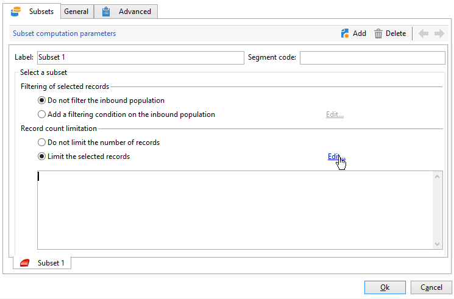
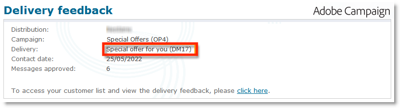

# 分割{#split}

A **分割**-type活動可讓您將目標分割為數個子集。 目標是用所有接收結果構建的：因此，所有先前的活動必須已完成，才能執行此活動。

此活動不會觸發入站母體的聯合。 如果數個轉變落在一個分割活動中，建議您插入 **[!UICONTROL Union]** 前面的活動。

如需所使用分割活動的範例，請參閱 [本節](targeting-workflows.md#create-subsets-using-the-split-activity).

說明如何使用分割活動，以透過篩選條件將目標細分為不同母體的範例，如 [本節](cross-channel-delivery-workflow.md).

有關如何在分割活動中使用例項變數的範例，請參閱 [本節](javascript-scripts-and-templates.md).

若要設定此活動，請在 **[!UICONTROL Subsets]** 標籤，然後在 **[!UICONTROL General]** 標籤。

## 建立子集 {#create-subsets}

要建立子集：

1. 在相符欄位中按一下標籤，然後選取要套用的篩選。
1. 若要篩選入站母體，請選取 **[!UICONTROL Add a filtering condition]** ，然後按一下 **[!UICONTROL Edit...]** 連結。

   選取要套用至資料的篩選器類型，以將其納入此集。

   程式與 **查詢**-type活動。

   >[!NOTE]
   >
   >您最多可以篩選兩個外部資料庫(FDA)中的資料。

1. 您可以指定要從目標中提取以建立子集的最大記錄數。 若要這麼做，請檢查 **[!UICONTROL Limit the selected records]** ，然後按一下 **[!UICONTROL Edit...]** 連結。

   嚮導允許您選擇此子集的記錄的選擇模式。 [了解更多資訊](#limit-the-number-of-subset-records)。

   

1. 如果你願意，你可以 **添加其他子集** 使用 **[!UICONTROL Add]** 按鈕。

   

   >[!NOTE]
   >
   >若 **[!UICONTROL Enable overlapping of output populations]** 選項，則按頁簽的順序建立子集。 使用此窗口右上角的箭頭來移動它們。 例如，如果第一個子集恢復了初始母體的70%，則下一個子集將只將其選擇標準應用於剩餘的30%，以此類推。

   對於已建立的每個子集，將向拆分活動添加出站轉變。

   

   您可以選擇產生單一出站轉變（例如，並使用區段代碼來識別集）:要執行此操作，請選取 **[!UICONTROL Generate subsets in the same table]** 選項 **[!UICONTROL General]** 標籤。

   如果完成，則每個子集的區段代碼會自動儲存在另一欄中。 您可以在傳送層級的個人化欄位中存取此欄。

## 限制子集記錄數 {#limit-the-number-of-subset-records}

如果您不想使用子集中包含的整個母體，則可以限制其將包含的記錄數。

1. 在子集編輯窗口中，檢查 **[!UICONTROL Limit the selected records]** ，然後按一下 **[!UICONTROL Edit...]** 連結。
1. 選取您選擇的限制類型：

   * **[!UICONTROL Activate random sampling]**:此選項會取用隨機的記錄範例。 套用的隨機取樣類型取決於資料庫引擎。
   * **[!UICONTROL Keep only the first records after sorting]**:此選項可讓您根據一或多個排序順序定義限制。 如果您選取 **[!UICONTROL Age]** 欄位作為排序標準，100作為限制，只會保留最年輕的100個收件者。
   * **[!UICONTROL Keep the first ones after sorting (criteria, random)]**:此選項會結合前兩個選項。 它可讓您根據一或多個排序順序定義限制，如果某些記錄的值與定義的准則相同，則對第一個記錄套用隨機選取。

      例如，若您選取 **[!UICONTROL Age]** 欄位作為排序標準，然後您會定義100的限制，但資料庫中2000個最年輕的收件者都是18個，則從2000個收件者中隨機選取100個收件者。
   

1. 如果您想要定義排序標準，可使用其他步驟來定義欄和排序順序。

   

1. 然後選擇資料限制方法。

   

   執行此作業有數種方式：

   * **[!UICONTROL Size (in %)]**:記錄的百分比。 例如，下方的設定會擷取總母體的10%。

      百分比適用於初始母體，而非活動的結果。

   * **[!UICONTROL Size (as a % of the segment)]**:僅與子集而不是與初始母體相關的記錄百分比。
   * **[!UICONTROL Maximum size]**:記錄數上限。
   * **[!UICONTROL By data grouping]**:您可以根據入站母體之指定欄位中的值，設定記錄數限制。 [了解更多資訊](#limit-the-number-of-subset-records-by-data-grouping)。
   * **[!UICONTROL By data grouping (in %)]**:您可以根據入站母體的指定欄位中的值，使用百分比來設定記錄數限制。 [了解更多資訊](#limit-the-number-of-subset-records-by-data-grouping)。
   * **[!UICONTROL By data distribution]**:如果您的分組欄位有太多值，或您不想為每個新分割活動再次輸入值，則Adobe Campaign可讓您設定 **[!UICONTROL By data distribution]** 限制（選用的Distributed Marketing模組）。 [了解更多資訊](#limit-the-number-of-subset-records-per-data-distribution)。

1. 按一下 **[!UICONTROL Finish]** 批准記錄選擇標準。 定義的設定隨後會顯示在編輯器的中間視窗中。

## 按資料分組限制子集記錄數 {#limit-the-number-of-subset-records-by-data-grouping}

您可以依資料分組來限制記錄數。 此限制可使用固定值或百分比執行。

例如，若您選取 **[!UICONTROL Language]** 欄位作為群組欄位，您可以定義每種語言的記錄清單。

1. 選取資料限制值後，請選取 **[!UICONTROL By data grouping]** 或 **[!UICONTROL By data grouping (as a %)]** 按一下 **[!UICONTROL Next]**.

   

1. 然後選取分組欄位( **[!UICONTROL Language]** 欄位)，然後按一下 **[!UICONTROL Next]**.

   

1. 最後，指定資料分組臨界值（使用固定值或百分比，視先前選取的分組方法而定）。 若要為每個值設定相同的臨界值，例如，如果您想要將每種語言的記錄數設為10，請選取 **[!UICONTROL All data groupings are the same size]** 選項。 若要為每個值設定不同的限制，請選取 **[!UICONTROL Limitations by grouping value]** 選項。 這可讓您選擇不同的英文、法文等限制。

   

1. 按一下 **[!UICONTROL Finish]** 批准限制並返回編輯拆分活動。

## 限制每個資料分發的子集記錄數 {#limit-the-number-of-subset-records-per-data-distribution}

如果您的分組欄位包含的值過多，或您不想重設每個新分割活動的值，Adobe Campaign可讓您針對資料分送建立限制。 選取 [資料限制值](#create-subsets) 部分)，選擇 **[!UICONTROL By data distribution]** ，然後從下拉式功能表中選取範本。 以下示範如何建立資料分送範本。

例如 **[!UICONTROL Local approval]** 具有發佈範本的活動，請參閱 [本頁](local-approval-activity.md).

>[!CAUTION]
>
>此函式僅可搭配 [分散式行銷附加元件](../distributed-marketing/about-distributed-marketing.md). 請檢查您的授權合約。

資料分送範本可讓您使用分組值清單來限制記錄數。 若要建立資料分送範本，請套用下列步驟：

1. 若要建立資料分送範本，請前往 **[!UICONTROL Resources > Campaign management > Data distribution]** 節點，按一下 **[!UICONTROL New]**.

   

1. 此 **[!UICONTROL General]** 索引標籤可讓您輸入分送的標籤和執行內容（目標維度、分送欄位）。

   

   需要輸入下列欄位：

   * **[!UICONTROL Label]**:分送範本的標籤。
   * **[!UICONTROL Targeting dimension]**:輸入要套用資料分送的目標維度， **[!UICONTROL Recipient]** 例如。 此結構必須始終與目標工作流程中使用的資料相容。
   * **[!UICONTROL Distribution field]**:透過目標維度選取欄位。 例如，若您選取 **[!UICONTROL Email domain]** 欄位中，收件者清單將依網域劃分。
   * **[!UICONTROL Distribution type]**:在 **[!UICONTROL Distribution]** 標籤： **[!UICONTROL Percentage]** 或 **[!UICONTROL Set]**.
   * **[!UICONTROL Approval storage]**:若您使用 [本地批准](local-approval.md) 活動，請輸入要儲存核准結果的結構。 必須為每個目標架構指定一個儲存架構。 如果您使用 **[!UICONTROL Recipients]** 目標結構，輸入預設 **[!UICONTROL Local approval of recipients]** 儲存架構。

      若未經本機核准而透過資料分組進行簡單限制，您不需要輸入 **[!UICONTROL Approvals storage]** 欄位。

1. 如果您使用 [本地批准](local-approval.md) 活動，請輸入 **[!UICONTROL Advanced settings]** （針對發佈範本）:

   

   需要輸入下列欄位：

   * **[!UICONTROL Approve targeted messages]**:如果您希望從要核准的收件者清單中預先選取所有收件者，請核取此選項。 如果取消勾選此選項，則不會預先選取任何收件者。

      >[!NOTE]
      >
      >預設會勾選此選項。

      

   * **[!UICONTROL Delivery label]**:可讓您定義運算式，以在傳回通知中顯示傳送標籤。 預設運算式提供傳送（計算字串）之標準標籤的相關資訊。 您可以修改此運算式。

      

   * **[!UICONTROL Grouping field]**:此欄位可讓您定義用來在核准和傳回通知中顯示收件者的分組。

      

   * **[!UICONTROL Web Interface]**:可讓您將Web應用程式連結至收件者清單。 在核准和傳回通知中，每個收件者都可點按，並連結至選取的Web應用程式。 此 **[!UICONTROL Parameters]** 欄位(例如 **[!UICONTROL recipientId]**)可讓您設定要用於URL和Web應用程式的其他參數。

1. 此 **[!UICONTROL Breakdown]** 索引標籤可讓您定義分送值清單。

   

   * **[!UICONTROL Value]**:輸入分配值。
   * **[!UICONTROL Percentage / Set]**:輸入連結到每個值的記錄限制（固定或百分比）。

      此欄由 **[!UICONTROL Distribution type]** 欄位 **[!UICONTROL General]** 標籤。

   * **[!UICONTROL Label]**:輸入連結到每個值的標籤。
   * **[!UICONTROL Group or operator]**:如果您使用[本地批准](local-approval.md) 活動，選擇分配給每個分配值的運算子或運算子組。

      若未經本機核准而透過資料分組進行簡單限制，您不需要輸入 **[!UICONTROL Group or operator]** 欄位。

      >[!CAUTION]
      >
      >請確定已為運算子指派適當的權限。

## 篩選參數 {#filtering-parameters}

按一下 **[!UICONTROL General]** 索引標籤來輸入活動標籤。 為此分割選取目標維度並篩選維度。 如有必要，您可以為指定子集更改這些維。

檢查 **[!UICONTROL Generate complement]** 選項。 補充是傳入目標減去子集的聯合。 接著，會新增其他出站轉變至活動，如下所示：

若要讓此選項正常運作，入站資料必須具有主索引鍵。

例如，如果資料是直接從外部資料庫讀取，例如，Netezza（不支援索引的概念），則透過 **[!UICONTROL Data loading (RDBMS)]** 活動，由 **[!UICONTROL Split]** 活動將不正確。

若要避免此情況，您可以拖放 **[!UICONTROL Enrichment]** 活動之前 **[!UICONTROL Split]** 活動。 在 **[!UICONTROL Enrichment]** 活動，檢查 **[!UICONTROL Keep all additional data from the main set]** 並在其他資料中指定您要用來設定 **[!UICONTROL Split]** 活動。 來自 **[!UICONTROL Split]** 活動接著會儲存在Adobe Campaign伺服器上的本機臨時表格中，且可正確產生補充。

此 **[!UICONTROL Enable overlapping of output populations]** 選項可讓您管理屬於數個子集的母體：

* 未核取方塊時，分割活動會確保收件者無法出現在數個輸出轉變中，即使符合數個子集的准則亦然。 它們會位於第一個索引標籤的目標中，且具有相符的條件。
* 核取方塊後，如果收件者符合其篩選准則，即可在數個子集中找到收件者。 Adobe Campaign建議使用獨家條件。

## 輸入參數 {#input-parameters}

* tableName
* 綱要

每個入站事件都必須指定由這些參數定義的目標。

## 輸出參數 {#output-parameters}

* tableName
* 綱要
* recCount

這組三個值可識別排除後產生的目標。 **[!UICONTROL tableName]** 是記錄目標標識符的表的名稱， **[!UICONTROL schema]** 是母體的綱要（通常為nms:recipient）和 **[!UICONTROL recCount]** 是表格中的元素數。

與補體相關聯的轉變具有相同的參數。
