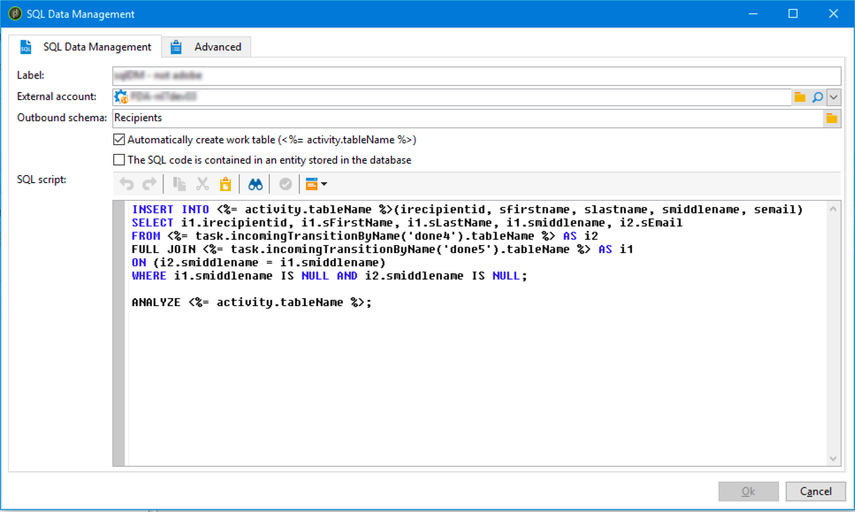

# SQL 資料管理{#sql-data-management}

**SQL資料管理**&#x200B;活動可讓您撰寫自己的SQL指令碼，以建立和填入工作表。

## 先決條件 {#prerequisites}

在設定活動之前，請確定已符合下列必要條件：

* 活動僅適用於遠端資料來源。
* 傳出綱要必須存在於資料庫中，並連結至FDA資料庫。

## 重要備註 {#important-notes}

從8.9.1開始，**[!UICONTROL SQL code]**&#x200B;和&#x200B;**[!UICONTROL SQL Data Management]**&#x200B;工作流程活動已經過改善，以便在從Campaign執行自訂SQL時，能更妥善地保護PostgreSQL資料庫，並讓工作流程順暢地執行。

如果發生錯誤，有兩種解決方案可供使用：

* 方案1 — `XtkSecurity_FeatureFlag_SqlSensitive`
* 解決方案2 — `XtkSecurity_SqlSensitive_Methods`

如需詳細資訊和最佳實務，請參閱[SQL程式碼](sql-code-and-javascript-code.md#important-notes)。

## 設定SQL資料管理活動 {#configuring-the-sql-data-management-activity}

1. 指定活動&#x200B;**[!UICONTROL Label]**。
1. 選取要使用的&#x200B;**[!UICONTROL External account]**，然後選取連結至此外部帳戶的&#x200B;**[!UICONTROL Outbound schema]**。

   >[!CAUTION]
   >
   >傳出結構描述是固定的，無法編輯。

1. 新增SQL指令碼。

   >[!CAUTION]
   >
   >SQL指令碼編寫者有責任確認SQL指令碼正常運作，以及其參考（欄位名稱等） 符合傳出綱要。

   如果要載入現有的SQL程式碼，請選取&#x200B;**[!UICONTROL The SQL script is contained in an entity stored in the database]**&#x200B;選項。 SQL指令碼必須建立並儲存在&#x200B;**[!UICONTROL Administration]** / **[!UICONTROL Configuration]** / **[!UICONTROL SQL scripts]**&#x200B;功能表中。

   否則，請在專用區域中輸入或複製貼上您的SQL指令碼。

   

   活動可讓您在指令碼中使用下列變數：

   * **activity.tableName**：輸出工作表的SQL名稱。
   * **task.incomingTransitionByName(&#39;name&#39;)。tableName**：要使用的傳入轉變所承載的工作表的SQL名稱（轉變由其名稱識別）。

     >[!NOTE]
     >
     >(&#39;name&#39;)值對應至轉變屬性中的&#x200B;**[!UICONTROL Name]**&#x200B;欄位。

1. 如果SQL指令碼已經包含建立外送工作表的命令，請取消選取&#x200B;**[!UICONTROL Automatically create work table]**&#x200B;選項。 否則，工作流程執行後會自動建立工作表。
1. 按一下&#x200B;**[!UICONTROL Ok]**&#x200B;以確認活動設定。

該活動現已完成設定。 它可以在工作流程中執行。

>[!CAUTION]
>
>執行活動後，出站轉變記錄計數僅為指示性。 它可能會根據SQL指令碼的複雜度而有所不同。
>  
>如果活動重新啟動，則會從一開始執行整個指令碼，無論其執行狀態為何。

## SQL指令碼範例 {#sql-script-samples}

>[!NOTE]
>
>本節中的指令碼範例旨在在PostgreSQL下執行。

以下指令碼可讓您建立工作表，並將資料插入此相同工作表：

```
CREATE UNLOGGED TABLE <%= activity.tableName %> (
  iRecipientId INTEGER DEFAULT 0,
  sFirstName VARCHAR(100),
  sMiddleName VARCHAR(100),
  sLastName VARCHAR(100),
  sEmail VARCHAR(100)
);

INSERT INTO <%= activity.tableName %>
SELECT iRecipientId, sFirstName, sMiddleName, sLastName, sEmail
FROM nmsRecipient
GROUP BY iRecipientId, sFirstName, sMiddleName, sLastName, sEmail;
```

以下指令碼可讓您執行CTAS作業(CREATE TABLE AS SELECT)並建立工作表索引：

```
CREATE TABLE <%= activity.tableName %>
AS SELECT iRecipientId, sEmail, sFirstName, sLastName, sMiddleName
FROM nmsRecipient
WHERE sEmail IS NOT NULL
GROUP BY iRecipientId, sEmail, sFirstName, sLastName, sMiddleName;

CREATE INDEX ON <%= activity.tableName %> (sEmail);

ANALYZE <%= activity.tableName %> (sEmail);
```

以下指令碼可讓您合併兩個工作表格：

```
CREATE TABLE <%= activity.tableName %>
AS SELECT i1.sFirstName, i1.sLastName, i2.sEmail
FROM <%= task.incomingTransitionByName('input1').tableName %> i1
JOIN <%= task.incomingTransitionByName('input2').tableName %> i2 ON (i1.id = i2.id)
```
