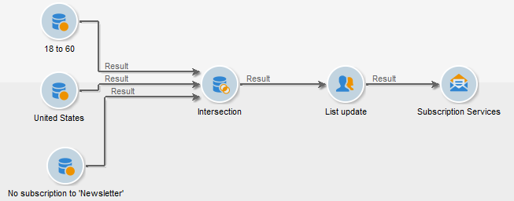

# 訂閱服務{#subscription-services}

A **訂閱服務**-type活動可讓您為轉變中指定的母體建立或刪除資訊服務的訂閱。

若要設定，請編輯活動並輸入其標籤，然後選取要執行的動作（訂閱或取消訂閱）和相關服務，如下列範例所示：

1. 輸入活動的標籤。
1. 選擇 **[!UICONTROL Generate an outbound transition]** 如果要在執行結束時建立轉變。

   一般而言，目標對資訊服務的訂閱會標籤目標工作流程的結尾，因此預設不會啟用選項。

1. 按一下 **[!UICONTROL Subscription]** 或 **[!UICONTROL Unsubscription]** 如果您希望向所選資訊服務訂閱或取消訂閱指定的母體。
1. 選擇 **[!UICONTROL Send a confirmation message]** 通知收件者已訂閱或取消訂閱服務。

   此訊息的內容在與資訊服務相關的傳遞範本中指定。

## 範例：訂閱電子報的收件者清單 {#example--subscribe-a-list-of-recipients-to-a-newsletter}

在單一操作中，以下工作流程旨在建立符合電子報資格的收件者清單，以便讓居住在巴黎的工作人員訂閱。

若要這麼做，您也必須排除已訂閱的收件者。

>[!CAUTION]
>
>手動將收件者訂閱服務之前，請確認這些收件者接受您的通訊。

1. 新增下列三個查詢：

   * 一個目標是18至60歲的收件者。
   * 第二個目標是居住在巴黎的收件者。
   * 第三個目標收件者，目前未訂閱電子報。

1. 新增交叉點活動以交叉參考不同的結果。
1. 您也可以插入清單更新，讓最新訂閱者的清單保持最新。
1. 插入訂閱服務活動，然後按兩下此活動進行配置。
1. 輸入活動標籤並選取 **[!UICONTROL Subscription]**.

   您也可以檢查 **[!UICONTROL Send a confirmation message]** 框。

1. 選擇新聞稿所在的資料夾，然後從顯示的清單中選擇新聞稿。
1. 保留 **[!UICONTROL Generate outbound transition]** 取消勾選，讓此活動會標籤工作流程的結尾，然後按一下 **[!UICONTROL Ok]**.

在工作流程執行期間，與所有三個查詢對應的收件者會新增至清單，並訂閱電子報。

您可以前往 **[!UICONTROL Subscription]** 頁簽。

## 輸入參數 {#input-parameters}

* tableName
* 綱要

每個入站事件都必須指定由這些參數定義的目標。
