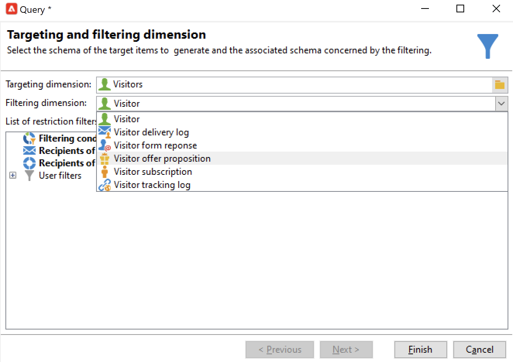
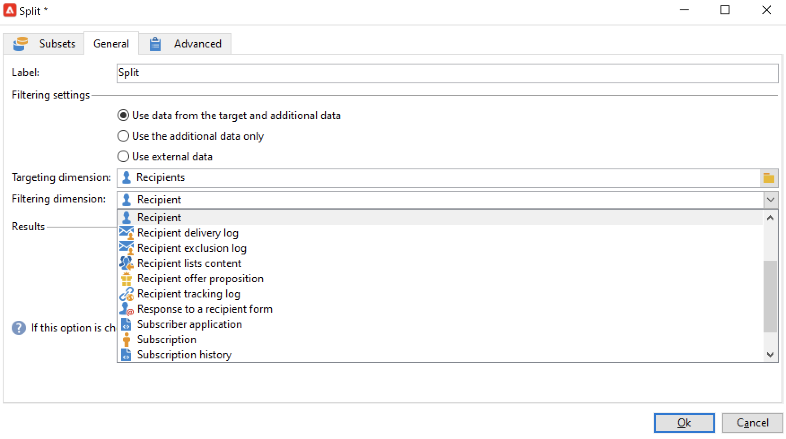

# 建立目標定位工作流程{#target-data}

工作流程可用來查詢資料庫和劃分資料。 行銷活動工作流程模組是功能強大的工具，可執行資料管理活動、擷取、擴充及轉換資料、管理對象及調整人口。

目標工作流程可讓您建立數個傳送目標。 由於工作流活動，您可以建立查詢、根據特定條件定義聯合或排除、新增排程。 此定位的結果可自動轉移至清單，作為傳送動作的目標

除了這些活動，資料管理選項還可讓您控制資料並存取進階功能，以滿足複雜的鎖定目標問題。 有關詳細資訊，請參閱 [資料管理](targeting-workflows.md#data-management).

您可以在第一個工作流程索引標籤中找到所有這些活動。

>[!NOTE]
>
>定位活動在 [本節](activities.md).

您可以透過 **[!UICONTROL Profiles and Targets > Jobs > Targeting workflows]** Adobe Campaign樹的節點，或透過 **[!UICONTROL Profiles and Targets > Targeting workflows]** 首頁的菜單。

所有行銷活動工作流程都會儲存行銷活動架構內的目標工作流程。

## 建立目標工作流程的關鍵步驟 {#implementation-steps-}

建立目標工作流程的步驟在以下章節中詳細說明：

1. **識別** 資料庫中的資料 — 請參閱 [建立查詢](#create-queries)
1. **準備** 滿足傳遞需求的資料 — 請參閱 [豐富和修改資料](#enrich-and-modify-data)
1. **使用** 執行更新或傳送內的資料 — 請參閱 [更新資料庫](use-workflow-data.md#update-the-database)

鎖定目標期間執行的所有擴充和所有處理結果都會儲存在個人化欄位中，且可供存取，尤其是用於建立個人化訊息時。 有關詳細資訊，請參閱 [目標資料](use-workflow-data.md#target-data).

## 定位和篩選維度 {#targeting-and-filtering-dimensions}

在資料分段作業期間，目標索引鍵會對應至篩選維度。 目標維度可讓您定義作業鎖定的母體：收件者、合約受益人、營運商、訂閱者等。 篩選維度可讓您根據特定條件選取母體：合約持有者、電子報訂閱者等

例如，要選擇已擁有壽險保單超過5年的客戶，請選擇以下目標維度： **用戶端** 和下列篩選維度： **合同持有人**. 然後，您可以在查詢活動中定義篩選條件

在目標維度選取階段期間，介面中僅提供相容的篩選維度。

這兩個維度必須相關。 因此， **[!UICONTROL Filtering dimension]** 清單取決於第一個欄位中指定的目標維度。

例如，對於收件者(**收件者**)，將可使用下列篩選維度：

為 **訪客**，清單將包含下列篩選維度：

## 建立查詢 {#create-queries}

### 使用其他資料 {#select-data}

A **[!UICONTROL Query]** 活動可讓您選取基本資料以建立目標母體。 如需詳細資訊，請參閱[本章節](query.md#create-a-query)。

您也可以使用下列活動來查詢和調整資料庫中的資料： [增量查詢](incremental-query.md), [讀取清單](read-list.md).

可以收集要在整個工作流生命週期中轉發和處理的其他資料。 有關詳細資訊，請參閱 [新增資料](query.md#add-data) 和 [編輯其他資料](#edit-additional-data).

### 編輯其他資料 {#edit-additional-data}

新增其他資料後，您可以編輯該資料，或使用該資料來調整查詢活動中定義的目標。

此 **[!UICONTROL Edit additional data...]** 連結可讓您檢視新增的資料，並加以修改或新增至該資料。

若要將資料新增至先前定義的輸出欄，請在可用欄位清單中選取資料。 要建立新的輸出列，請按一下 **[!UICONTROL Add]** 圖示，然後選取欄位並按一下 **[!UICONTROL Edit expression]**.

按一下 **進階選取** 按鈕。

為要添加的欄位定義計算模式，例如聚合。

此 **[!UICONTROL Add a sub-item]** 選項可讓您將計算資料附加至集合。 這可讓您從集合中選取其他資料，或定義集合元素的匯總計算。

子元素將在它們映射的集合的子樹中表示。

集合會顯示在 **[!UICONTROL Collections]** 頁簽。 您可以按一下 **[!UICONTROL Detail]** 圖示。 篩選精靈可讓您選取收集的資料，並指定要套用至集合中資料的篩選條件。

### 使用其他資料調整目標 {#refine-the-target-using-additional-data}

收集的其他資料可讓您調整資料庫中的資料篩選。 若要這麼做，請按一下 **[!UICONTROL Refine the target using additional data...]** 連結：這可讓您對新增的資料進行過度篩選。

### 同質化資料 {#homogenize-data}

在 **[!UICONTROL Union]** 或 **[!UICONTROL Intersection]** 類型活動時，您可以選擇僅保留共用的其他資料，以保持資料一致。 在這種情況下，此活動的臨時輸出工作表將僅包含所有入站集中找到的其他資料。

### 與其他資料協調 {#reconciliation-with-additional-data}

在資料協調階段期間(**[!UICONTROL Union]**, **[!UICONTROL Intersection]**、等 活動)，則可以從其他欄選取要用於資料協調的欄。 要執行此操作，請對一系列列配置調解並指定主集。 然後選取視窗下方欄中的欄，如下列範例所示：

選取運算式並確認。

### 建立子集 {#create-subsets}

此 **[!UICONTROL Split]** 活動可讓您根據透過擷取查詢定義的條件建立子集。 對於每個子集，當您編輯母體上的篩選條件時，將會存取標準查詢活動，該活動可讓您定義目標分段條件。

您只能使用附加資料作為篩選條件，或除了目標資料之外，將目標分割為多個子集。 如果您已購買 **同盟資料存取** 選項。

如需詳細資訊，請參閱[本章節](#create-subsets-using-the-split-activity)。

## 區段資料 {#segment-data}

### 合併多個目標（聯合） {#combine-several-targets--union-}

聯合活動可讓您在一個轉變中結合數個活動的結果。 集不一定必須是同質的。

可使用下列資料協調選項：

* **[!UICONTROL Keys only]**

   如果輸入母體是同質的，則可使用此選項。

* **[!UICONTROL All columns in common]**

   此選項可讓您根據目標各種母體的所有共同欄來調解資料。

   Adobe Campaign會根據欄的名稱來識別欄。 接受允差閾值：例如，「電子郵件」欄可辨識為與「@email」欄相同。

* **[!UICONTROL A selection of columns]**

   選擇此選項可定義將應用資料協調的列清單。

   首先，選擇主集（包含源資料的集），然後選擇要用於聯接的列。

   

   >[!CAUTION]
   >
   >在資料協調期間，不會刪除重複的人口。

   您可以將母體大小限制為指定數量的記錄。 要執行此操作，請按一下適當的選項，並指定要保留的記錄數。

   此外，指定入站母體的優先順序：視窗的下部會列出聯合活動的入站轉變，並可讓您使用視窗右側的藍色箭頭來排序。

   記錄會先從清單中第一個入站轉變的母體中擷取，然後，如果尚未達到最大值，則會從第二個入站轉變的母體中擷取，以此類推。

   

### 提取聯合資料（交集） {#extract-joint-data--intersection-}

交集可讓您僅復原入站轉變母體共用的線條。 此活動必須像聯合活動一樣設定。

此外，您也可以僅保留一系列欄，或僅保留入站母體共用的欄。

在 [交集](intersection.md) 區段。

### 排除母體（排除） {#exclude-a-population--exclusion-}

排除活動可讓您從不同的目標母體中排除目標的元素。 此活動的輸出目標維度將是主要集的目標維度。

如有必要，可操控入站表。 事實上，若要從其他維度排除目標，必須將此目標傳回與主要目標相同的目標維度。 要執行此操作，請按一下 **[!UICONTROL Add]** 按鈕並指定維更改條件。

資料協調是透過識別碼、變更軸或連接執行。

### 使用分割活動建立子集 {#create-subsets-using-the-split-activity}

此 **[!UICONTROL Split]** 活動是標準活動，可讓您透過一或多個篩選維度，視需要建立多組集，以及為每個子集產生一個輸出轉變或一個唯一轉變。

入站轉變所傳送的其他資料可用於篩選條件。

若要設定，您必須先選取條件：

1. 在工作流程中，拖放 **[!UICONTROL Split]** 活動。
1. 在 **[!UICONTROL General]** 標籤中，選擇所需選項： **[!UICONTROL Use data from the target and additional data]**, **[!UICONTROL Use the additional data only]** 或 **[!UICONTROL Use external data]**.
1. 若 **[!UICONTROL Use data from the target and additional data]** 選項，則目標維度可讓您使用入站轉變所傳送的所有資料。

   

   建立子集時，使用上述過濾參數。

   若要定義篩選條件，請選取 **[!UICONTROL Add a filtering condition on the inbound population]** ，然後按一下 **[!UICONTROL Edit...]** 連結。 然後指定建立此子集的篩選條件。

   

   此範例顯示如何在 **[!UICONTROL Split]** 將目標細分為不同母體的活動，如 [本節](cross-channel-delivery-workflow.md).

   此 **[!UICONTROL Label]** 欄位可讓您為新建立的子集指定名稱，以符合出站轉變。

   您也可以指派區段代碼給子集以加以識別，並使用它來定位母體。

   如有需要，您可以針對要建立的每個子集分別變更目標定位和篩選維度。 要執行此操作，請編輯子集的篩選條件並檢查 **[!UICONTROL Use a specific filtering dimension]** 選項。

   

1. 若 **[!UICONTROL Use the additional data only]** 選項，則僅提供用於子集篩選的其他資料。

1. 若 **同盟資料存取** 選項， **[!UICONTROL Use external data]** 可讓您處理已設定的外部資料庫中的資料，或建立與資料庫的新連線。

然後，我們需要添加新的子集：

1. 按一下 **[!UICONTROL Add]** 按鈕並定義篩選條件。

   

1. 在 **[!UICONTROL General]** 活動的索引標籤（請參閱上方）。預設情況下，它會套用至所有子集。

   

1. 如有必要，您可以個別變更每個子集的篩選維度。 這可讓您為所有金卡持卡者建立一組資料，其中一組是所有點按最新電子報的收件者，另一組是18至25歲的人，在過去30天內購買了金卡，而所有這些都使用相同的分割活動。 若要這麼做，請選取 **[!UICONTROL Use a specific filtering dimension]** 選項並選取資料篩選內容。

建立子集後，預設情況下，拆分活動顯示的輸出轉變數與有子集數相同：

您可以將所有這些子集分組到單個輸出轉變中。 在這種情況下，例如，到各個子集的連結將在段代碼中可見。 若要這麼做，請選取 **[!UICONTROL Generate all subsets in the same table]** 選項。

例如，您可以放置單一傳送活動，並根據每個收件者集的區段代碼個人化傳送內容。

您也可以使用 **[!UICONTROL Cells]** 活動。 有關詳細資訊，請參閱 [儲存格](cells.md) 區段。

### 使用目標資料 {#using-targeted-data}

識別並準備資料後，即可在下列內容中使用：

* 在各種工作流程階段中進行資料操作之後，您可以更新資料庫中的資料。

   關於這個， [更新資料](update-data.md).

* 您也可以重新整理現有清單的內容。

   有關詳細資訊，請參閱 [清單更新](list-update.md).

* 您可以直接在工作流程中準備或開始傳送。

   有關詳細資訊，請參閱 [傳送](delivery.md), [傳遞控制](delivery-control.md) 和 [持續傳遞](continuous-delivery.md).

## 資料管理 {#data-management}

在Adobe Campaign中，資料管理結合了一組活動，透過提供更有效率、更靈活的工具來解決複雜的鎖定問題。 這可讓您使用與合約、訂閱、傳送再活動等相關的資訊，對與聯絡人的所有通訊進行一致的管理。 「資料管理」可讓您在細分操作期間追蹤資料生命週期，尤其是：

* 透過包含未在資料超市中模型化的資料，來簡化及最佳化鎖定過程（建立新的資料表：根據配置，對目標工作流程進行本地擴展）。
* 保持和傳達緩衝區計算，尤其是在目標建構階段或進行資料庫管理時。
* 存取外部資料庫（選用）：在鎖定過程中考慮異質資料庫。

為了實作這些操作，Adobe Campaign提供：

* 資料收集活動： [檔案傳輸](file-transfer.md), [資料載入（檔案）](data-loading--file-.md), [資料載入(RDBMS)](data-loading--rdbms-.md), [更新資料](update-data.md). 收集資料的第一步會準備資料，以便在其他活動中處理資料。 需要監控數個參數，以確保工作流程正確執行並提供預期的結果。 例如，匯入資料時，此資料的主索引鍵(Pkey)對於每個記錄都必須是唯一的。
* 已使用「資料管理」選項擴充目標定位活動： [查詢](query.md), [聯合](union.md), [交集](intersection.md), [分割](split.md). 這可讓您設定來自數個不同目標維度之資料之間的聯合或交集，只要可進行資料協調即可。
* 資料轉換活動： [擴充](enrichment.md), [變更維度](change-dimension.md).

>[!CAUTION]
>
>連結兩個工作流程時，刪除來源表格元素並不表示會刪除連結至該工作流程的所有資料。
>  
>例如，透過工作流程刪除收件者不會導致刪除所有收件者的傳送歷史記錄。 不過，直接在「收件者」資料夾中刪除收件者，確實會導致刪除與此收件者連結的所有資料。

### 豐富和修改資料 {#enrich-and-modify-data}

除了目標維度，篩選維度還可讓您指定收集資料的性質。 請參閱[本節](targeting-workflows.md#targeting-and-filtering-dimensions)。

識別和收集的資料可以被豐富、聚合和操作以優化目標構造。 若要這麼做，除了以下章節詳述的資料操作活動外， [本節](#segmen-data)，請使用下列項目：

* 此 **[!UICONTROL Enrichment]** 活動可讓您暫時將欄新增至結構，以及新增資訊至特定元素。 在 [擴充](enrichment.md) 活動存放庫的區段。
* 此 **[!UICONTROL Edit schema]** 活動可讓您修改結構。 在 [編輯結構](edit-schema.md) 活動存放庫的區段。
* 此 **[!UICONTROL Change dimension]** 活動可讓您在目標建構週期中變更目標維度。 在 [變更維度](change-dimension.md) 區段。
