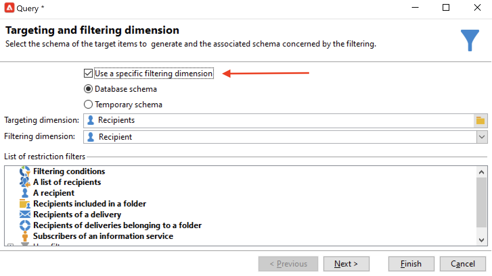

# 建立目標定位工作流程{#target-data}

工作流可用於查詢資料庫和分段資料。 市場活動工作流模組是執行資料管理活動、提取、豐富和轉換資料、管理受眾和細化群體的強大工具。

目標工作流使您能夠構建多個傳遞目標。 由於工作流活動，您可以建立查詢、根據特定標準定義工會或排除、添加計畫。 此目標的結果可以自動傳送到清單，該清單可用作傳遞操作的目標

除了這些活動外，資料管理選項還允許您處理資料並訪問高級功能，以滿足複雜的目標問題。 有關此內容的詳細資訊，請參閱 [資料管理](targeting-workflows.md#data-management)。

所有這些活動都可以在第一個工作流頁籤中找到。

>[!NOTE]
>
>目標活動詳見 [此部分](activities.md)。

目標工作流可通過 **[!UICONTROL Profiles and Targets > Jobs > Targeting workflows]** 或通過 **[!UICONTROL Profiles and Targets > Targeting workflows]** 的子菜單。

市場活動框架內的目標工作流與所有市場活動工作流一起儲存。

## 建立目標工作流的關鍵步驟 {#implementation-steps-}

建立目標工作流的步驟在以下各節中詳細介紹：

1. **識別** 資料庫中的資料 — 請參見 [建立查詢](#create-queries)
1. **準備** 滿足交付需要的資料 — 請參閱 [豐富和修改資料](#enrich-and-modify-data)
1. **使用** 要執行更新或交付內的資料 — 請參閱 [更新資料庫](use-workflow-data.md#update-the-database)

在目標期間執行的所有內容和所有處理的結果被儲存在個性化欄位中並且可以訪問，特別是在建立個性化消息時使用。 有關此內容的詳細資訊，請參閱 [目標資料](use-workflow-data.md#target-data)。

## 定位和篩選維 {#targeting-and-filtering-dimensions}

在資料分段操作期間，將目標鍵映射到過濾維度。 目標維用於定義工序所針對的人口：收件人、合同受益人、操作員、訂戶等。 篩選維允許您根據特定條件選擇填充：合同持有人、通訊訂閱者等。

例如，要選擇擁有人壽保險單超過5年的客戶，請選擇以下目標維： **客戶端** 和以下篩選維： **合同持有人**。 然後，可以在查詢活動中定義篩選條件

在目標維選擇階段，介面中僅提供相容的篩選維。

這兩個維必須相關。 因此， **[!UICONTROL Filtering dimension]** 清單取決於在第一個欄位中指定的目標維。

例如，對於收件人(**收件人**)，以下篩選維將可用：

為 **訪問者**，清單將包含以下篩選維：

## 建立查詢 {#create-queries}

### 使用其他資料 {#select-data}

A **[!UICONTROL Query]** 「活動」(activity)允許您選擇基本資料以構建目標人口。 如需詳細資訊，請參閱[本章節](query.md#create-a-query)。

您還可以使用以下活動來查詢和細化資料庫中的資料： [增量查詢](incremental-query.md)。 [讀取清單](read-list.md)。

可以收集要在工作流的整個生命週期中轉發和處理的其他資料。 有關此內容的詳細資訊，請參閱 [添加資料](query.md#add-data) 和 [編輯其他資料](#edit-additional-data)。

### 編輯其他資料 {#edit-additional-data}

添加其他資料後，您可以編輯它或使用它來細化查詢活動中定義的目標。

的 **[!UICONTROL Edit additional data...]** 連結，您可以查看添加的資料並修改或添加到其中。

要將資料添加到先前定義的輸出列，請在可用欄位清單中選擇它。 要建立新輸出列，請按一下 **[!UICONTROL Add]** 表徵圖，然後選擇該欄位並按一下 **[!UICONTROL Edit expression]**。

按一下 **高級選擇** 按鈕

定義要添加的欄位的計算模式，例如聚合。

的 **[!UICONTROL Add a sub-item]** 選項，可將計算資料附加到集合。 這允許您從收集中選擇附加資料或定義收集要素的聚合計算。

子元素將在它們映射到的集合的子樹中表示。

集合顯示在 **[!UICONTROL Collections]** 的子菜單。 通過按一下 **[!UICONTROL Detail]** 表徵圖。 通過篩選器嚮導，您可以選擇收集的資料並指定要應用於集合中的資料的篩選條件。

### 使用其他資料細化目標 {#refine-the-target-using-additional-data}

收集的附加資料使您能夠細化資料庫中的資料過濾。 要執行此操作，請按一下 **[!UICONTROL Refine the target using additional data...]** 連結：這允許您對添加的資料進行過濾。

### 均勻化資料 {#homogenize-data}

在 **[!UICONTROL Union]** 或 **[!UICONTROL Intersection]** 類型活動，您可以選擇僅保留共用的附加資料以保持資料一致。 在這種情況下，此活動的臨時輸出工作表將只包含所有入站集中找到的其他資料。

### 與其他資料協調 {#reconciliation-with-additional-data}

在資料協調階段(**[!UICONTROL Union]**。 **[!UICONTROL Intersection]**&#x200B;的子菜單。 活動)，可以從附加列中選擇要用於資料協調的列。 要執行此操作，請在選定的列上配置協調並指定主集。 然後，選擇窗口下列中的列，如下例所示：

選擇表達式並確認。

### 建立子集 {#create-subsets}

的 **[!UICONTROL Split]** 活動允許您根據通過抽取查詢定義的條件建立子集。 對於每個子集，在編輯填充上的篩選條件時，將訪問標準查詢活動，該活動允許您定義目標分段條件。

您只能將附加資料用作篩選條件，或將目標資料除外，將目標拆分為多個子集。 如果已購買 **聯合資料存取** 的雙曲餘切值。

如需詳細資訊，請參閱[本章節](#create-subsets-using-the-split-activity)。

## 段資料 {#segment-data}

### 合併多個目標（聯合） {#combine-several-targets--union-}

聯合活動允許您將多個活動的結果組合到一個過渡中。 集合不一定非得是同質的。

以下資料協調選項可用：

* **[!UICONTROL Keys only]**

   如果輸入總體是同質的，則可以使用此選項。

* **[!UICONTROL All columns in common]**

   此選項允許您根據目標的不同總體所共有的所有列協調資料。

   Adobe Campaign根據列的名稱標識列。 接受容差閾值：例如，「Email」列可以識別為與「@email」列相同。

* **[!UICONTROL A selection of columns]**

   選擇此選項可定義要應用資料協調的列清單。

   首先選擇主集（包含源資料的集），然後選擇要用於聯接的列。

   

   >[!CAUTION]
   >
   >在資料協調期間，不會消除重複資料。

   您可以將人口規模限制為給定數量的記錄。 為此，請按一下相應的選項並指定要保留的記錄數。

   此外，指定入站總量的優先順序：窗口的下部列出聯合活動的入站轉換，並允許您使用窗口右側的藍色箭頭對它們進行排序。

   記錄將首先從清單中第一個入站轉移的總體中獲取，然後，如果未達到最大值，則從第二個入站轉移的總體中獲取這些記錄，等等。

   

### 提取關節資料（交集） {#extract-joint-data--intersection-}

交叉點允許您僅恢復入站過渡總體共用的線。 必須像聯合活動一樣配置此活動。

此外，可以只保留選定的列，或僅保留入站總體共用的列。

交叉點活動在 [交集](intersection.md) 的子菜單。

### 排除人口（排除） {#exclude-a-population--exclusion-}

排除活動允許您從不同的目標群體中排除目標的元素。 此活動的輸出目標維將是主集的輸出目標維。

必要時，可以處理入站表。 實際上，要從另一個維中排除目標，必須將此目標返回到與主目標相同的目標維。 要執行此操作，請按一下 **[!UICONTROL Add]** 按鈕並指定維更改條件。

通過標識符、更改軸或連接執行資料協調。

### 使用「拆分」活動建立子集 {#create-subsets-using-the-split-activity}

的 **[!UICONTROL Split]** activity是一個標準活動，它允許您通過一個或多個篩選維根據需要建立多個集，並為每個子集生成一個輸出轉換或唯一轉換。

通過入站轉換傳送的附加資料可以用在過濾標準中。

要配置它，您首先需要選擇條件：

1. 在工作流中，拖放 **[!UICONTROL Split]** 的子菜單。
1. 在 **[!UICONTROL General]** 頁籤，選擇所需選項： **[!UICONTROL Use data from the target and additional data]**。 **[!UICONTROL Use the additional data only]** 或 **[!UICONTROL Use external data]**。
1. 如果 **[!UICONTROL Use data from the target and additional data]** 選項，使用目標維可以使用入站轉換傳送的所有資料。

   

   建立子集時，使用上述過濾參數。

   要定義篩選條件，請選擇 **[!UICONTROL Add a filtering condition on the inbound population]** ，然後按一下 **[!UICONTROL Edit...]** 的子菜單。 然後指定建立此子集的篩選條件。

   

   一個示例，說明如何在 **[!UICONTROL Split]** 將目標分割到不同群體的活動，如中所述 [此部分](cross-channel-delivery-workflow.md)。

   的 **[!UICONTROL Label]** 欄位中，您可以為新建立的子集指定一個名稱，該名稱將與出站轉移相匹配。

   您還可以為子集指定段代碼以標識該子集，並使用該子集來瞄準其填充。

   如有必要，您可以分別為要建立的每個子集更改目標尺寸和篩選尺寸。 為此，請編輯子集的篩選條件並檢查 **[!UICONTROL Use a specific filtering dimension]** 的雙曲餘切值。

   

1. 如果 **[!UICONTROL Use the additional data only]** 選項，僅提供用於子集篩選的附加資料。

1. 如果 **聯合資料存取** 選項， **[!UICONTROL Use external data]** 允許您在已配置的外部資料庫中處理資料，或建立到資料庫的新連接。

然後，我們需要添加新的子集：

1. 按一下 **[!UICONTROL Add]** 按鈕並定義篩選條件。

   

1. 在 **[!UICONTROL General]** 頁籤（請參閱上面）。預設情況下，它適用於所有子集。

   

1. 如有必要，可以單獨更改每個子集的篩選尺寸。 這樣，您就可以為所有金卡持卡者建立一個集，一個適用於所有點擊了最新新聞稿的收件人，另一個適用於18至25歲在過去30天內進行店內採購的人，所有這些人都使用相同的拆分活動。 要執行此操作，請選擇 **[!UICONTROL Use a specific filtering dimension]** 選項，然後選擇資料篩選上下文。

建立子集後，預設情況下，拆分活動顯示的輸出過渡與有子集一樣多：

可以將所有這些子集分組為單個輸出過渡。 在這種情況下，到各個子集的連結在段代碼中可見，例如。 要執行此操作，請選擇 **[!UICONTROL Generate all subsets in the same table]** 的雙曲餘切值。

例如，您可以放置單個交貨活動，並根據每個收件人集的段代碼個性化交貨內容。

也可以使用 **[!UICONTROL Cells]** 的子菜單。 有關詳細資訊，請參閱 [單元格](cells.md) 的子菜單。

### 使用目標資料 {#using-targeted-data}

一旦識別和準備了資料，就可以在以下上下文中使用資料：

* 您可以在不同工作流階段中對資料進行操作後更新資料庫中的資料。

   關於這個， [更新資料](update-data.md)。

* 您還可以刷新現有清單的內容。

   有關此內容的詳細資訊，請參閱 [清單更新](list-update.md)。

* 您可以直接在工作流中準備或開始交貨。

   有關此內容的詳細資訊，請參閱 [交貨](delivery.md)。 [交貨控制](delivery-control.md) 和 [連續交付](continuous-delivery.md)。

## 資料管理 {#data-management}

在Adobe Campaign，資料管理通過提供更高效和更靈活的工具，將一系列活動結合起來，以解決複雜的目標問題。 這使您能夠使用與聯繫人的合同、訂閱、對交貨的反應等相關的資訊，對聯繫人的所有通信實施一致的管理。 資料管理允許您在分段操作期間跟蹤資料生命週期，尤其是：

* 透過包含未在資料超市中模型化的資料，來簡化及最佳化鎖定過程（建立新的資料表：根據配置，對目標工作流程進行本地擴展）。
* 保持和傳達緩衝區計算，尤其是在目標建構階段或進行資料庫管理時。
* 存取外部資料庫（選用）：在鎖定過程中考慮異質資料庫。

為了實施這些操作，Adobe Campaign提供：

* 資料收集活動： [檔案傳輸](file-transfer.md)。 [資料載入（檔案）](data-loading--file-.md)。 [資料載入(RDBMS)](data-loading--rdbms-.md)。 [更新資料](update-data.md)。 收集資料的第一步是準備資料，以便在其他活動中處理資料。 需要監控幾個參數，以確保工作流正確執行並提供預期結果。 例如，在導入資料時，此資料的主鍵(Pkey)對於每個記錄都必須唯一。
* 資料管理選項豐富了針對活動的內容： [查詢](query.md)。 [聯合](union.md)。 [交集](intersection.md)。 [拆分](split.md)。 這允許您配置來自多個不同目標維的資料之間的聯合或交集，只要可以進行資料協調。
* 資料轉換活動： [濃縮](enrichment.md)。 [更改維](change-dimension.md)。

>[!CAUTION]
>
>當兩個工作流連結時，刪除源表元素並不意味著刪除連結到它的所有資料。
>  
>例如，通過工作流刪除收件人不會導致刪除收件人的所有傳遞歷史記錄。 但是，直接在「收件人」資料夾中刪除收件人確實會導致刪除與此收件人連結的所有資料。

### 豐富和修改資料 {#enrich-and-modify-data}

除目標維外，篩選維還允許您指定所收集資料的性質。 請參閱[本節](targeting-workflows.md#targeting-and-filtering-dimensions)。

所識別和收集的資料可以被富集、聚集和操縱以優化目標構造。 為此，除了中詳述的資料操作活動外 [此部分](#segmen-data)，使用以下命令：

* 的 **[!UICONTROL Enrichment]** 「活動」(activity)允許您立即將列添加到架構中，並將資訊添加到某些元素中。 在 [濃縮](enrichment.md) 的子菜單。
* 的 **[!UICONTROL Edit schema]** 活動，用於修改架構的結構。 在 [編輯架構](edit-schema.md) 的子菜單。
* 的 **[!UICONTROL Change dimension]** 活動允許您在目標構建週期中更改目標維。 在 [更改維](change-dimension.md) 的子菜單。
