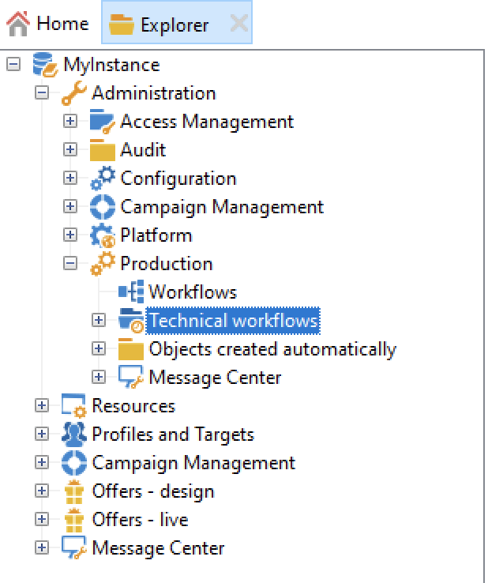

# 技術工作流程{#about-technical-workflows}

Adobe Campaign隨附一組內建的技術工作流程。 它們可控制排定在伺服器上定期執行的作業和工作。 技術工作流程會對Campaign資料庫執行維護操作、管理傳遞的追蹤資料，以及設定傳遞的臨時流程。

依預設，技術工作流程可在下列節點的子資料夾中使用： **[!UICONTROL Administration]** > **[!UICONTROL Production]** > **[!UICONTROL Technical workflows]**。

{width="50%" align="left" zoomable="yes"}

>[!NOTE]
>
>* [本節](#list-technical-workflows)提供每個模組所安裝的技術工作流程清單。
>
>* 與訊息中心附加元件相關的技術工作流程預設會儲存在&#x200B;**[!UICONTROL Administration]** > **[!UICONTROL Production]** > **[!UICONTROL Message Center]** > **[!UICONTROL Technical workflows]**&#x200B;節點中。

**[!UICONTROL Campaign process]**&#x200B;子資料夾集中了執行行銷活動內處理程式所需的工作流程：任務通知、庫存管理、成本計算等。

## 管理和建立技術工作流程 {#manage-tech-workflows}

行銷活動技術工作流程只能由具有&#x200B;**管理**&#x200B;許可權的運運算元啟動和修改。 在此[專屬區段](monitor-technical-workflows.md)中瞭解如何監視技術工作流程。

您可以在樹狀結構的&#x200B;**[!UICONTROL Administration > Production > Technical workflows]**&#x200B;節點中建立自訂的技術工作流程。 原生範本可用於建立技術工作流程。 可依您的需求加以設定。 不過，此程式僅供專家使用者使用。 技術工作流程中可用的活動與定位工作流程相同。 [了解更多](targeting-workflows.md)。

## 內建的技術工作流程 {#list-technical-workflows}

此頁面中詳細的工作流程會隨Adobe Campaign內建套件安裝。 這些套件和相關的技術工作流程取決於您的授權合約和附加元件。

| 技術工作流程 | 套件 | 說明 |
|------|--------|-----------|
| **別名清除** (aliasCleansing) | 預設安裝 | 此工作流程會標準化[列舉](../../v8/config/enumerations.md#alias-cleansing)值。 預設會每天凌晨3:00觸發。 |
| **帳單** （帳單） | 預設安裝 | 此工作流程會透過電子郵件將系統活動報告傳送給「帳單」操作員。 它會在每月25日的行銷執行個體上觸發。 |
| **行銷活動工作** (operationMgt) | 預設安裝 | 此工作流程管理行銷活動的工作（啟動目標定位、檔案擷取等）。 也會建立與循環和定期行銷活動相關的工作流程。 |
| **收集HeatMap服務的資料** (collectDataHeatMapService) | 預設安裝 | 此工作流程會擷取HeatMap服務所需的資料。 |
| **收集隱私權請求** (collectPrivacyRequests) | 隱私權資料保護規範 | 此工作流程會產生儲存在Adobe Campaign的收件者資料，並讓該資料可在隱私權請求的畫面中下載。 |
| **成本計算** (budgetMgt) | 預設安裝 | 此工作流程會開始計算預算、計畫、方案、行銷活動、傳遞和任務的費用和成本行。 |
| **資料庫清理** （清理） | 預設安裝 | 此工作流程是資料庫維護工作流程：它會根據統計和程式進行不同的計算，並根據部署助理員中定義的組態從資料庫刪除過時的資料。 預設會每天凌晨4:00觸發。 |
| **刪除封鎖的LINE使用者** (deleteBlockedLineUsersV2) | LINE 管道 | 此工作流程確保LINE V2使用者的資料在封鎖LINE正式帳戶180天後會被刪除。 |
| **刪除隱私權請求資料** (deletePrivacyRequestsData) | 隱私權資料保護規範 | 此工作流程會刪除收件者儲存在Adobe Campaign中的資料。 |
| **傳遞指標** (deliveryIndicators) | 預設安裝 | 此工作流程會更新傳送的傳送追蹤指標。 預設會每小時觸發此工作流程。 |
| **立即部署FFDA** (ffdaDeploy) | 預設僅安裝於[Campaign Enterprise (FFDA)部署](../../v8/architecture/enterprise-deployment.md) | 執行雲端資料庫的立即部署。 [進一步瞭解資料復寫](../../v8/architecture/replication.md) |
| **分散式行銷程式** (centralLocalMgt) | 中央/地方行銷（分散式行銷） | 此工作流程會開始處理與使用分散式行銷模組相關。 它會啟動本機行銷活動的建立，並管理與訂單和行銷活動套件可用性相關的通知。 |
| **事件清除** (webAnalyticsPurgeWebEvents) | 網站分析聯結器 | 此工作流程可讓您根據生命週期欄位中設定的期間，從資料庫欄位中刪除每個事件。 |
| **將對象匯出至Adobe Experience Cloud** (exportSharedAudience) | 與Adobe Experience Cloud整合 | 此工作流程會將對象匯出為共用對象/區段。 這些對象可用於您所使用的不同Adobe Experience Cloud解決方案。 |
| **預測** （預測） | 預設安裝 | 此工作流程會分析臨時行事曆中儲存的傳遞（建立臨時記錄）。 預設會每天凌晨1:00觸發。 |
| **完整彙總計算(propositionrcp cube)** (agg_nmspropositionrcp_full) | 優惠方案引擎（互動） | 此工作流程會更新優惠方案主張Cube的完整彙總。 預設會每天早上6:00觸發。 此彙總會擷取下列維度：管道、傳送、行銷優惠和日期。 然後，優惠方案主張多維度資料集可用來根據優惠方案產生報表。 在[本節](../../v8/reporting/gs-cubes.md)中進一步瞭解多維度資料集。 |
| **已轉換連絡人的識別碼** (webAnalyticsFindConverted) | 網站分析聯結器 | 此工作流程會針對在再次行銷活動後完成購買的網站訪客建立索引。 此工作流程復原的資料可在再行銷效率報表中存取（請參閱本頁面）。 |
| **從Adobe Experience Cloud** (importSharedAudience)匯入對象 | 與Adobe Experience Cloud整合 | 此工作流程可讓您將不同Adobe Experience Cloud解決方案的對象/區段匯入至Adobe Campaign。 |
| 行銷活動中的傳遞&#x200B;**工作** (deliveryMgt) | 預設安裝 | 此工作流程會觸發已核准的傳送，並開始為外部傳送對服務提供者進行後續處理。 也會傳送核准通知和提醒。 |
| 服務提供者上的&#x200B;**工作** (supplierMgt) | 預設安裝 | 在核准傳遞後，此工作流程會開始處理提供者（傳送至路由器的電子郵件並進行後續處理）。 |
| **MID到LineUserID移轉** (MIDToUserIDMigration) | LINE 管道 | 此工作流程會產生LINE V2使用者ID，以便從LINE V1移轉至LINE V2。 |
| **訊息中心&lt;外部帳戶名稱>** （mcSynch_&lt;外部帳戶名稱>） | 異動訊息控制（訊息中心 — 控制） | 此工作流程： <ul><li>復原作業處理的事件清單。</li><li>與NmsBroadLogMsg表格同步，以復原傳遞訊息資格。</li><li>與NmsBroadLogMsg表格的同步一完成，就會復原事件傳送記錄檔。</li><li>會與NmsTrackingUrl表格同步，以復原傳遞URL的追蹤。</li><li>與NmsTrackingUrl表同步完成後，立即復原事件追蹤URL。</li><li>可讓您在傳送傳遞後，每三小時復原一次所有置於隔離的電子郵件地址。</li></ul> |
| **MessageCenter完整彙總計算** (agg_messageCenter_full) | 異動訊息控制（訊息中心 — 控制） | 此工作流程會更新訊息中心Cube的「完整」彙總。 預設會每天凌晨3:00觸發。 此彙總會擷取下列維度：管道、日期、狀態和事件型別。 然後，訊息中心Cube可用於根據事件產生報表。 若要深入瞭解多維度資料集，請參閱  |
| **中間來源（傳遞計數器）** (defaultMidSourcingDlv) | 轉移至中間來源 | 此工作流程會收集中間來源伺服器上傳遞的計數資訊。 計數資訊包括一般傳遞指標，例如已傳送的傳遞數量等。 未包含開啟之類的追蹤資訊。 預設會每十分鐘觸發一次。 |
| **中間來源（傳遞記錄）** (defaultMidSourcingLog) | 轉移至中間來源 | 此工作流程會收集中間來源伺服器上的傳遞記錄。 預設會每小時觸發一次。 |
| **NMAC選擇退出管理** (mobileAppOptOutMgt) | 行動應用程式頻道（推播） | 此工作流程會更新行動裝置上的取消訂閱通知。 從上午1:00到午夜，每6小時觸發一次。 |
| **優惠通知** (offerMgt) | 預設安裝 | 此工作流程會將核准的優惠方案以及優惠方案目錄中包含的每個類別部署至線上環境。 |
| **暫停的工作流程清理** (cleanupPausedWorkflows) | 預設安裝 | 此工作流程會分析嚴重程度設定為正常的暫停工作流程，並在暫停太久時觸發警告和通知。 一個月後，暫停的技術工作流程會無條件停止。 預設會每週一早上5:00觸發。 如需詳細資訊，請參閱[處理暫停的工作流程](monitor-workflow-execution.md#handling-of-paused-workflows)。 |
| **隱私權要求清除** (cleanupPrivacyRequests) | 隱私權資料保護規範 | 此工作流程會清除90天以前的存取請求檔案。 |
| **正在處理批次事件** (batchEventsProcessing) | 異動訊息執行（訊息中心 — 執行） | 此工作流程可讓您在將批次事件與訊息範本產生關聯之前，先將批次事件放入佇列中。 |
| **正在處理即時事件** (rtEventsProcessing) | 異動訊息執行（訊息中心 — 執行） | 此工作流程可讓您將即時事件放入佇列中，再將其與訊息範本建立關聯。 |
| **主張同步** (propositionSynch) | 透過執行例項控制優惠方案引擎 | 此工作流程會在行銷執行個體與用於互動的執行執行個體之間同步建議。 |
| **復原Web事件** (webAnalyticsGetWebEvents) | 網站分析聯結器 | 每小時，此工作流程會下載指定網站之網際網路使用者行為的區段，將其放入Adobe Campaign資料庫並啟動再次行銷工作流程。 |
| **立即復寫FFDA資料** (ffdaReplicate) | 預設僅安裝於[Campaign Enterprise (FFDA)部署](../../v8/architecture/enterprise-deployment.md) | 復寫指定外部帳戶的XS資料。 [進一步瞭解資料復寫](../../v8/architecture/replication.md) |
| **復寫nmsDelivery佇列** (ffdaReplicateQueueDelivery) | 預設僅安裝於[Campaign Enterprise (FFDA)部署](../../v8/architecture/enterprise-deployment.md) | `nms:delivery`資料表的佇列。 [進一步瞭解資料復寫](../../v8/architecture/replication.md) |
| **復寫nmsDlvExclusion佇列** (ffdaReplicateQueueDlvExclusion) | 預設僅安裝於[Campaign Enterprise (FFDA)部署](../../v8/architecture/enterprise-deployment.md) | `nms:dlvExclusion`資料表的佇列。 [進一步瞭解資料復寫](../../v8/architecture/replication.md) |
| **復寫nmsDlvMidRemoteIdRel佇列** (ffdaReplicateQueueDlvMidRemoteIdRel) | 預設僅安裝於[Campaign Enterprise (FFDA)部署](../../v8/architecture/enterprise-deployment.md) | `nms:dlvRemoteIdRel`資料表的佇列。 [進一步瞭解資料復寫](../../v8/architecture/replication.md) |
| **復寫nmsTrackingUrl佇列** (ffdaReplicateQueueTrackingUrl) **以並行方式復寫nmsTrackingUrl佇列** (ffdaReplicateQueueTrackingUrl_2) | 預設僅安裝於[Campaign Enterprise (FFDA)部署](../../v8/architecture/enterprise-deployment.md) | `nms:trackingUrl`資料表的並行佇列，利用兩個工作流程根據不同的優先順序處理請求，以提高效率。 [進一步瞭解資料復寫](../../v8/architecture/replication.md) |
| **復寫參考資料表** (ffdaReplicateReferenceTables) | 預設僅安裝於[Campaign Enterprise (FFDA)部署](../../v8/architecture/enterprise-deployment.md) | 執行需要存在於Campaign本機資料庫(PostgreSQL)和雲端資料庫([!DNL Snowflake])上的內建資料表的自動復寫。 排程為每小時、每天執行。 如果存在&#x200B;**lastModified**&#x200B;欄位，則會遞增進行復寫，否則會復寫整個資料表。 [進一步瞭解資料復寫](../../v8/architecture/replication.md) |
| **復寫暫存資料** (ffdaReplicateStagingData) | 預設僅安裝於[Campaign Enterprise (FFDA)部署](../../v8/architecture/enterprise-deployment.md) | 復寫單一呼叫的中繼資料。 排程為每小時、每天執行。 [進一步瞭解資料復寫](../../v8/architecture/replication.md) |
| **報告彙總** (reportingAggregates) | 傳遞 | 此工作流程會更新報告中使用的彙總。 預設會每天凌晨2:00觸發。 |
| **傳送指標和行銷活動屬性** (webAnalyticsSendMetrics) | 網站分析聯結器 | 此工作流程可讓您透過Adobe® Analytics聯結器，從Adobe Campaign傳送電子郵件行銷活動指標至Adobe Experience Cloud套裝。 相關指標如下：已傳送(iSent)、開啟總數(iTotalRecipientOpen)、點按的收件者總數(iTotalRecipientClick)、錯誤(iError)、選擇退出（選擇退出） (iOptOut)。 |
| **Stock：訂單與警示** (stockMgt) | 預設安裝 | 此工作流程會啟動訂單明細行的庫存計算，並管理警告警示臨界值。 |
| 從Adobe Experience Platform Data Collection **(syncWithLaunch)同步行動應用程式** | 預設安裝，從v8.5開始 | 此工作流程會自動將行動屬性從資料收集同步至Adobe Campaign。 |
| **追蹤** （追蹤） | 預設安裝 | 此工作流程會執行追蹤資訊的復原與合併。 它也能確保重新計算追蹤和傳遞統計資料，尤其是訊息中心封存工作流程所使用的資料。 預設會每小時觸發一次。 |
| **更新事件狀態** (updateEventsStatus) | 異動訊息執行（訊息中心 — 執行） | 此工作流程可讓您為事件指派狀態。 事件狀態如下：<ul><li>擱置中：事件在佇列中。 尚未為其建立任何訊息範本的關聯。</li><li>待定傳送：事件位於佇列中，訊息範本已與其建立關聯，且傳送目前正在處理中。</li><li>已傳送：此狀態是從傳送記錄檔複製而來。 這表示傳送已進行。</li><li>由傳送忽略：此狀態是從傳送記錄檔複製而來。 這表示已忽略傳送。</li><li>傳送錯誤：此狀態是從傳送記錄檔複製而來。 這表示傳送失敗。</li><li>未涵蓋的事件：事件無法與訊息範本建立關聯。 將不會重新處理事件。</li></ul> |
| 傳遞能力的&#x200B;**更新** (deliverabilityUpdate) | 預設安裝 | 安裝傳遞能力監控（電子郵件傳遞能力）套件後，此工作流程會在夜間執行，並管理退信電子郵件資格規則以及網域和MX的清單。 這需要在平台上開啟HTTPS連線埠。 |
| **更新取消訂閱** (ffdaUnsuscribe) | 預設僅安裝於[Campaign Enterprise (FFDA)部署](../../v8/architecture/enterprise-deployment.md) | 此工作流程會處理以退回郵件形式收到的取消訂閱（透過使用`<mailto>` List-Unsubscribe方法）。 它每隔1小時會執行一次，而且只會在具有企業(FFDA)部署的行銷執行個體上執行。  工作流程會檢查inMail模組（在NmsBroadLog表格的iFlags欄中設定標籤）標示為取消訂閱退回的特定時間範圍（上次處理時間和目前時間）的broadlog，並根據broadlog服務是否設定而處理取消訂閱：<ul><li>如果serviceId為0 （未定義），收件者將會加入封鎖清單。</li><li>如果serviceId不是0 （連結至現有服務），收件者將會取消訂閱該服務。</li></ul> 注意：此工作流程只會處理退信取消訂閱；透過選擇退出連結和一鍵取消訂閱（URL方法）完成的取消訂閱會在此工作流程之外單獨處理。 |
