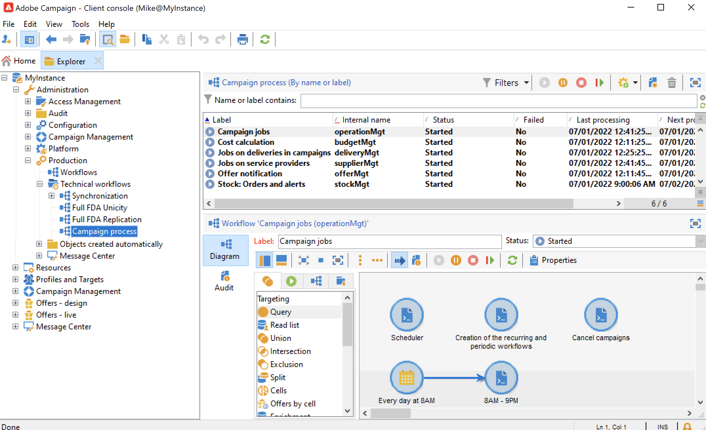

# 技術工作流程{#about-technical-workflows}

Adobe Campaign隨附一組內建的技術工作流程。 它們管理計畫在伺服器上定期執行的操作和作業。 它們可讓您對資料庫進行維護、轉送傳送的追蹤資訊，或設定傳送的臨時程式。 技術工作流程可透過 **[!UICONTROL Administration > Production > Technical workflows]** 節點。

原生範本可用於建立技術工作流程。 可依您的需求加以設定。

此 **[!UICONTROL Campaign process]** 子資料夾會集中執行行銷活動中的程式所需的工作流程：任務通知、庫存管理、成本計算等

>[!NOTE]
>
>隨每個模組安裝的技術工作流程清單可在 [專屬區段](technical-workflows.md).

您可以在 **[!UICONTROL Administration > Production > Technical workflows]** 樹結構的節點。 不過，此程式會保留給專家使用者。

提供的活動與目標工作流程的相同。 [了解更多](targeting-workflows.md)

本節中詳述的工作流程會與不同的Adobe Campaign內建套件一起安裝。 這些套件和相關技術工作流程取決於您的授權合約。 中會詳細說明內建套件。

依預設，技術工作流程可在下列節點的子資料夾中使用： **[!UICONTROL Administration]** > **[!UICONTROL Production]** > **[!UICONTROL Technical workflows]**.

請注意，只有具有管理權限的運算子才能啟動和修改技術工作流程。

>[!NOTE]
>
>與訊息中心附加元件相關的技術工作流程預設可在 **[!UICONTROL Administration]** > **[!UICONTROL Production]** > **[!UICONTROL Message Center]** > **[!UICONTROL Technical workflows]** 節點。

了解如何透過此檔案監控技術工作流程 [專屬區段](monitor-technical-workflows.md).

## 技術工作流程清單 {#list-technical-workflows}

| 技術工作流程 | 套件 | 說明 |
|------|--------|-----------|
| **別名清除** (aliasClearing) | 預設安裝 | 此工作流程會標準化列舉值。 預設會每天凌晨3:00觸發。 |
| **帳單** （帳單） | 預設安裝 | 此工作流程會透過電子郵件將系統活動報表傳送至「帳單」運算子。 它會在每月25號的行銷執行個體上觸發。 |
| **行銷活動工作** (operationMgt) | 預設安裝 | 此工作流程會管理行銷活動的工作（啟動鎖定目標、檔案擷取等）。 它也會建立與循環和定期促銷活動相關的工作流程。 |
| **收集HeatMap服務的資料** (collectDataHeatMapService) | 預設安裝 | 此工作流將檢索熱度圖服務所需的資料。 |
| **收集隱私權要求** (collectPrivacyRequests) | 隱私權資料保護法規 | 此工作流程會產生儲存在Adobe Campaign中的收件者資料，並在隱私權要求的畫面中供下載。 |
| **成本計算** (budgetMgt) | 預設安裝 | 此工作流開始計算預算、計畫、方案、促銷活動、傳送和任務上的費用和成本行。 |
| **資料庫清理** （清除） | 預設安裝 | 此工作流是資料庫維護工作流：它會根據統計資料和進程進行不同的計算，並根據部署助理中定義的配置從資料庫中刪除過時資料。 預設會每天凌晨4:00觸發。 如需詳細資訊，請參閱。 |
| **刪除阻止的LINE用戶** (deleteBlockedLineUsersV2) | LINE 頻道 | 此工作流確保在LINE V2用戶180天內阻止LINE官方帳戶後刪除其資料。 |
| **刪除隱私權要求資料** (deletePrivacyRequestsData) | 隱私權資料保護法規 | 此工作流程會刪除儲存在Adobe Campaign中的收件者資料。 |
| **傳送指標** (deliveryIndicators) | 中間來源平台 | 此工作流程會更新傳送的傳送追蹤指標。 預設會每小時觸發此工作流程。 |
| **分散式行銷程式** (centralLocalMgt) | 中央/地方行銷（分散式行銷） | 此工作流程會開始處理與使用分散式行銷模組相關的作業。 它會啟動本機促銷活動的建立，並管理與訂購和促銷活動套件可用性相關的通知。 |
| **事件清除** (webAnalyticsPurgeWebEvents) | 網站分析連接器 | 此工作流允許您根據「有效期限」欄位中配置的期間從資料庫欄位中刪除每個事件。 |
| **將受眾匯出至Adobe Experience Cloud** (exportSharedAudience) | 與Adobe Experience Cloud整合 | 此工作流程會將受眾匯出為共用受眾/區段。 這些對象可用於您所使用的不同 Adobe Experience Cloud 解決方案。  |
| **預測** （預測） | 傳遞 | 此工作流程會分析儲存在臨時日曆中的傳送（建立臨時記錄）。 預設會每天凌晨1:00觸發。 |
| **完整聚合計算（propositircp多維資料集）** (agg_nmspropositrcp_full) | 優惠方案引擎（互動） | 此工作流程會更新選件主張多維度資料集的完整匯總。 預設會每天早上6點觸發。 此匯總會擷取下列維度：管道、傳送、行銷活動和日期。 然後會使用優惠方案主張多維度資料集來根據優惠方案產生報表。 進一步了解中的立方體  [本節](../../v8/reporting/gs-cubes.md). |
| **轉換的聯繫人的標識** (webAnalyticsFindConverted) | 網站分析連接器 | 此工作流程會為在再行銷活動後完成購買的網站訪客建立索引。 您可以在「再行銷效率」報表（請參閱本頁面）中存取此工作流程所復原的資料。 |
| **從Adobe Experience Cloud匯入對象** (importSharedAudience) | 與Adobe Experience Cloud整合 | 此工作流程可讓您將不同Adobe Experience Cloud解決方案的對象/區段匯入Adobe Campaign。 |
| **行銷活動中傳遞的工作** (deliveryMgt) | 預設安裝 | 此工作流程會觸發已核准的傳送，並開始對外部傳送的服務提供者進行後續處理。 也會傳送核准通知和提醒。 |
| **服務提供者作業** (supplierMgt) | 預設安裝 | 傳遞經核准後，此工作流程就會開始處理提供者（傳送電子郵件給路由器及後續處理）。 |
| **MID到LineUserID移轉** (MIDToUserIDMigration) | LINE 頻道 | 此工作流將生成LINE V2用戶的ID，以便從LINE V1遷移到LINE V2。 |
| **訊息中心 &lt;external_account_name>** (mcSynch_&lt;external_account_name>) | 交易式訊息控制（訊息中心 — 控制） | 此工作流程： <ul><li>恢復操作處理的事件清單。</li><li>與NmsBroadLogMsg表同步，以恢復傳送消息資格。</li><li>完成與NmsBroadLogMsg表的同步恢復後，事件傳送日誌即可。</li><li>與NmsTrackingUrl表格同步，以便復原傳送URL的追蹤。</li><li>完成與NmsTrackingUrl表格的同步後，事件追蹤URL會立即恢復。</li><li>可讓您在傳送後每三小時復原所有置於隔離區的電子郵件地址。</li></ul> |
| **MessageCenter完整聚合計算** (agg_messageCenter_full) | 交易式訊息控制（訊息中心 — 控制） | 此工作流將更新消息中心多維資料集的完整聚合。 預設會每天凌晨3:00觸發。 此匯總會擷取下列維度：管道、日期、狀態和事件類型。 然後，將使用消息中心多維資料集根據事件生成報告。 您可以在  |
| **中間來源（交貨計數器）** (defaultMidSourcingDlv) | 轉移至中間來源 | 此工作流程會收集中間來源伺服器上傳送的計數資訊。 計數資訊包括一般傳送指標，例如傳送的傳送數量等。 不包含開啟等追蹤資訊。 預設會每十分鐘觸發一次。 |
| **中間來源（傳送記錄檔）** (defaultMidSourcingLog) | 轉移至中間來源 | 此工作流程會收集中間來源伺服器上的傳送記錄。 預設會每小時觸發一次。 |
| **NMAC選擇退出管理** (mobileAppOptOutMgt) | 行動應用程式頻道（推播） | 此工作流程會更新行動裝置上的通知取消訂閱。 從凌晨1點到午夜，每6小時觸發一次。 如需詳細資訊，請參閱。 |
| **優惠方案通知** (offerMgt) | 預設安裝 | 此工作流程會將已核准的優惠方案部署至線上環境，以及優惠方案目錄中包含的每個類別。 |
| **暫停的工作流程清除** (cleanupPausedWorkflows) | 預設安裝 | 此工作流程會分析嚴重性設為正常的暫停工作流程，並在暫停太久時觸發警告和通知。 一個月後，暫停的技術工作流程會無條件停止。 預設會每週一早上5點觸發。 如需詳細資訊，請參閱 [處理暫停的工作流程](monitor-workflow-execution.md#handling-of-paused-workflows). |
| **隱私權要求清除** (cleanupPrivacyRequests) | 隱私權資料保護法規 | 此工作流程會清除90天以前的存取要求檔案。 |
| **處理批次事件** (batchEventsProcessing) | 交易式訊息執行（Message Center — 執行） | 此工作流程可讓您先將批次事件放入佇列，再將其與訊息範本建立關聯。 |
| **處理即時事件** (rtEventsProcessing) | 交易式訊息執行（Message Center — 執行） | 此工作流程可讓您在將即時事件與訊息範本建立關聯之前，將其放入佇列中。 |
| **命題同步** （主張同步） | 具有執行實例的選件引擎的控制 | 此工作流程會在用於互動的行銷執行個體與執行執行個體之間同步建議。 |
| **恢復Web事件** (webAnalyticsGetWebEvents) | 網站分析連接器 | 此工作流程會每小時下載指定網站上網際網路使用者行為的區段，並將其放入Adobe Campaign資料庫並啟動再行銷工作流程。 |
| **報表匯總** (reportingAggregates) | 傳遞 | 此工作流程會更新報表中使用的匯總。 預設會每天凌晨2:00觸發。 |
| **傳送指標和行銷活動屬性** (webAnalyticsSendMetrics) | 網站分析連接器 | 此工作流程可讓您透過Adobe Campaign® Analytics連接器，將電子郵件促銷活動指標從Adobe傳送至Adobe Experience Cloud套裝。 相關指標如下：已傳送(iSent)、開啟總數(iTotalRecipientOpen)、已點按的收件者總數(iTotalRecipientClick)、錯誤(iError)、選擇退出（選擇退出）(iOptOut)。 |
| **庫存：訂單與警報** (stockMgt) | 預設安裝 | 此工作流將啟動訂單行上的庫存計算，並管理警告警報閾值。 |
| **追蹤** （追蹤） | 預設安裝 | 此工作流程會執行追蹤資訊的復原和整合。 它還可確保重新計算跟蹤和傳遞統計資料，特別是報文中心存檔工作流所使用的統計資料。 預設會每小時觸發一次。 |
| **更新事件狀態** (updateEventsStatus) | 交易式訊息執行（Message Center — 執行） | 此工作流程可讓您指派狀態給事件。 事件狀態如下：<ul><li>待定：事件在佇列中。 尚未與其關聯任何消息模板。</li><li>待定傳送：事件在佇列中，且訊息範本已與其相關聯，且目前由傳送處理。</li><li>已發送：此狀態是從傳送記錄檔複製而來。 這表示已傳送傳遞。</li><li>由傳送忽略：此狀態是從傳送記錄檔複製而來。 這表示已忽略傳送。</li><li>傳送錯誤：此狀態是從傳送記錄檔複製而來。 這表示傳送失敗。</li><li>未涵蓋的事件：事件無法與消息模板關聯。 將不會重新處理事件。</li></ul> |
| **傳遞能力更新** (deliverabilityUpdate) | 預設安裝 | 安裝「傳遞能力監控（電子郵件傳遞）」套件後，此工作流程會在夜間執行，並管理退信電子郵件資格規則，以及網域和MX清單。 這需要在平台上開啟HTTPS埠。 |
