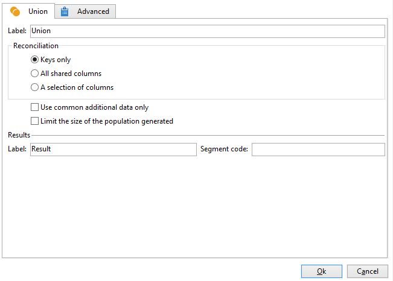

# 聯合{#union}

A **[!UICONTROL Union]** 將單一目標中數個入站活動的結果分組。 目標建立時會收到所有結果：因此，必須完成所有先前的活動才能執行聯合。

>[!NOTE]
>
>如需設定和使用的詳細資訊 **[!UICONTROL Union]** 活動，請參閱 [本頁](targeting-workflows.md#combining-several-targets--union-).

## 聯合範例 {#union-example}

在以下範例中，已結合兩個查詢的結果以更新清單。 這兩個查詢會鎖定收件者。 因此，結果是以相同表格為基礎。

1. 插入 **[!UICONTROL Union]** -type活動，直接在兩個查詢之後，在清單的更新類型活動之前，然後開啟它。
1. 您可以輸入標籤。
1. 選取 **[!UICONTROL Keys only]** 調解方法，因為在此範例中，查詢產生的母體包含一致的資料。
1. 如果已為查詢新增其他資料，您可以決定僅保留已共用的資料。
1. 如果要限制最終母體的大小，請核取 **[!UICONTROL Limit size of generated population]** 選項。

   輸入最大收件者人數，並選取母體將優先順序排列的查詢，以指定此最終編號。

1. 核准 **[!UICONTROL Union]** 活動，然後設定 [清單更新](list-update.md) 活動。
1. 開始工作流程. 將顯示結果數，並建立或更新清單更新活動中定義的清單。 此清單包含查詢的收件者集合，如果適用，則包含上一步定義的數字。

   

## 輸入參數 {#input-parameters}

* tableName
* 綱要

每個入站事件都必須指定由這些參數定義的目標。

## 輸出參數 {#output-parameters}

* tableName
* 綱要
* recCount

這組三個值識別聯合後產生的目標。 **[!UICONTROL tableName]** 是記錄目標標識符的表的名稱， **[!UICONTROL schema]** 是母體的綱要（通常為nms:recipient）和 **[!UICONTROL recCount]** 是表格中的元素數。
