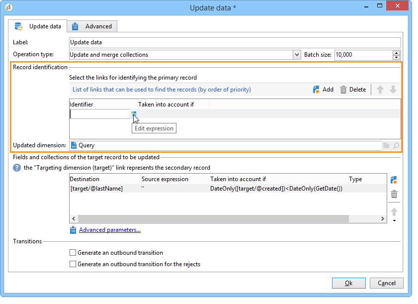

# 更新資料{#update-data}

**更新資料**&#x200B;型別的活動會大量更新資料庫中的欄位。

## 作業類型 {#operation-type}

**[!UICONTROL Operation type]**&#x200B;欄位可讓您選擇要對資料庫中的資料執行的程式：

* **[!UICONTROL Insert or update]**：新增資料，或更新已新增的資料。
* **[!UICONTROL Insert]**：僅新增資料。
* **[!UICONTROL Update]**：僅更新資料。
* **[!UICONTROL Update and merge collections]**：更新資料並選擇主要記錄，然後連結連結至此主要記錄中重複專案的元素。 然後，可刪除重複專案，而不建立孤立的附加元素。
* **[!UICONTROL Delete]**：刪除資料。

**[!UICONTROL Batch size]**&#x200B;欄位可讓您選取要更新的入站轉變元素數目。 例如，如果您宣告500，則處理的前500筆記錄將會更新。

## 記錄識別 {#record-identification}

指定如何識別資料庫中的記錄：

* 如果資料專案與現有目標維度相關，請選取&#x200B;**[!UICONTROL By directly using the targeting dimension]**&#x200B;選項，然後在&#x200B;**[!UICONTROL Updated dimension]**&#x200B;欄位中選取它。

  您可以使用&#x200B;**[!UICONTROL Edit this link]**&#x200B;放大鏡按鈕來顯示所選維度的欄位。

* 否則，請指定一或多個連結，以便識別資料庫中的資料或直接使用調解金鑰。

## 選取要更新的欄位 {#selecting-the-fields-to-be-updated}

使用&#x200B;**[!UICONTROL Automatically associate fields with the same name]**&#x200B;選項，讓Adobe Campaign自動識別要更新的欄位。

您也可以使用&#x200B;**[!UICONTROL Insert]**&#x200B;圖示來手動選取要更新的資料庫欄位。

選取要更新的所有欄位，並在必要時根據要執行的更新新增條件。 要執行此操作，請使用 **[!UICONTROL Taken into account if]** 欄。條件會逐一套用，並遵循清單中的順序。 使用右邊的箭頭來變更更新順序。

您可以多次使用相同的目的地欄位。

在&#x200B;**[!UICONTROL Insert or update]**&#x200B;作業中，您可以個別或針對每個欄位選取要套用的行銷活動。 若要這麼做，請在&#x200B;**[!UICONTROL Operation]**&#x200B;欄中選取所需的值。

**[!UICONTROL modifiedDate]**、**[!UICONTROL modifiedBy]**、**[!UICONTROL createdDate]**&#x200B;和&#x200B;**[!UICONTROL createdBy]**&#x200B;欄位會在資料更新期間自動更新，除非其管理模式在欄位更新表格中特別設定。

僅對包含至少一個差異的記錄執行記錄更新。 如果值相同，則不會執行更新。

**[!UICONTROL Advanced parameters]**&#x200B;連結可讓您指定處理更新資料與管理重複專案的其他選項。 您也可以：

* **[!UICONTROL Disable automatic key management]**。
* **[!UICONTROL Disable audit]**。
* **[!UICONTROL Empty the destination value if the source value is empty (NULL)]**。 此選項依預設會自動核取。
* **[!UICONTROL Update all columns with matching names]**。
* 指定在&#x200B;**[!UICONTROL Enabled if]**&#x200B;欄位中使用運算式來考慮來源專案的條件。
* 使用運算式指定考慮重複專案的條件。 如果您核取&#x200B;**[!UICONTROL Ignore records which concern the same target]**&#x200B;選項，則只會考慮運算式清單中的第一個。

**[!UICONTROL Generate an outbound transition]**

建立將在執行結束時啟用的出站轉變。 更新通常表示目標工作流程結束，因此預設不會啟用選項。

**[!UICONTROL Generate an outbound transition for the rejects]**

建立外站轉變，其中包含更新後未正確處理的記錄（例如，如果有重複記錄）。 更新通常是標示目標定位工作流程的結束，因此預設不會啟動該選項。

## 更新及合併集合 {#updating-and-merging-collections}

更新資料及合併集合可讓您使用一或多個次要記錄的資料，更新記錄中包含的資料，以便在需要時僅保留一項。 這些更新由一組規則管理。

>[!NOTE]
>
>此選項也可讓您從工作流程工作表(targetWorkflow)、傳送(targetDelivery)和清單(targetList)處理次要記錄的參考。 如有需要，這些連結會出現在您選取欄位和集合的清單中。

1. 選取&#x200B;**[!UICONTROL Update and merge collections]**&#x200B;作業。

   

1. 選取連結的優先順序。 這可讓您識別主要記錄。 可用的連結會因入站轉變而異。

   

1. 選取要移至主要記錄的集合與要更新的欄位。

   輸入一或多個次要記錄識別後套用至這些記錄的規則。 若要這麼做，您可以使用運算式產生器。 例如，指定這是必須保留的所有不同記錄中最近更新的值。

   然後輸入規則要考慮的條件。

   最後，指定要執行的更新型別。 例如，您可以選擇在更新資料之後刪除次要記錄。

   例如，您可以設定合併包含異質性資料（例如收件者的訂閱清單）的集合。 您也可以使用規則從次要記錄訂閱建立新的訂閱歷史記錄，甚至可以將訂閱清單從次要記錄移至主要記錄。

1. 選取&#x200B;**[!UICONTROL Advanced parameters]** > **[!UICONTROL Duplicates]**，指定您要處理次要記錄的順序。

   

如果定義的規則適用，次要記錄的資料會與主要記錄相關聯。 根據所選的更新型別，可刪除次要記錄。

## 範例：在擴充後更新資料 {#example--update-data-following-an-enrichment}

[步驟2：將擴充資料寫入使用案例的「購買」表格](create-a-summary-list.md#step-2--writing-enriched-data-to-the--purchases--table)區段，該使用案例詳細說明了如何建立重新摘要清單，提供擴充活動後資料更新的範例。

## 輸入引數 {#input-parameters}

* tableName
* 結構描述

每個傳入事件都必須指定由這些引數定義的目標。
