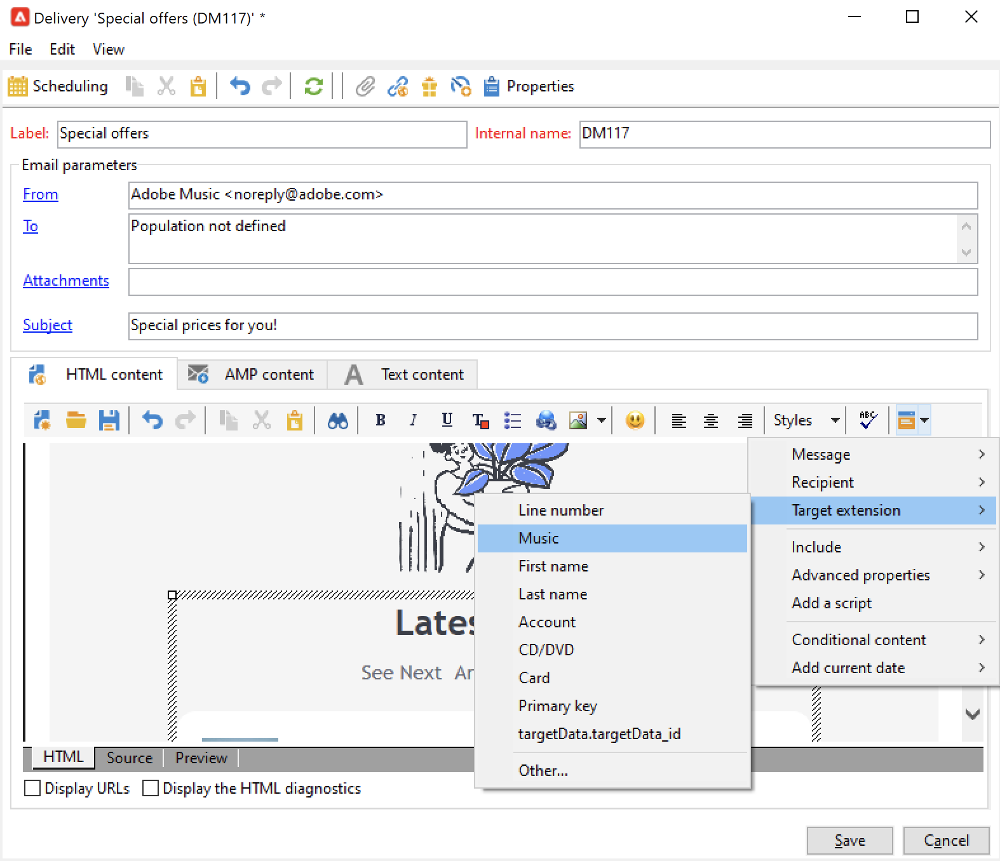

# 使用工作流程資料{#how-to-use-workflow-data}

您可以使用工作流活動執行多個任務。 通過建立清單、管理訂閱、通過工作流發送消息或豐富您的交付內容及其受眾，查找以下用於更新資料庫的使用示例。

在中提供了一組工作流使用案例 [此部分](workflow-use-cases.md)。

## 資料生命週期 {#data-life-cycle}

### 工作流臨時工作表 {#work-table}

在工作流中，從一個活動傳輸到另一個活動的資料儲存在臨時工作表中。

通過按一下右鍵相應的過渡，可以顯示和分析此資料。


為此，請選擇相關菜單：

* **[!UICONTROL Display the target...]**

   此菜單顯示目標填充的可用資料。

   

   可以訪問 **[!UICONTROL Schema]** 頁籤。

   

   如需詳細資訊，請參閱[本章節](monitor-workflow-execution.md#worktables-and-workflow-schema)。

* **[!UICONTROL Analyze target...]**

   通過此菜單，您可以訪問描述性分析嚮導，該嚮導可以生成有關轉換資料的統計資訊和報告。

   如需詳細資訊，請參閱 [Campaign Classic v7 文件](https://experienceleague.adobe.com/docs/campaign-classic/using/reporting/analyzing-populations/about-descriptive-analysis.html){target=&quot;_blank&quot;}。

目標資料在工作流執行時被清除。 只能訪問最後一個工作表。 您可以配置工作流，以便所有工作表保持可訪問性：檢查 **[!UICONTROL Keep the result of interim populations between two executions]** 的子菜單。


>[!CAUTION]
>
>此選項必須 **從不** 已簽入 **生產** 工作流。 此選項用於分析結果，並且僅用於測試目的，因此必須僅用於開發或試運行環境。


### 利用目標資料 {#target-data}

儲存在工作流臨時工作表中的資料可用於個性化任務。 資料可以在個性化欄位中使用。

這允許您使用通過傳遞中的清單收集的資料。 要執行此操作，請使用以下語法：

```
%= targetData.FIELD %
```

**[!UICONTROL Target extension]** (targetData)類型個性化元素不可用於目標工作流。 必須在工作流中生成並在傳遞的入站轉換中指定傳遞目標。

在以下示例中，您正在收集要在個性化電子郵件中使用的客戶資訊清單。 應用以下步驟：

1. 建立工作流以收集資訊，將其與資料庫中已有的資料協調，然後啟動傳遞。

   

1. 在本示例中，檔案內容如下所示：

   ```
   Music,First name,Last name,Account,CD/DVD,Card
   Pop,David,BLAIR,4323,CD,0
   Rock,Daniel,ARCARI,3222,DVD,1
   Disco,Uma,ALTON,0488,DVD,0
   Jazz,Paul,BOLES,6475,CD,1
   Jazz,David,BOUKHARI,0841,DVD,1
   [...]
   ```

   要載入檔案，請配置 **[!UICONTROL Data loading (file)]** 活動如下：

   

1. 配置 **[!UICONTROL Enrichment]** 活動，將收集的資料與Adobe Campaign資料庫中已有的資料進行協調。 這裡，協調密鑰是帳號：

   

1. 然後配置 **[!UICONTROL Delivery]**:它基於模板建立，收件人由入站轉換指定。

   

   >[!CAUTION]
   >
   >只能使用轉換中包含的資料來個性化傳送。 **目標資料** 類型個性化欄位僅可用於 **[!UICONTROL Delivery]** 的子菜單。

1. 在交貨模板中，使用工作流中收集的欄位。

   為此，請插入 **[!UICONTROL Target extension]** 類型個性化欄位。

   

   在此，我們要插入客戶最喜愛的音樂流派和媒體類型（CD或DVD），如工作流收集的檔案中所述。

   作為加號，我們將為會員卡持有者添加優惠券，即「卡」值等於1的收件者。

   

   **[!UICONTROL Target extension]** (targetData)類型資料使用與所有個性化欄位相同的特徵插入到遞送中。 它們也可用於主題、連結標籤或連結本身。


## 更新資料庫 {#update-the-database}

所有收集的資料都可用於更新資料庫，或在交貨中。 例如，您可以豐富郵件內容個性化的可能性（包括郵件中的合同數、指定過去一年的平均購物車等） 或詳細的人口目標（向合同合同持有人發送消息，瞄準1000名線上服務最佳訂戶等）。 此資料也可以在清單中導出或存檔。

### 更新清單  {#list-updates}

Adobe Campaign資料庫和現有清單的資料可通過以下兩項專門活動進行更新：

* 的 **[!UICONTROL List update]** 活動允許您將工作表儲存在資料庫中。

   您可以選擇現有清單或建立它。 在這種情況下，將計算名稱以及可能的記錄資料夾。

   

   請參閱 [清單更新](list-update.md)。

* 的 **[!UICONTROL Update data]** activity對資料庫中的欄位執行成批更新。

   有關此內容的詳細資訊，請參閱 [更新資料](update-data.md)。

### 管理訂閱 {#subscription-management}

要瞭解有關通過工作流訂閱和取消訂閱資訊服務的收件人的資訊，請參閱 [訂閱服務](subscription-services.md)。


