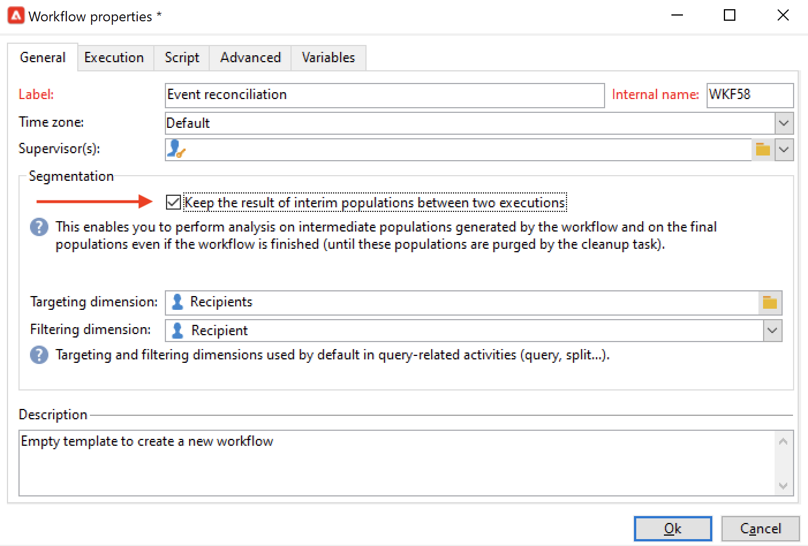

# 使用工作流程資料{#how-to-use-workflow-data}

您可以使用工作流活動來執行多個任務。 請找到下列使用範例，借由建立清單、管理訂閱、透過工作流程傳送訊息，或讓您的傳送及其對象更豐富，以更新資料庫。

一組工作流程使用案例適用於 [本節](workflow-use-cases.md).

## 資料生命週期 {#data-life-cycle}

### 工作流臨時工作表 {#work-table}

在工作流中，從一個活動傳輸到另一個活動的資料儲存在臨時工作表中。

以滑鼠右鍵按一下適當的轉變，即可顯示和分析此資料。


要執行此操作，請選取相關功能表：

* **[!UICONTROL Display the target...]**

   此功能表會顯示目標母體上的可用資料。

   

   您可以在 **[!UICONTROL Schema]** 標籤。

   

   如需詳細資訊，請參閱[本章節](monitor-workflow-execution.md#worktables-and-workflow-schema)。

* **[!UICONTROL Analyze target...]**

   此功能表可讓您存取描述性分析精靈，以便產生轉變資料的統計資料和報表。

   如需詳細資訊，請參閱 [Campaign Classic v7 文件](https://experienceleague.adobe.com/docs/campaign-classic/using/reporting/analyzing-populations/about-descriptive-analysis.html){target="_blank"}.

目標資料會在執行工作流程時清除。 只能訪問最後一個工作表。 您可以配置工作流，以便所有工作表都保持可訪問狀態：檢查 **[!UICONTROL Keep the result of interim populations between two executions]** 選項。



>[!CAUTION]
>
>此選項必須 **從不** 在 **生產** 工作流程。 此選項可用來分析結果，且設計僅用於測試用途，因此只能用於開發或測試環境。


### 利用目標資料 {#target-data}

儲存在工作流臨時工作表中的資料可用於個人化任務。 資料可用於 [個人化欄位](../../v8/send/personalization-fields.md).

例如，這可讓您使用透過傳送中的清單收集的資料。 若要這麼做，請使用下列語法：

```
%= targetData.FIELD %
```

**[!UICONTROL Target extension]** (targetData)類型個人化元素無法用於目標工作流程。 傳遞目標必須建置在工作流程中，並在傳遞的入站轉變中指定。

在下列範例中，您要收集要用於個人化電子郵件的客戶資訊清單。 應用以下步驟：

1. 建立工作流程以收集資訊，將其與資料庫中已有的資料調解，然後開始傳送。

   

1. 在我們的範例中，檔案內容如下：

   ```
   Music,First name,Last name,Account,CD/DVD,Card
   Pop,David,BLAIR,4323,CD,0
   Rock,Daniel,ARCARI,3222,DVD,1
   Disco,Uma,ALTON,0488,DVD,0
   Jazz,Paul,BOLES,6475,CD,1
   Jazz,David,BOUKHARI,0841,DVD,1
   [...]
   ```

   若要載入檔案，請設定 **[!UICONTROL Data loading (file)]** 活動，如下所示：

   

1. 設定 **[!UICONTROL Enrichment]** 活動，將收集的資料與Adobe Campaign資料庫中已有的資料調解。 調解金鑰為帳號：

   

1. 然後設定 **[!UICONTROL Delivery]**:系統會根據範本建立收件者，並由入站轉變指定收件者。

   

   >[!CAUTION]
   >
   >只有轉換中包含的資料才可用於個人化傳送。 **targetData** 類型個人化欄位僅適用於 **[!UICONTROL Delivery]** 活動。

1. 在傳遞範本中，使用在工作流程中收集的欄位。

   要執行此操作，請插入 **[!UICONTROL Target extension]** 輸入個人化欄位。

   

   在此處，我們要插入客戶最喜愛的音樂類型和媒體類型（CD或DVD），如工作流收集的檔案中所述。

   作為加號，我們將為忠誠卡持有者（即「卡」值等於1的收件者）新增抵用券。

   

   **[!UICONTROL Target extension]** (targetData)類型資料會使用與所有個人化欄位相同的特性，插入傳遞中。 這些標籤也可用於主題、連結標籤或連結本身。


## 更新資料庫 {#update-the-database}

所有收集的資料都可用來更新資料庫或傳送。 例如，您可以豐富訊息內容個人化的可能性（包括訊息中的合約數、指定去年的平均購物車等） 或詳細人口目標定位（傳送訊息給合約合同持有人、鎖定1,000位線上服務最佳訂閱者等）。 此資料也可匯出或封存於清單中。

### 更新清單  {#list-updates}

Adobe Campaign資料庫的資料和現有清單可使用兩個專用活動來更新：

* 此 **[!UICONTROL List update]** 活動可讓您將工作表儲存在資料庫中。

   您可以選取現有清單或加以建立。 在此情況下，將計算名稱和可能的記錄資料夾。

   

   請參閱 [清單更新](list-update.md).

* 此 **[!UICONTROL Update data]** 活動會執行資料庫中欄位的大量更新。

   有關詳細資訊，請參閱 [更新資料](update-data.md).

### 管理訂閱 {#subscription-management}

若要了解如何透過工作流程訂閱和取消訂閱收件者至資訊服務，請參閱 [訂閱服務](subscription-services.md).
