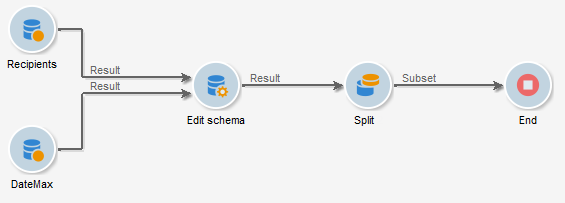
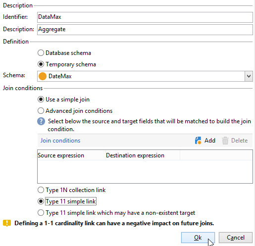

# 使用彙總{#using-aggregates}

此使用案例詳細說明了如何自動標識添加到資料庫的最後一個收件人。

使用以下過程，將資料庫中收件人的建立日期與使用聚合建立收件人的最後已知日期進行比較。 同一天建立的所有收件人也將被選中。

執行 **建立日期=最大值（建立日期）** 在收件人上鍵入篩選器，必須運行工作流才能執行以下步驟：

1. 使用基本查詢檢索資料庫收件人。 有關此步驟的詳細資訊，請參閱 [建立查詢](query.md#creating-a-query)。
1. 使用從 **最大（建立日期）** 聚合函式。
1. 將每個收件人連結到聚合函式，結果是同一架構。
1. 通過編輯的架構篩選使用聚合的收件人。

## 步驟1:計算聚合結果 {#step-1--calculating-the-aggregate-result}

1. 建立查詢。 在此，目標是計算資料庫中所有收件人的上次已知建立日期。 因此，查詢不包含篩選器。
1. 選取 **[!UICONTROL Add data]**。
1. 在開啟的窗口中，選擇 **[!UICONTROL Data linked to the filtering dimension]** 然後 **[!UICONTROL Filtering dimension data]**。
1. 在 **[!UICONTROL Data to add]** 窗口，添加計算 **建立日期** 的子菜單。 可以使用表達式編輯器或輸入 **max(@created)** 直接進入一個 **[!UICONTROL Expression]** 的雙曲餘切值。 然後按一下 **[!UICONTROL Finish]** 按鈕

   

1. 按一下 **[!UICONTROL Edit additional data]**，之後 **[!UICONTROL Advanced parameters...]**。核取 **[!UICONTROL Disable automatic adding of the primary keys of the targeting dimension]** 選項。

   此選項可確保不會因此顯示所有收件人，並且不會保留顯式添加的資料。 在本例中，它指的是建立收件人的最後日期。

   保留 **[!UICONTROL Remove duplicate rows (DISTINCT)]** 選項為已核取狀態。

## 步驟2:連結收件人和聚合函式結果 {#step-2--linking-the-recipients-and-the-aggregation-function-result}

要將處理收件人的查詢連結到執行聚合函式計算的查詢，必須使用方案編輯活動。

1. 將收件人的查詢定義為主集。
1. 在 **[!UICONTROL Links]** 頁籤中，添加新連結，並在窗口中輸入以下資訊：

   * 選擇與聚合相關的臨時架構。 此架構的資料將添加到主集的成員中。
   * 選擇 **[!UICONTROL Use a simple join]** 將聚合結果連結到主集的每個收件人。
   * 最後，指定連結為 **[!UICONTROL Type 11 simple link]**。

   

因此，聚合結果連結到每個接收者。

## 第3步：使用聚合篩選收件人。 {#step-3--filtering-recipients-using-the-aggregate-}

建立連結後，聚合結果和接收方組成同一臨時架構的一部分。 因此，可以在架構上建立篩選器，以比較收件人的建立日期和由聚合函式表示的最後已知建立日期。 此篩選器使用拆分活動執行。

1. 在 **[!UICONTROL General]** 頁籤 **收件人** 作為目標維度和 **編輯架構** 作為篩選維（用於篩選入站轉換架構活動）。
1. 在 **[!UICONTROL subsets]** 頁籤 **[!UICONTROL Add a filtering condition on the inbound population]** 按一下 **[!UICONTROL Edit...]**。
1. 使用表達式編輯器，在收件人的建立日期和由聚合計算的建立日期之間添加一個相等條件。

   資料庫中的日期類型欄位通常保存到毫秒。 因此，您必須將這些內容延長一天，以避免檢索僅在毫秒內建立的收件人。

   要執行此操作，請使用 **結束日期** 函式，可在表達式編輯器中使用，該編輯器可將日期和小時數轉換為簡單日期。

   因此，要用於條件的表達式為：

   * **[!UICONTROL Expression]**: `toDate([target/@created])`.
   * **[!UICONTROL Value]**: `toDate([datemax/expr####])`，其中expr###與聚合函式查詢中指定的聚合相關。

   

因此，拆分活動的結果與上次已知建立日期建立的同一天的收件人有關。

然後，您可以添加其他活動，如清單更新或交付，以豐富您的工作流。
