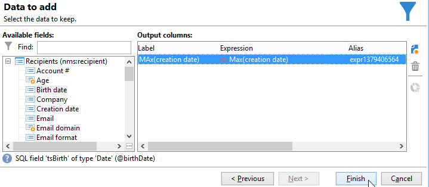

# 使用彙總{#using-aggregates}

此使用案例詳細說明如何自動識別新增到資料庫的最後一位收件者。

使用下列程式，將資料庫中收件者的建立日期與使用彙總建立收件者的最後已知日期進行比較。 也將選取同日建立的所有收件者。

若要對收件者執行&#x200B;**建立日期= max （建立日期）**&#x200B;型別篩選，您必須執行工作流程以遵循下列步驟：

1. 使用基本查詢擷取資料庫收件者。 如需此步驟的詳細資訊，請參閱[建立查詢](query.md#creating-a-query)。
1. 使用從&#x200B;**max （建立日期）**&#x200B;彙總函式產生的結果來計算上次建立收件者的已知日期。
1. 將每個收件者連結至彙總函式會產生相同的結構描述。
1. 透過已編輯的結構描述使用彙總來篩選收件者。

## 步驟1：計算彙總結果 {#step-1--calculating-the-aggregate-result}

1. 建立查詢。 在此處，目標是計算資料庫中所有收件者的最後已知建立日期。 因此，查詢不包含篩選器。
1. 選取 **[!UICONTROL Add data]**。
1. 在開啟的視窗中，依序選取&#x200B;**[!UICONTROL Data linked to the filtering dimension]**&#x200B;及&#x200B;**[!UICONTROL Filtering dimension data]**。
1. 在&#x200B;**[!UICONTROL Data to add]**&#x200B;視窗中，新增計算收件者表格中&#x200B;**建立日期**&#x200B;欄位最大值的欄。 您可以使用運算式編輯器，或直接在&#x200B;**[!UICONTROL Expression]**&#x200B;欄的欄位中輸入&#x200B;**max(@created)**。 然後按一下&#x200B;**[!UICONTROL Finish]**&#x200B;按鈕。

   

1. 按一下&#x200B;**[!UICONTROL Edit additional data]**，然後再按&#x200B;**[!UICONTROL Advanced parameters...]**。 核取 **[!UICONTROL Disable automatic adding of the primary keys of the targeting dimension]** 選項。

   此選項可確保不會顯示所有收件者，且不會保留明確新增的資料。 在此案例中，該日期是指上次建立收件者的日期。

   保留 **[!UICONTROL Remove duplicate rows (DISTINCT)]** 選項為已核取狀態。

## 步驟2：連結收件者和彙總函式結果 {#step-2--linking-the-recipients-and-the-aggregation-function-result}

若要將處理收件者的查詢連結至執行彙總函式計算的查詢，您必須使用結構描述編輯活動。

1. 將收件者的查詢定義為主集。
1. 在&#x200B;**[!UICONTROL Links]**&#x200B;索引標籤中，新增連結並在開啟的視窗中輸入資訊，如下所示：

   * 選取與彙總相關的暫存結構描述。 此結構描述的資料將新增到主集的成員。
   * 選取&#x200B;**[!UICONTROL Use a simple join]**&#x200B;將彙總結果連結至主集的每個收件者。
   * 最後，指定連結為&#x200B;**[!UICONTROL Type 11 simple link]**。

   

因此，彙總結果會連結至每個收件者。

## 步驟3：使用彙總篩選收件者。 {#step-3--filtering-recipients-using-the-aggregate-}

建立連結後，彙總結果和收件者會成為相同臨時方案的一部分。 因此，可以在結構描述上建立篩選，以比較收件者的建立日期與最後已知建立日期（由彙總函式表示）。 使用分割活動執行此篩選。

1. 在&#x200B;**[!UICONTROL General]**&#x200B;索引標籤中，選取&#x200B;**收件者**&#x200B;作為目標維度，並選取&#x200B;**編輯結構描述**&#x200B;作為篩選維度（以篩選入站轉變結構描述活動）。
1. 在&#x200B;**[!UICONTROL subsets]**&#x200B;索引標籤中，選取&#x200B;**[!UICONTROL Add a filtering condition on the inbound population]**，然後按一下&#x200B;**[!UICONTROL Edit...]**。
1. 使用運算式編輯器，在收件者的建立日期與彙總計算的建立日期之間新增相等條件。

   資料庫中的日期型別欄位通常會儲存到毫秒。 因此，您必須將這些延長一整天，以避免擷取僅建立該毫秒的收件者。

   若要這麼做，請使用運算式編輯器中可用的&#x200B;**ToDate**&#x200B;函式，該函式會將日期和小時轉換為簡單日期。

   因此，用於條件的運算式為：

   * **[!UICONTROL Expression]**： `toDate([target/@created])`。
   * **[!UICONTROL Value]**： `toDate([datemax/expr####])`，其中expr####與彙總函式查詢中指定的彙總相關。

   

因此，分割活動的結果會與最後一個已知建立日期同一天建立的收件者相關。

然後，您可以新增其他活動（例如清單更新或傳遞）以擴充您的工作流程。
