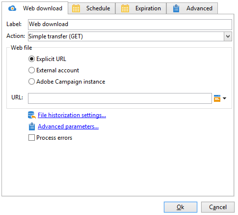
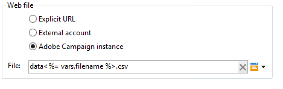

# 網頁下載{#web-download}

此 **網頁下載** 活動可讓您在明確URL、外部帳戶或Adobe Campaign執行個體上下載檔案。 會使用HTTP通訊協定。 這可以是GET或POST下載。

## 屬性 {#properties}

1. **選取網頁檔案**

   若要指定要下載的檔案，您可以輸入檔案URL、使用儲存檔案的外部HTTP帳戶，或透過Adobe Campaign執行個體載入檔案。 可用的引數詳述如下：

   * 若要直接輸入要下載的檔案URL，請選取 **[!UICONTROL Explicit URL]** 並在相關欄位中指定URL。 此URL可使用變數資料建構。

     

   * 若要使用 **[!UICONTROL External account]**，從下拉式清單中選取帳戶，並指定要下載的檔案。

     外部帳戶是從 **[!UICONTROL Administration > Platform > External accounts]** Adobe Campaign樹的節點。 帳戶引數可透過以下方式編輯： **[!UICONTROL Edit link]** 圖示。

     

   * 若要從Adobe Campaign例項下載檔案，請選取 **[!UICONTROL Adobe Campaign Instance]** 選項。

     

1. **檔案歷史化**

   此 **[!UICONTROL File historization settings...]** 連結可讓您指定檔案儲存目錄和此目錄的清除頻率。

   

   可以使用以下選項：

   * **[!UICONTROL Use a default storage directory]**：檔案一律會在處理前移動。 如果核取此選項，檔案會移至預設儲存目錄( **變數** Adobe Campaign安裝資料夾的目錄)。 若要指定儲存目錄，請取消核取方塊，然後在 **[!UICONTROL Storage directory]** 欄位
   * **[!UICONTROL Number of files]**：輸入要保留在儲存目錄中的檔案數上限。
   * **[!UICONTROL Maximum size (in Mb)]**：輸入儲存目錄的最大容量（以MB為單位）。

   每個檔案會保留24小時，之後才會受到定義的清除規則的限制。 清除作業會在活動開始之前進行，因此不會考慮進行中的工作流程檔案。

   會根據檔案的年齡（從最舊到最新）來刪除檔案。 最舊的檔案會被清除，直到兩個清除規則都得到驗證為止。 因此，如果定義了100個檔案的限制，這表示儲存目錄在工作流程開始之前將一律包含100個最新檔案，以及在進行中的工作流程中正在處理的檔案。

   如果您不想再為 **[!UICONTROL Number of files]** 和 **[!UICONTROL Maximum size (in Mb)]** 選項，請輸入0作為值。

1. **高級參數**

   此 **[!UICONTROL Advanced parameters...]** 連結可讓您指定下列其他選項：

   * **[!UICONTROL Follow redirections]**：檔案重新導向可讓您使用覆寫，將資料輸入或輸出導向不同型別的裝置。
   * **[!UICONTROL Add the HTTP headers to the file]**：在某些情況下，您可能想要將其他HTTP標頭新增到檔案中。 最常見的情況是，這些標題將用於提供其他資訊以進行疑難排解，目的是 [跨原始資源共用(CORS)](https://developer.mozilla.org/docs/Web/HTTP/CORS)，或來設定特定的快取指示。
   * **[!UICONTROL Ignore the HTTP return code]**：HTTP傳回碼（也稱為HTTP狀態碼）會指出HTTP要求的結果。

   

   此 **[!UICONTROL Process errors]** 詳細選項於 [正在處理錯誤](monitor-workflow-execution.md#processing-errors).

## 輸出引數 {#output-parameters}

* 檔案名稱：下載檔案的完整名稱。
