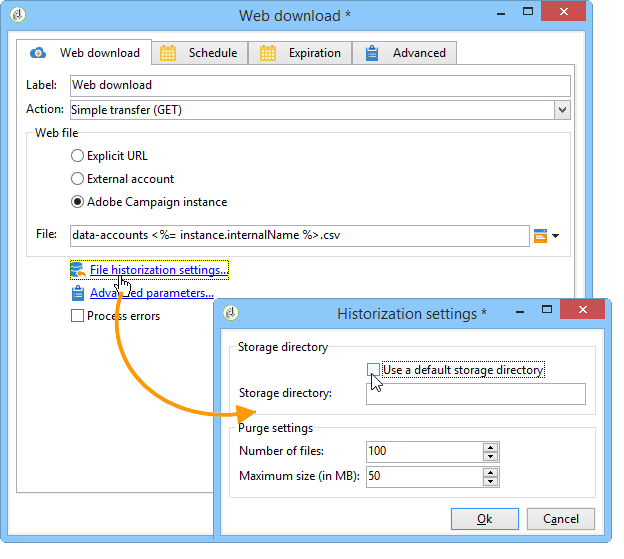
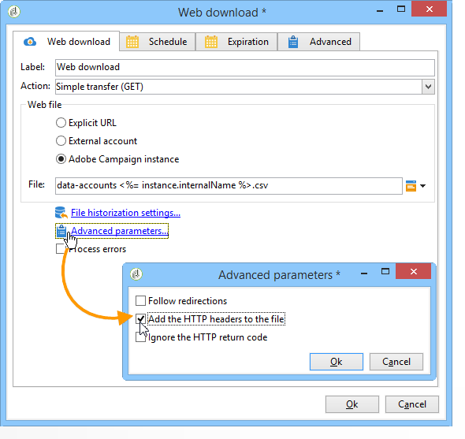

# 網頁下載{#web-download}

的 **Web下載** 活動啟動在顯式URL、外部帳戶或Adobe Campaign實例上下載檔案。 使用HTTP協定。 這可以是GET或POST下載。

## 屬性 {#properties}

1. **選擇Web檔案**

   要指定要下載的檔案，可以輸入檔案URL，使用儲存檔案的外部HTTP帳戶，或通過Adobe Campaign實例載入檔案。 可用參數詳述如下：

   * 要直接輸入要下載的檔案的URL，請選擇 **[!UICONTROL Explicit URL]** 的子菜單。 此URL可以使用變數資料構建。

      

   * 使用 **[!UICONTROL External account]**，從下拉清單中選擇帳戶，並指定要下載的檔案。

      外部帳戶是從 **[!UICONTROL Administration > Platform > External accounts]** Adobe Campaign樹的節點。 帳戶參數可通過 **[!UICONTROL Edit link]** 表徵圖

      

   * 要從Adobe Campaign實例下載檔案，請選擇 **[!UICONTROL Adobe Campaign Instance]** 的雙曲餘切值。

      

1. **檔案歷史化**

   的 **[!UICONTROL File historization settings...]** 連結，用於指定檔案儲存目錄和此目錄的清除頻率。

   

   可以使用以下選項：

   * **[!UICONTROL Use a default storage directory]**:檔案始終在處理之前移動。 如果選中此選項，則檔案將移入預設儲存目錄( **瓦** 的子目錄)。 要指定儲存目錄，請取消選中該框，然後在 **[!UICONTROL Storage directory]** 場
   * **[!UICONTROL Number of files]**:輸入要保留在儲存目錄中的最大檔案數。
   * **[!UICONTROL Maximum size (in Mb)]**:輸入儲存目錄的最大容量(MB)。

   每個檔案在遵守定義的清除規則之前保留24小時。 清除在活動開始之前進行，因此不考慮正在進行的工作流檔案。

   檔案將根據其年齡（從最早到最新）而刪除。 清除最舊的檔案，直到驗證兩個清除規則。 因此，如果定義了100個檔案限制，這意味著儲存目錄將始終包含工作流開始之前的100個最新檔案，以及正在進行的工作流中正在處理的檔案。

   如果您不想再為 **[!UICONTROL Number of files]** 和 **[!UICONTROL Maximum size (in Mb)]** 選項，輸入0作為值。

1. **高級參數**

   的 **[!UICONTROL Advanced parameters...]** 連結，用於指定下面所示的其他選項：

   

   的 **[!UICONTROL Process errors]** 的子菜單。 [處理錯誤](monitor-workflow-execution.md#processing-errors)。

## 輸出參數 {#output-parameters}

* 檔案名：已下載檔案的完整名稱。
