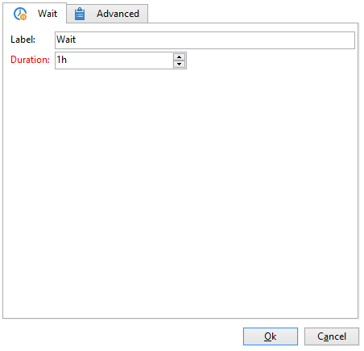

# 使用案例：監督您的工作流程{#supervising-workflows}

此使用案例詳細說明如何建立工作流程，以讓您監視一組「已暫停」、「已停止」或「發生錯誤」的工作流程的狀態。

其目的是：

* 使用工作流程來監視業務工作流程群組。
* 透過「傳遞」活動傳送訊息給主管。

若要監視一組工作流程的狀態，您必須遵循下列步驟：

1. 建立監控工作流程。
1. 撰寫JavaScript以判斷工作流程是否已暫停、停止或發生錯誤。
1. 建立&#x200B;**[!UICONTROL Test]**&#x200B;活動。
1. 準備傳遞範本。

>[!NOTE]
>
>除了工作流程之外，行銷活動&#x200B;**工作流程熱度圖**&#x200B;可讓您詳細分析目前執行的工作流程。 如需詳細資訊，請參閱[專屬區段](heatmap.md)。
>
>如需如何&#x200B;**監視工作流程執行**&#x200B;的詳細資訊，請參閱[本節](monitor-workflow-execution.md)。

## 步驟1：建立監控工作流程 {#step-1--creating-the-monitoring-workflow}

我們要監視的工作流程資料夾是儲存在&#x200B;**管理>生產>技術工作流程**&#x200B;節點中的&#x200B;**&quot;CustomWorkflows&quot;**&#x200B;資料夾。 此資料夾包含一組業務工作流程。

**監視工作流程**&#x200B;儲存在Technical Workflows資料夾的根目錄中。 使用的標籤是&#x200B;**「監視」**。

下列結構描述顯示活動的順序：


此工作流程由以下部分組成：

* **「開始」**&#x200B;活動。
* **「JavaScript程式碼」**&#x200B;活動負責分析業務工作流程資料夾。
* **「測試」**&#x200B;活動，將傳遞傳送給主管或重新啟動工作流程。
* 負責訊息佈局的&#x200B;**「傳遞」**&#x200B;活動。
* **「等待」**&#x200B;活動可控制工作流程反複專案之間的前置時間。

## 步驟2：撰寫JavaScript {#step-2--writing-the-javascript}

JavaScript程式碼的第一部分與&#x200B;**查詢(queryDef)**&#x200B;一致，可讓您識別具有「暫停」(@state == 13)、「錯誤」(@failed == 1)或「已停止」(@state == 20)狀態的工作流程。

要監視的工作流程資料夾的&#x200B;**內部名稱**&#x200B;是以下列條件所指定：

```
<condition boolOperator="AND" expr="[folder/@name] = 'Folder20'" internalId="1"/>
```

```
var strError = "";
var strPaused = "";
var strStop = "";

var queryWkfError = xtk.queryDef.create(
  <queryDef schema="xtk:workflow" operation="select">
    <select>
      <node expr="@internalName"/>
      <node expr="@state"/>
      <node expr="@label"/>
      <node expr="@failed"/>
      <node expr="@state"/>   
    </select>
    <where id="12837805386">
      <condition boolOperator="AND" expr="[folder/@name] = 'Folder20'" internalId="1"/>
        <condition boolOperator="AND" internalId="2">
          <condition boolOperator="OR" expr="@state = 20" internalId="3"/>
          <condition expr="@state = 13" internalId="4"/>
        </condition>  
    </where>
  </queryDef>
);
var ndWkfError = queryWkfError.ExecuteQuery(); 
```

JavaScript程式碼的第二部分可讓您&#x200B;**根據查詢期間復原的狀態，為每個工作流程**&#x200B;顯示訊息。

>[!NOTE]
>
>建立的字串必須載入工作流程的事件變數中。

```
for each ( var wkf in ndWkfError.workflow ) 
{
  if ( wkf.@state == 13 )  // Status 13 = paused
  {
    if ( wkf.@failed == 1 )
      strError += "<li>Workflow '" + wkf.@internalName + "' with the label '" + wkf.@label + "'</li>";
    else
      strPaused += "<li>Workflow '" + wkf.@internalName + "' with the label '" + wkf.@label + "'</li>";
  }
  
  if ( wkf.@state == 20 )  // Status 20 = stop
    strStop += "<li>Workflow '" + wkf.@internalName + "' with the label '" + wkf.@label + "'</li>";
}

vars.strWorkflowError = strError;
vars.strWorkflowPaused = strPaused;
vars.strWorkflowStop = strStop;
```

## 步驟3：建立「測試」活動 {#step-3--creating-the--test--activity}

「測試」活動可讓您根據「等待」活動，決定是否需要傳送傳遞或監控工作流程是否需要執行另一個週期。

如果三個事件變數「vars.strWorkflowError」、「vars.strWorkflowPaused」或「vars.strWorkflowStop」中至少有一個不是void，則會傳送傳遞給主管&#x200B;**。**


「等待」活動可設定為定期重新啟動監視工作流程。 在此使用案例中，**等待時間設為1小時**。



## 步驟4：準備傳送 {#step-4--preparing-the-delivery}

「傳遞」活動以儲存在&#x200B;**資源>範本>傳遞範本**&#x200B;節點中的&#x200B;**傳遞範本**&#x200B;為基礎。

此範本必須包括：

* **主管的電子郵件地址**。
* **HTML內容**&#x200B;以插入個人化文字。

  

  宣告的三個變數(WF_Stop、WF_Paused、WF_Error)符合三個工作流程事件變數。

  必須在傳遞範本屬性的&#x200B;**變數**&#x200B;索引標籤中宣告這些變數。

  若要復原&#x200B;**工作流程事件變數**&#x200B;的內容，您必須宣告傳遞的特定變數，這些變數將使用JavaScript程式碼傳回的值進行初始化。

  傳遞範本的內容如下：

  

建立並核准範本後，您需要將&#x200B;**傳遞**&#x200B;活動設定為：

* 將「傳遞」活動連結至先前建立的傳遞範本。
* 將工作流程的事件變數連結至傳送範本的特定事件變數。

連按兩下&#x200B;**傳遞**&#x200B;活動並選取下列選項：

* 傳遞：選取&#x200B;**新增（從範本**&#x200B;建立），然後選取先前建立的傳遞範本。
* 針對&#x200B;**收件者和內容**&#x200B;欄位，選取傳遞&#x200B;**中指定的**。
* 要執行的動作：選取&#x200B;**準備並啟動**。
* 取消核取&#x200B;**處理錯誤**&#x200B;選項。

  

* 前往&#x200B;**傳遞**&#x200B;活動的&#x200B;**指令碼**&#x200B;標籤，透過個人化欄位功能表新增三個&#x200B;**字元字串**&#x200B;型別變數。

  

  

  宣告的三個變數為：

  ```
  delivery.variables._var[0].stringValue = vars.strWorkflowError;
  delivery.variables._var[1].stringValue = vars.strWorkflowPaused;
  delivery.variables._var[2].stringValue = vars.strWorkflowStop; 
  ```

啟動此監視工作流程後，會傳送摘要給收件者。
