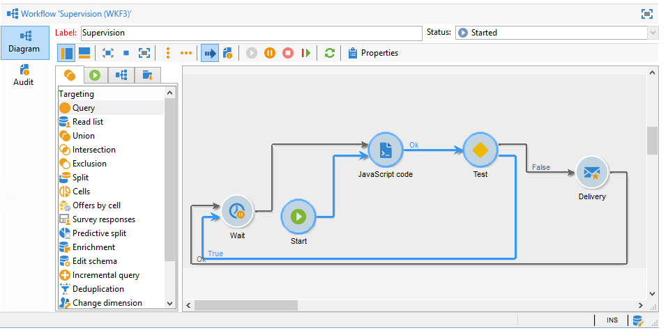

# 使用案例：監控工作流程{#supervising-workflows}

此使用案例詳細說明了如何建立工作流程，讓您監控「暫停」、「停止」或「有錯誤」之工作流程集的狀態。

其目的為：

* 使用工作流程來監視一組業務工作流程。
* 透過「傳送」活動傳送訊息給主管。

若要監控一組工作流程的狀態，您需要遵循下列步驟：

1. 建立監控工作流程。
1. 撰寫JavaScript以判斷工作流程是否暫停、停止或有錯誤。
1. 建立 **[!UICONTROL Test]** 活動。
1. 準備傳遞範本。

>[!NOTE]
>
>除了工作流程外，Campaign **工作流程熱度圖** 可讓您詳細分析目前執行的工作流程。 有關詳細資訊，請參閱 [專屬區段](heatmap.md).
>
>有關如何 **監視工作流程的執行**，請參閱 [本節](monitor-workflow-execution.md).

## 步驟1:建立監控工作流程 {#step-1--creating-the-monitoring-workflow}

我們要監控的工作流程資料夾為 **&quot;CustomWorkflows&quot;** 儲存在 **管理>生產>技術工作流程** 節點。 此資料夾包含一組業務工作流程。

此 **監控工作流程** 儲存在「技術工作流程」資料夾的根目錄中。 使用的標籤為 **&quot;監視&quot;**.

下列結構會顯示活動的順序：



此工作流程由下列部分組成：

* a **&quot;開始&quot;** 活動。
* a **&quot;JavaScript程式碼&quot;** 負責分析業務工作流資料夾的活動。
* a **&quot;測試&quot;** 向主管發送傳遞或重新啟動工作流的活動。
* a **&quot;傳送&quot;** 負責訊息配置的活動。
* a **&quot;等待&quot;** 控制工作流迭代之間提前期的活動。

## 步驟2:撰寫JavaScript {#step-2--writing-the-javascript}

JavaScript程式碼的第一部分與 **查詢(queryDef)** 這可讓您識別狀態為「pause」(@state == 13)、「error」(@failed == 1)或「stopped」(@state == 20)的工作流程。

此 **內部名稱** 在以下條件中提供要監視的工作流資料夾：

```
<condition boolOperator="AND" expr="[folder/@name] = 'Folder20'" internalId="1"/>
```

```
var strError = "";
var strPaused = "";
var strStop = "";

var queryWkfError = xtk.queryDef.create(
  <queryDef schema="xtk:workflow" operation="select">
    <select>
      <node expr="@internalName"/>
      <node expr="@state"/>
      <node expr="@label"/>
      <node expr="@failed"/>
      <node expr="@state"/>   
    </select>
    <where id="12837805386">
      <condition boolOperator="AND" expr="[folder/@name] = 'Folder20'" internalId="1"/>
        <condition boolOperator="AND" internalId="2">
          <condition boolOperator="OR" expr="@state = 20" internalId="3"/>
          <condition expr="@state = 13" internalId="4"/>
        </condition>  
    </where>
  </queryDef>
);
var ndWkfError = queryWkfError.ExecuteQuery(); 
```

JavaScript程式碼的第二部分可讓您 **顯示每個工作流的訊息** 根據查詢期間恢復的狀態。

>[!NOTE]
>
>建立的字串必須載入工作流程的事件變數中。

```
for each ( var wkf in ndWkfError.workflow ) 
{
  if ( wkf.@state == 13 )  // Status 13 = paused
  {
    if ( wkf.@failed == 1 )
      strError += "<li>Workflow '" + wkf.@internalName + "' with the label '" + wkf.@label + "'</li>";
    else
      strPaused += "<li>Workflow '" + wkf.@internalName + "' with the label '" + wkf.@label + "'</li>";
  }
  
  if ( wkf.@state == 20 )  // Status 20 = stop
    strStop += "<li>Workflow '" + wkf.@internalName + "' with the label '" + wkf.@label + "'</li>";
}

vars.strWorkflowError = strError;
vars.strWorkflowPaused = strPaused;
vars.strWorkflowStop = strStop;
```

## 步驟3:建立「測試」活動 {#step-3--creating-the--test--activity}

「測試」活動可讓您判斷是否需要傳送傳送，或監控工作流程是否需要根據「等待」活動執行其他週期。

將傳送給主管 **如果三個事件變數「vars.strWorkflowError」、「vars.strWorkflowPaused」或「vars.strWorkflowStop」中至少有一個為非void。**


「等待」活動可設定為定期重新啟動監控工作流程。 針對此使用案例， **等待時間設定為1小時**.


## 步驟4:準備傳送 {#step-4--preparing-the-delivery}

「傳送」活動以 **傳遞範本** 儲存於 **資源>範本>傳送範本** 節點。

此範本必須包括：

* **主管的電子郵件地址**.
* **HTML內容** ，以插入個人化文字。

   

   聲明的三個變數(WF_Stop、WF_Paused、WF_Error)與三個工作流事件變數匹配。

   這些變數必須在 **變數** 標籤。

   要恢復 **工作流程事件變數的內容**，您需要宣告傳送的特定變數，這些變數將會以JavaScript程式碼傳回的值初始化。

   傳遞範本包含下列內容：

   

建立並核准範本後，您需要設定 **傳送** 活動：

* 將「傳送」活動連結至先前建立的傳送範本。
* 將工作流程的事件變數連結至傳送範本專屬的事件變數。

按兩下 **傳送** 活動，並選取下列選項：

* 傳送：選取 **新建，從範本建立**，並選取先前建立的傳送範本。
* 若 **收件者與內容** 欄位，選擇 **在傳送中指定**.
* 要執行的動作：選取 **準備和開始**.
* 取消核取 **處理錯誤** 選項。

   

* 前往 **指令碼** 的 **傳送** 活動，新增三個 **字串** 透過個人化欄位功能表輸入變數。

   

   

   宣告的三個變數為：

   ```
   delivery.variables._var[0].stringValue = vars.strWorkflowError;
   delivery.variables._var[1].stringValue = vars.strWorkflowPaused;
   delivery.variables._var[2].stringValue = vars.strWorkflowStop; 
   ```

此監控工作流程啟動後，會傳送摘要給收件者。
