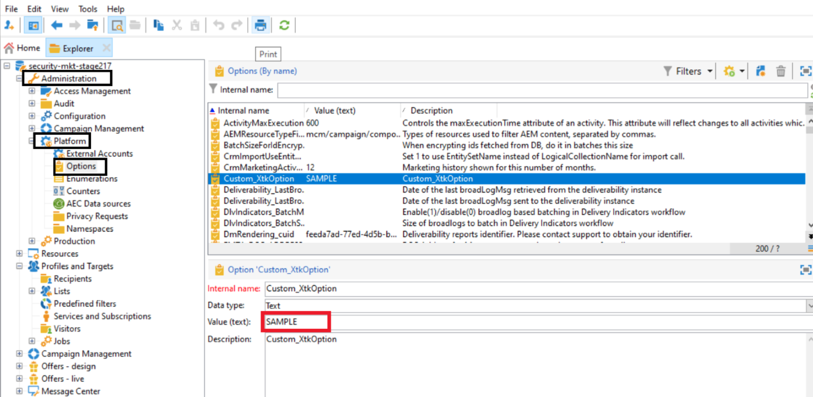

# 技術說明：認證輪換指南 {#ac-customer-credentials}

身為客戶，您有責任定期以新的認證取代憑證，以降低安全風險。

## Adobe Campaign選項認證 {#ac-options-credentials}

在Adobe Campaign Explorer中，**管理>平台>選項**&#x200B;節點可讓您修改Adobe Campaign選項。 如果您在這裡儲存了一些認證，請務必輪換它們。

## 外部帳戶認證 {#ac-accounts-credentials}

**管理>平台>外部帳戶**&#x200B;節點可讓您修改Adobe Campaign外部帳戶。

請輪換您儲存在外部帳戶中的所有認證。

>[!CAUTION]
>
>**不要**&#x200B;修改Adobe Managed認證。 任何具有`adobe`相關伺服器的外部帳戶都不應修改。

對於特定的技術`mc*` （例如：mc1、mc2等）和`Interaction*` （例如：interaction1、interaction2等）運運算元，以下兩種方法中的任一種都可以遵循：

1. Adobe可以變更這類操作員的認證，並與您共用。 請注意，在您這邊更新這些操作員的認證之前，使用這些操作員的所有整合功能都將停止運作。

1. Adobe可建立與每個現有運運算元相對應的&#x200B;**新**&#x200B;運運算元，並與您共用。 在您切換至舊運運算元後，Adobe將會刪除這些運運算元的所有相符專案。

## Mobile Services私人金鑰/憑證  {#ac-key-credentials}

如需與行動服務相關的私密金鑰和憑證的輪換，請參閱以下連結。

* 若為Android，請參閱[本檔案](https://experienceleague.adobe.com/en/docs/campaign-classic/using/sending-messages/sending-push-notifications/configure-the-mobile-app/configuring-the-mobile-application-android){target="_blank"}。
瀏覽至**建立Android行動應用程式>設定API版本**&#x200B;區段。

* 若為iOS，請參閱[本檔案](https://experienceleague.adobe.com/en/docs/campaign-classic/using/sending-messages/sending-push-notifications/configure-the-mobile-app/configuring-the-mobile-application){target="_blank"}。
瀏覽至**建立iOS行動應用程式 — >驗證模式**&#x200B;區段。

## GPG 金鑰 {#ac-gpg-credentials}

若要旋轉GPG金鑰，必須執行下列步驟：

1. 使用現有金鑰解密現有資料。 [了解更多](https://experienceleague.adobe.com/en/docs/control-panel/using/instances-settings/gpg-keys-management#decrypting-data){target="_blank"}。

1. 建立新的GPG金鑰組。 在[本檔案](https://experienceleague.adobe.com/en/docs/control-panel/using/instances-settings/gpg-keys-management#decrypting-data){target="_blank"}中進一步瞭解GPG金鑰管理。

1. 以新建立的金鑰取代所有工作流程中的現有GPG金鑰使用方式。

1. 刪除現有的GPG金鑰。
