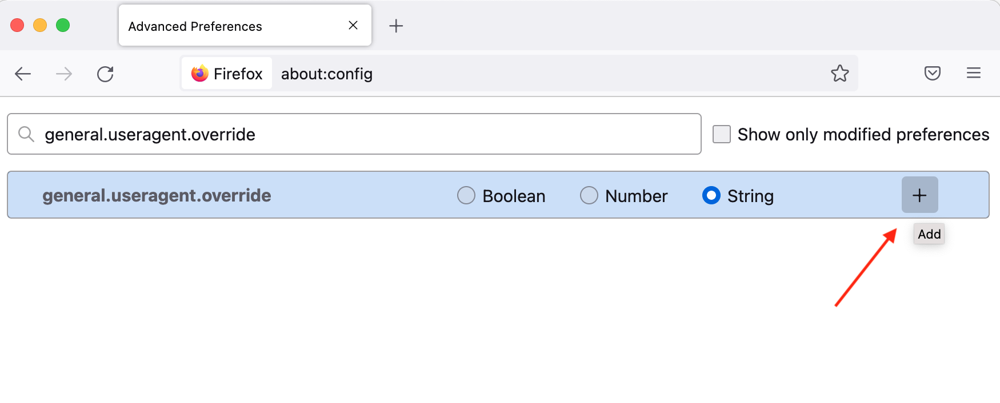
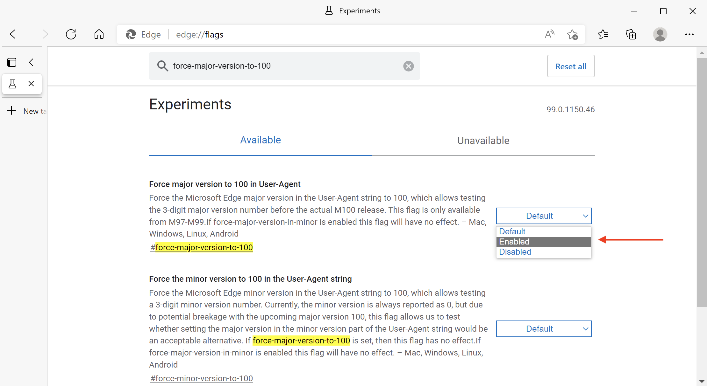

# 3位數瀏覽器版本對Campaign網頁元件的影響 {#version-100}

Google和Mozilla警告說，Chrome和Firefox可能會因為某些網站即將推出的3位數版本而中斷它們。

Chrome v100的發行日期設定為 **2022年3月29日**&#x200B;上的、和Firefox v100 **2022年5月3日**.

Microsoft於2022年3月早些時候發行Edge v100。

將版本編號從2位數變更為3位數時，造訪未針對此變更做好準備的網站時可能會造成一些問題。 某些網頁可能會停止在這些新瀏覽器版本中正確顯示。

主要網站的相容性已預先測試。 如果在發行這些版本之前無法修正網站的問題，公司會準備備份計畫以確保網站不受影響。

網站上的潛在問題或功能遺失源自瀏覽器傳送至您造訪之網站的使用者代理字串：使用者代理字串是瀏覽器傳送至網站的字串，用以告知網站您使用哪個瀏覽器和版本，以及相關的技術。 瀏覽器傳送請求至網站時，會在擷取您要求的內容之前，先以使用者代理字串識別自己。 使用者代理字串中的資料可協助網站以適合瀏覽器的格式傳送內容。 使用者代理的版本會增加，以符合瀏覽器版本號碼。 從2位數移動到3位數可能會導致問題。

## 您有受到影響嗎？{#version-100-impact}

Adobe建議您測試Campaign網路應用程式（包括網路表單和調查），以確保這些新的瀏覽器版本仍可正常運作。

此建議適用於所有Web應用程式，尤其是當您已包含JavaScript程式碼時。

您必須檢視所有瀏覽器、行動裝置和案頭。

## 如何測試？{#version-100-test}

您可以設定瀏覽器立即將版本報告為100，然後報告並更正您遇到的任何問題。

使用這些設定，瀏覽器會將新的使用者代理字串傳送到網站，這表示瀏覽器是v100。 如果您遇到網路表單的任何問題，您應該為瀏覽器編輯器建立錯誤。 請考慮重新建置這些網路表單，然後這些更新才可廣泛使用。

### 使用Firefox 100進行測試{#test-firefox-100}

若要使用Mozilla Firefox 100測試您的網頁，您可以手動變更使用者代理字串，在網頁應用程式上模擬即將發生的使用者代理程式變更。

1. 開啟Firefox，輸入 `about:config` ，然後按Enter鍵。
1. 搜尋 `general.useragent.override`.
1. 選取「字串」，然後按一下加號(+)。

   

1. 在欄位中輸入下列文字：

   ```
   Mozilla/5.0 (Windows NT 10.0; rv:100.0) Gecko/20100101 Firefox/100.0
   ```

1. 按一下藍色核取記號按鈕以儲存設定。
1. 關閉並重新啟動瀏覽器。

若要將您的使用者代理變回其預設值，只要返回 `about:config` 並搜尋 `general.useragent.override` 重新設定。  出現時，按一下垃圾桶圖示以刪除設定，然後重新啟動瀏覽器。

### 使用Chrome 100進行測試{#test-chrome-100}

若要在您自己的網頁應用程式上測試Google Chrome 100使用者代理程式，您可以使用下列步驟啟用此測試：

1. 開啟Chrome，輸入 `chrome://flags` ，然後按Enter鍵。
1. 搜尋 `Force major version to 100 in User-Agent` 在搜尋欄位中，並將其啟用，如下所示。

   

1. 重新啟動瀏覽器。
1. 關閉 `chrome://flags` 標籤。

若要將使用者代理變更為其預設值，只需依照此程式並將標幟的設定變更為 `Default` 並重新啟動瀏覽器。


### 使用Microsoft Edge 100進行測試{#test-ms-edge-100}

從v97開始，網站擁有者可以啟用實驗旗標來模擬此版本  `#force-major-version-to-100` 在 `edge://flags`.

1. 開啟Microsoft Edge，輸入 `edge://flags` ，然後按Enter鍵。
1. 搜尋 `force-major-version-to-100` 欄位，並將其啟用，如下所示。

   

1. 重新啟動瀏覽器。
1. 關閉 `edge://flags` 標籤。

若要將使用者代理變更為其預設值，只需依照此程式並將標幟的設定變更為 `Default` 並重新啟動瀏覽器。
