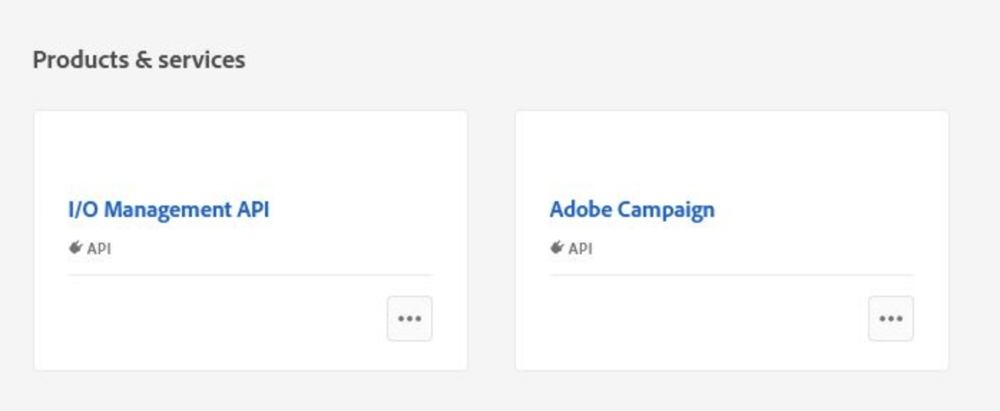

# Campaign技術運運算元移轉至Adobe Developer Console {#migrate-tech-users-to-ims}

自Campaign v8.5開始，改善對Campaign v8的驗證流程。 技術操作員必須使用[AdobeIdentity Management系統(IMS)](https://helpx.adobe.com/tw/enterprise/using/identity.html){target="_blank"}來連線至Campaign。 技術運運算元是已針對API整合明確建立的Campaign使用者設定檔。 本文詳細說明將技術運運算元移轉至Adobe Developer主控台上的技術帳戶所需的步驟。

## 哪些部分有所變更？{#ims-changes}

Campaign一般使用者已透過AdobeAdobe Campaign系統(IMS)，使用其Adobe ID連線至Identity Management主控台。 為了強化安全性和驗證程式，Adobe Campaign使用者端應用程式現在直接使用IMS技術帳戶權杖呼叫Campaign API。

在[Adobe Developer Console檔案](https://developer.adobe.com/developer-console/docs/guides/authentication/ServerToServerAuthentication/){target="_blank"}中進一步瞭解新的伺服器對伺服器驗證程式。

此變更適用於Campaign v8.5開始，且自Campaign v8.6開始將是&#x200B;**強制**。


## 您有受到影響嗎？{#ims-impacts}

如果您使用Campaign API，則需要將技術運運算元移轉至Adobe Developer Console，如下所述。

## 如何移轉？{#ims-migration-procedure}

每個技術操作員應至少有一個技術帳戶。

主要步驟為：

1. 首先建立與技術操作員對應的技術帳戶。 例如，假設為技術運運算元(TO1)新建立的技術帳戶(TA1)。
1. 執行以下技術帳戶TA1上的詳細步驟
   [步驟4](#ims-migration-step-4)是選擇性的，只有在技術操作員具有特定檔案夾許可權時才需要。
1. 將所有Campaign API整合實作移轉至新建立的技術帳戶TA1。
1. 一旦所有面對客戶的API/整合在TA1上完全開始運作，請以技術帳戶TA1取代技術操作員TO1。

### 先決條件{#ims-migration-prerequisites}

在開始移轉程式之前，您必須聯絡您的Adobe轉換經理，以便Adobe技術團隊可以移轉您現有的操作員群組和AdobeIdentity Management System (IMS)的已命名許可權。

### 步驟1 — 在Adobe Developer Console中建立/更新Campaign專案{#ims-migration-step-1}

整合是在Adobe Developer Console中建立為&#x200B;**專案**&#x200B;的一部分。 在[Adobe Developer Console檔案](https://developer.adobe.com/developer-console/docs/guides/projects/){target="_blank"}中進一步瞭解專案。

您可以使用任何先前建立的專案，也可以建立新專案。 建立專案的步驟已詳載於[Adobe Developer Console檔案](https://developer.adobe.com/developer-console/docs/guides/getting-started/){target="_blank"}。

針對此移轉，您必須在專案中新增下列API： **I/O管理API**&#x200B;和&#x200B;**Adobe Campaign**。




### 步驟2 — 使用Server to Server驗證新增API至您的專案{#ims-migration-step-2}

在Adobe Developer Console中建立專案後，請新增使用伺服器對伺服器驗證的API。 在[Adobe Developer Console檔案](https://developer.adobe.com/developer-console/docs/guides/authentication/ServerToServerAuthentication/implementation/){target="_blank"}中瞭解如何設定OAuth伺服器對伺服器認證。

當API成功連線時，您可以存取新產生的認證（包括使用者端ID和使用者端密碼），並產生存取權杖。

### 步驟3 — 將產品設定檔新增至專案{#ims-migration-step-3}

您現在可以將Campaign產品設定檔新增至專案，如下所述：

1. 開啟Adobe Campaign API。
1. 按一下&#x200B;**編輯產品設定檔**&#x200B;按鈕

   

1. 將所有相關產品設定檔指派至API （例如「messagecenter」），然後儲存變更。
1. 瀏覽至專案的&#x200B;**認證詳細資料**&#x200B;標籤，並複製&#x200B;**技術帳戶電子郵件**&#x200B;值。

### 步驟4 — 更新使用者端主控台中的技術運運算元 {#ims-migration-step-4}

只有在已為此運運算元（而非透過運運算元的群組）定義特定檔案夾許可權或已命名許可權時，才需要執行此步驟。

您現在需要更新Adobe Campaign使用者端主控台中新建立的技術運運算元。 您必須將現有的技術操作員資料夾許可權套用至新的技術操作員。
若要更新此運運算元，請執行下列步驟：

1. 從Campaign使用者端主控台總管，瀏覽至&#x200B;**管理>存取管理>操作員**。
1. 存取用於API的現有技術運運算元。
1. 瀏覽至檔案夾許可權並檢查許可權。
1. 將相同的許可權套用至新建立的技術運運算元。 此操作員的電子郵件是先前複製的&#x200B;**技術帳戶電子郵件**&#x200B;值。
1. 儲存您的變更。


>[!CAUTION]
>
>新的技術運運算元必須已發出至少一個API呼叫，才能新增至Campaign使用者端主控台。
>

<!--

>[!CAUTION]
>
>After updating the authentication type for the technical operator, all API integrations with this technical operator will stop working. You must [update your API integrations](#ims-migration-step-6). 

To update the technical operator authentication mode to IMS, follow these steps:

1. From Campaign client console explorer, browse to the **Administration > Access Management > Operators**.
1. Edit the existing technical operator used for APIs.
1. Replace the **Name (login)** of this technical operator by the technical account email retrieved earlier.
1. Browse to the **Edit** button on the top left beside **File**, and select **Edit the XML source**.
1. Update the authentication mode to `ims`, as follows:

    ```javascript
    <operator 
    ...
        <access authenticationType="ims" ...
        ...
        </access>
    ...
    </operator>
    ```

1. Save your changes.

You can also update the technical operator programmatically, using SQL scripts or Campaign APIs. These modes help you automate the steps which update operator's name with associated Technical account email address and/or authentication type. 

* Use the following **SQL Script** to replace operator's name with associated email:

    ```sql
    UPDATE xtkoperator
    SET sauthenticationtype = 'ims',
            sname = '{email}'
    WHERE sname = '{name}' AND itype = 0;
    ```

* Use the following `queryDef.ExecuteQuery` **Campaign API** to fetch id of an operator for given technical operator:

    ```javascript
    <?xml version="1.0" encoding="utf-8"?>
    <soap:Envelope xmlns:soap="http://schemas.xmlsoap.org/soap/envelope/">
        <soap:Body>
            <ExecuteQuery xmlns="urn:xtk:queryDef">
                <sessiontoken>{session_token}</sessiontoken>
                <entity>
                    <queryDef schema="xtk:operator" operation="select">
                        <select>
                            <node expr="@id"/>
                        </select>
                        <where>
                            <condition expr="@name='{name}'"/>
                            <condition expr="@type=0"/>
                        </where>
                    </queryDef>
                </entity>
            </ExecuteQuery>
        </soap:Body>
    </soap:Envelope>
    ```

* Use the following `session.Write` **Campaign API** to update name with given technical account email address:

    ```javascript
    <?xml version="1.0" encoding="utf-8"?>
    <soap:Envelope xmlns:soap="http://schemas.xmlsoap.org/soap/envelope/">
        <soap:Body>
            <Write xmlns="urn:xtk:session">
                <sessiontoken>{session_token}</sessiontoken>
                <domDoc xsi:type='ns:Element' SOAP-ENV:encodingStyle='http://xml.apache.org/xml-soap/literalxml'>
                    <operator _operation="update" id="{id}" name="{email}" xtkschema="xtk:operator">
                        <access authenticationType="ims" />
                    </operator>
                </domDoc>
            </Write>
        </soap:Body>
    </soap:Envelope>
    ```
-->

### 步驟5 — 驗證設定 {#ims-migration-step-5}

若要嘗試連線，請依照[Adobe Developer Console認證指南](https://developer.adobe.com/developer-console/docs/guides/authentication/ServerToServerAuthentication/implementation/#generate-access-tokens){target="_blank"}中詳細說明的步驟來產生存取權杖，並複製提供的範例cURL命令。


### 步驟6 — 更新協力廠商API整合 {#ims-migration-step-6}

您必須更新API與協力廠商系統的整合。

如需API整合步驟的詳細資訊，包括順利整合的範常式式碼，請參閱[Adobe Developer Console驗證檔案](https://developer.adobe.com/developer-console/docs/guides/authentication/ServerToServerAuthentication/){target="_blank"}。


### 步驟7 — 移除舊的技術操作員 {#ims-migration-step-7}


移轉所有API/自訂程式碼與技術帳戶使用者的整合後。 您可以從Campaign使用者端主控台刪除舊的技術運運算元。

### Soap呼叫範例{#ims-migration-samples}

實現並驗證移轉流程後，Soap呼叫會更新如下：

* 移轉前：不支援技術帳戶存取權杖。

  ```sql
  POST /nl/jsp/soaprouter.jsp HTTP/1.1
  Host: localhost:8080
  Content-Type: application/soap+xml;
  SOAPAction: "nms:rtEvent#PushEvent"
  charset=utf-8
  
  <?xml version="1.0" encoding="utf-8"?>  <soapenv:Envelope xmlns:soapenv="http://schemas.xmlsoap.org/soap/envelope/" xmlns:urn="urn:nms:rtEvent">
  <soapenv:Header/>
  <soapenv:Body>
      <urn:PushEvent>
          <urn:sessiontoken>SESSION_TOKEN</urn:sessiontoken>
          <urn:domEvent>
              <!--You may enter ANY elements at this point-->
              <rtEvent type="type" email="name@domain.com"/>
          </urn:domEvent>
      </urn:PushEvent>
  </soapenv:Body>
  </soapenv:Envelope>
  ```

* 移轉後：支援技術帳戶存取權杖。 預期在`Authorization`標頭中提供存取權杖做為持有人權杖。 應在此忽略工作階段權杖的使用情況，如下方soap呼叫範例所示。

  ```sql
  POST /nl/jsp/soaprouter.jsp HTTP/1.1
  Host: localhost:8080
  Content-Type: application/soap+xml;
  SOAPAction: "nms:rtEvent#PushEvent"
  charset=utf-8
  Authorization: Bearer <IMS_Technical_Token_Token>
  
  <?xml version="1.0" encoding="utf-8"?>  <soapenv:Envelope xmlns:soapenv="http://schemas.xmlsoap.org/soap/envelope/" xmlns:urn="urn:nms:rtEvent">
  <soapenv:Header/>
  <soapenv:Body>
      <urn:PushEvent>
          <urn:sessiontoken></urn:sessiontoken>
          <urn:domEvent>
              <!--You may enter ANY elements at this point-->
              <rtEvent type="type" email="name@domain.com"/>
          </urn:domEvent>
      </urn:PushEvent>
  </soapenv:Body>
  </soapenv:Envelope>
  ```
