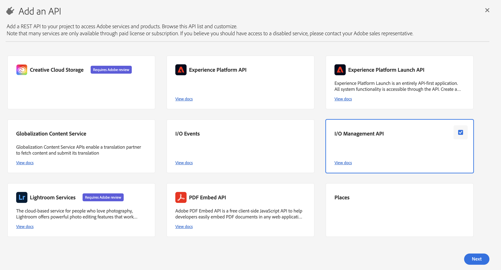
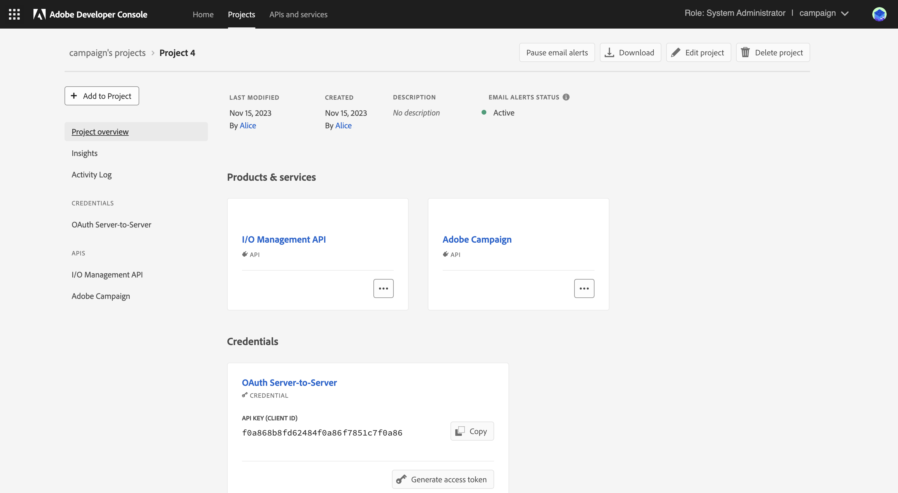

# Campaign技術運運算元移轉至Adobe Developer主控台 {#migrate-tech-users-to-ims}

自Campaign v8.5開始，為了強化安全性和驗證流程，我們一直在改善Campaign v8的驗證流程。 技術操作員現在可以使用 [AdobeIdentity Management系統(IMS)](https://helpx.adobe.com/cn/enterprise/using/identity.html){target="_blank"} to connect to Campaign. Learn more about the new server to server authentication process in [Adobe Developer Console documentation](https://developer.adobe.com/developer-console/docs/guides/authentication/ServerToServerAuthentication/){target="_blank"}.

技術運運算元是已針對API整合明確建立的Campaign使用者設定檔。 本文詳細說明透過Adobe Developer主控台將技術運運算元移轉至技術帳戶所需的步驟。


## 您有受到影響嗎？{#ims-impacts}

如果您從Campaign外部的系統將API呼叫移轉至其Campaign行銷執行個體或即時訊息中心執行個體，您必須透過Adobe Developer主控台將技術運運算元移轉至技術帳戶，如下所述。

此變更適用於Campaign v8.5。


## 移轉程式 {#ims-migration-procedure}

請依照下列步驟，在Adobe Developer主控台中建立技術帳戶，然後使用這些新建立的帳戶，以便能夠變更在Adobe Campaign中進行API呼叫的所有外部系統的驗證方法。

這些步驟的概觀如下：

* 在Adobe Developer Console中建立專案
* 將適當的API指派給新建立的專案
* 將所需的Campaign產品設定檔授與專案
* 更新您的API以使用新建立的技術帳戶認證
* 從您的Campaign執行個體移除舊版技術運運算元

### 移轉的必要條件{#ims-migration-prerequisites}

為了能夠建立技術帳戶來取代技術操作者，必須驗證所有Campaign執行個體的Admin Console中存在正確Campaign產品設定檔的先決條件。 您可以在Adobe控制檯中進一步瞭解產品設定檔，位置如下： [Adobe Developer Console檔案](https://developer.adobe.com/developer-console/docs/guides/projects/){target="_blank"}.

針對傳入訊息中心執行個體的API呼叫，在升級至Campaign v8.5期間或布建執行個體期間應已建立產品設定檔。 此產品設定檔名為：

`campaign - <your campaign instance> - messagecenter`

如果您已使用IMS型驗證讓使用者存取Campaign，則API呼叫所需的產品設定檔應已存在於Admin Console中。 如果您在Campaign中為行銷執行個體的API呼叫使用自訂運運算元群組，則必須在Admin Console中建立該產品設定檔。

對於其他情況，您必須聯絡您的Adobe轉變經理，以便Adobe技術團隊能夠將您現有的操作員群組和已命名的許可權移轉至Admin Console內的產品設定檔。


### 步驟1 — 在Adobe Developer主控台中建立Campaign專案 {#ims-migration-step-1}

整合是在建立時，作為 **專案** 在Adobe Developer Console中。 進一步瞭解中的專案 [Adobe Developer Console檔案](https://developer.adobe.com/developer-console/docs/guides/projects/){target="_blank"}.

您可以使用任何先前建立的專案，也可以建立新專案。 建立專案的步驟詳見 [Adobe Developer Console檔案](https://developer.adobe.com/developer-console/docs/guides/getting-started/){target="_blank"}. 您可以在下方找到關鍵步驟

<!--
For this migration, you must add below APIs in your project: **I/O Management API** and **Adobe Campaign**.

-->

若要建立新專案，請按一下 **建立新專案** 從Adobe Developer Console的主畫面。


您可以使用 **編輯專案** 按鈕以重新命名此專案。


### 步驟2 — 將API新增至您的專案 {#ims-migration-step-2}

從新建立的專案畫面中新增API的必要專案，以便能夠將此專案作為技術帳戶用於您對Adobe Campaign的API呼叫。

若要將API新增至專案，請依照下列步驟執行：

1. 按一下 **新增API** 以選取要新增至專案的API。
   
1. 勾選Adobe Campaign卡片右上角的方塊，選取Adobe Campaign API並將其新增至您的專案，當您將滑鼠停留在卡片上時，就會顯示這個方塊
   
1. 按一下 **下一個** 在熒幕底部。

### 步驟3 — 選取驗證型別  {#ims-migration-step-3}

在 **設定API** 畫面中，選取所需的驗證型別。 **OAuth伺服器對伺服器** 此專案需要驗證。 確認已選取，然後按一下 **下一個** 在熒幕底部。


<!--
Once your project is created in the Adobe Developer Console, add an API that uses Server-to-Server authentication. Learn how to set up the OAuth Server-to-Server credential in [Adobe Developer Console documentation](https://developer.adobe.com/developer-console/docs/guides/authentication/ServerToServerAuthentication/implementation/){target="_blank"}.

When the API has been successfully connected, you can access the newly generated credentials including Client ID and Client Secret, as well as generate an access token.-->

### 步驟4 — 選取產品設定檔 {#ims-migration-step-4}

如先決條件一節中所述，您必須指派適當的產品設定檔以供專案使用。 在此步驟中，您必須選取要由正在建立的技術帳戶使用的產品設定檔。

如果此技術帳戶用於對Message Center例項進行API呼叫，請務必選取Adobe建立產品設定檔，結尾為 `messagecenter`.

針對行銷執行個體的API呼叫，選取與執行個體和操作員群組對應的產品設定檔。

選取所需的產品設定檔後，請按一下 **儲存已設定的API** 在熒幕底部。

<!--
You can now add your Campaign product profile to the project, as detailed below:

1. Open the Adobe Campaign API.
1. Click the **Edit product profiles** button

    

1. Assign all the relevant Product Profiles to the API, for example 'messagecenter', and save your changes.
1. Browse to the **Credential details** tab of your project, and copy the **Technical Account Email** value.-->

### 步驟5 — 將I/O管理API新增至專案 {#ims-migration-step-5}


在專案畫面中，按一下 **[!UICONTROL + Add to Project]** 並選擇 **[!UICONTROL API]** 在熒幕左上角新增I/O Management API至此專案。


在 **新增API** 畫面，向下捲動以尋找 **I/O管理API** 卡片。 按一下將游標停留在卡片上時顯示的核取方塊，選取該專案。 然後按一下 **下一個** 在熒幕底部。




在 **設定API** 熒幕中，OAuth伺服器對伺服器驗證已存在。 按一下 **儲存已設定的API** 在熒幕底部。


這會帶您回到新建立專案之I/O管理API中的專案畫面。 按一下畫面頂端階層連結中的專案名稱，即可返回主專案詳細資訊頁面。


### 步驟6 — 驗證專案設定 {#ims-migration-step-6}

請檢閱您的專案，確認其外觀類似於以下的 **I/O管理API** 和 **ADOBE CAMPAIGN API** 顯示在「產品與服務」區段及 **OAuth伺服器對伺服器** 在「證明資料」區段中。




### 步驟7 — 驗證設定 {#ims-migration-step-7}

若要嘗試連線，請依照以下詳細步驟操作： [Adobe Developer Console憑證指南](https://developer.adobe.com/developer-console/docs/guides/authentication/ServerToServerAuthentication/implementation/#generate-access-tokens){target="_blank"} 以產生存取權杖並複製所提供的範例cURL命令。 您可以使用這些認證建立soap呼叫，以測試您是否能正確驗證及連線至Adobe Campaign執行個體。 建議在對協力廠商API整合進行所有變更前，先執行此驗證。

### 步驟8 — 更新協力廠商API整合 {#ims-migration-step-8}

您現在必須更新API整合功能，才能對Adobe Campaign發出呼叫，使用新建立的技術帳戶。

如需API整合步驟的詳細資訊，包括順利整合的範常式式碼，請參閱 [Adobe Developer Console驗證檔案](https://developer.adobe.com/developer-console/docs/guides/authentication/ServerToServerAuthentication/){target="_blank"}.

以下範例SOAP呼叫顯示，第三方系統的移轉呼叫前後。

實現並驗證移轉流程後，Soap呼叫會更新如下：


* 移轉前：不支援技術帳戶存取權杖。

  ```sql
  POST /nl/jsp/soaprouter.jsp HTTP/1.1
  Host: localhost:8080
  Content-Type: application/soap+xml;
  SOAPAction: "nms:rtEvent#PushEvent"
  charset=utf-8
  
  <?xml version="1.0" encoding="utf-8"?>  <soapenv:Envelope xmlns:soapenv="http://schemas.xmlsoap.org/soap/envelope/" xmlns:urn="urn:nms:rtEvent">
  <soapenv:Header/>
  <soapenv:Body>
      <urn:PushEvent>
          <urn:sessiontoken>SESSION_TOKEN</urn:sessiontoken>
          <urn:domEvent>
              <!--You may enter ANY elements at this point-->
              <rtEvent type="type" email="name@domain.com"/>
          </urn:domEvent>
      </urn:PushEvent>
  </soapenv:Body>
  </soapenv:Envelope>
  ```

* 移轉後：支援技術帳戶存取權杖。 應該在中提供存取權杖 `Authorization` 標頭作為持有人權杖。 應在此忽略工作階段權杖的使用情況，如下方soap呼叫範例所示。

  ```sql
  POST /nl/jsp/soaprouter.jsp HTTP/1.1
  Host: localhost:8080
  Content-Type: application/soap+xml;
  SOAPAction: "nms:rtEvent#PushEvent"
  charset=utf-8
  Authorization: Bearer <IMS_Technical_Token_Token>
  
  <?xml version="1.0" encoding="utf-8"?>  <soapenv:Envelope xmlns:soapenv="http://schemas.xmlsoap.org/soap/envelope/" xmlns:urn="urn:nms:rtEvent">
  <soapenv:Header/>
  <soapenv:Body>
      <urn:PushEvent>
          <urn:sessiontoken></urn:sessiontoken>
          <urn:domEvent>
              <!--You may enter ANY elements at this point-->
              <rtEvent type="type" email="name@domain.com"/>
          </urn:domEvent>
      </urn:PushEvent>
  </soapenv:Body>
  </soapenv:Envelope>
  ```


### 步驟9 - （選用）在Campaign使用者端主控台中更新技術帳戶運運算元 {#ims-migration-step-9}

此步驟為選用步驟，且僅適用於行銷執行個體，不可用於任何Message Center執行個體。 如果已經為技術操作員定義了特定檔案夾許可權或已命名許可權，但未透過指派的操作員群組。 您現在需要更新Admin Console中新建立的技術帳戶使用者，以授予所需的檔案夾許可權或已命名許可權。

請注意，對Campaign執行個體進行至少一個API呼叫之前，技術帳戶使用者不會存在於Adobe Campaign中，此時IMS將會在Campaign中建立使用者。 如果您在Campaign中找不到技術使用者，請確定您已能夠成功傳送API呼叫，如上所述 [在步驟7](#ims-migration-step-7).

1. 若要套用新技術帳戶使用者所需的變更，請依電子郵件地址在Campaign使用者端主控台中找出這些變更。 此電子郵件地址是在上述專案建立和驗證步驟期間建立的。

   您可以按一下 **OAuth伺服器對伺服器** 標題在 **認證** 專案的區段。

   

   在「認證」畫面中，向下捲動以找出**技術帳戶電子郵件**，然後按一下 **複製** 按鈕。

   

1. 您現在需要更新Adobe Campaign使用者端主控台中新建立的技術運運算元。 您必須將現有的技術操作員資料夾許可權套用至新的技術操作員。

   若要更新此運運算元，請執行下列步驟：

   1. 從Campaign使用者端主控台總管，瀏覽至 **管理>存取管理>操作者**.
   1. 存取用於API的現有技術運運算元。
   1. 瀏覽至檔案夾許可權並檢查許可權。
   1. 將相同的許可權套用至新建立的技術運運算元。 此操作員的電子郵件為 **技術帳戶電子郵件** 值先前已複製。
   1. 儲存您的變更。


>[!CAUTION]
>
>新的技術運運算元必須已發出至少一個API呼叫，才能新增至Campaign使用者端主控台。
>

### 步驟10 — 從Adobe Campaign移除舊版技術運運算元 {#ims-migration-step-10}

在您移轉所有協力廠商系統以搭配IMS驗證使用新的技術帳戶後，即可從Campaign使用者端主控台刪除舊的技術運運算元。

若要這麼做，請登入Campaign使用者端主控台，導覽至 **管理>存取管理>操作者** 並找到舊版技術使用者並將其刪除。
