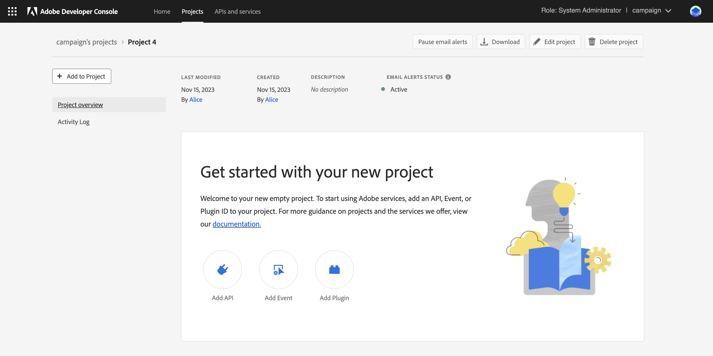

# Campaign技術運運算元移轉至Adobe Developer Console {#migrate-tech-users-to-ims}

自Campaign v8.5開始，為了強化安全性和驗證流程，我們一直在改善Campaign v8的驗證流程。 技術操作員現在可以使用[Adobe Identity Management System (IMS)](https://helpx.adobe.com/tw/enterprise/using/identity.html){target="_blank"}連線至Campaign。 在[Adobe Developer Console檔案](https://developer.adobe.com/developer-console/docs/guides/authentication/ServerToServerAuthentication/){target="_blank"}中進一步瞭解新的伺服器對伺服器驗證程式。

技術運運算元是已針對API整合明確建立的Campaign使用者設定檔。 本文詳細說明透過Adobe Developer主控台將技術運運算元移轉至技術帳戶所需的步驟。


## 您有受到影響嗎？{#ims-impacts}

如果您從Campaign外部的系統將API呼叫移轉至其Campaign行銷執行個體或即時訊息中心執行個體，您必須透過Adobe Developer Console將技術運運算元移轉至技術帳戶，如下所述。

此變更適用於Campaign v8.5開始，且自Campaign v8.6開始將是&#x200B;**強制**。


## 移轉程式 {#ims-migration-procedure}

請依照下列步驟在Adobe Developer Console中建立技術帳戶，然後使用這些新建立的帳戶，以便能夠變更在Adobe Campaign中進行API呼叫的所有外部系統的驗證方法。

這些步驟的概觀如下：

* 在Adobe Developer Console中建立專案
* 將適當的API指派給新建立的專案
* 將所需的Campaign產品設定檔授與專案
* 更新您的API以使用新建立的技術帳戶認證
* 從您的Campaign執行個體移除舊版技術運運算元

### 移轉的必要條件{#ims-migration-prerequisites}

<!--To be able to create the technical accounts which replace the technical operators, the prerequisite that the proper Campaign Product Profiles exist within the Admin Console for all Campaign instances need to be validated. You can learn more about Product Profiles within the Adobe Console in [Adobe Developer Console documentation](https://developer.adobe.com/developer-console/docs/guides/projects/){target="_blank"}.-->

針對傳入訊息中心執行個體的API呼叫，在升級至Campaign v8.5期間或布建執行個體期間應已建立產品設定檔。 此產品設定檔名為：

`campaign - <your campaign instance> - messagecenter`

如果您已使用IMS型驗證讓使用者存取Campaign，則API呼叫所需的產品設定檔應已存在於Admin Console中。 如果您在Campaign中使用自訂運運算元群組對行銷執行個體進行API呼叫，必須在Admin Console中建立該產品設定檔。

對於其他情況，您必須聯絡您的Adobe轉換經理，以便Adobe技術團隊能夠將您現有的操作員群組和「已命名」許可權移轉至Admin Console中的產品設定檔。


### 步驟1 — 在Adobe Developer Console中建立Campaign專案 {#ims-migration-step-1}

整合是在Adobe Developer Console中建立為&#x200B;**專案**&#x200B;的一部分。 在[Adobe Developer Console檔案](https://developer.adobe.com/developer-console/docs/guides/projects/){target="_blank"}中進一步瞭解專案。

您可以使用任何先前建立的專案，也可以建立新專案。 建立專案的步驟已詳載於[Adobe Developer Console檔案](https://developer.adobe.com/developer-console/docs/guides/getting-started/){target="_blank"}。 您可以在下方找到關鍵步驟

<!--
For this migration, you must add below APIs in your project: **I/O Management API** and **Adobe Campaign**.

-->

若要建立新專案，請從Adobe Developer Console的主畫面按一下&#x200B;**建立新專案**。


您可以使用&#x200B;**編輯專案**&#x200B;按鈕來重新命名此專案。


### 步驟2 — 將API新增至您的專案 {#ims-migration-step-2}

從新建立的專案畫面中新增API的必要專案，以便能夠將此專案作為技術帳戶用於您對Adobe Campaign的API呼叫。

若要將API新增至專案，請依照下列步驟執行：

1. 按一下&#x200B;**新增API**&#x200B;以選取要新增至專案的API。
   
1. 勾選Adobe Campaign卡片右上角的方塊，選取Adobe Campaign API並將其新增至您的專案，當您將滑鼠停留在卡片上時，就會顯示這個方塊
   
1. 按一下畫面底部的&#x200B;**[下一步]**。

### 步驟3 — 選取驗證型別  {#ims-migration-step-3}

在&#x200B;**設定API**&#x200B;畫面中，選取所需的驗證型別。 此專案需要&#x200B;**OAuth伺服器對伺服器**&#x200B;驗證。 確定已選取它，然後按一下畫面底部的&#x200B;**下一步**。


<!--
Once your project is created in the Adobe Developer Console, add an API that uses Server-to-Server authentication. Learn how to set up the OAuth Server-to-Server credential in [Adobe Developer Console documentation](https://developer.adobe.com/developer-console/docs/guides/authentication/ServerToServerAuthentication/implementation/){target="_blank"}.

When the API has been successfully connected, you can access the newly generated credentials including Client ID and Client Secret, as well as generate an access token.-->

### 步驟4 — 選取產品設定檔 {#ims-migration-step-4}

如先決條件一節中所述，您必須指派適當的產品設定檔以供專案使用。 在此步驟中，您必須選取要由正在建立的技術帳戶使用的產品設定檔。

如果此技術帳戶用於對Message Center執行個體進行API呼叫，請務必選取Adobe建立產品設定檔，其結尾為`messagecenter`。

針對行銷執行個體的API呼叫，選取與執行個體和操作員群組對應的產品設定檔。

選取所需的產品設定檔後，請按一下畫面底部的&#x200B;**儲存已設定的API**。

<!--
You can now add your Campaign product profile to the project, as detailed below:

1. Open the Adobe Campaign API.
1. Click the **Edit product profiles** button

    

1. Assign all the relevant Product Profiles to the API, for example 'messagecenter', and save your changes.
1. Browse to the **Credential details** tab of your project, and copy the **Technical Account Email** value.-->

### 步驟5 — 將I/O管理API新增至專案 {#ims-migration-step-5}


在專案畫面中，按一下&#x200B;**[!UICONTROL + Add to Project]**&#x200B;並選擇畫面左上方的&#x200B;**[!UICONTROL API]**，以便將I/O管理API新增至此專案。


在&#x200B;**新增API**&#x200B;畫面中，向下捲動以尋找&#x200B;**I/O管理API**&#x200B;卡。 按一下將游標停留在卡片上時顯示的核取方塊，選取該卡片。 然後按一下熒幕底部的&#x200B;**下一步**。


在&#x200B;**設定API**&#x200B;畫面中，OAuth伺服器對伺服器驗證已存在。 按一下畫面底部的&#x200B;**「儲存設定的API」**。


這會帶您回到新建立專案之I/O管理API中的專案畫面。 按一下畫面頂端階層連結中的專案名稱，即可返回主專案詳細資訊頁面。


### 步驟6 — 驗證專案設定 {#ims-migration-step-6}

檢閱您的專案，確定專案看起來類似下文，產品和服務區段中的&#x200B;**I/O管理API**&#x200B;和&#x200B;**Adobe Campaign API**&#x200B;以及[認證]區段中的&#x200B;**OAuth伺服器對伺服器**。


### 步驟7 — 驗證設定 {#ims-migration-step-7}

若要嘗試連線，請依照[Adobe Developer Console認證指南](https://developer.adobe.com/developer-console/docs/guides/authentication/ServerToServerAuthentication/implementation/#generate-access-tokens){target="_blank"}中詳細說明的步驟來產生存取權杖，並複製提供的範例cURL命令。 您可以使用這些認證建立soap呼叫，以測試您是否能正確驗證及連線至Adobe Campaign執行個體。 建議在對協力廠商API整合進行所有變更前，先執行此驗證。

### 步驟8 — 更新協力廠商API整合 {#ims-migration-step-8}

您現在必須更新所有對Adobe Campaign發出呼叫的API整合，才能使用新建立的技術帳戶。

如需API整合步驟的詳細資訊，包括順利整合的範常式式碼，請參閱[Adobe Developer Console驗證檔案](https://developer.adobe.com/developer-console/docs/guides/authentication/ServerToServerAuthentication/){target="_blank"}。

以下是顯示協力廠商系統移轉之前和之後的SOAP呼叫範例。

使用Adobe Identity Management System (IMS)驗證時，若要產生WSDL檔案，您應該在Postman呼叫中新增`Authorization: Bearer <IMS_Technical_Token_Token>`：

```
curl --location --request POST 'https://<instance_url>/nl/jsp/schemawsdl.jsp?schema=nms:rtEvent' \--header 'Authorization: Bearer <Technical account access token>'
```

實現並驗證移轉流程後，Soap呼叫會更新如下：

* 移轉前：不支援技術帳戶存取權杖。

  ```sql
  POST /nl/jsp/soaprouter.jsp HTTP/1.1
  Host: localhost:8080
  Content-Type: application/soap+xml;
  SOAPAction: "nms:rtEvent#PushEvent"
  charset=utf-8
  
  <?xml version="1.0" encoding="utf-8"?>  <soapenv:Envelope xmlns:soapenv="http://schemas.xmlsoap.org/soap/envelope/" xmlns:urn="urn:nms:rtEvent">
  <soapenv:Header/>
  <soapenv:Body>
      <urn:PushEvent>
          <urn:sessiontoken>SESSION_TOKEN</urn:sessiontoken>
          <urn:domEvent>
              <!--You may enter ANY elements at this point-->
              <rtEvent type="type" email="name@domain.com"/>
          </urn:domEvent>
      </urn:PushEvent>
  </soapenv:Body>
  </soapenv:Envelope>
  ```

* 移轉後：支援技術帳戶存取權杖。 預期在`Authorization`標頭中提供存取權杖做為持有人權杖。 應在此忽略工作階段權杖的使用情況，如下方soap呼叫範例所示。

  ```sql
  POST /nl/jsp/soaprouter.jsp HTTP/1.1
  Host: localhost:8080
  Content-Type: application/soap+xml;
  SOAPAction: "nms:rtEvent#PushEvent"
  charset=utf-8
  Authorization: Bearer <IMS_Technical_Token_Token>
  
  <?xml version="1.0" encoding="utf-8"?>  <soapenv:Envelope xmlns:soapenv="http://schemas.xmlsoap.org/soap/envelope/" xmlns:urn="urn:nms:rtEvent">
  <soapenv:Header/>
  <soapenv:Body>
      <urn:PushEvent>
          <urn:sessiontoken></urn:sessiontoken>
          <urn:domEvent>
              <!--You may enter ANY elements at this point-->
              <rtEvent type="type" email="name@domain.com"/>
          </urn:domEvent>
      </urn:PushEvent>
  </soapenv:Body>
  </soapenv:Envelope>
  ```

### 步驟9 - （選用）在Campaign使用者端主控台中更新技術帳戶運運算元 {#ims-migration-step-9}

此步驟為選用步驟，且僅適用於行銷執行個體，不可用於任何Message Center執行個體。 如果已經為技術操作員定義了特定檔案夾許可權或已命名許可權，但未透過指派的操作員群組。 您現在需要更新Admin Console中新建立的技術帳戶使用者，以授予所需的檔案夾許可權或已命名許可權。

請注意，對Campaign執行個體進行至少一個API呼叫之前，技術帳戶使用者不會存在於Adobe Campaign中，此時IMS將會在Campaign中建立使用者。 如果您在Campaign內找不到技術使用者，請確定您已能夠成功傳送API呼叫，如步驟7[&#128279;](#ims-migration-step-7)中所述。

1. 若要套用新技術帳戶使用者所需的變更，請依電子郵件地址在Campaign使用者端主控台中找出這些變更。 此電子郵件地址是在上述專案建立和驗證步驟期間建立的。

   您可以按一下專案&#x200B;**認證**&#x200B;區段中的&#x200B;**OAuth伺服器對伺服器**&#x200B;標題來尋找此電子郵件地址。

   

   在[認證]畫面中，向下捲動以找到&#x200B;**Technical Account Email &#x200B;**，然後按一下&#x200B;**複製**&#x200B;按鈕。

   

1. 您現在需要更新Adobe Campaign使用者端主控台中新建立的技術運運算元。 您必須將現有的技術操作員資料夾許可權套用至新的技術操作員。

   若要更新此運運算元，請執行下列步驟：

   1. 從Campaign使用者端主控台總管，瀏覽至&#x200B;**管理>存取管理>操作員**。
   1. 存取用於API的現有技術運運算元。
   1. 瀏覽至檔案夾許可權並檢查許可權。
   1. 將相同的許可權套用至新建立的技術運運算元。 此操作員的電子郵件是先前複製的&#x200B;**技術帳戶電子郵件**&#x200B;值。
   1. 儲存您的變更。


>[!CAUTION]
>
>新的技術運運算元必須已發出至少一個API呼叫，才能新增至Campaign使用者端主控台。
>

### 步驟10 — 從Adobe Campaign移除舊版技術運運算元 {#ims-migration-step-10}

在您移轉所有協力廠商系統以搭配IMS驗證使用新的技術帳戶後，即可從Campaign使用者端主控台刪除舊的技術操作員。

若要這麼做，請登入Campaign使用者端主控台，導覽至&#x200B;**管理>存取管理>操作員**，並找出舊版技術使用者並將其刪除。
