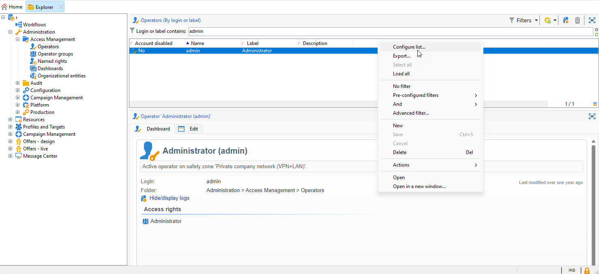

# 移轉Campaign運運算元至AdobeIdentity Management系統(IMS) {#migrate-users-to-ims}

自Campaign v8.6開始，改善對Campaign v8的驗證流程。 所有運運算元將使用 [AdobeIdentity Management系統(IMS)](https://helpx.adobe.com/tw/enterprise/using/identity.html){target="_blank"} **僅限** 以連線至Campaign。 不再允許以使用者/密碼（亦稱為原生驗證）連線。 Adobe建議在Campaign v8.5.2中執行此移轉，以便能夠順利移轉至Campaign v8.6。

身為Campaign Classic v7 Managed Services客戶，如果您要移轉至Campaign v8，此程式也適用於您。

本文詳細說明將技術運運算元移轉至Adobe Developer主控台上的技術帳戶所需的步驟。

## 哪些部分有所變更？{#move-to-ims-changes}

透過Campaign v8，所有一般使用者應該已透過AdobeAdobe Campaign System (IMS)，使用其Adobe ID連線至Identity Management使用者端主控台。 但是，使用某些舊版設定時，使用者/密碼連線仍然可用。 **從Campaign v8.6開始將不再允許這樣做。**

此外，為了強化安全性和驗證程式，Adobe Campaign使用者端應用程式現在直接使用IMS技術帳戶權杖呼叫Campaign API。 技術操作員的移轉詳情請參閱中提供的專屬文章 [此頁面](ims-migration.md).

此變更適用於從Campaign v8.5.2開始，且將 **強制** 從Campaign v8.6開始。

## 您有受到影響嗎？{#migrate-ims-impacts}

如果貴組織中的操作員使用其登入/密碼（亦即）連線至Campaign使用者端主控台， 原生驗證)，您會受到影響，且必須將這些運運算元移轉至Adobe IMS，如下所述。

移轉至 [AdobeIdentity Management系統(IMS)](https://helpx.adobe.com/tw/enterprise/using/identity.html){target="_blank"} 是確保環境安全且標準化的安全性必要條件，因為大部分其他Adobe Experience Cloud解決方案和應用程式皆已在IMS上。

## 如何移轉？{#ims-migration-procedure}

### 先決條件{#ims-migration-prerequisites}

在開始移轉程式之前，您必須聯絡您的Adobe代表（轉變經理），以便Adobe技術團隊可以移轉您現有的操作員群組和AdobeIdentity Management System (IMS)的已命名許可權。

### 主要步驟 {#ims-migration-steps}

以下列出此移轉的關鍵步驟：

1. Adobe會將您的環境升級至Campaign v8.5.2。
1. 升級後，您仍然可以透過兩種方法建立新使用者，以原生使用者身分或透過IMS。
1. 您的內部Campaign管理員必須向Campaign使用者端主控台上的所有原生使用者新增唯一電子郵件，並在完成後向Adobe轉變管理員確認。 此步驟的詳細資訊，請參閱 [本節](#ims-migration-id).
1. 與Adobe合作，確保Adobe的日期，以針對您的非技術使用者（操作員）和產品設定檔執行自動移轉。 此步驟需要一小時的時段，您的任何執行個體都沒有停機時間。
1. 您的內部Campaign管理員會驗證這些變更，並提供簽核服務。 移轉後，您再也不能建立任何以他的登入和密碼進行驗證的進一步運運算元。

您現在可以將技術運運算元移轉至Adobe Developer主控台，如所述 [此技術檔案](ims-migration.md). 如果您使用Campaign API，則此步驟為必要步驟。

此移轉一旦完成，請向您的Adobe轉變管理員確認：Adobe接著將移轉標示為完成，並封鎖建立新的原生使用者和原生使用者登入。 接著您的環境就會受到保護並標準化。

## 常見問題集 {#ims-migration-faq}

### 何時可以開始移轉？ {#ims-migration-start}

移轉至「 」的先決條件 [AdobeIdentity Management系統(IMS)](https://helpx.adobe.com/tw/enterprise/using/identity.html){target="_blank"} 是將您的環境升級至Campaign v8.5.2。

升級到Campaign v8.5.2後，您可以在中繼環境中開始IMS移轉，並據此規劃生產環境。

### 組建版本升級至Campaign v8.5.2後會發生什麼事？ {#ims-migration-after-upgrade}

環境升級至Campaign v8.5.2後，您就可以開始轉變至 [AdobeIdentity Management系統(IMS)](https://helpx.adobe.com/tw/enterprise/using/identity.html){target="_blank"}.

在IMS移轉完成之前，仍允許建立新的原生使用者。

### 移轉何時完成？ {#ims-migration-end}

終端使用者移轉及技術使用者移轉至AdobeIdentity Management系統(IMS)後，您必須聯絡Adobe轉換經理，讓Adobe將您的移轉標示為完成，並封鎖從使用者端主控台建立使用者的作業，以及停用原生使用者登入。

### 如何在移轉後建立使用者？ {#ims-migration-native}

完整IMS移轉完成後，Adobe將套用會封鎖新原生使用者建立的限制。 在IMS移轉完成之前，不會套用這些限制。

對於新客戶 — 不允許從頭開始建立新的原生使用者。

身為Campaign管理員，您可以透過Adobe Admin Console和Campaign使用者端主控台將許可權授予組織的使用者。 使用者使用其Adobe ID登入Adobe Campaign。 進一步瞭解 [本檔案](../../v8/start/gs-permissions.md).

### 如何為目前原生使用者新增電子郵件？ {#ims-migration-id}

身為Campaign管理員，您必須從使用者端主控台新增電子郵件ID至所有原生使用者。 若要執行此作業，請依照下列步驟操作：

1. 連線到使用者端主控台並瀏覽至 **管理>存取管理>操作者**.
1. 在運運算元清單中選取要更新的運運算元。
1. 輸入操作員的電子郵件，在 **聯絡方式** 運運算元表單的區段。
1. 儲存您的變更。

<!--You can also import a CSV file to update all your operator profiles with their email.-->

### 如何透過IMS登入Campaign？ {#ims-migration-log}

瞭解如何使用您的Adobe ID連線至Campaign，位於 [本節](../../v8/start/connect.md).

### 此移轉期間是否會有停機時間？ {#ims-migration-downtime}

為了完成移轉（移轉使用者和產品設定檔），Adobe需要一小時的時間，您的任何執行個體（工作流程等）都不會出現停機時間。

在這段時間內，所有Campaign使用者都必須登出，並在完成移轉至IMS後使用Adobe ID登回。

### 在IMS使用者移轉期間登入的使用者會發生什麼事？ {#ims-migration-log-off}

Adobe強烈建議所有使用者在移轉期間登出。

### 我組織中的使用者已在使用IMS，我仍需要執行IMS移轉嗎？{#ims-migration-needed}

此移轉包括兩個方面：一般使用者移轉和技術使用者移轉（用於自訂程式碼的API）。

如果您的所有使用者（Campaign運運算元）都在IMS上，則不需要執行此移轉。 不過，您仍需要移轉可能已用於自訂程式碼中的技術使用者。 在[本頁](ims-migration.md)中瞭解更多。

完成此移轉後，您必須聯絡Adobe轉換經理，讓Adobe完成移轉。

### 如何檢視您的操作員的驗證型別？

瞭解如何在Campaign中檢視您的操作員驗證型別：

1. 從 **瀏覽器**，存取 **管理** `>` **存取管理** `>` **運運算元**.

1. 以滑鼠右鍵按一下標題列並選取 **設定清單** 功能表。

   

1. 新增 **帳戶已停用** 和 **驗證型別** 作為 **輸出欄**.

   

您現在可以看到您的 **運運算元** 及其 **驗證型別**.

## 有用的連結 {#ims-useful-links}

* [將技術使用者移轉至Adobe Developer主控台](ims-migration.md)
* [如何連線至Adobe Campaign v8](../../v8/start/connect.md)
* [Adobe Campaign v8中的存取和許可權](../../v8/start/gs-permissions.md)
* [Adobe Campaign v8發行說明](../../v8/start/release-notes.md)
* [什麼是AdobeIdentity Management系統(IMS)](https://helpx.adobe.com/tw/enterprise/using/identity.html){target="_blank"}
