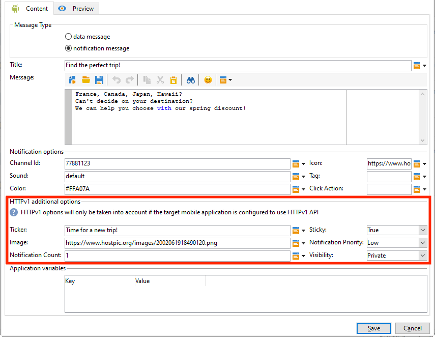

# 推播通知頻道近期變更 {#push-upgrade}

您可以使用Campaign在Android裝置上傳送推播通知。 為此，Campaign需仰賴特定的訂閱服務。 Android Firebase Cloud Messaging (FCM)服務的一些重要變更將於2024年發行，可能會影響您的Adobe Campaign實施。 您可能需要更新Android推送訊息的訂閱服務設定，才能支援此變更。

## 哪些部分有所變更？ {#fcm-changes}

為Google持續改善其服務，我們將於以下日期終止使用舊版FCM API： **2024年6月20日**. 在中進一步瞭解Firebase雲端通訊HTTP通訊協定 [Google Firebase檔案](https://firebase.google.com/docs/cloud-messaging/http-server-ref){target="_blank"}.

Adobe Campaign Classic v7和Adobe Campaign v8已支援最新API來傳送推播通知訊息。 不過，有些舊版實作仍需仰賴舊版API。 必須更新這些實作。

## 您有受到影響嗎？ {#fcm-impact}

如果您目前的實作支援使用舊版API連線至FCM的訂閱服務，則會受到影響。 您必須移轉至最新的API，才能避免服務中斷。 在這種情況下，Adobe團隊會與您聯絡。

若要檢查您是否受到影響，您可以篩選 **服務與訂閱** 根據以下篩選：

* 如果您的任何使用中推播通知服務使用 **HTTP （舊版）** API，此變更將直接影響您的設定。 您必須檢閱目前的設定，並依照以下所述移轉至較新的API。

* 如果您的設定僅使用 **HTTP v1** Android推播通知的API，則表示您已符合法規，不需要採取任何進一步動作。

## 如何移轉？ {#fcm-migration-procedure}

### 先決條件 {#fcm-migration-prerequisites}

* 針對Campaign Classic v7,20.3.1版本已新增支援HTTP v1。 如果您的環境執行於較舊的版本，移轉至HTTP v1的先決條件是將環境升級至 [最新Campaign Classic建置](https://experienceleague.adobe.com/docs/campaign-classic/using/release-notes/latest-release.html){target="_blank"}. 若為Campaign v8，所有發行版本都支援HTTP v1，且不需要升級。

* 需要Android Firebase Admin SDK服務的帳戶JSON檔案，才能將行動應用程式移至HTTP v1。 瞭解如何取得此檔案於 [Google Firebase檔案](https://firebase.google.com/docs/admin/setup#initialize-sdk){target="_blank"}.

* 對於混合、託管和Managed Services部署，除了下列移轉程式外，請聯絡Adobe以更新即時(RT)執行伺服器。 中間來源伺服器不受影響。

* 身為Campaign Classic v7內部部署使用者，您必須升級行銷和即時執行伺服器。 中間來源伺服器不受影響。

### 移轉程式 {#fcm-migration-steps}

若要將環境移轉至HTTP v1，請遵循下列步驟：

1. 瀏覽至您的清單 **服務與訂閱**.
1. 列出所有行動應用程式 **HTTP （舊版）** API版本。
1. 針對這些行動應用程式，設定 **API版本** 至 **HTTP v1**.
1. 按一下 **[!UICONTROL Load project json file to extract project details...]** 直接載入JSON金鑰檔案的連結。

   您也可以手動輸入下列明細：

   * **[!UICONTROL Project Id]**
   * **[!UICONTROL Private Key]**
   * **[!UICONTROL Client Email]**

   

1. 按一下 **[!UICONTROL Test the connection]** 檢查您的設定是否正確，以及行銷伺服器是否擁有FCM的存取權。 請注意，對於中間來源部署， **[!UICONTROL Test connection]** 按鈕無法檢查伺服器是否可存取Android Firebase雲端通訊(FCM)服務。
1. 或者，您也可以選擇擴充推送訊息的內容 **[!UICONTROL Application variables]** 如有需要。 這些都是可完全自訂的專案，而且是傳送至行動裝置的訊息裝載的一部分。
1. 按一下 **[!UICONTROL Finish]**，之後 **[!UICONTROL Save]**。

以下是FCM裝載名稱，可進一步個人化您的推播通知。 這些選項會詳細說明 [此處](#fcm-apps).

| 訊息類型 | 可設定的訊息元素（FCM裝載名稱） | 可設定的選項（FCM裝載名稱） |
|:-:|:-:|:-:|
| 資料訊息 | N/A | validate_only |
| 通知訊息 | 標題，內文， android_channel_id，圖示，聲音，標籤，顏色，點選動作，影像，提示，粘性，可見度，通知優先順序，通知計數   | validate_only |

>[!NOTE]
>
>這些變更套用至您的所有伺服器後，所有傳送至Android裝置的新推播通知都會使用HTTP v1 API。 處於重試、進行中及使用中的現有推播傳送仍使用HTTP （舊版） API。

### 對我的Android應用程式有何影響？ {#fcm-apps}

Android行動應用程式的程式碼不需要特定變更，且通知行為不應變更。

不過，使用HTTP v1時，您可以透過進一步個人化推播通知 **[!UICONTROL HTTPV1 additional options]**.

您可以：

* 使用 **[!UICONTROL Ticker]** 欄位以設定通知的提示文字。
* 使用 **[!UICONTROL Image]** 欄位來設定要在通知中顯示的影像URL。
* 使用 **[!UICONTROL Notification Count]** 欄位來設定直接在應用程式圖示上顯示的新未讀取資訊數目。
* 設定 **[!UICONTROL Sticky]** 選項設為false，如此一來，使用者按一下通知時，就會自動將其關閉。 如果設為true，則即使使用者按一下通知，仍會顯示通知。
* 設定 **[!UICONTROL Notification Priority]** 您的通知層級為預設、最低、低或高。
* 設定 **[!UICONTROL Visibility]** 您向公開、私人或機密發出通知的層級。

如需詳細資訊，請參閱 **[!UICONTROL HTTP v1 additional options]** 以及如何填寫這些欄位，請參閱 [FCM檔案](https://firebase.google.com/docs/reference/fcm/rest/v1/projects.messages#androidnotification){target="_blank"}.
