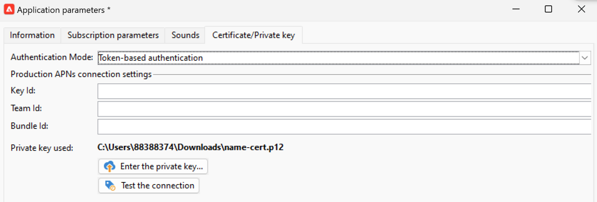

# 推播通知頻道變更 {#push-upgrade}

您可以使用Campaign在iOS和Android裝置上傳送推播通知。 為此，Campaign需仰賴行動應用程式訂閱服務。

Android Firebase Cloud Messaging (FCM)服務的一些重要變更將於2024年發行，可能會影響您的Adobe Campaign實施。 您可能需要更新Android推送訊息的訂閱服務設定，才能支援此變更。

此外，Adobe強烈建議改用權杖式連線來連線APN，而非更安全、更可擴充的憑證式連線。

## Google Android Firebase Cloud Messaging (FCM)服務 {#fcm-push-upgrade}

### 哪些部分有所變更？ {#fcm-changes}

Google持續改善服務，其中舊版FCM API將於&#x200B;**2024年7月22日**&#x200B;終止服務。 在[Google Firebase檔案](https://firebase.google.com/docs/cloud-messaging/migrate-v1){target="_blank"}中進一步瞭解Firebase雲端通訊HTTP通訊協定。

Adobe Campaign Classic v7和Adobe Campaign v8已支援最新API來傳送推播通知訊息。 不過，有些舊版實作仍需仰賴舊版API。 必須更新這些實作。

### 您有受到影響嗎？ {#fcm-impact}

如果您目前的實作支援使用舊版API連線至FCM的訂閱服務，則會受到影響。 轉換至最新的API是必須的，這樣才能避免任何服務中斷。 在這種情況下，Adobe團隊會與您聯絡。

若要檢查您是否受到影響，您可以依照以下篩選條件來篩選您的&#x200B;**服務與訂閱**：


* 如果您的任何使用中推播通知服務使用&#x200B;**HTTP （舊版）** API，此變更將直接影響您的設定。 您必須檢閱目前的設定，並依照下方所述移至較新的API。

* 如果您的設定僅使用&#x200B;**HTTP v1** API來處理Android推播通知，則表示您已符合規範，不需要您採取任何進一步的動作。

### 如何更新？ {#fcm-transition-procedure}

#### 先決條件 {#fcm-transition-prerequisites}

* 針對Campaign Classic v7,20.3.1版本已新增支援HTTP v1。 如果您的環境執行於舊版，轉換至HTTP v1的先決條件是將環境升級至[最新的Campaign Classic組建](https://experienceleague.adobe.com/docs/campaign-classic/using/release-notes/latest-release.html){target="_blank"}。 若為Campaign v8，所有發行版本都支援HTTP v1，且不需要升級。

* 需要Android Firebase Admin SDK服務的帳戶JSON檔案，才能將行動應用程式移至HTTP v1。 在[Google Firebase檔案](https://firebase.google.com/docs/admin/setup#initialize-sdk){target="_blank"}中瞭解如何取得此檔案。

* 對於混合、託管和Managed Services部署，除了下列轉換程式外，請聯絡Adobe以更新即時(RT)執行伺服器。 中間來源伺服器不受影響。

* 身為Campaign Classic v7內部部署使用者，您必須升級行銷和即時執行伺服器。 中間來源伺服器不受影響。

* 作為Campaign Classic v7內部部署或混合使用者，請檢查您的Android路由外部帳戶是否已設定`androidPushConnectorV2.js`。 [了解更多](https://experienceleague.adobe.com/en/docs/campaign-classic/using/sending-messages/sending-push-notifications/configure-the-mobile-app/configuring-the-mobile-application-android#configuring-external-account-android)

#### 轉換程式 {#fcm-transition-steps}

若要將環境移至HTTP v1，請遵循下列步驟：

1. 瀏覽至您的&#x200B;**服務與訂閱**&#x200B;清單。
1. 列出使用&#x200B;**HTTP （舊版）** API版本的所有行動應用程式。
1. 針對這些行動應用程式的每一個，將&#x200B;**API版本**&#x200B;設定為&#x200B;**HTTP v1**。
1. 按一下&#x200B;**[!UICONTROL Load project json file to extract project details...]**&#x200B;連結，直接載入您的JSON金鑰檔案。

   您也可以手動輸入下列明細：

   * **[!UICONTROL Project Id]**
   * **[!UICONTROL Private Key]**
   * **[!UICONTROL Client Email]**

   

1. 按一下&#x200B;**[!UICONTROL Test the connection]**&#x200B;以檢查您的設定是否正確，以及行銷伺服器是否具有存取FCM的許可權。 請注意，針對中間來源部署，**[!UICONTROL Test connection]**&#x200B;按鈕無法檢查伺服器是否擁有Android Firebase雲端通訊(FCM)服務的存取權。
1. 您可以視需要以約&#x200B;**[!UICONTROL Application variables]**&#x200B;擴充推送訊息內容，作為選項。 這些都是可完全自訂的專案，而且是傳送至行動裝置的訊息裝載的一部分。
1. 按一下 **[!UICONTROL Finish]**，之後 **[!UICONTROL Save]**。

   以下是FCM裝載名稱，可進一步個人化您的推播通知。 [此處](#fcm-apps)提供這些選項的詳細資料。

   | 訊息類型 | 可設定的訊息元素（FCM裝載名稱） | 可設定的選項（FCM裝載名稱） |
   |:-:|:-:|:-:|
   | 資料訊息 | N/A | validate_only |
   | 通知訊息 | title，內文， android_channel_id，圖示，聲音，標籤，顏色，點按動作，影像，提示，粘性，可見度，通知優先順序，通知計數<br> | validate_only |


>[!NOTE]
>
>這些變更套用至您的所有伺服器後，所有傳送至Android裝置的&#x200B;**新**&#x200B;推播通知都會使用HTTP v1 API。 處於重試、進行中及使用中的現有推播傳送仍使用HTTP （舊版） API。 請在以下章節瞭解如何更新。

#### 更新現有範本 {#fcm-transition-update}

轉換HTTP v1完成後，您必須為Android推播通知更新&#x200B;**傳遞範本**，以增加批次訊息的數量。 若要這麼做，請瀏覽至您的Android傳遞範本的屬性，並在&#x200B;**傳遞**&#x200B;索引標籤中，將[訊息批次數量](../../v8/send/configure-and-send.md#delivery-batch-quantity)設定為&#x200B;**256**。 將此變更套用至Android傳遞使用的所有傳遞範本，以及所有現有的Android傳遞。

您也可以更新在升級至支援HTTP v1的版本之前建立的現有傳遞和傳遞範本。 若要執行此動作：

* 若為「受管理的Cloud Service」或「託管」客戶，請聯絡Adobe以更新您現有的Android傳遞範本。

* 若為內部部署環境，請下載`fcm-httpv1-migration.js`指令碼並執行，如下所述。

  下載[fcm-httpv1-migration.zip](assets/do-not-localize/fcm-httpv1-migration-js.zip)

  >[!CAUTION]
  >
  >指令碼必須在行銷、中間來源和即時環境中執行。


  +++更新現有傳遞和範本的步驟（僅限內部部署）

  若要修補在升級至支援HTTP v1的版本之前建立的所有傳遞和傳遞範本，請遵循下列步驟：

   1. 將您現有的傳遞和傳遞範本匯出至套件中，以便在修補期間發生未預期的問題時能夠還原它們。
   1. 在Posgresql中執行以下命令：

      ```sql
      pg_dump -Fp -f /sftp/<db_name>-nmsdelivery-before_rd_script.sql -t nmsdelivery -d <db_name>
      ```

   1. 根據預設，指令碼處於`dryrun`模式，您可以在該模式中啟動它，以檢查是否需要修補某些傳遞。

      命令

      ```sql
      nlserver javascript -instance:<instance_name> -file fcm-httpv1-migration.js 
      ```

      輸出

      ```sql
      ...
      HH:MM:SS >   Processing delivery (id:123456,  label:'Deliver on Android - New', name:'DM1234')
      HH:MM:SS >   Dry run: Would update androidCheckParams for delivery (id:123456,  label:'Deliver on Android - New', name:'DM1234')
      HH:MM:SS >   Processing delivery (id:567890,  label:'Deliver on Android - New', name:'DM5678')
      HH:MM:SS >   Dry run: Would update androidCheckParams for delivery (id:567890,  label:'Deliver on Android - New', name:'DM5678')
      ...
      HH:MM:SS >   Summary (XYZ processed deliverie(s) or delivery template(s)):
      HH:MM:SS >>  - X had not patchable androidCheckParams formula!
      HH:MM:SS >   - Y had androidCheckParams formula patched.
      HH:MM:SS >   - Z ignored as alreading having androidCheckParams formula patched.
      ```

      >[!NOTE]
      >
      >需要手動更新`not patchable`傳遞。 可在紀錄中找到其ID。

   1. 在執行模式中以下列方式執行指令碼以更新傳送：

      ```sql
      nlserver javascript -instance:<instance_name> -file fcm-httpv1-migration.js -arg:run
      ```

+++

### 對我的Android應用程式有何影響？ {#fcm-apps}

Android Mobile應用程式的程式碼不需要任何特定變更，通知行為也不應變更。

不過，使用HTTP v1時，您可以使用&#x200B;**[!UICONTROL HTTPV1 additional options]**&#x200B;進一步個人化推播通知。


您可以：

* 使用&#x200B;**[!UICONTROL Ticker]**&#x200B;欄位來設定通知的提示字元文字。
* 使用&#x200B;**[!UICONTROL Image]**&#x200B;欄位來設定要在通知中顯示的影像URL。
* 使用&#x200B;**[!UICONTROL Notification Count]**&#x200B;欄位設定新未讀取資訊的數量，以直接顯示在應用程式圖示上。
* 將&#x200B;**[!UICONTROL Sticky]**&#x200B;選項設為false，讓使用者按一下通知時，通知會自動關閉。 如果設為true，則即使使用者按一下通知，仍會顯示通知。
* 將通知的&#x200B;**[!UICONTROL Notification Priority]**&#x200B;層級設定為預設、最低、低或高。
* 將通知的&#x200B;**[!UICONTROL Visibility]**&#x200B;層級設定為公開、私人或機密。

有關&#x200B;**[!UICONTROL HTTP v1 additional options]**&#x200B;以及如何填寫這些欄位的詳細資訊，請參閱[FCM檔案](https://firebase.google.com/docs/reference/fcm/rest/v1/projects.messages#androidnotification){target="_blank"}。


## Apple iOS推播通知服務(APN) {#apns-push-upgrade}

### 哪些部分有所變更？ {#ios-changes}

依照Apple的建議，您應使用無狀態驗證權杖來保護與Apple推播通知服務(APN)的通訊。

權杖型驗證提供與APN無狀態通訊的方式。 無狀態通訊比憑證式通訊更快，因為無狀態通訊不需要APN查閱憑證或其他與您的提供者伺服器相關的資訊。 使用權杖型驗證還有其他優點：

* 您可以使用來自多個提供者伺服器的相同Token。

* 您可以使用一個Token為貴公司的所有應用程式散發通知。

在[Apple開發人員檔案](https://developer.apple.com/documentation/usernotifications/establishing-a-token-based-connection-to-apns){target="_blank"}中進一步瞭解與APN的權杖型連線。

Adobe Campaign Classic v7和Adobe Campaign v8同時支援權杖型和憑證型連線。 如果您的實施仰賴憑證式連線，Adobe強烈建議您將其更新為權杖式連線。

### 您有受到影響嗎？ {#ios-impact}

如果您目前的實施仰賴憑證式請求來連線至APN，則會受到影響。 建議轉換為權杖型連線。

若要檢查您是否受到影響，您可以依照以下篩選條件來篩選您的&#x200B;**服務與訂閱**：


* 如果您的任何使用中推播通知服務使用&#x200B;**憑證式驗證**&#x200B;模式(.p12)，則應檢閱您目前的實作，並將其移至&#x200B;**權杖式驗證**&#x200B;模式(.p8)，如下所述。

* 如果您的設定僅針對iOS推播通知使用&#x200B;**權杖式驗證**&#x200B;模式，則您的實作已經是最新的，不需要您採取任何進一步的動作。

### 如何更新？ {#ios-transition-procedure}

#### 先決條件 {#ios-transition-prerequisites}

* 針對Campaign Classicv7，已在20.2發行版本中新增支援&#x200B;**權杖式驗證**&#x200B;模式。 如果您的環境執行於較舊的版本，此變更的先決條件是將您的環境升級至[最新的Campaign Classic組建](https://experienceleague.adobe.com/docs/campaign-classic/using/release-notes/latest-release.html){target="_blank"}。 對於Campaign v8，所有發行版本都支援&#x200B;**權杖式驗證**&#x200B;模式，且不需要升級。

* 您需要APNs驗證Token簽署金鑰才能產生您的伺服器所使用的Token。 如[Apple開發人員檔案](https://developer.apple.com/documentation/usernotifications/establishing-a-token-based-connection-to-apns){target="_blank"}所述，您向您的Apple開發人員帳戶要求此金鑰。

* 對於混合、託管和Managed Services部署，除了下列轉換程式外，請聯絡Adobe以更新即時(RT)執行伺服器。 中間來源伺服器不受影響。

* 身為Campaign Classic v7內部部署使用者，您必須升級行銷和即時執行伺服器。 中間來源伺服器不受影響。

#### 轉換程式 {#ios-transition-steps}

若要將iOS行動應用程式移至權杖型驗證模式，請遵循下列步驟：

1. 瀏覽至您的&#x200B;**服務與訂閱**&#x200B;清單。
1. 列出使用&#x200B;**憑證式驗證**&#x200B;模式(.p12)的所有行動應用程式。
1. 編輯每個行動應用程式，並瀏覽至&#x200B;**憑證/私密金鑰**&#x200B;標籤。
1. 從&#x200B;**驗證模式**&#x200B;下拉式清單中，選取&#x200B;**權杖型驗證**&#x200B;模式(.p8)。
1. 填寫APNs連線設定&#x200B;**[!UICONTROL Key Id]**、**[!UICONTROL Team Id]**&#x200B;和&#x200B;**[!UICONTROL Bundle Id]**，然後按一下&#x200B;**[!UICONTROL Enter the private key...]**&#x200B;以選取您的p8憑證。

   

1. 按一下&#x200B;**[!UICONTROL Test the connection]**&#x200B;以檢查您的設定是否正確，以及伺服器是否具有APN的存取權。 請注意，對於中間來源部署，**[!UICONTROL Test connection]**&#x200B;按鈕無法檢查伺服器是否擁有APN的存取權。
1. 按一下&#x200B;**[!UICONTROL Next]**&#x200B;開始設定生產應用程式，並依照上述步驟執行。
1. 按一下 **[!UICONTROL Finish]**，之後 **[!UICONTROL Save]**。

您的iOS應用程式現在已移至權杖型驗證模式。
