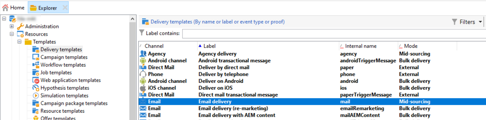

# 開始使用Campaign架構{#gs-ac-archi}

## 環境 {#environments}

Campaign可作為個別執行個體使用，每個執行個體代表完整的Campaign環境。

有兩種型別的環境可供使用：

* **生產環境**：為商務從業人員代管應用程式。

* **非生產環境**：用於將應用程式的變更推送至生產環境之前，進行各種效能和品質測試。

您可以將套件從一個環境匯出和匯入到另一個環境。

在[Campaign Classic v7檔案](https://experienceleague.adobe.com/docs/campaign-classic/using/getting-started/administration-basics/working-with-data-packages.html){target="_blank"}中進一步瞭解套件

## 部署模型 {#ac-deployment}

有兩種部署模型可供使用： **Campaign FDA部署** (P1-P3)和&#x200B;**Campaign Enterprise (FFDA)部署** (P4)。

### Campaign FDA 部署 {#ac-deployment-fda}

在其[FDA部署](fda-deployment.md)中，[!DNL Adobe Campaign] v8可連線至[!DNL Snowflake]，以透過同盟資料存取功能存取資料：您可以存取及處理儲存在[!DNL Snowflake]資料庫中的外部資料與資訊，而不需要變更Adobe Campaign資料的結構。 PostgreSQL是主要資料庫，您可以使用Snowflake做為次要資料庫，以擴充資料模型並將資料儲存至Snowflake。 接著，您可以利用出色的效能，對大型資料集執行ETL、細分和報告。

{zoomable="yes"}

>[!NOTE]
>
>在此部署模型中，[!DNL Snowflake]次要資料庫僅在請求時可用。 若要使用[!DNL Snowflake]更新您的部署，請聯絡您的Adobe轉換經理。
>

### Campaign Enterprise (FFDA)部署 {#ac-deployment-ffda}

在[Enterprise (FFDA)部署](enterprise-deployment.md)的內容中，[!DNL Adobe Campaign] v8可與兩個資料庫搭配使用：本機的[!DNL Campaign]資料庫，用於使用者介面即時傳送訊息和透過API統一查詢及寫入，以及雲端[!DNL Snowflake]資料庫，用於行銷活動執行、批次查詢及工作流程執行。

Campaign v8 企業版帶來 **完全同盟資料存取** (FFDA) 的概念：所有資料現在都在雲端資料庫遠端處理。使用此新架構，Campaign v8 企業 (FFDA) 部署可簡化資料管理：雲端資料庫不需要索引。 您只需要建立表格、複製資料，即可開始。雲端資料庫技術不需要進行具體的維護來保證效能等級。

{zoomable="yes"}

## 分割傳遞執行 {#split}

>[!AVAILABILITY]
>
>此功能僅適用於擁有多個中間來源(MID)執行個體設定的客戶。

根據您的Campaign v8套件，系統會為您布建特定數量的中間來源執行個體，負責執行傳送。

依預設，所有管道的外部帳戶都使用&#x200B;**[!UICONTROL Alternate]**&#x200B;路由模式，這表示一次會以交替方式從每個中間來源(MID)執行個體傳送一個傳遞。

為了確保速度和規模兩方面皆能有較佳的效能，您可以允許傳遞內容在中間來源執行個體之間自動分割，以更快傳送給收件者。 從行銷執行個體執行傳送時，此操作是透明的：傳送後，所有記錄會合併在一起，然後傳回行銷執行個體成為單一傳送物件。

為此，在為每個管道布建時，會建立具有&#x200B;**[!UICONTROL Split]**&#x200B;路由模式的其他外部帳戶：

* 分割傳遞 — 電子郵件(splitDeliveryEmail)
* 分割傳送 — SMS (splitDeliverySMS)
* 分割傳送 — iOS (splitDeliveryIOS)
* 分割傳送 — Android (splitDeliveryAndroid)

>[!IMPORTANT]
>
>分割路由模式預設為「分割傳遞 — 電子郵件」帳戶啟用。 對於所有其他管道外部帳戶，請聯絡您的Adobe轉換管理員以啟用此選項。
>
>根據預設，在多個中間來源(MID)執行個體之間分割傳遞的臨界值是100K。 您可以在&#x200B;**[!UICONTROL Administration]** / **[!UICONTROL Platform]** / **[!UICONTROL Options]**&#x200B;功能表的「NmsDelivery_MultiMidSplitThreshold」選項中變更此值。

若要將分割外部帳戶設為傳送傳遞的預設帳戶，您必須變更傳遞範本中的路由提供者。 要執行此操作，請依照下列步驟執行：

1. 導覽至&#x200B;**[!UICONTROL Resources]** / **[!UICONTROL Templates]** / **[!UICONTROL Delivery templates]**&#x200B;資料夾，並開啟所需的傳遞範本。 在此範例中，我們要編輯電子郵件傳遞範本。

   

1. 按一下&#x200B;**[!UICONTROL Properties]**&#x200B;按鈕，並將路由提供者變更為對應的分割傳遞外部帳戶。

   

1. 儲存您的變更。使用範本傳送的所有傳遞，現在預設都會使用分割路由模式。

<!--In addition, you can select split external accounts as the default routing provider for all future delivery templates. To do this, change the value of the **[!UICONTROL xtkoption NmsBroadcast_DefaultProvider]** option to the name of the split account.

 -->

## 訊息中心架構{#transac-msg-archi}

交易型訊息 (訊息中心) 是專為管理觸發訊息而設計的 Campaign 模組。

在[本節](../send/transactional.md)中瞭解如何傳送異動訊息。

為回應客戶在網站上的動作，會透過REST API傳送事件Campaign，並透過API呼叫提供的資訊或資料填入訊息範本，且會即時傳送交易式訊息給客戶。 這些訊息可透過電子郵件、簡訊或推播通知個別或批次傳送。

在此特定架構中，執行儲存格與控制執行個體分開，以確保高可用性和負載管理。

* 行銷人員和IT團隊會使用&#x200B;**控制項執行個體** （或行銷執行個體）來建立、設定和發佈訊息範本。 此例項也會集中事件監控和歷史記錄。

  在[本節](../send/transactional.md)中瞭解如何建立和發佈訊息範本。

* **執行執行個體**&#x200B;會擷取傳入的事件（例如密碼重設或來自網站的訂單），並傳送個人化訊息。 可以有多個執行例項可透過負載平衡器處理訊息，並調整要處理的事件數量以達最大可用性。

>[!CAUTION]
>
>控制例項和執行例項必須安裝在不同的電腦上。 他們無法共用相同的Campaign執行個體。

### 驗證

若要使用這些功能，Adobe Campaign使用者會登入控制執行個體來建立異動訊息範本、使用種子清單產生訊息預覽、顯示報告並監視執行個體。

* 單一執行例項
與Adobe代管的訊息中心執行例項互動時，外部系統可使用提供的帳戶登入及密碼，先對工作階段登入方法進行API呼叫，擷取工作階段權杖（預設於24小時後到期）。
然後，透過執行執行例項回應上述呼叫提供的sessionToken，外部應用程式可進行SOAP api叫用（rtEvents或batchEvents）以傳送通訊，而不需要在每個SOAP呼叫中包含帳戶登入和密碼。

* 多個執行例項
在負載平衡器後面有多個執行例項的多儲存格執行架構中，外部應用程式叫用的登入方法會通過負載平衡器：因此，無法使用權杖型驗證。 需要以使用者/密碼為基礎的驗證。

在[此頁面](../send/event-processing.md)中進一步瞭解異動訊息事件。
