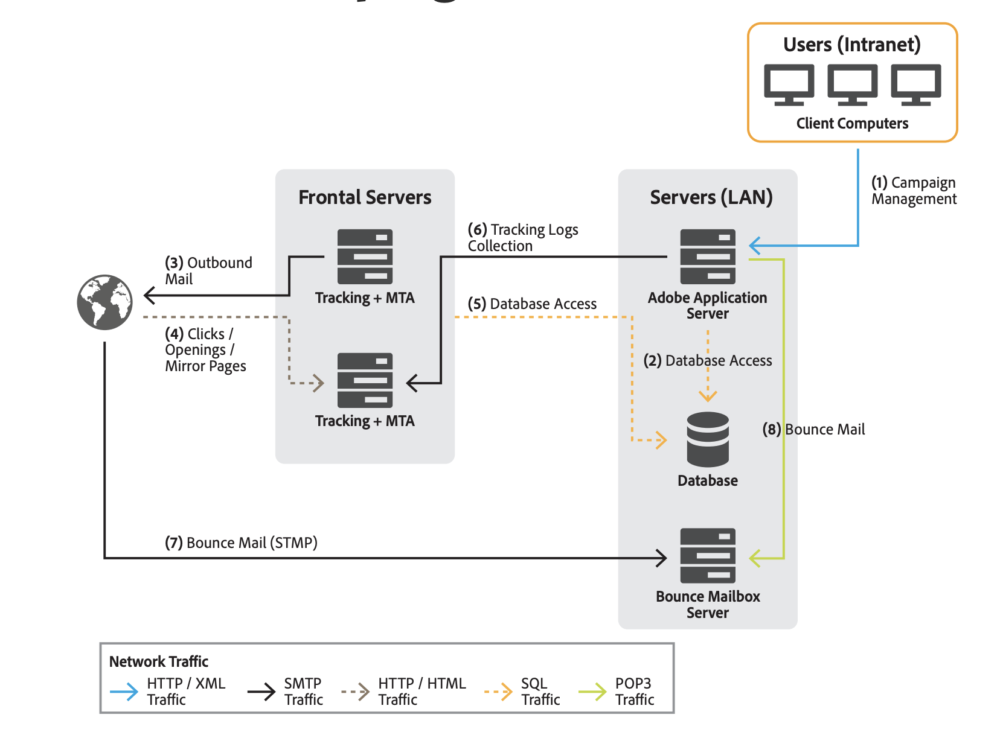

# 一般架構{#general-architecture}

典型的Adobe Campaign解決方案部署包含下列元件：

* **個人化使用者端環境**

  直覺式圖形介面，使用者可在此介面通訊及追蹤行銷優惠方案、建立行銷活動、檢閱及管理所有行銷活動、方案和計畫（包括電子郵件、工作流程和登入頁面）、建立和管理客戶設定檔，以及建立對象。

* **開發環境**

  伺服器端軟體，可依據使用者介面中定義的規則和工作流程，透過選定的通訊通道（包括電子郵件、簡訊、推播通知、直接郵件、網頁或社交）執行行銷活動。

* **資料庫容器**

  Adobe Campaign Cloud資料庫以關聯式資料庫技術為基礎，將所有資訊、行銷活動元件、優惠方案、工作流程和行銷活動結果儲存在資料庫容器中。

## 個人化使用者端環境 {#client-env}

應用程式可透過不同方式存取：豐富使用者端、精簡使用者端或API整合。

 [進一步瞭解Campaign展示層](../start/ac-components.md).

## 開發環境 {#dev-env}

Adobe Campaign是單一平台，具備多種應用程式，可建立開放且可擴充的架構。 Adobe Campaign平台以靈活的應用程式層撰寫，可輕鬆設定以符合您的業務需求。 分散式架構可確保線性系統擴充能力，從數千則訊息擴充至數百萬則訊息。

有些Campaign模組會持續運作，而其他模組則偶爾會啟動，以執行管理工作（例如設定資料庫連線）或執行週期性工作（例如合併追蹤資訊）。

Adobe Campaign模組分為三種型別：

* **多執行個體模組**：針對所有執行個體執行單一程式。 這適用於下列模組：web、syslogd、trackinglogd和watchdog。
* **單執行個體模組**：每個執行個體會執行一個處理程式。 這適用於下列模組：mta、wfserver、inMail、sms和stat。
* **公用程式模組**：這些模組會不定期執行，以執行偶爾或經常性操作（清理、設定、下載追蹤記錄等）。

主要程式為：

* **應用程式伺服器** （nlserver網頁） — 此程式會透過網頁服務API (SOAP / HTTP + XML)公開所有的Adobe Campaign功能。 此外，它可以動態產生網頁以用於HTML型存取（報表、網路表單等）。 為實現此目的，此流程包含一個Apache Tomcat JSP伺服器。 這是Console連線的程式。

* **工作流程引擎** (nlserver wfserver) — 此程式會執行應用程式中定義的工作流程程式。 它也會處理定期執行的技術工作流程，包括：

   * **追蹤**：復原並合併追蹤記錄，以便您可以從重新導向伺服器擷取記錄，並建立報告模組使用的彙總指標。
   * **Cleanup**：清除資料庫並清除舊記錄，避免資料庫呈指數增長。
   * **帳單**：傳送平台的活動報告（資料庫大小、行銷動作數量等）。

* **傳遞伺服器** (nlserver mta) - Adobe Campaign具有原生電子郵件廣播功能。 此程式的功能為SMTP郵件傳輸代理程式(MTA)。 它會執行訊息的「一對一」個人化，並處理其實體傳送。 它會使用傳送工作來執行，並處理自動重試。 此外，啟用追蹤時，會自動取代URL，使其指向重新導向伺服器。 此程式可處理自訂及自動傳送至第三方路由器的SMS、傳真和直接郵件。

* **重新導向伺服器** (nlserver webmdl) — 對於電子郵件，Adobe Campaign會自動處理開啟和點選追蹤（進一步可能是網站層級的交易追蹤）。 為此，重新寫入納入電子郵件訊息中的URL以指向此模組，該模組會先註冊網際網路使用者的傳遞，然後再將他們重新導向至所需的URL。

  為了確保最高可用性，此處理程式完全獨立於資料庫：其他伺服器處理程式僅使用SOAP呼叫(HTTP、HTTP(S)和XML)與其通訊。 技術上，此功能是在HTTP伺服器的擴充功能模組（IIS中的ISAPI擴充功能，或DSO Apache模組等）中實作 和僅適用於Windows。

您也可以參閱其他更技術性的程式：

* **管理退信電子郵件** (nlserver inMail) — 此程式可讓您從設定為接收在傳送失敗時傳回之退回郵件的信箱自動擷取電子郵件。 接著，這些訊息會進行規則型處理，以判斷未傳遞的原因（未知的收件者、超過配額等） 以及更新資料庫中的傳遞狀態。 所有這些操作都是完全自動且預先設定的。

* **簡訊傳送狀態** (nlserver sms) — 此程式會輪詢SMS路由器以收集進度狀態並更新資料庫。

* **正在寫入記錄訊息** (nlserver syslogd) — 此技術流程會擷取其他流程產生的記錄訊息和追蹤，並將這些訊息寫入硬碟。 如此一來，便可在發生問題時提供充足的診斷資訊。

* **正在寫入追蹤記錄** (nlserver trackinglogd) — 此程式會將重新導向程式產生的追蹤記錄儲存到磁碟。

* **寫入傳入事件** (nlserver interactiond) — 此程式可確保在Interaction的架構中，將傳入事件的記錄到磁碟。

* **監督模組** (nlserver watchdog) — 此技術程式充當衍生其他程式的主要程式。 它也會監控這些事件，並在發生事件時自動重新啟動，以維持最長系統運作時間。

* **統計伺服器** (nlserver stat) — 此程式會維護連線數、每個郵件伺服器傳送的郵件數、郵件傳送目的地及其限制（同時連線數上限、每小時郵件數/和/或連線）的統計資料。 此外，如果多個執行個體或電腦共用相同的公用IP位址，您也可以聯合這些執行個體或電腦。

## 資料庫容器 {#db-containers}

Adobe Campaign雲端資料庫仰賴 [!DNL Snowflake] 其中包含功能資料（設定檔、訂閱、內容等）、技術資料（傳遞工作和記錄、追蹤記錄等） 和解決方案的工作資料（購買、銷售機會）以及所有Adobe Campaign元件會與資料庫通訊，以執行其特定工作。

您可以使用預先定義的資料庫和結構描述來部署Adobe Campaign，並視需要擴充此預先定義的環境。 Adobe Campaign會透過SQL呼叫存取資料市場內的所有資料。 Adobe Campaign也提供完整的擷取轉換和載入(ETL)工具，以執行資料匯入和匯出系統內的資料。

>[!CAUTION]
>
>若使用 **Campaign Managed Cloud Services**，您的環境和初始設定已根據您的許可協定條款由 Adobe 設定。 您不得修改已安裝的內建套件、內建方案或報告。
>
>如果您需要使用 Campaign 附加元件或尚未佈建的特定功能，您必須聯絡 **Adobe 客戶服務**。

## 資料庫儲存 {#db-storage}

總儲存容量可在主要資料庫與Snowflake倉儲之間分割。 應根據客戶特定的使用案例，在實施或升級時間決定儲存資料的位置。

瞭解如何在中監視您的資料庫使用情況 [Campaign控制面板檔案](https://experienceleague.adobe.com/docs/control-panel/using/performance-monitoring/database-monitoring/database-monitoring.html){target="_blank"}.