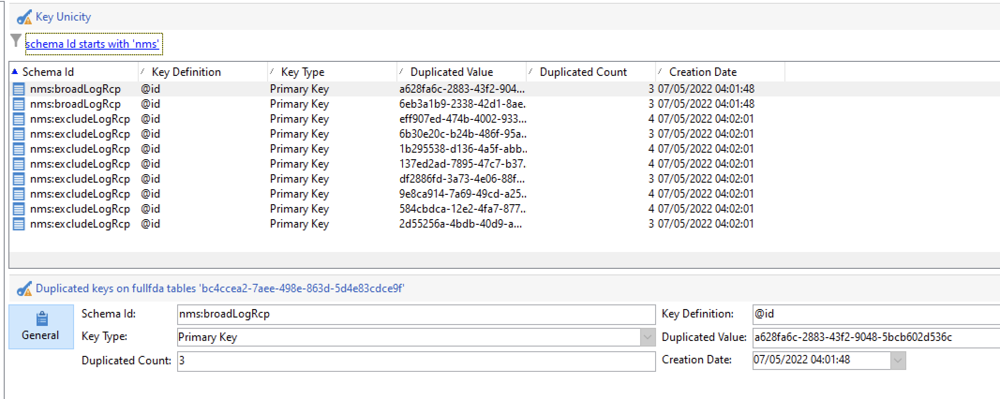

# 金鑰管理和唯一性 {#key-management}

在[Enterprise (FFDA)部署](enterprise-deployment.md)的內容中，主索引鍵是通用唯一識別碼(UUID)，這是字元字串。 若要建立此UUID，結構描述的主要元素必須包含設定為&#x200B;**true**&#x200B;的&#x200B;**autouuid**&#x200B;和&#x200B;**autopk**&#x200B;屬性。

Adobe Campaign v8使用[!DNL Snowflake]作為核心資料庫。 [!DNL Snowflake]資料庫的分散式架構未提供機制來確保資料表中索引鍵的唯一性：一般使用者負責Adobe Campaign資料庫中的索引鍵一致性。

若要保留關聯式資料庫的一致性，必須避免索引鍵上的重複專案，尤其是主索引鍵上的重複專案。 主索引鍵上的重複專案會導致資料管理工作流程活動發生問題，例如&#x200B;**查詢**、**調解**、**更新資料**&#x200B;等等。 更新[!DNL Snowflake]資料表時，這個重要選項可定義適當的調解條件。

>[!CAUTION]
>
>重複的金鑰不限於UUID。 這可能發生在具有ID中，包括在自訂表格中建立的自訂金鑰。

## Unicity Service{#unicity-service}

Unicity Service是Cloud Database Manager元件，可協助使用者保留及監視Cloud Database表格中唯一關鍵值限制的完整性。 這可讓您降低插入重複金鑰的風險。

由於Cloud Database不強制執行unicity限制，因此Unicity Service降低了使用Adobe Campaign管理資料時插入重複專案的風險。

### 唯一性工作流程{#unicity-wf}

Unicity Service隨附專屬的&#x200B;**[!UICONTROL Unicity alerting]**&#x200B;內建工作流程，可監視單向性限制，並在偵測到重複專案時發出警報。

此技術工作流程可從Campaign Explorer的&#x200B;**[!UICONTROL Administration > Production > Technical workflows > Full FFDA Unicity]**&#x200B;節點取得。 **不可修改**。

此工作流程會檢查所有自訂和內建方案，以偵測重複的列。

如果&#x200B;**[!UICONTROL Unicity alerting]** (ffdaUnicity)工作流程偵測到某些重複的索引鍵，則會將其新增至特定的&#x200B;**稽核Unicity**&#x200B;表格，其中包括結構描述名稱、索引鍵型別、受影響的列數和日期。 您可以從&#x200B;**[!UICONTROL Administration > Audit > Key Unicity]**&#x200B;節點存取重複的金鑰。

身為資料庫管理員，您可以使用SQL活動來移除重複專案，或聯絡Adobe客戶服務以取得更多指引。

### 警報{#unicity-wf-alerting}

偵測到重複的金鑰時，會傳送特定通知給&#x200B;**[!UICONTROL Workflow Supervisors]**&#x200B;運運算元群組。 可在&#x200B;**[!UICONTROL Unicity alerting]**&#x200B;工作流程的&#x200B;**警報**&#x200B;活動中變更此警報的內容和對象。

## 其他護欄 {#duplicates-guardrails}

Campaign提供一組新護欄，以防止在[!DNL Snowflake]資料庫中插入重複的金鑰。

>[!NOTE]
>
>從Campaign v8.3開始提供這些護欄。若要檢查您的版本，請參閱[本節](../start/compatibility-matrix.md#how-to-check-your-campaign-version-and-buildversion)

### 傳遞準備 {#remove-duplicates-delivery-preparation}

Adobe Campaign會在傳送準備期間自動移除對象中任何重複的UUID。 此機制可防止在準備傳送時發生任何錯誤。 身為一般使用者，您可以在傳送記錄中檢查此資訊：由於金鑰重複，某些收件者可從主要目標中排除。 在這種情況下，會顯示下列警告： `Exclusion of duplicates (based on the primary key or targeted records)`。

### 更新工作流程中的資料 {#duplicates-update-data}

在[Enterprise (FFDA)部署](enterprise-deployment.md)的內容中，您無法選取內部金鑰(UUID)作為欄位來更新工作流程中的資料。

### 查詢包含重複專案的結構描述 {#query-with-duplicates}

當工作流程開始在結構描述上執行查詢時，Adobe Campaign會檢查是否在[稽核唯一性表格](#unicity-wf)中報告任何重複記錄。 若是如此，工作流程會記錄警告，因為對重複資料的後續操作可能會影響工作流程結果。

此檢查會在下列工作流程活動中執行：

* 查詢
* 增量查詢
* 讀取清單

>[!NOTE]
>
>如果您的從其他Campaign版本進行轉換，請務必移除重複專案、疑難排解並清理資料，以避免影響轉換。
