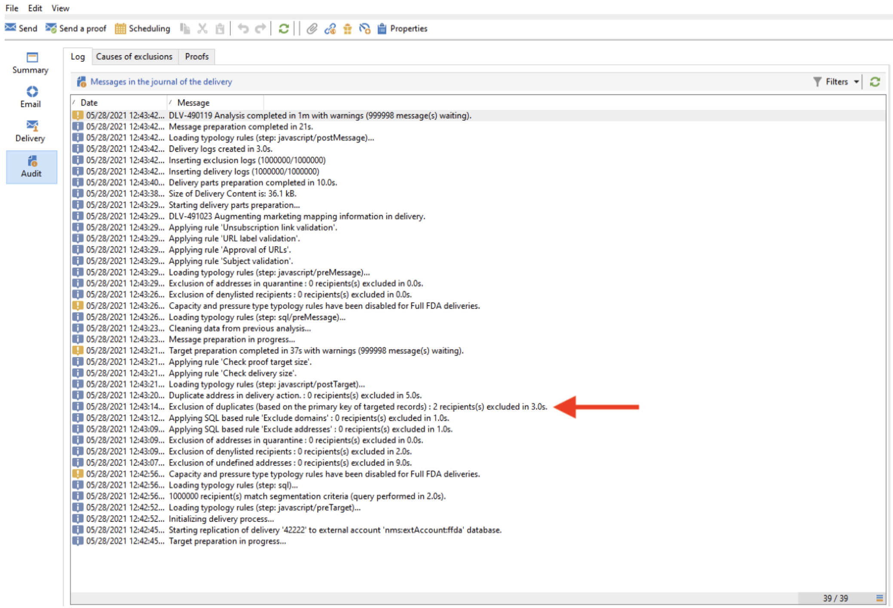

# 金鑰管理和唯一性 {#key-management}

在 [企業(FDA)部署](enterprise-deployment.md)，主鍵是通用唯一IDentifier(UUID)，它是字串。 要建立此UUID，架構的主元素必須包含 **autouuid** 和 **奧托普** 屬性設定為 **真**。

Adobe Campaignv8用途 [!DNL Snowflake] 作為核心資料庫。 Windows的分佈式體系結構 [!DNL Snowflake] 資料庫不提供確保表中鍵唯一性的機制：最終用戶負責Adobe Campaign資料庫內的關鍵一致性。

要保持關係資料庫一致性，必須避免在鍵上重複，尤其是在主鍵上重複。 主鍵上的重複導致資料管理工作流活動出現問題，如 **查詢**。 **協調**。 **更新資料**。 在更新時定義適當的協調標準這一點至關重要 [!DNL Snowflake] 的下界。

>[!CAUTION]
>
>重複的鍵不限於UUID。 可以在中使用ID（包括在自定義表中建立的自定義鍵）。

## Unicity Service{#unicity-service}

Unicity Service是Cloud Database Manager元件，可幫助用戶保留和監視Cloud Database表中唯一鍵約束的完整性。 這可讓您降低插入重複金鑰的風險。

由於雲資料庫不強制實施唯一性約束，因此Unicity Service在與Adobe Campaign管理資料時減少了插入重複項的風險。

### 唯一性工作流{#unicity-wf}

Unicity服務附帶專用 **[!UICONTROL Unicity alerting]** 內置工作流，用於監視唯一性約束並在檢測到重複項時發出警報。

此技術工作流可從 **[!UICONTROL Administration > Production > Technical workflows > Full FFDA Unicity]** 市場活動瀏覽器的節點。 **不得修改**。

此工作流檢查所有自定義和內置架構以檢測重複行。

如果 **[!UICONTROL Unicity alerting]** (fdaUnicity)工作流檢測某些重複的鍵，這些鍵被添加到特定的 **審核唯一性** 表，包括方案名稱、鍵類型、受影響的行數和日期。 您可以從 **[!UICONTROL Administration > Audit > Key Unicity]** 的下界。

作為資料庫管理員，您可以使用SQL活動刪除重複項，或與Adobe客戶關心部門聯繫以獲取更多指導。

### 警報{#unicity-wf-alerting}

特定通知將發送到 **[!UICONTROL Workflow Supervisors]** 檢測到重複的鍵時的運算子組。 可以在 **警報** 的 **[!UICONTROL Unicity alerting]** 工作流。

## 附加護欄{#duplicates-guardrails}

市場活動附帶了一組新的護欄，以防止在 [!DNL Snowflake] 資料庫。

>[!NOTE]
>
>這些護欄從8.3版促銷活動開始可用。要檢查您的版本，請參閱 [此部分](../start/compatibility-matrix.md#how-to-check-your-campaign-version-and-buildversion)

### 遞送準備{#remove-duplicates-delivery-preparation}

Adobe Campaign在交付準備期間自動從受眾中刪除任何重複的UUID。 此機制可防止在準備傳遞時發生任何錯誤。 作為最終用戶，您可以在傳遞日誌中檢查以下資訊：由於密鑰重複，某些收件者可從主目標中排除。 在這種情況下，將顯示以下警告： `Exclusion of duplicates (based on the primary key or targeted records)`。

### 更新工作流中的資料{#duplicates-update-data}

在 [企業(FDA)部署](enterprise-deployment.md)，不能選擇內部鍵(UUID)作為欄位來更新工作流中的資料。

使用顯式協調鍵時， **更新資料** 活動通過以下方式自動確保基於此鍵的目標架構的唯一性：

1. 消除複製傳入資料（從轉換）
1. 使用目標表消除重複資料（合併）

>[!CAUTION]
>
>此護欄僅適用於選項 **[!UICONTROL Using reconciliation keys]**。

### 查詢具有重複項的架構{#query-with-duplicates}

當工作流開始在架構上運行查詢時，Adobe Campaign會檢查是否在 [「審核唯一性」表](#unicity-wf)。 如果是，工作流將記錄警告，因為對重複資料的後續操作可能會影響工作流結果。

此檢查在以下工作流活動中執行：

* 查詢
* 增量查詢
* 讀取清單