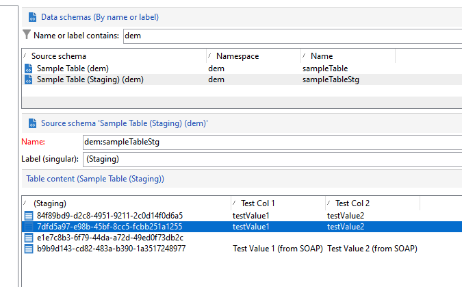
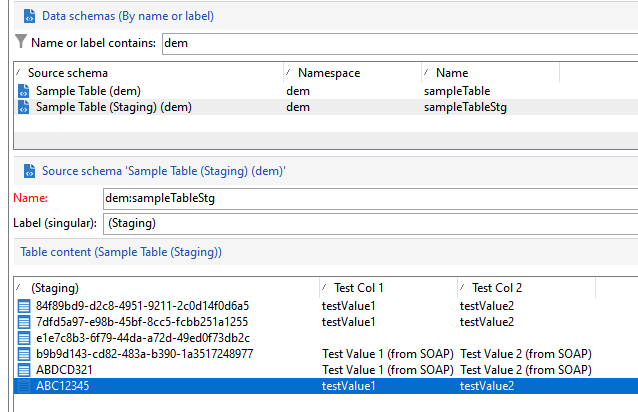
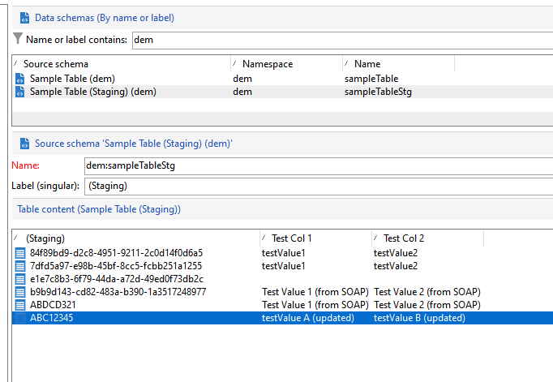

# 特定FFDA Campaign API{#gs-new-api}

在[企業(FFDA)部署](enterprise-deployment.md)的內容中，Campaign v8提供兩個特定API，用於管理Campaign本機資料庫和雲端資料庫之間的資料。 使用這些功能的先決條件是在架構上啟用準備機制。 [了解更多](staging.md)

* 擷取API： **xtk.session.ingest**

  此API僅供資料插入專用。 [了解更多](#data-insert-api)

* 資料更新/刪除API： **xtk.session.ingestExt**

  此API用於更新或刪除資料。 [了解更多](#data-update-api)

專用的內建工作流程將同步雲端資料庫中的資料。

## 插入資料{#data-insert-api}

**xtk.session.ingest** API僅專用於「資料插入」。 無更新/刪除。

### 插入但不進行調解{#insert-no-reconciliation}

**在工作流程中**

在&#x200B;**Javascript程式碼**&#x200B;活動中使用下列程式碼，將資料插入雲端資料庫而不進行調解：

```
var xmlStagingSampleTable = <sampleTableStg
                                testcol1="testValue1"
                                testcol2="testValue2"
                                xtkschema="dem:sampleTableStg">
                            </sampleTableStg>;
strUuid = xtk.session.Ingest(xmlStagingSampleTable);
logInfo(strUuid);
```

執行工作流程後，會依預期提供暫存表格。

**來自SOAP呼叫**

1. 取得驗證權杖。
1. 觸發API。 承載為：

   ```
   <soapenv:Envelope xmlns:soapenv="http://schemas.xmlsoap.org/soap/envelope/" xmlns:urn="urn:xtk:session">
   <soapenv:Header/>
   <soapenv:Body>
       <urn:Ingest>
           <urn:sessiontoken>___xxxxxxx-xxxx-xxx-xxx-xxxxxxxxxxx</urn:sessiontoken>
           <urn:domDoc>
               <sampleTableStg
                   testcol1="Test Value 1 (from SOAP)"
                   testcol2="Test Value 2 (from SOAP)"
                   xtkschema="dem:sampleTableStg">
               </sampleTableStg>
           </urn:domDoc>
       </urn:Ingest>
   </soapenv:Body>
   </soapenv:Envelope>
   ```

1. UUID會傳回SOAP回應：

   ```
   <SOAP-ENV:Envelope xmlns:xsd="http://www.w3.org/2001/XMLSchema" xmlns:xsi="http://www.w3.org/2001/XMLSchema-instance" xmlns:ns="urn:wpp:default" xmlns:SOAP-ENV="http://schemas.xmlsoap.org/soap/envelope/">
   <SOAP-ENV:Body>
       <IngestResponse SOAP-ENV:encodingStyle="http://schemas.xmlsoap.org/soap/encoding/" xmlns="urn:wpp:default">
           <pstrSUuids xsi:type="xsd:string">e1e7c8b3-6f79-44da-a72d-49ed0f73db2c</pstrSUuids>
       </IngestResponse>
   </SOAP-ENV:Body>
   </SOAP-ENV:Envelope>
   ```

因此，會如預期提供臨時資料表。



### 插入並調解

**在工作流程中**

在&#x200B;**Javascript程式碼**&#x200B;活動中使用下列程式碼，以使用調解方式將資料插入雲端資料庫：

```
var xmlStagingSampleTable = <sampleTableStg  _key="@id" id="ABC12345"
                              testcol1="testValue1"
                              testcol2="testValue2"
                              xtkschema="dem:sampleTableStg">
                            </sampleTableStg>;         
strUuid = xtk.session.Ingest(xmlStagingSampleTable);
logInfo(strUuid);
```

執行工作流程後，會依預期提供暫存表格。




**來自SOAP呼叫**

1. 取得驗證權杖。
1. 觸發API。 承載為：

   ```
   <soapenv:Envelope xmlns:soapenv="http://schemas.xmlsoap.org/soap/envelope/" xmlns:urn="urn:xtk:session">
   <soapenv:Header/>
   <soapenv:Body>
     <urn:Ingest>
        <urn:sessiontoken>___5e71f4bf-d38a-4ba8-ac15-35a958f7f138</urn:sessiontoken>
        <urn:domDoc>
           <sampleTableStg  _key="@id" id="ABDCD321"
                testcol1="Test Value 1 (from SOAP)"
                testcol2="Test Value 2 (from SOAP)"
                xtkschema="dem:sampleTableStg">
            </sampleTableStg>
        </urn:domDoc>
     </urn:Ingest>
    </soapenv:Body>
   </soapenv:Envelope>
   ```

1. 在此情況下，UUID不會提供回回應，因為它已在裝載中提供。 回應為：

   ```
   <SOAP-ENV:Envelope xmlns:xsd="http://www.w3.org/2001/XMLSchema" xmlns:xsi="http://www.w3.org/2001/XMLSchema-instance" xmlns:ns="urn:wpp:default" xmlns:SOAP-ENV="http://schemas.xmlsoap.org/soap/envelope/">
   <SOAP-ENV:Body>
       <IngestResponse SOAP-ENV:encodingStyle="http://schemas.xmlsoap.org/soap/encoding/" xmlns="urn:wpp:default">
           <pstrSUuids xsi:type="xsd:string"/>
       </IngestResponse>
   </SOAP-ENV:Body>
   </SOAP-ENV:Envelope>
   ```

因此，會如預期提供臨時資料表。

## 更新或刪除資料{#data-update-api}

已針對資料更新/刪除最佳化&#x200B;**xtk.session.IngestExt** API。 僅供插入，偏好使用&#x200B;**xtk.session.ingest**。 無論記錄索引鍵是否不在臨時資料表中，插入都正常運作。

### 插入/更新

**在工作流程中**

在&#x200B;**Javascript程式碼**&#x200B;活動中使用下列程式碼來更新雲端資料庫中的資料：

```
var xmlStagingRecipient = <sampleTableStg  _key="@id" id="ABC12345"
                              testcol1="testValue A (updated)"
                              testcol2="testValue B (updated)"
                              xtkschema="dem:sampleTableStg">
                            </sampleTableStg>;
xtk.session.IngestExt(xmlStagingRecipient);
```

執行工作流程後，測試表格會如預期更新。



**來自SOAP呼叫**

1. 取得驗證權杖。
1. 觸發API。 承載為：

   ```
   <soapenv:Envelope xmlns:soapenv="http://schemas.xmlsoap.org/soap/envelope/" xmlns:urn="urn:xtk:session">
   <soapenv:Header/>
   <soapenv:Body>
       <urn:IngestExt>
           <urn:sessiontoken>___444cd168-a1e2-4fb6-a2a8-73be9f133489</urn:sessiontoken>
           <urn:domDoc>
           <sampleTableStg  _key="@id" id="ABDCD321"
                   testcol1="Test Value E (from SOAP)"
                   testcol2="Test Value F (from SOAP)"
                   xtkschema="dem:sampleTableStg">
               </sampleTableStg>
           </urn:domDoc>
       </urn:IngestExt>
   </soapenv:Body>
   </soapenv:Envelope>
   ```

1. SOAP回應為：

   ```
   <SOAP-ENV:Envelope xmlns:xsd="http://www.w3.org/2001/XMLSchema" xmlns:xsi="http://www.w3.org/2001/XMLSchema-instance" xmlns:ns="urn:wpp:default" xmlns:SOAP-ENV="http://schemas.xmlsoap.org/soap/envelope/">
   <SOAP-ENV:Body>
       <IngestExtResponse SOAP-ENV:encodingStyle="http://schemas.xmlsoap.org/soap/encoding/" xmlns="urn:wpp:default"/>
   </SOAP-ENV:Body>
   </SOAP-ENV:Envelope>
   ```

因此，臨時資料表會如預期更新。

## 訂閱管理 {#sub-apis}

Campaign的訂閱管理在[此頁面](../start/subscriptions.md)中說明。

訂閱和取消訂閱資料的插入依賴Campaign本機資料庫中的[暫存機制](staging.md)。 訂閱者資訊會暫時儲存在本機資料庫的臨時資料表中，而同步工作流程會將此資料從本機資料庫傳送至雲端資料庫。 因此，訂閱和取消訂閱程式為&#x200B;**非同步**。 每小時都會透過特定的技術工作流程處理選擇加入和選擇退出請求。 [了解更多](replication.md#tech-wf)


**相關主題**

* [Campaign JSAPI](https://experienceleague.adobe.com/developer/campaign-api/api/p-1.html){target="_blank"}
