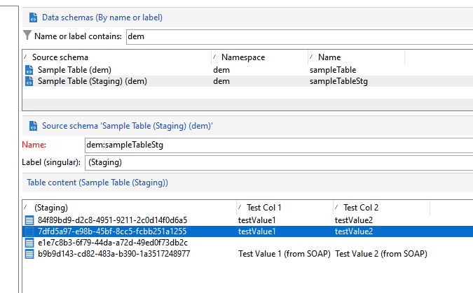
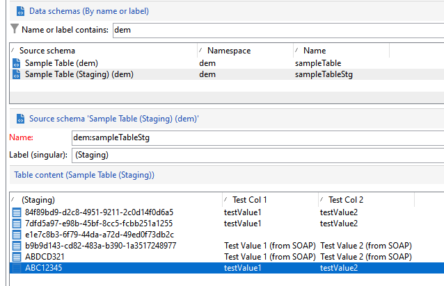

# 特定FDA促銷活動API{#gs-new-api}

在 [企業(FFDA)部署](enterprise-deployment.md), Campaign v8隨附兩個特定API，用於管理Campaign本機資料庫和雲端資料庫之間的資料。 使用這些設定的先決條件是啟用架構上的測試機制。 [了解更多](staging.md)

* 擷取API: **xtk.session.ingest**

   此API僅專用於「資料插入」。 [了解更多](#data-insert-api)

* 資料更新/刪除API: **xtk.session.ingestExt**

   此API用於更新或刪除資料。 [了解更多](#data-update-api)

專用的內建工作流程將同步雲端資料庫中的資料。

## 插入資料{#data-insert-api}

此 **xtk.session.ingest** API僅專用於「資料插入」。 無更新/刪除。

### 插入，無調解{#insert-no-reconciliation}

**在工作流程中**

在 **Javascript程式碼** 在雲端資料庫中插入資料而不進行調解的活動：

```
var xmlStagingSampleTable = <sampleTableStg
                                testcol1="testValue1"
                                testcol2="testValue2"
                                xtkschema="dem:sampleTableStg">
                            </sampleTableStg>;
strUuid = xtk.session.Ingest(xmlStagingSampleTable);
logInfo(strUuid);
```

執行工作流程後，中繼表格會如預期般饋送。

**從SOAP調用**

1. 取得驗證Token。
1. 觸發API。 裝載為：

   ```
   <soapenv:Envelope xmlns:soapenv="http://schemas.xmlsoap.org/soap/envelope/" xmlns:urn="urn:xtk:session">
   <soapenv:Header/>
   <soapenv:Body>
       <urn:Ingest>
           <urn:sessiontoken>___xxxxxxx-xxxx-xxx-xxx-xxxxxxxxxxx</urn:sessiontoken>
           <urn:domDoc>
               <sampleTableStg
                   testcol1="Test Value 1 (from SOAP)"
                   testcol2="Test Value 2 (from SOAP)"
                   xtkschema="dem:sampleTableStg">
               </sampleTableStg>
           </urn:domDoc>
       </urn:Ingest>
   </soapenv:Body>
   </soapenv:Envelope>
   ```

1. UUID會傳回至SOAP回應：

   ```
   <SOAP-ENV:Envelope xmlns:xsd="http://www.w3.org/2001/XMLSchema" xmlns:xsi="http://www.w3.org/2001/XMLSchema-instance" xmlns:ns="urn:wpp:default" xmlns:SOAP-ENV="http://schemas.xmlsoap.org/soap/envelope/">
   <SOAP-ENV:Body>
       <IngestResponse SOAP-ENV:encodingStyle="http://schemas.xmlsoap.org/soap/encoding/" xmlns="urn:wpp:default">
           <pstrSUuids xsi:type="xsd:string">e1e7c8b3-6f79-44da-a72d-49ed0f73db2c</pstrSUuids>
       </IngestResponse>
   </SOAP-ENV:Body>
   </SOAP-ENV:Envelope>
   ```

因此，中繼表格會如預期般饋送。



### 插入並進行調解

**在工作流程中**

在 **Javascript程式碼** 在具有調解的雲端資料庫中插入資料的活動：

```
var xmlStagingSampleTable = <sampleTableStg  _key="@id" id="ABC12345"
                              testcol1="testValue1"
                              testcol2="testValue2"
                              xtkschema="dem:sampleTableStg">
                            </sampleTableStg>;         
strUuid = xtk.session.Ingest(xmlStagingSampleTable);
logInfo(strUuid);
```

執行工作流程後，中繼表格會如預期般饋送。




**從SOAP調用**

1. 取得驗證Token。
1. 觸發API。 裝載為：

   ```
   <soapenv:Envelope xmlns:soapenv="http://schemas.xmlsoap.org/soap/envelope/" xmlns:urn="urn:xtk:session">
   <soapenv:Header/>
   <soapenv:Body>
     <urn:Ingest>
        <urn:sessiontoken>___5e71f4bf-d38a-4ba8-ac15-35a958f7f138</urn:sessiontoken>
        <urn:domDoc>
           <sampleTableStg  _key="@id" id="ABDCD321"
                testcol1="Test Value 1 (from SOAP)"
                testcol2="Test Value 2 (from SOAP)"
                xtkschema="dem:sampleTableStg">
            </sampleTableStg>
        </urn:domDoc>
     </urn:Ingest>
    </soapenv:Body>
   </soapenv:Envelope>
   ```

1. 在此情況下，不會將UUID提供回回應，因為已在裝載中提供。 回應為：

   ```
   <SOAP-ENV:Envelope xmlns:xsd="http://www.w3.org/2001/XMLSchema" xmlns:xsi="http://www.w3.org/2001/XMLSchema-instance" xmlns:ns="urn:wpp:default" xmlns:SOAP-ENV="http://schemas.xmlsoap.org/soap/envelope/">
   <SOAP-ENV:Body>
       <IngestResponse SOAP-ENV:encodingStyle="http://schemas.xmlsoap.org/soap/encoding/" xmlns="urn:wpp:default">
           <pstrSUuids xsi:type="xsd:string"/>
       </IngestResponse>
   </SOAP-ENV:Body>
   </SOAP-ENV:Envelope>
   ```

因此，中繼表格會如預期般饋送。

## 更新或刪除資料{#data-update-api}

此 **xtk.session.IngestExt** API會最佳化以進行資料更新/刪除。 僅插入，首選 **xtk.session.ingest**. 記錄鍵是否不在測試表中，插入正在工作。

### 插入/更新

**在工作流程中**

在 **Javascript程式碼** 更新雲端資料庫中資料的活動：

```
var xmlStagingRecipient = <sampleTableStg  _key="@id" id="ABC12345"
                              testcol1="testValue A (updated)"
                              testcol2="testValue B (updated)"
                              xtkschema="dem:sampleTableStg">
                            </sampleTableStg>;
xtk.session.IngestExt(xmlStagingRecipient);
```

執行工作流程後，中繼表格會如預期般更新。


**從SOAP調用**

1. 取得驗證Token。
1. 觸發API。 裝載為：

   ```
   <soapenv:Envelope xmlns:soapenv="http://schemas.xmlsoap.org/soap/envelope/" xmlns:urn="urn:xtk:session">
   <soapenv:Header/>
   <soapenv:Body>
       <urn:IngestExt>
           <urn:sessiontoken>___444cd168-a1e2-4fb6-a2a8-73be9f133489</urn:sessiontoken>
           <urn:domDoc>
           <sampleTableStg  _key="@id" id="ABDCD321"
                   testcol1="Test Value E (from SOAP)"
                   testcol2="Test Value F (from SOAP)"
                   xtkschema="dem:sampleTableStg">
               </sampleTableStg>
           </urn:domDoc>
       </urn:IngestExt>
   </soapenv:Body>
   </soapenv:Envelope>
   ```

1. SOAP響應為：

   ```
   <SOAP-ENV:Envelope xmlns:xsd="http://www.w3.org/2001/XMLSchema" xmlns:xsi="http://www.w3.org/2001/XMLSchema-instance" xmlns:ns="urn:wpp:default" xmlns:SOAP-ENV="http://schemas.xmlsoap.org/soap/envelope/">
   <SOAP-ENV:Body>
       <IngestExtResponse SOAP-ENV:encodingStyle="http://schemas.xmlsoap.org/soap/encoding/" xmlns="urn:wpp:default"/>
   </SOAP-ENV:Body>
   </SOAP-ENV:Envelope>
   ```

因此，中繼表格會如預期般更新。

## 訂閱管理 {#sub-apis}

如需Campaign中的訂閱管理相關說明，請參閱 [本頁](../start/subscriptions.md).

插入訂閱和取消訂閱資料需仰賴 [中繼機制](staging.md) 在Campaign本機資料庫中。 訂閱者資訊是臨時儲存在本地資料庫的臨時表中，同步工作流將此資料從本地資料庫發送到雲資料庫。 因此，訂閱和取消訂閱程式 **非同步**. 選擇加入和選擇退出請求會透過特定的技術工作流程每小時處理一次。 [了解更多](replication.md#tech-wf)


**相關主題**

* [Campaign JSAPI](https://experienceleague.adobe.com/developer/campaign-api/api/p-1.html){target="_blank"}
