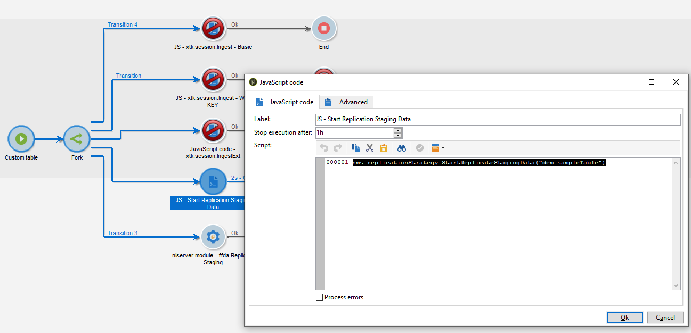

# 技術工作流程和資料復寫

## 技術工作流程{#tech-wf}

在 [企業(FFDA)部署](enterprise-deployment.md),Adobe Campaign隨附一組內建的技術工作流程。 技術工作流程會執行定期在伺服器上排程的程式或作業。

這些工作流程會在資料庫上執行維護作業、運用傳送記錄檔中的追蹤資訊、建立週期性促銷活動等。

 技術工作流程的完整清單在 [本頁](https://experienceleague.adobe.com/docs/campaign/automation/workflows/introduction/wf-type/technical-workflows.html).

除了這些技術工作流程外，Campaign v8還依賴特定的技術工作流程來管理 [資料復寫](#data-replication).

* **[!UICONTROL Replicate Reference tables]**
此工作流程會自動復寫需要存在於Campaign本機資料庫(Postgres)和雲端資料庫([!DNL Snowflake])。 排程每小時執行一次。 若 **lastModified** 欄位存在，複製會以增量方式進行，否則會複製整個表。 以下陣列中的表的順序是複製工作流使用的順序。
* **[!UICONTROL Replicate Staging data]**
此工作流程會複製統一呼叫的中繼資料。 排程每小時執行一次。
* **[!UICONTROL Deploy FFDA immediately]**\
   此工作流程會立即部署至雲端資料庫。
* **[!UICONTROL Replicate FFDA data immediately]**
此工作流將複製給定外部帳戶的XS資料。

這些技術工作流程可從 **[!UICONTROL Administration > Production > Technical workflows > Full FFDA Replication]** 行銷活動總管的節點。 **不得更改它們。**

如有需要，您可以手動啟動資料同步。 若要執行此操作，請以滑鼠右鍵按一下 **排程器** 活動和選取 **立即執行掛起任務**.

## 資料複製{#data-replication}

有些內建表格會從Campaign本機資料庫複製到 [!DNL Snowflake] 雲端資料庫，透過上述專屬的工作流程。

了解Adobe Campaign v8使用的資料庫、複製資料的原因、正在複製的資料以及複製過程的工作方式。

>[!VIDEO](https://video.tv.adobe.com/v/334460?quality=12)


### 資料複製策略{#data-replication-policies}

複製策略基於表的大小。 有些表將即時複製，有些表將按小時複製。 某些表在替換其他表時將進行增量更新。

除了內建 **複製引用表** 技術工作流程中，您可以在工作流程中強制進行資料復寫。

您可以：

* 新增特定 **Javascript程式碼** 活動（包含下列程式碼）:

```
nms.replicationStrategy.StartReplicateStagingData("dem:sampleTable")
```




* 新增特定 **nlmodule** 活動（使用下列命令）:

```
nlserver ffdaReplicateStaging -stagingSchema -instance:acc1
```


**相關主題**

* [了解如何開始使用工作流程](https://experienceleague.adobe.com/docs/campaign/automation/workflows/introduction/about-workflows.html?lang=zh-Hant)

* [資料保留期](../dev/datamodel-best-practices.md#data-retention)
