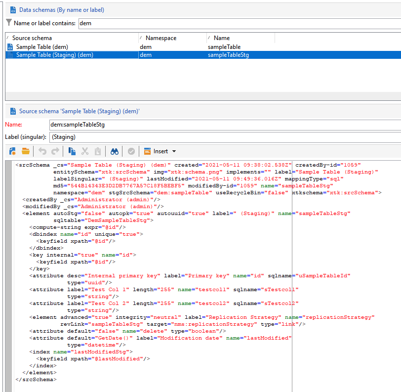

# 促銷活動API測試機制

在 [企業(FFDA)部署](enterprise-deployment.md)，不建議對效能（延遲和並行）進行單一呼叫。 批次處理操作一律為推薦操作。 為了改善效能，擷取API會重新導向至本機資料庫。

某些內建結構預設會啟用促銷活動測試功能。 我們也可以在任何自訂結構上啟用它。 一言以蔽之：

* 資料架構結構已複製到本機中繼表格
* 專用於資料擷取的新API會直接匯入本機中繼表格。 [了解更多](new-apis.md)
* 排程的工作流程每小時會觸發一次，並將資料同步回雲端資料庫。 [了解更多](replication.md)

某些內建結構預設會分段，例如nmsSubscriptionRcp、nmsAppSubscriptionRcp、nmsRecipient。

Campaign Classicv7 API仍可供使用，但無法受益於此新的測試機制：API呼叫會直接流至雲端資料庫。 Adobe建議盡可能使用新的測試機制，以降低Campaign Cloud資料庫的整體壓力和延遲。

>[!CAUTION]
>
>* 透過這種新機制，通道輸出、訂閱、取消訂閱或行動註冊的資料同步功能現已開放使用 **非同步**.
>
>* 中繼僅適用於雲端資料庫上儲存的結構描述。 請勿在複製的架構上啟用中繼。 請勿啟用本機結構上的測試功能。 不啟用分段架構上的分段
>


## 實施步驟{#implement-staging}

若要在特定表格上實作Campaign測試機制，請遵循下列步驟：

1. 在Campaign Cloud資料庫上建立範例自訂結構。 此步驟未啟用測試。

   ```
   <srcSchema _cs="Sample Table (dem)" created="YYYY-DD-MM"
           entitySchema="xtk:srcSchema" img="xtk:schema.png" label="Sample Table"
           lastModified="YYYY-DD-MM HH:MM:SS.TZ" mappingType="sql" md5="XXX"
           modifiedBy-id="0" name="sampleTable" namespace="dem" xtkschema="xtk:srcSchema">
   <element autopk="true" autouuid="true" dataSource="nms:extAccount:ffda" label="Sample Table"
           name="sampleTable">
       <attribute label="Test Col 1" length="255" name="testcol1" type="string"/>
       <attribute label="Test Col 2" length="255" name="testcol2" type="string"/>
   </element>
   </srcSchema>
   ```

    進一步了解自訂結構建立，位於 [本頁](../dev/create-schema.md).

1. 保存和更新資料庫結構。  [了解更多](../dev/update-database-structure.md)

1. 借由新增 **autoStg=&quot;true&quot;** 參數。

   ```
   <srcSchema _cs="Sample Table (dem)" "YYYY-DD-MM"
           entitySchema="xtk:srcSchema" img="xtk:schema.png" label="Sample Table"
           lastModified="YYYY-DD-MM HH:MM:SS.TZ" mappingType="sql" md5="XXX"
           modifiedBy-id="0" name="sampleTable" namespace="dem" xtkschema="xtk:srcSchema">
   <element autoStg="true" autopk="true" autouuid="true" dataSource="nms:extAccount:ffda" label="Sample Table"
           name="sampleTable">
       <attribute label="Test Col 1" length="255" name="testcol1" type="string"/>
       <attribute label="Test Col 2" length="255" name="testcol2" type="string"/>
   </element>
   </srcSchema>
   ```

1. 儲存修改。 有新的中繼架構可用，此為初始架構的本機副本。

   

1. 更新資料庫結構。 中繼表格將建立在Campaign本機資料庫上。
