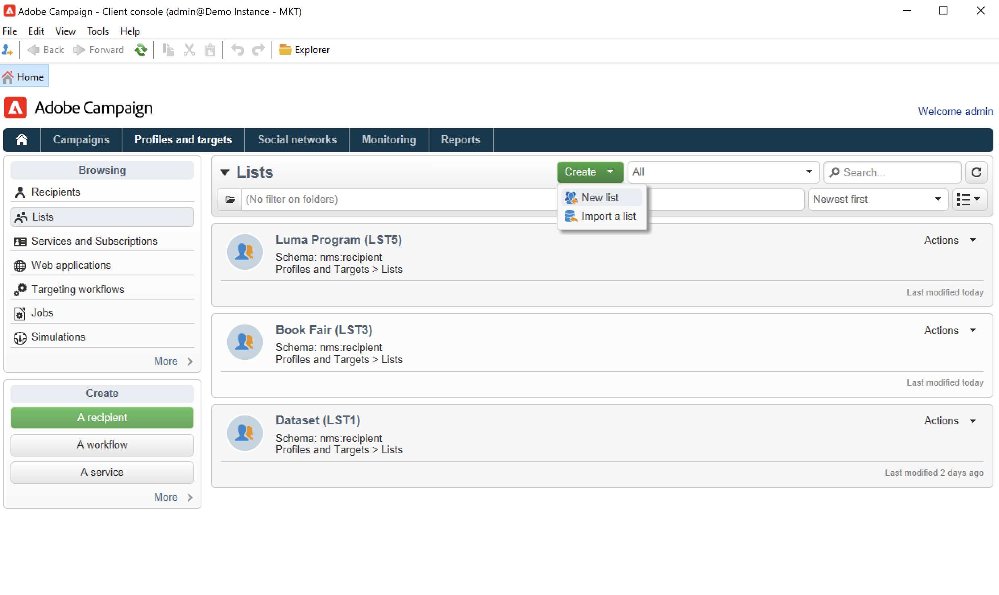
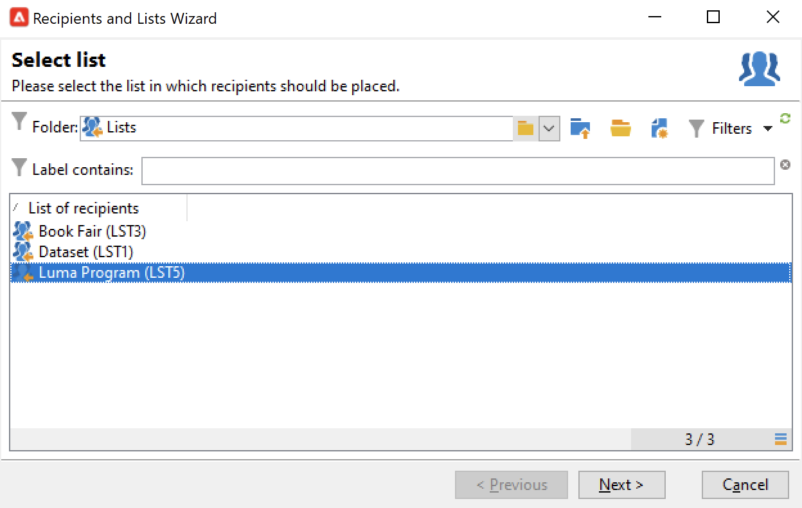

# 在清單中建立受眾{#create-segments}

使用「活動」清單建立和組織您的受眾。

清單是一組靜態聯繫人，可以在交貨操作中針對這些聯繫人，或在導入或其他工作流操作期間更新這些聯繫人。 例如，通過查詢從資料庫提取的總體可以儲存為清單。

清單通過 **[!UICONTROL Lists]** 連結 **[!UICONTROL Profiles and targets]** 頁籤。 這些清單基於預設的Adobe Campaign配置檔案表(nms:recipient)。 [了解更多](../dev/datamodel.md#ootb-profiles.md)

您可以使用 **更新清單** 的子菜單。 此活動將生成的人口儲存到清單中。 使用它可建立新清單或更新現有清單。 要建立包含除內置配置檔案表之外其他類型資料的清單，必須運行工作流。 例如，透過在訪客資料表上查詢並更新清單，您可以建立訪客清單。[了解更多資訊](#create-a-list-wf)。

觀看此視頻以瞭解有關Adobe Campaign清單管理的更多資訊。

>[!VIDEO](https://video.tv.adobe.com/v/334909?quality=12)

## 建立連絡人清單 {#create-a-list-of-contacts}

要建立聯繫人清單，請執行以下步驟：

1. 按一下 **[!UICONTROL Create]** 按鈕 **[!UICONTROL New list]**。

   

1. 在清單建立視窗的 **[!UICONTROL Edit]** 索引標籤中輸入資訊。

   

   * 在 **[!UICONTROL Label]** 欄位中輸入清單名稱，並視需要變更內部名稱。
   * 新增此清單的描述。
   * 您可以指定到期日：達到此日期時，清單會被清除並自動刪除。

1. 在 **[!UICONTROL Content]** 索引標籤中，按一下 **[!UICONTROL Add]** 以選取屬於清單的用戶檔案。

   

   您可以使用 **[!UICONTROL Create]** 表徵圖 該用戶檔案將新增至資料庫。

1. 按一下 **[!UICONTROL Save]** 儲存清單。然後，清單便會新增至清單概要中。

## 將篩選的聯繫人轉換為清單 {#convert-data-to-a-list}

您可以選擇配置檔案並將其添加到清單中。 要執行此操作，請執行以下步驟：

1. 從市場活動瀏覽器中，選擇配置檔案並按一下右鍵。

   可以過濾這些配置檔案以滿足特定條件。

1. 選取 **[!UICONTROL Actions > Associate selection with a list...]**。

   

1. 選擇現有清單或建立新清單，然後按一下 **[!UICONTROL Next]**。

   

1. 按一下 **[!UICONTROL Start]** 按鈕。

   

選擇 **[!UICONTROL Recreate the list]** 選項，從清單中刪除現有內容並優化清單的建立（無需查詢即可驗證配置式是否已連結到清單）。

如果取消選中 **[!UICONTROL No trace of this job is saved in the database]** 選項，可以選擇（或建立）將儲存連結到此進程的資訊的執行資料夾。

使用視窗的上方區域可監視執行情況。使用 **[!UICONTROL Stop]** 按鈕可停止程序。已處理的連絡人將連結至清單。

執行完成後，訪問 **[!UICONTROL Profiles and Targets > Lists]** ，然後選擇清單：這樣 **[!UICONTROL Content]** 頁籤顯示連結到此清單的配置檔案。

## 使用工作流建立清單  {#create-a-list-wf}

您可以使用 **[!UICONTROL List update]** 活動，建立清單或將填充添加到收件人清單。

在下面的示例中，您將建立25到40之間的所有收件人的清單。

1. 選擇 **[!UICONTROL Profiles and targets]**, **[!UICONTROL Targeting workflows]**，然後從 **[!UICONTROL Create]** 按鈕
1. 為此工作流輸入標籤，例如「25-40聯繫人」，添加說明，然後按一下 **[!UICONTROL Next]**。

   

1. 插入 **[!UICONTROL Query]** 活動：定義目標人口，並編輯查詢。

   

1. 定義篩選器條件，如下所示：

   

   瞭解如何在中的工作流中建立查詢 [此部分](https://experienceleague.adobe.com/docs/campaign/automation/workflows/wf-activities/targeting-activities/query.html)。

1. 為此查詢添加標籤並保存更改。
1. 添加 **[!UICONTROL List update]** 編輯。

   

1. 輸入活動的標籤。
1. 選擇 **[!UICONTROL Create the list if necessary (Computed name)]** 選項，顯示將在執行第一個工作流後建立清單，然後使用以下執行更新清單。
1. 選擇資料夾並輸入清單的標籤。
1. 選擇 **[!UICONTROL Database of the targeting dimension]** 來儲存表格。
1. 離開 **[!UICONTROL Purge the list if it exists (otherwise add to the list)]** 選項可刪除與目標條件不匹配的收件人，並將新收件人插入清單。
1. 另請 **[!UICONTROL Create or use a list with its own table]** 選項。
1. 離開 **[!UICONTROL Generate an outbound transition]** 複選框。
1. 按一下 **[!UICONTROL Ok]**，並保存工作流。
1. 啟動工作流程。

   然後建立匹配的收件人清單。 您可以從 **[!UICONTROL Lists]** 的子菜單。

   

   通過將調度程式添加到工作流中，可以使此工作流重複運行。 [了解更多資訊](https://experienceleague.adobe.com/docs/campaign/automation/workflows/wf-activities/flow-control-activities/scheduler.html)。

## 從清單中刪除配置檔案 {#remove-a-profile-from-a-list}

要從清單中刪除配置檔案，請編輯清單，在 **[!UICONTROL Content]** ，然後按一下 **[!UICONTROL Delete]** 表徵圖

## 刪除配置檔案清單 {#delete-a-list-of-profiles}

要刪除清單，請從市場活動瀏覽器瀏覽到它，選擇它，然後按一下右鍵。 選擇 **[!UICONTROL Delete]**。 此時將顯示警告訊息，要求您確認是否刪除。

>[!NOTE]
>
>刪除清單時，清單上的用戶檔案不受影響，但是將更新用戶檔案中的資料。
