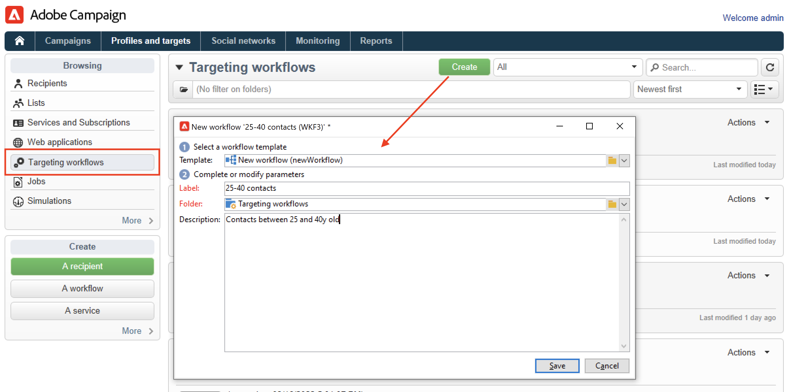

# 在清單中建立對象 {#create-segments}

使用Campaign清單來建立及組織您的對象。

清單是一組靜態的聯絡人，可在傳遞動作中定位，或在匯入或其他工作流程動作中更新。 例如，透過查詢從資料庫中擷取的母體可儲存為清單。

清單是透過&#x200B;**[!UICONTROL Profiles and targets]**&#x200B;索引標籤中的&#x200B;**[!UICONTROL Lists]**&#x200B;連結建立及管理的。 這些清單以預設的Adobe Campaign設定檔表格(nms：recipient)為基礎。 [了解更多](../dev/datamodel.md#ootb-profiles.md)

您可以使用工作流程中的&#x200B;**更新清單**&#x200B;活動來建立清單。 此活動會將產生的母體儲存在清單中。 使用它來建立新清單或更新現有清單。 若要建立包含內建設定檔表格以外其他資料型別的清單，您必須執行工作流程。 例如，若您在訪客表格上使用查詢，然後更新清單，即可建立訪客清單。 [了解更多](#create-a-list-wf)。

觀看此影片以進一步瞭解Adobe Campaign中的清單管理。

>[!VIDEO](https://video.tv.adobe.com/v/334909?quality=12)

## 建立連絡人清單 {#create-a-list-of-contacts}

若要建立連絡人清單，請遵循下列步驟：

1. 按一下&#x200B;**[!UICONTROL Create]**&#x200B;按鈕並選取&#x200B;**[!UICONTROL New list]**。

   

1. 在清單建立視窗的&#x200B;**[!UICONTROL Edit]**&#x200B;索引標籤中輸入資訊。

   

   * 在&#x200B;**[!UICONTROL Label]**&#x200B;欄位中輸入清單名稱，並視需要變更內部名稱。
   * 新增此清單的描述。
   * 您可以指定到期日：達到此日期時，清單會被清除並自動刪除。

1. 在&#x200B;**[!UICONTROL Content]**&#x200B;索引標籤中，按一下&#x200B;**[!UICONTROL Add]**&#x200B;以選取屬於清單的設定檔。

   

   您可以使用&#x200B;**[!UICONTROL Create]**&#x200B;圖示建立新的設定檔，並直接從此視窗將其新增到清單中。 該用戶檔案將新增至資料庫。

1. 按一下&#x200B;**[!UICONTROL Save]**&#x200B;以儲存清單。 然後，清單便會新增至清單概要中。

## 將篩選的連絡人轉換為清單 {#convert-data-to-a-list}

您可以選取設定檔並將它們新增到清單中。 若要執行此作業，請依照下列步驟操作：

1. 在Campaign Explorer中，選取設定檔並按一下滑鼠右鍵。

   您可以篩選這些設定檔以符合特定條件。

1. 選取 **[!UICONTROL Actions > Associate selection with a list...]**。

   

1. 選取現有清單或建立新清單，然後按一下&#x200B;**[!UICONTROL Next]**。

   

1. 按一下 **[!UICONTROL Start]** 按鈕。

   

選取&#x200B;**[!UICONTROL Recreate the list]**&#x200B;選項，從清單中刪除現有內容並最佳化清單的建立（不需要查詢即可驗證設定檔是否已連結至清單）。

如果取消核取&#x200B;**[!UICONTROL No trace of this job is saved in the database]**&#x200B;選項，您可以選取（或建立）執行資料夾，其中會儲存連結至此程式的資訊。

視窗的上方區段可讓您監視執行。 **[!UICONTROL Stop]**&#x200B;按鈕可讓您停止程式。 已處理的連絡人將連結至清單。

執行完成後，存取&#x200B;**[!UICONTROL Profiles and Targets > Lists]**&#x200B;功能表並選取清單： **[!UICONTROL Content]**&#x200B;索引標籤會顯示連結至此清單的設定檔。

## 使用工作流程建立清單  {#create-a-list-wf}

您可以使用&#x200B;**[!UICONTROL List update]**&#x200B;活動來建立清單，或將母體新增至收件者清單。

在以下範例中，您會建立25到40歲之間所有收件者的清單。

1. 選取「**[!UICONTROL Profiles and targets]**」、「**[!UICONTROL Targeting workflows]**」，然後從「**[!UICONTROL Create]**」按鈕建立新的工作流程。
1. 輸入此工作流程的標籤，例如&#39;25-40連絡人&#39;，新增說明，然後按一下&#x200B;**[!UICONTROL Next]**。

   

1. 插入&#x200B;**[!UICONTROL Query]**&#x200B;活動以定義目標母體，並編輯查詢。

   

1. 定義篩選條件，如下所示：

   

   在[本節](https://experienceleague.adobe.com/docs/campaign/automation/workflows/wf-activities/targeting-activities/query.html){target="_blank"}中瞭解如何在工作流程中建立查詢。

1. 為此查詢新增標籤並儲存您的變更。
1. 新增&#x200B;**[!UICONTROL List update]**&#x200B;活動並加以編輯。

   

1. 輸入活動的標籤。
1. 選取&#x200B;**[!UICONTROL Create the list if necessary (Computed name)]**&#x200B;選項以顯示清單會在第一個工作流程執行後建立，然後使用下列執行進行更新。
1. 選取資料夾並輸入清單的標籤。
1. 選取&#x200B;**[!UICONTROL Database of the targeting dimension]**&#x200B;以儲存資料表。
1. 保留&#x200B;**[!UICONTROL Purge the list if it exists (otherwise add to the list)]**&#x200B;選項核取，以刪除不符合目標定位條件的收件者，並將新收件者插入清單中。
1. 同時保留&#x200B;**[!UICONTROL Create or use a list with its own table]**&#x200B;選項為已核取狀態。
1. 保留&#x200B;**[!UICONTROL Generate an outbound transition]**&#x200B;選項為未核取。
1. 按一下&#x200B;**[!UICONTROL Ok]**，然後儲存工作流程。
1. 啟動工作流程。

   接著會建立相符的收件者清單。 您可以從首頁的&#x200B;**[!UICONTROL Lists]**&#x200B;專案存取此清單。

   

   您可以將排程器新增至工作流程，讓此工作流程重複執行。 [了解更多](https://experienceleague.adobe.com/docs/campaign/automation/workflows/wf-activities/flow-control-activities/scheduler.html){target="_blank"}。

## 從清單中移除設定檔 {#remove-a-profile-from-a-list}

若要從清單中移除設定檔，請編輯清單，在&#x200B;**[!UICONTROL Content]**&#x200B;索引標籤中選取設定檔，然後按一下&#x200B;**[!UICONTROL Delete]**&#x200B;圖示。

## 刪除設定檔清單 {#delete-a-list-of-profiles}

若要刪除清單，請從Campaign Explorer瀏覽至該清單，選取該清單，然後按一下滑鼠右鍵。 選擇&#x200B;**[!UICONTROL Delete]**。 此時將顯示警告訊息，要求您確認是否刪除。

>[!NOTE]
>
>刪除清單時，清單上的用戶檔案不受影響，但是將更新用戶檔案中的資料。
