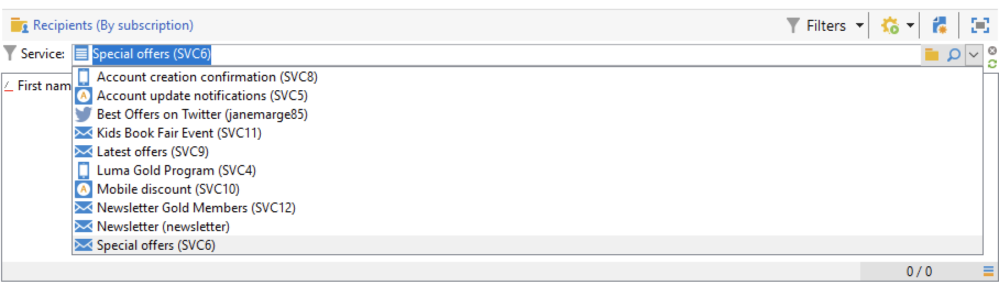
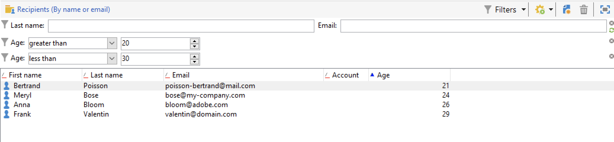
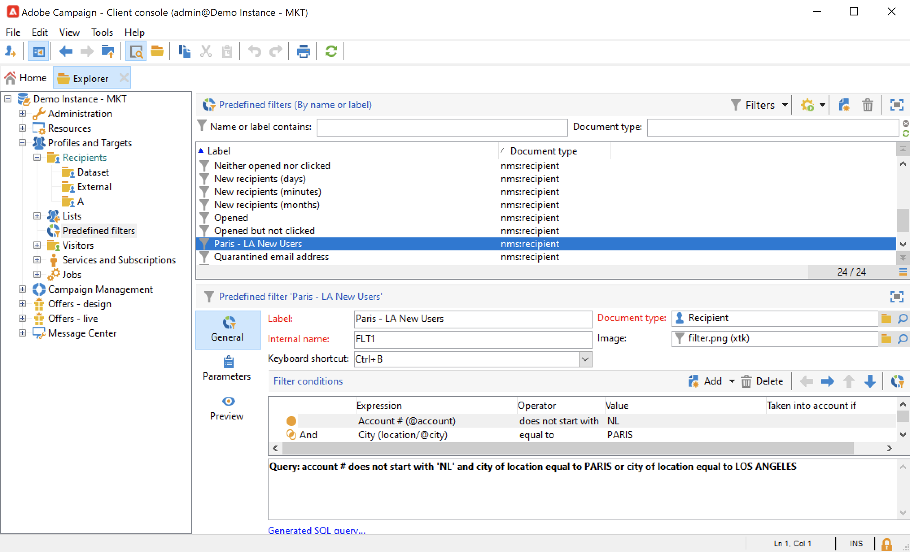

# 建立及管理篩選器{#create-filters}

資料篩選是指選取資料集中較小部分的程式，只選取符合特定條件的記錄，並將該子集用於特定動作（更新、建立對象）或分析。

從 **[!UICONTROL Explorer]**，資料會顯示在清單中。 您可以使用現有的內建篩選器來存取此資料的特定子集：隔離的地址、無目標的收件者、特定的年齡範圍或建立日期。

您也可以建立自己的篩選器、儲存篩選器以供日後使用，或與其他Campaign使用者共用。

篩選設定可讓您從清單中選取資料 **[!UICONTROL dynamically]**:當修改資料時，會更新篩選的資料。

>[!NOTE]
>
>用戶介面配置設定是在本地設備級別定義的。 有時可能需要清除此資料，尤其是在重新整理資料時出現問題時。 若要這麼做，請使用 **[!UICONTROL File > Clear the local cache]** 功能表。

Adobe Campaign提供下列類型的篩選器：

## 預先定義的篩選{#predefined-filters}

預先定義的篩選器可從 **篩選器** 按鈕。

例如，對於設定檔，可使用下列內建篩選器：

您可以在 **[!UICONTROL Profiles and Targets > Pre-defined filters]** 的子節點。

>[!NOTE]
>
>對於所有其他資料清單，預先定義的篩選器會儲存在  **[!UICONTROL Administration > Configuration > Predefined filters]** 節點。

選取一個篩選器以顯示其定義。

使用最後一個索引標籤來預覽篩選的資料。

內建的預先定義篩選器包括：

<table> 
 <tbody> 
  <tr> 
   <td> <strong>標籤</strong>  </td> 
   <td> <strong>查詢</strong>  </td> 
  </tr> 
  <tr> 
   <td> 已開啟  </td> 
   <td> 選取已開啟傳遞的收件者。  </td> 
  </tr> 
  <tr> 
   <td> 已開啟但未點按  </td> 
   <td> 選取已開啟傳遞但未點按連結的收件者。  </td> 
  </tr> 
  <tr> 
   <td> 非作用中收件者  </td> 
   <td> 選擇在X個月內未開啟傳遞的收件者。  </td> 
  </tr> 
  <tr> 
   <td> 上次活動（依裝置類型）  </td> 
   <td> 在過去Z天內使用裝置X按一下或開啟傳遞Y的收件者。  </td> 
  </tr> 
  <tr> 
   <td> 上次活動（依裝置類型）（追蹤）  </td> 
   <td> 在過去Z天內使用裝置X按一下或開啟傳遞Y的收件者。  </td> 
  </tr> 
  <tr> 
   <td> 無目標收件者  </td> 
   <td> 選取在X個月內從未透過管道Y鎖定的收件者。  </td> 
  </tr> 
  <tr> 
   <td> 非常有效的收件者  </td> 
   <td> 選取在過去Y個月內點按傳送至少X次的收件者。  </td> 
  </tr> 
  <tr> 
 <td> 已拒絕的電子郵件地址  </td> 
    <td> 選擇其電子郵件地址位於封鎖清單上的收件人。  </td>
  </tr> 
  <tr> 
   <td> 隔離的電子郵件地址  </td> 
   <td> 選擇被隔離的電子郵件地址的收件人。  </td> 
  </tr> 
  <tr> 
   <td> 資料夾中重複的電子郵件地址  </td> 
   <td> 選擇資料夾中電子郵件地址重複的收件人。  </td> 
  </tr> 
  <tr> 
   <td> 未開啟或未點按  </td> 
   <td> 選取尚未開啟傳遞或點按傳遞的收件者。  </td> 
  </tr> 
  <tr> 
   <td> 新收件者（天）  </td> 
   <td> 選擇在最近X天建立的收件人。  </td> 
  </tr> 
  <tr> 
   <td> 新收件者（分鐘）  </td> 
   <td> 選擇在最後X分鐘內建立的收件者。  </td> 
  </tr> 
  <tr> 
   <td> 新收件者（月）  </td> 
   <td> 選取過去X個月中建立的收件者。  </td> 
  </tr> 
  <tr> 
   <td> 按訂閱  </td> 
   <td> 通過訂閱選擇收件人。  </td> 
  </tr> 
  <tr> 
   <td> 按一下特定連結  </td> 
   <td> 選取在傳送中按一下特定URL的收件者。  </td> 
  </tr> 
  <tr> 
   <td> 依貼文傳送行為  </td> 
   <td> 在收到傳遞後，根據收件者的行為選取收件者。  </td> 
  </tr> 
  <tr> 
   <td> 按建立日期  </td> 
   <td> 依建立日期，在從X個月（目前日期減去n個月）到Y個月（目前日期減去n個月）的期間內選取收件者。  </td> 
  </tr> 
  <tr> 
   <td> 依清單  </td> 
   <td> 按清單選擇收件人。  </td> 
  </tr> 
  <tr> 
   <td> 按點按次數  </td> 
   <td> 選取在過去X個月內點按傳送的收件者。  </td> 
  </tr> 
  <tr> 
   <td> 按接收的消息數  </td> 
   <td> 根據收到的郵件數選擇收件人。  </td> 
  </tr> 
  <tr> 
   <td> 依開啟次數  </td> 
   <td> 選擇在X和Y之間以Z時間開啟的收件者。  </td> 
  </tr> 
  <tr> 
   <td> 依名稱或電子郵件  </td> 
   <td> 根據收件人的姓名或電子郵件選擇收件人。  </td> 
  </tr> 
  <tr> 
   <td> 依年齡範圍  </td> 
   <td> 根據年齡選擇收件者。  </td> 
  </tr> 
 </tbody> 
</table>

### 預設篩選{#default-filters}

每個清單上方的欄位可讓您使用 **預先定義的預設篩選** 來查看此清單。 對於收件者清單，您預設可依名稱和電子郵件地址進行篩選。

>[!NOTE]
>
>此 **%** 字元取代任何字串。 例如，輸入 `%@gmail.com` 在「電子郵件」欄位中，以顯示具有Gmail地址的所有設定檔。 輸入 `%@L` 在「姓氏」欄位中，以顯示姓氏為L的所有設定檔。

要更改收件人清單的預設篩選器，請瀏覽至 **[!UICONTROL Profiles and Targets > Predefined filters]** 節點。

對於所有其他類型的資料，請透過 **[!UICONTROL Administration > Configuration > Predefined filters]** 節點。

應用以下步驟：

1. 選取您預設要使用的篩選器。
1. 按一下 **[!UICONTROL Parameters]** 索引標籤和選取 **[!UICONTROL Default filter for the associated document type]**.

   

1. 請取消勾選目前預設預先定義篩選條件的相同選項。
1. 按一下 **[!UICONTROL Save]** 來套用篩選。
1. 瀏覽至收件者資料夾，然後按一下 **[!UICONTROL Remove this filter]** 圖示（位於目前篩選器的右側）:新預設篩選器可用。
   

## 快速篩選{#quick-filters}

使用和結合 **快速篩選** 定義特定欄位的篩選。

新增後，快速篩選欄位會依序顯示在資料清單上方。 可以相互獨立刪除。

快速篩選器是每個運算子專屬的，每次運算子清除其用戶端主控台的快取時，都會重新初始化。

如果您需要重複使用篩選器，請建立 **進階篩選** 並保存。 [了解更多資訊](#advanced-filters)。

建立 **快速篩選**，請依照下列步驟操作：

1. 以滑鼠右鍵按一下您要篩選的欄位並選取 **[!UICONTROL Filter on this field]**.

   

   預設篩選欄位會顯示在清單上方。

   

1. 選取篩選選項。
1. 如有需要，請使用篩選器右側的灰色圖示加以移除。
1. 您可以結合篩選器來調整篩選器。

   

如果您需要篩選表單中無法使用的欄位，請在欄中篩選，然後篩選該欄。 要做到，

1. 按一下 **[!UICONTROL Configure list]** 表徵圖。

   

1. 選取要顯示的欄，例如收件者的年齡，然後按一下 **確定**.

   

1. 以滑鼠右鍵按一下 **年齡** 欄，然後選取 **[!UICONTROL Filter on this column]**.

   

   然後，您可以選取年齡篩選選項。 在頁面上新增另一個篩選器以定義範圍。

   

## 進階篩選器{#advanced-filters}

將複雜的條件合併至 **進階篩選**. 使用這些篩選器可建立複雜查詢或資料查詢的組合。 這些篩選器可以儲存並與其他Campaign使用者共用。

### 建立進階篩選{#create-adv-filters}

若要建立 **進階篩選**，按一下 **[!UICONTROL Filters]** 按鈕並選取 **[!UICONTROL Advanced filter...]**.

您也可以以滑鼠右鍵按一下資料清單，然後選取 **[!UICONTROL Advanced filter...]**.

定義篩選條件。 在下列範例中，您會篩選其帳號不以NL開頭、且居住在巴黎或洛杉磯的收件者。

1. 按一下 **[!UICONTROL Edit expression]** 表徵圖 **[!UICONTROL Expression]** 欄。

   

1. 選取要篩選的欄位。
1. 從下拉式清單中選取要套用的運算子。

   

1. 從 **[!UICONTROL Value]** 欄。 您可以結合數個篩選器來調整查詢。 若要新增篩選條件，請按一下 **[!UICONTROL Add]**.

   

   >[!NOTE]
   >
   >您可以為運算式指派階層，或使用工具列箭頭來變更查詢運算式的順序。

1. 有三個運算子可用來結合運算式：  **和**, **或**, **除外**. 按一下箭頭以切換至 **或**.

   

1. 按一下 **[!UICONTROL Ok]** 建立篩選器並將其套用至目前清單。

套用的篩選器會顯示在清單上方。

若要編輯或修改此篩選器，請按一下清單上方的藍色說明連結。

### 儲存進階篩選{#save-adv-filters}

您可以將進階篩選器儲存為  [預先定義的篩選](#predefined-filters)，以便重複使用，並與其他Campaign使用者共用。

若要儲存進階篩選，請遵循下列步驟：

1. 按一下篩選器的說明加以編輯。
1. 按一下 **[!UICONTROL Save as filter]** 表徵圖。

   

1. 輸入此篩選器的名稱並儲存。

   

篩選器會新增至 [預先定義的篩選器](#predefined-filters). 可從此節點更新。

>[!NOTE]
>
>您可以新增篩選器的捷徑，以便從鍵盤啟動篩選器。

此篩選器也可從收件者清單的預先定義篩選器中使用。

### 使用篩選器來定義區段 {#filter-as-segment}

您可以使用和結合篩選器來建立目標母體群體。

儲存後，當選取訊息的目標母體時，即可使用進階篩選，位於 **[!UICONTROL User filters]** 區段。

>[!NOTE]
>
>使用 **[!UICONTROL Exclude recipients from this segment]** 僅定位不符合篩選條件的聯繫人。

### 使用函式建立進階篩選{#use-functions-adv-filters}

若要執行進階篩選功能，請使用函式來定義篩選器的內容。 進階篩選器編輯器會運用Campaign查詢編輯器的所有功能。

了解如何在這些端對端範例中建立進階查詢：

* 了解如何在中鎖定簡單的收件者屬性 [本頁](https://experienceleague.adobe.com/docs/campaign/automation/workflows/wf-activities/targeting-activities/query.html).
* 了解如何篩選過去7天未聯絡的收件者，位於 [本頁](https://experienceleague.adobe.com/docs/campaign/automation/workflows/use-cases/designing-queries/query-many-to-many-relationship.html).
* 了解如何復原可依活動帳戶篩選的運算子清單，位於 [本頁](https://experienceleague.adobe.com/docs/campaign/automation/workflows/use-cases/designing-queries/create-a-filter.html).
* 了解如何在中建立生日電子郵件對象  [本頁](https://experienceleague.adobe.com/docs/campaign/automation/workflows/use-cases/deliveries/send-a-birthday-email.html?lang=zh-Hant).

### 預先定義篩選器的進階參數 {#param-for-data-filters}

進階參數適用於預先定義的篩選器。 若要存取，請瀏覽至 **[!UICONTROL Parameters]** 的下一頁。

* 要預設顯示基於此文檔類型的所有清單的篩選器，請選擇 **[!UICONTROL Default filter for the associated document type]** 選項。

   例如， **[!UICONTROL By name or login]** 篩選器已應用於運算子此選項已選中，因此篩選器始終顯示在所有運算子清單上。

* 若要讓篩選器可供所有促銷活動運算子使用，請選取  **[!UICONTROL Filter shared with other operators]** 選項。

* 若要定義表單以選取篩選條件，請選取  **[!UICONTROL Use parameter entry form]** 選項。 此表單必須以XML格式輸入， **[!UICONTROL Form]** 標籤。 例如，內建的預先定義篩選器 **[!UICONTROL Recipients who have opened]**，可從收件者清單中取得，顯示篩選欄位，讓您選取篩選套用的傳送。

* 此 **[!UICONTROL Advanced parameters]** 連結可讓您定義其他設定。

   * 可將SQL表與篩選器關聯，使共用該表的所有編輯器都能使用該篩選器。
   * 若要防止任何使用者覆寫篩選器，請選取 **[!UICONTROL Do not restrict the filter]** 選項。 例如，此選項對於「傳送的收件者」和「屬於資料夾的傳送的收件者」篩選器有效，可在傳送精靈中使用。 這些篩選器不能多載。
