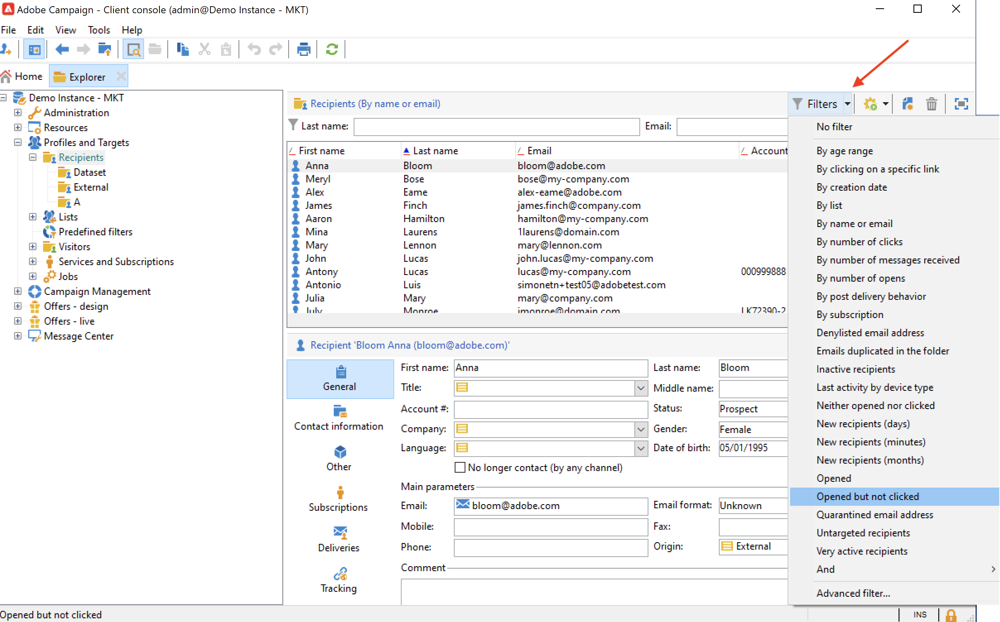

# 建立及管理篩選器{#create-filters}

資料篩選是選取資料集較小部分的程式，僅選取符合特定條件的記錄，並將該子集用於特定動作（更新、對象建立）或分析。

從瀏覽Campaign時 **[!UICONTROL Explorer]**，資料會顯示在清單中。 您可以使用現有的內建篩選器來存取此資料的特定子集：例如隔離地址、未鎖定目標的收件者、特定年齡範圍或建立日期。

您也可以建立自己的篩選器、儲存以供日後使用，或與其他Campaign使用者共用。

篩選設定可讓您從清單中選取資料 **[!UICONTROL dynamically]**：修改資料時，會更新篩選的資料。

>[!NOTE]
>
>使用者介面組態設定是在裝置層級本機定義的。 有時可能必須清除此資料，尤其是在重新整理資料時發生問題時。 若要這麼做，請使用 **[!UICONTROL File > Clear the local cache]** 功能表。

Adobe Campaign中有以下篩選器型別：

## 預先定義的篩選{#predefined-filters}

預先定義的篩選條件可從 **篩選器** 按鈕來顯示每個清單的上方。

例如，設定檔可使用下列內建篩選器：

您可以存取以下連結中的篩選器詳細資料： **[!UICONTROL Profiles and Targets > Pre-defined filters]** Explorer節點。

>[!NOTE]
>
>對於所有其他資料清單，預先定義的篩選條件會儲存在  **[!UICONTROL Administration > Configuration > Predefined filters]** 節點。

選取要顯示其定義的篩選器。

使用最後一個索引標籤來預覽篩選的資料。

內建預先定義的篩選器包括：

<table> 
 <tbody> 
  <tr> 
   <td> <strong>標籤</strong>  </td> 
   <td> <strong>查詢</strong>  </td> 
  </tr> 
  <tr> 
   <td> 已開啟  </td> 
   <td> 選取已開啟傳遞的收件者。  </td> 
  </tr> 
  <tr> 
   <td> 已開啟但未點按  </td> 
   <td> 選取已開啟傳遞但未點按連結的收件者。  </td> 
  </tr> 
  <tr> 
   <td> 非作用中收件者  </td> 
   <td> 選取在X個月內未開啟傳遞的收件者。  </td> 
  </tr> 
  <tr> 
   <td> 依裝置型別的最後一個活動  </td> 
   <td> 選取在最近Z天內使用裝置X點選或開啟傳送Y的收件者。  </td> 
  </tr> 
  <tr> 
   <td> 依裝置型別的最後一個活動（追蹤）  </td> 
   <td> 選取在最近Z天內使用裝置X點選或開啟傳送Y的收件者。  </td> 
  </tr> 
  <tr> 
   <td> 未鎖定的收件者  </td> 
   <td> 選取在X個月內從未透過管道Y定位的收件者。  </td> 
  </tr> 
  <tr> 
   <td> 非常活躍的收件者  </td> 
   <td> 選取在過去Y個月內至少點按過傳遞X次的收件者。  </td> 
  </tr> 
  <tr> 
 <td> 已加入封鎖清單的電子郵件地址  </td> 
    <td> 選取電子郵件地址在封鎖清單上的收件者。  </td>
  </tr> 
  <tr> 
   <td> 隔離的電子郵件地址  </td> 
   <td> 選取已隔離電子郵件地址的收件者。  </td> 
  </tr> 
  <tr> 
   <td> 資料夾中重複的電子郵件地址  </td> 
   <td> 選取資料夾中電子郵件地址重複的收件者。  </td> 
  </tr> 
  <tr> 
   <td> 未開啟或未點按  </td> 
   <td> 選取尚未開啟傳遞或按一下傳遞的收件者。  </td> 
  </tr> 
  <tr> 
   <td> 新收件者（天）  </td> 
   <td> 選取過去X天建立的收件者。  </td> 
  </tr> 
  <tr> 
   <td> 新收件者（分鐘）  </td> 
   <td> 選取過去X分鐘建立的收件者。  </td> 
  </tr> 
  <tr> 
   <td> 新收件者（月）  </td> 
   <td> 選取過去X個月建立的收件者。  </td> 
  </tr> 
  <tr> 
   <td> 依訂閱  </td> 
   <td> 依訂閱選取收件者。  </td> 
  </tr> 
  <tr> 
   <td> 按一下特定連結  </td> 
   <td> 選取在傳遞中按一下特定URL的收件者。  </td> 
  </tr> 
  <tr> 
   <td> 依貼文傳遞行為  </td> 
   <td> 根據收件者在收到傳遞後的行為選取收件者。  </td> 
  </tr> 
  <tr> 
   <td> 依建立日期  </td> 
   <td> 依建立日期選取從X個月（目前日期減去n個月）到Y個月（目前日期減去n個月）的期間。  </td> 
  </tr> 
  <tr> 
   <td> 依清單  </td> 
   <td> 依清單選取收件者。  </td> 
  </tr> 
  <tr> 
   <td> 按點按次數  </td> 
   <td> 選取過去X個月內點選傳遞的收件者。  </td> 
  </tr> 
  <tr> 
   <td> 依接收的訊息數  </td> 
   <td> 根據收件者收到的郵件數選取收件者。  </td> 
  </tr> 
  <tr> 
   <td> 按開啟次數  </td> 
   <td> 選取在X和Y傳遞之間超過Z時間量的開啟收件者。  </td> 
  </tr> 
  <tr> 
   <td> 依名稱或電子郵件  </td> 
   <td> 根據收件者的名稱或電子郵件選取收件者。  </td> 
  </tr> 
  <tr> 
   <td> 依年齡範圍  </td> 
   <td> 根據收件者的年齡來選取收件者。  </td> 
  </tr> 
 </tbody> 
</table>

### 預設篩選器{#default-filters}

每個清單上方的欄位可讓您使用 **預先定義的預設篩選器** 以取得此清單。 對於收件者清單，您可以依預設篩選名稱和電子郵件地址。

>[!NOTE]
>
>此 **%** 字元會取代任何字元字串。 例如，輸入 `%@gmail.com` 在「電子郵件」欄位中，顯示所有具有Gmail地址的設定檔。 輸入 `%@L` 在「姓氏」欄位中顯示所有姓氏為L的設定檔。

若要變更收件者清單的預設篩選器，請瀏覽至 **[!UICONTROL Profiles and Targets > Predefined filters]** 節點。

對於所有其他型別的資料，請透過 **[!UICONTROL Administration > Configuration > Predefined filters]** 節點。

應用以下步驟：

1. 選取預設要使用的篩選器。
1. 按一下 **[!UICONTROL Parameters]** 標籤並選取 **[!UICONTROL Default filter for the associated document type]**.

   

1. 取消勾選目前預設預先定義篩選的相同選項。
1. 按一下 **[!UICONTROL Save]** 以套用篩選。
1. 瀏覽至收件者資料夾，然後按一下 **[!UICONTROL Remove this filter]** 圖示目前的篩選器右側：新的預設篩選器可供使用。
   

## 快速篩選{#quick-filters}

使用並合併 **快速篩選** 以定義特定欄位的篩選器。

新增後，快速篩選欄位會逐一顯示在資料清單上方。 它們可以相互獨立地刪除。

快速篩選器是每個運運算元專屬的，每當運運算元清除其使用者端主控台的快取時，就會重新初始化。

如果您需要重複使用篩選器，請建立 **進階篩選** 並儲存。 [了解更多](#advanced-filters)。

若要建立 **快速篩選**，請遵循下列步驟：

1. 以滑鼠右鍵按一下要篩選的欄位並選取 **[!UICONTROL Filter on this field]**.

   

   預設篩選欄位會顯示在清單上方。

   

1. 選取篩選選項。
1. 如有需要，請使用篩選器右側的灰色圖示將其移除。
1. 您可以合併篩選器以縮小篩選範圍。

   

如果您需要對表單中不可用的欄位進行篩選，它會在欄中篩選，然後在該欄中篩選。 若要這麼做，

1. 按一下 **[!UICONTROL Configure list]** 圖示。

   

1. 選取要顯示的欄（例如收件者的年齡），然後按一下 **確定**.

   

1. 以滑鼠右鍵按一下 **年齡** 欄，並選取 **[!UICONTROL Filter on this column]**.

   

   然後，您可以選取年齡篩選選項。 在頁面上新增另一個篩選器以定義範圍。

   

## 進階篩選器{#advanced-filters}

在中合併複雜條件 **進階篩選**. 使用這些篩選器對您的資料建立複雜查詢或查詢組合。 這些篩選器可以儲存並與其他Campaign使用者共用。

### 建立進階篩選{#create-adv-filters}

若要建立 **進階篩選**，按一下 **[!UICONTROL Filters]** 按鈕並選取 **[!UICONTROL Advanced filter...]**.

您也可以以滑鼠右鍵按一下資料清單，然後選取 **[!UICONTROL Advanced filter...]**.

定義篩選條件。 在以下範例中，您將篩選帳號並非以NL開頭的收件者，以及住在巴黎或洛杉磯的收件者。

1. 按一下 **[!UICONTROL Edit expression]** 圖示 **[!UICONTROL Expression]** 欄。

   

1. 選取要篩選的欄位。
1. 從下拉式清單中選取要套用的運運算元。

   

1. 從以下專案選取預期值： **[!UICONTROL Value]** 欄。 您可以合併多個篩選器來縮小查詢範圍。 若要新增篩選條件，請按一下 **[!UICONTROL Add]**.

   

   >[!NOTE]
   >
   >您可以將階層指派給運算式，或使用工具列箭頭來變更查詢運算式的順序。

1. 有三個運運算元可用來組合運算式：  **和**， **或**， **例外**. 按一下箭頭以切換至 **或**.

   

1. 按一下 **[!UICONTROL Ok]** 以建立篩選器並將其套用至目前清單。

套用的篩選器會顯示在清單上方。

若要編輯或修改此篩選器，請按一下清單上方的藍色說明連結。

### 儲存進階篩選{#save-adv-filters}

您可以將進階篩選器儲存為  [預先定義的篩選器](#predefined-filters)，以便重複使用它，並與其他Campaign使用者共用。

若要儲存進階篩選，請遵循下列步驟：

1. 按一下篩選的說明以進行編輯。
1. 按一下 **[!UICONTROL Save as filter]** 圖示加以檢視。

   

1. 輸入此篩選器的名稱並儲存。

   

篩選器會新增至 [預先定義的篩選器](#predefined-filters). 可以從此節點更新。

>[!NOTE]
>
>您可以新增篩選的捷徑，以從鍵盤啟動它。

此篩選器也可從收件者清單的預先定義篩選器取得。

### 使用篩選器定義區段 {#filter-as-segment}

您可以使用和組合篩選器來建立目標母體區段。

儲存後，在「 」中選擇訊息的目標母體時，可使用進階篩選 **[!UICONTROL User filters]** 區段。

>[!NOTE]
>
>使用 **[!UICONTROL Exclude recipients from this segment]** 僅鎖定不符合篩選條件的連絡人。

### 使用函式建置進階篩選器{#use-functions-adv-filters}

若要執行進階篩選功能，請使用函式來定義篩選器的內容。 進階篩選器編輯器運用Campaign查詢編輯器的所有功能。

瞭解如何在這些端對端範例中建立進階查詢：

* 瞭解如何在中鎖定簡單的收件者屬性 [此頁面](https://experienceleague.adobe.com/docs/campaign/automation/workflows/wf-activities/targeting-activities/query.html).
* 瞭解如何篩選過去7天內未聯絡的收件者 [此頁面](https://experienceleague.adobe.com/docs/campaign/automation/workflows/use-cases/designing-queries/query-many-to-many-relationship.html).
* 瞭解如何復原可由中的作用中帳戶篩選的運運算元清單 [此頁面](https://experienceleague.adobe.com/docs/campaign/automation/workflows/use-cases/designing-queries/create-a-filter.html).
* 瞭解如何在中建立生日電子郵件對象  [此頁面](https://experienceleague.adobe.com/docs/campaign/automation/workflows/use-cases/deliveries/send-a-birthday-email.html?lang=zh-Hant).

### 預先定義篩選器的進階引數 {#param-for-data-filters}

進階引數可供預先定義的篩選器使用。 若要存取，請瀏覽至 **[!UICONTROL Parameters]** 的標籤中選取。

* 若要根據此「檔案」型別預設顯示所有清單的篩選器，請選取 **[!UICONTROL Default filter for the associated document type]** 選項。

   例如， **[!UICONTROL By name or login]** 篩選器已套用至運運算元此選項已選取，因此篩選器一律會顯示在所有運運算元清單上。

* 若要讓篩選器可供所有促銷活動運運算元使用，請選取  **[!UICONTROL Filter shared with other operators]** 選項。

* 若要定義表單以選取篩選條件，請選取  **[!UICONTROL Use parameter entry form]** 選項。 此表單必須以XML格式輸入 **[!UICONTROL Form]** 標籤。 例如，內建預先定義的篩選器 **[!UICONTROL Recipients who have opened]**（可從收件者清單取得）顯示篩選欄位，讓您選取套用篩選的傳送。

* 此 **[!UICONTROL Advanced parameters]** 連結可讓您定義其他設定。

   * 您可以將SQL表格與篩選器建立關聯，讓共用該表格的所有編輯器都能夠共用該表格。
   * 若要防止任何使用者覆寫篩選器，請選取 **[!UICONTROL Do not restrict the filter]** 選項。 例如，此選項對傳遞精靈中可用的「傳遞的收件者」和「屬於資料夾的傳遞的收件者」篩選器有效。 無法多載這些篩選器。
