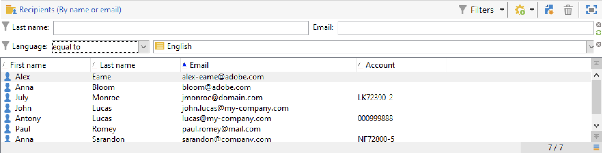
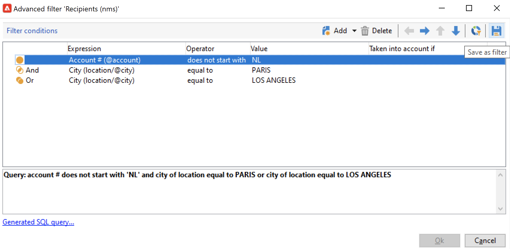
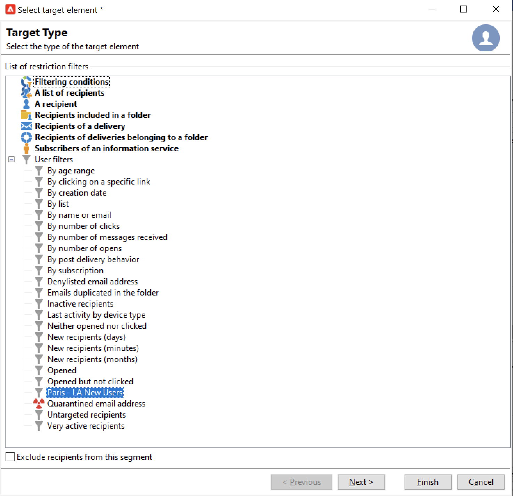

# 建立及管理篩選器{#create-filters}

資料篩選是指選擇資料集中較小部分（僅那些符合特定條件的記錄），並將該子集用於特定操作（更新、訪問群體建立）或分析的過程。

從 **[!UICONTROL Explorer]**，資料將顯示在清單中。 可以使用現有內置篩選器訪問此資料的特定子集：隔離地址、未定向收件人、特定的年齡範圍或建立日期。

您還可以建立自己的篩選器、保存它們以供將來使用或與其他市場活動用戶共用。

篩選器配置允許您從清單中選擇資料 **[!UICONTROL dynamically]**:當資料被修改時，過濾的資料被更新。

>[!NOTE]
>
>用戶介面配置設定在設備級別本地定義。 有時可能需要清理此資料，特別是在刷新資料時出現問題時。 要執行此操作，請使用 **[!UICONTROL File > Clear the local cache]** 的子菜單。

以下類型的過濾器在Adobe Campaign可用：

## 預先定義的篩選{#predefined-filters}

預定義的篩選器可從 **篩選器** 按鈕。

例如，對於配置檔案，以下內置篩選器可用：

您可以訪問 **[!UICONTROL Profiles and Targets > Pre-defined filters]** 的子菜單。

>[!NOTE]
>
>對於所有其它資料清單，預定義的篩選器儲存在  **[!UICONTROL Administration > Configuration > Predefined filters]** 的下界。

選擇一個篩選器以顯示其定義。

使用最後一個頁籤預覽已篩選的資料。

內置的預定義篩選器包括：

<table> 
 <tbody> 
  <tr> 
   <td> <strong>標籤</strong>  </td> 
   <td> <strong>查詢</strong>  </td> 
  </tr> 
  <tr> 
   <td> 已開啟  </td> 
   <td> 選擇已開啟交貨的收件人。  </td> 
  </tr> 
  <tr> 
   <td> 已開啟但未按一下  </td> 
   <td> 選擇已開啟傳遞但未按一下連結的收件人。  </td> 
  </tr> 
  <tr> 
   <td> 非活動收件人  </td> 
   <td> 選擇在X個月內未開啟交貨的收件人。  </td> 
  </tr> 
  <tr> 
   <td> 按設備類型列出的上一活動  </td> 
   <td> 選擇在過去Z天中使用設備X按一下或開啟傳遞Y的收件人。  </td> 
  </tr> 
  <tr> 
   <td> 按設備類型列出的上次活動（跟蹤）  </td> 
   <td> 選擇在過去Z天中使用設備X按一下或開啟傳遞Y的收件人。  </td> 
  </tr> 
  <tr> 
   <td> 無目標收件人  </td> 
   <td> 選擇在X個月內從未通過渠道Y成為目標的收件人。  </td> 
  </tr> 
  <tr> 
   <td> 非常活動的收件人  </td> 
   <td> 選擇在過去Y個月中按一下傳遞至少X次的收件人。  </td> 
  </tr> 
  <tr> 
 <td> 拒絕列出的電子郵件地址  </td> 
    <td> 選擇電子郵件地址位於denylist上的收件人。  </td>
  </tr> 
  <tr> 
   <td> 隔離的電子郵件地址  </td> 
   <td> 選擇其電子郵件地址被隔離的收件人。  </td> 
  </tr> 
  <tr> 
   <td> 資料夾中重複的電子郵件地址  </td> 
   <td> 選擇其電子郵件地址在資料夾中重複的收件人。  </td> 
  </tr> 
  <tr> 
   <td> 未開啟或按一下  </td> 
   <td> 選擇尚未開啟傳遞或在傳遞中按一下的收件人。  </td> 
  </tr> 
  <tr> 
   <td> 新收件人（天）  </td> 
   <td> 選擇在最近X天內建立的收件人。  </td> 
  </tr> 
  <tr> 
   <td> 新收件人（分鐘）  </td> 
   <td> 選擇在最後X分鐘內建立的收件人。  </td> 
  </tr> 
  <tr> 
   <td> 新收件人（月）  </td> 
   <td> 選擇在最近X個月中建立的收件人。  </td> 
  </tr> 
  <tr> 
   <td> 按訂閱  </td> 
   <td> 按訂閱選擇收件人。  </td> 
  </tr> 
  <tr> 
   <td> 通過按一下特定連結  </td> 
   <td> 選擇按一下傳遞中特定URL的收件人。  </td> 
  </tr> 
  <tr> 
   <td> 按郵遞行為  </td> 
   <td> 在收到遞送後，根據收件人的行為選擇收件人。  </td> 
  </tr> 
  <tr> 
   <td> 按建立日期  </td> 
   <td> 按建立日期，在從X個月（當前日期減n個月）到Y個月（當前日期減n個月）的期間內選擇收件人。  </td> 
  </tr> 
  <tr> 
   <td> 按清單  </td> 
   <td> 按清單選擇收件人。  </td> 
  </tr> 
  <tr> 
   <td> 按點擊次數  </td> 
   <td> 選擇在最近X個月中按一下交貨的收件人。  </td> 
  </tr> 
  <tr> 
   <td> 按收到的郵件數  </td> 
   <td> 根據接收的郵件數選擇收件人。  </td> 
  </tr> 
  <tr> 
   <td> 按開啟數  </td> 
   <td> 選擇在X和Y交貨之間以Z時間開啟的收件人。  </td> 
  </tr> 
  <tr> 
   <td> 按姓名或電子郵件  </td> 
   <td> 根據收件人的姓名或電子郵件選擇收件人。  </td> 
  </tr> 
  <tr> 
   <td> 按年齡範圍  </td> 
   <td> 根據收件人的年齡選擇收件人。  </td> 
  </tr> 
 </tbody> 
</table>

### 預設篩選器{#default-filters}

每個清單上的欄位允許您使用 **預定義預設篩選器** 的子菜單。 對於收件人清單，預設情況下可以篩選名稱和電子郵件地址。

>[!NOTE]
>
>的 **%** 字元替換任何字串。 例如，輸入 `%@gmail.com` 在「電子郵件」欄位中顯示所有帶有Gmail地址的配置檔案。 輸入 `%@L` 在「姓氏」欄位中，顯示所有姓氏為L的配置檔案。

要更改收件人清單的預設篩選器，請瀏覽至 **[!UICONTROL Profiles and Targets > Predefined filters]** 的下界。

對於所有其他類型的資料，請通過 **[!UICONTROL Administration > Configuration > Predefined filters]** 的下界。

應用以下步驟：

1. 選擇預設情況下要使用的篩選器。
1. 按一下 **[!UICONTROL Parameters]** 頁籤 **[!UICONTROL Default filter for the associated document type]**。

   

1. 取消選中當前預設預定義篩選器的相同選項。
1. 按一下 **[!UICONTROL Save]** 按鈕
1. 瀏覽到「Recipient（收件人）」資料夾，然後按一下 **[!UICONTROL Remove this filter]** 表徵圖：新預設篩選器可用。
   

## 快速篩選器{#quick-filters}

使用和合併 **快速篩選器** 定義特定欄位的篩選器。

添加後，快速篩選欄位會依次顯示在資料清單的上方。 它們可以相互獨立地刪除。

快速過濾器是每個操作員特定的，並且每次操作員清除其客戶端控制台的快取時都會重新初始化。

如果需要重用篩選器，請建立 **高級過濾器** 並保存。 [了解更多資訊](#advanced-filters)。

建立 **快速濾波**，請執行以下步驟：

1. 按一下右鍵要篩選的欄位並選擇 **[!UICONTROL Filter on this field]**。

   

   預設篩選器欄位顯示在清單的上方。

   

1. 選擇篩選器選項。
1. 如果需要，請使用濾鏡右側的灰色表徵圖將其刪除。
1. 可以合併篩選器以細化篩選器。

   

如果需要在表單中不可用的欄位上篩選，請在列中篩選，然後在該列上篩選。 要做到這一點，

1. 按一下 **[!UICONTROL Configure list]** 表徵圖

   

1. 選擇要顯示的列，例如收件人的年齡，然後按一下 **確定**。

   

1. 按一下右鍵 **年齡** 列，然後選擇 **[!UICONTROL Filter on this column]**。

   

   然後，可以選擇年齡篩選選項。 在年齡上添加另一個篩選器以定義範圍。

   

## 高級篩選器{#advanced-filters}

將複雜標準 **高級篩選器**。 使用這些篩選器可建立複雜查詢或資料上的查詢組合。 這些篩選器可以保存，並與其他市場活動用戶共用。

### 建立高級篩選器{#create-adv-filters}

建立 **高級過濾器**，按一下 **[!UICONTROL Filters]** 按鈕 **[!UICONTROL Advanced filter...]**。

也可以按一下右鍵資料清單並選擇 **[!UICONTROL Advanced filter...]**。

定義篩選條件。 在下面的示例中，您將篩選帳戶編號不以NL開頭的收件人，以及居住在巴黎或洛杉磯的收件人。

1. 按一下 **[!UICONTROL Edit expression]** 表徵圖 **[!UICONTROL Expression]** 的雙曲餘切值。

   

1. 選擇要篩選的欄位。
1. 從下拉清單中選擇要應用的運算子。

   

1. 從 **[!UICONTROL Value]** 的雙曲餘切值。 您可以合併多個篩選器來細化查詢。 要添加篩選條件，請按一下 **[!UICONTROL Add]**。

   

   >[!NOTE]
   >
   >您可以為表達式分配層次，或使用工具欄箭頭更改查詢表達式的順序。

1. 有三個運算子可用於組合表達式：  **和**。 **或**。 **除外**。 按一下箭頭切換到 **或**。

   

1. 按一下 **[!UICONTROL Ok]** 來修改選定線條的屬性。

應用的篩選器顯示在清單的上方。

要編輯或修改此篩選器，請按一下清單上方的藍色說明連結。

### 保存高級篩選器{#save-adv-filters}

可以將高級篩選器另存為  [預定義濾波器](#predefined-filters)，這樣您就可以重新使用它，並與其他市場活動用戶共用它。

要保存高級篩選器，請執行以下步驟：

1. 按一下篩選器的說明以編輯它。
1. 按一下 **[!UICONTROL Save as filter]** 表徵圖。

   

1. 輸入此篩選器的名稱並保存。

   

篩選器將添加到 [預定義的篩選器](#predefined-filters)。 可以從此節點更新。

>[!NOTE]
>
>您可以為篩選器添加快捷方式，以從鍵盤激活它。

此篩選器也可從收件人清單的預定義篩選器中獲得。

### 使用篩選器定義段 {#filter-as-segment}

可以使用和組合篩選器來建立目標填充段。

保存後，當選擇消息的目標填充時，高級篩選器將可用於 **[!UICONTROL User filters]** 的子菜單。

>[!NOTE]
>
>使用 **[!UICONTROL Exclude recipients from this segment]** 僅針對與篩選條件不匹配的聯繫人。

### 使用函式構建高級篩選器{#use-functions-adv-filters}

要執行高級篩選功能，請使用函式定義篩選器的內容。 高級篩選器編輯器利用市場活動查詢編輯器的所有功能。

瞭解如何在這些端到端示例中構建高級查詢：

* 瞭解如何針對中的簡單收件人屬性 [此頁](https://experienceleague.adobe.com/docs/campaign/automation/workflows/wf-activities/targeting-activities/query.html)。
* 瞭解如何篩選過去7天未聯繫的收件人 [此頁](https://experienceleague.adobe.com/docs/campaign/automation/workflows/use-cases/designing-queries/query-many-to-many-relationship.html)。
* 瞭解如何恢復可按中的活動帳戶篩選的運算子清單 [此頁](https://experienceleague.adobe.com/docs/campaign/automation/workflows/use-cases/designing-queries/create-a-filter.html)。
* 瞭解如何在  [此頁](https://experienceleague.adobe.com/docs/campaign/automation/workflows/use-cases/deliveries/send-a-birthday-email.html)。

### 預定義篩選器的高級參數 {#param-for-data-filters}

高級參數可用於預定義的篩選器。 要訪問它們，請瀏覽 **[!UICONTROL Parameters]** 的子菜單。

* 要預設顯示基於此文檔類型的所有清單的篩選器，請選擇 **[!UICONTROL Default filter for the associated document type]** 的雙曲餘切值。

   例如， **[!UICONTROL By name or login]** 篩選器應用於運算子此選項被選中，因此篩選器始終顯示在所有運算子清單中。

* 要使篩選器可用於所有市場活動操作員，請選擇  **[!UICONTROL Filter shared with other operators]** 的雙曲餘切值。

* 要定義表單以選擇篩選條件，請選擇  **[!UICONTROL Use parameter entry form]** 的雙曲餘切值。 此表單必須以XML格式輸入， **[!UICONTROL Form]** 頁籤。 例如，內置的預定義篩選器 **[!UICONTROL Recipients who have opened]**（可從收件人清單獲得）中顯示一個篩選器欄位，該欄位允許您選擇篩選器應用於的傳遞。

* 的 **[!UICONTROL Advanced parameters]** 連結，用於定義其他設定。

   * 可以將SQL表與篩選器關聯，以使共用該表的所有編輯器通用。
   * 要防止任何用戶覆蓋篩選器，請選擇 **[!UICONTROL Do not restrict the filter]** 的雙曲餘切值。 例如，此選項對於「遞送的收件人」和「屬於資料夾的遞送的收件人」篩選器處於活動狀態，這些篩選器在遞送嚮導中可用。 這些篩選器不能過載。
