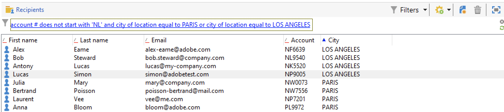

# 使用篩選器{#create-filters}

資料篩選是將資料集縮小至符合特定條件的那些記錄的程式。 然後可將此子集用於目標動作（例如更新或建立對象）或分析。

瀏覽Campaign時，資料會顯示在清單中。 您可以套用內建篩選器快速存取定義的子集，例如隔離地址、未鎖定目標的收件者或特定年齡範圍或建立日期內的記錄。

此外，您可以建立自訂篩選器、儲存以供日後使用，以及與其他Campaign使用者共用。

**動態套用篩選器**：每當資料變更時，篩選的結果都會自動更新。

>[!NOTE]
>
>使用者介面組態設定是在裝置層級本機定義的。 有時可能必須清除此資料，尤其是在重新整理資料時發生問題時。 若要這麼做，請使用&#x200B;**[!UICONTROL File > Clear the local cache]**&#x200B;功能表。

Adobe Campaign中有以下型別的篩選器：

* [預先定義的篩選器](#predefined-filters)
* [快速篩選](#quick-filters)
* [進階自訂篩選器](#advanced-filters)

## 預先定義的篩選器{#predefined-filters}

### 儀表板中的預先定義篩選器

依預設，Adobe Campaign會顯示操作員有權讀取的所有資料庫記錄。 您可以使用瀏覽器視窗上半區段中可用的選項來篩選此資料。

有數種方式可篩選要顯示的資料。 如有需要，這些可搭配使用。 瀏覽以下標籤以進一步瞭解篩選選項。

>[!BEGINTABS]

>[!TAB 依資料夾篩選]

若要根據資料夾來篩選資料，請按一下&#x200B;**[!UICONTROL Folder]**&#x200B;圖示，然後選取包含要顯示資料的資料夾。

只會顯示資料夾中的設定檔：

使用資料夾選擇欄位右側的十字可返回預設顯示模式。

>[!TAB 依狀態篩選]

根據顯示的資訊型別，您可以依狀態或狀態套用篩選。

例如，針對傳送，您可以選擇只顯示完成的傳送，如下所示：

>[!TAB 排序依據]

您可以透過「每個資料夾」篩選欄位右側的下拉式清單，選取頁面上所提供資料的排序順序。 此欄位的內容取決於頁面上的資料型別。

例如，您可以依優先順序、建立日期或字母順序來排序工作。

>[!TAB 快速搜尋]

使用搜尋欄位來快速存取您要尋找的專案：輸入包含在您要顯示之專案的標籤或內部名稱中的字元，然後確認將自動篩選套用至頁面上的資料。

若要再次顯示所有專案，請按一下十字以刪除搜尋欄位的內容。

>[!ENDTABS]

### 瀏覽器中的預先定義篩選器

可從每個清單上方的&#x200B;**篩選器**&#x200B;按鈕取得預先定義的篩選器。

例如，設定檔可使用下列內建篩選器：

您可以在瀏覽器的&#x200B;**[!UICONTROL Profiles and Targets > Pre-defined filters]**&#x200B;節點中存取篩選器詳細資料。

>[!NOTE]
>
>對於所有其他資料清單，預先定義的篩選器會儲存在&#x200B;**[!UICONTROL Administration > Configuration > Predefined filters]**&#x200B;節點中。

選取要顯示其定義的篩選器。

使用最後一個索引標籤來預覽篩選的資料。

+++  設定檔的內建預先定義篩選器

<table> 
 <tbody> 
  <tr> 
   <td> <strong>標籤</strong>  </td> 
   <td> <strong>查詢</strong>  </td> 
  </tr> 
  <tr> 
   <td> 已開啟  </td> 
   <td> 選取已開啟傳遞的收件者。  </td> 
  </tr> 
  <tr> 
   <td> 已開啟但未點按  </td> 
   <td> 選取已開啟傳遞但未點按連結的收件者。  </td> 
  </tr> 
  <tr> 
   <td> 非使用中的收件者  </td> 
   <td> 選取在X個月內未開啟傳遞的收件者。  </td> 
  </tr> 
  <tr> 
   <td> 依裝置型別的最後一個活動  </td> 
   <td> 選取在過去Z天內使用裝置X點選或開啟傳遞Y的收件者。  </td> 
  </tr> 
  <tr> 
   <td> 依裝置型別的最後一個活動（追蹤）  </td> 
   <td> 選取在過去Z天內使用裝置X點選或開啟傳遞Y的收件者。  </td> 
  </tr> 
  <tr> 
   <td> 未鎖定目標的收件者  </td> 
   <td> 選取在X個月內從未透過管道Y定位的收件者。  </td> 
  </tr> 
  <tr> 
   <td> 非常活躍的收件者  </td> 
   <td> 選取在過去Y個月中至少點按X次傳遞的收件者。  </td> 
  </tr> 
  <tr> 
 <td> 已加入封鎖清單的電子郵件地址  </td> 
    <td> 選取電子郵件地址在封鎖清單上的收件者。  </td>
  </tr> 
  <tr> 
   <td> 隔離的電子郵件地址  </td> 
   <td> 選取已隔離電子郵件地址的收件者。  </td> 
  </tr> 
  <tr> 
   <td> 在資料夾 中重複的電子郵件地址 </td> 
   <td> 選取資料夾中電子郵件地址重複的收件者。  </td> 
  </tr> 
  <tr> 
   <td> 未開啟或未按一下  </td> 
   <td> 選取尚未開啟傳遞或按一下傳遞的收件者。  </td> 
  </tr> 
  <tr> 
   <td> 新收件者（天）  </td> 
   <td> 選取過去X天建立的收件者。  </td> 
  </tr> 
  <tr> 
   <td> 新收件者（分鐘）  </td> 
   <td> 選取過去X分鐘建立的收件者。  </td> 
  </tr> 
  <tr> 
   <td> 新收件者（月）  </td> 
   <td> 選取過去X個月建立的收件者。  </td> 
  </tr> 
  <tr> 
   <td> 依訂閱  </td> 
   <td> 依訂閱選取收件者。  </td> 
  </tr> 
  <tr> 
   <td> 按一下特定連結  </td> 
   <td> 選取按一下傳遞中特定URL的收件者。  </td> 
  </tr> 
  <tr> 
   <td> 透過傳遞行為  </td> 
   <td> 根據收件者在收到傳遞後的行為選取收件者。  </td> 
  </tr> 
  <tr> 
   <td> 依據建立日期  </td> 
   <td> 依建立日期選取從X個月（目前日期減去n個月）到Y個月（目前日期減去n個月）的期間內的收件者。  </td> 
  </tr> 
  <tr> 
   <td> 依清單  </td> 
   <td> 依清單選取收件者。  </td> 
  </tr> 
  <tr> 
   <td> 按點按次數  </td> 
   <td> 選取過去X個月內點選傳遞的收件者。  </td> 
  </tr> 
  <tr> 
   <td> 依已接收的訊息數  </td> 
   <td> 根據收件者收到的郵件數目選取收件者。  </td> 
  </tr> 
  <tr> 
   <td> 按開啟次數  </td> 
   <td> 選取在X和Y傳遞之間開啟超過Z時間量的收件者。  </td> 
  </tr> 
  <tr> 
   <td> 依名稱或電子郵件  </td> 
   <td> 根據收件者的名稱或電子郵件選取收件者。  </td> 
  </tr> 
  <tr> 
   <td> 依年齡範圍  </td> 
   <td> 根據收件者的年齡選取收件者。  </td> 
  </tr> 
 </tbody> 
</table>

+++

#### 預設篩選器{#default-filters}

每個清單上方的欄位可讓您針對此清單使用&#x200B;**預先定義的預設篩選器**。 對於收件者清單，您可以依預設篩選名稱和電子郵件地址。

>[!NOTE]
>
>**%**&#x200B;字元會取代任何字元字串。 例如，在電子郵件欄位中輸入`%@gmail.com`，以顯示具有Gmail地址的所有設定檔。 在[姓氏]欄位中輸入`%@L`以顯示所有姓氏中帶有L的設定檔。

若要變更收件者清單的預設篩選器，請瀏覽至&#x200B;**[!UICONTROL Profiles and Targets > Predefined filters]**&#x200B;節點。

對於所有其他型別的資料，請透過&#x200B;**[!UICONTROL Administration > Configuration > Predefined filters]**&#x200B;節點設定預設篩選器。

應用以下步驟：

1. 選取預設要使用的篩選器。
1. 按一下「**[!UICONTROL Parameters]**」索引標籤並選取「**[!UICONTROL Default filter for the associated document type]**」。

   

1. 取消勾選目前預設預先定義篩選的相同選項。
1. 按一下&#x200B;**[!UICONTROL Save]**&#x200B;以套用篩選。
1. 瀏覽至收件者資料夾，然後按一下目前篩選器右側的&#x200B;**[!UICONTROL Remove this filter]**&#x200B;圖示：新的預設篩選器可供使用。
   

## 快速篩選{#quick-filters}

您可以設定並組合&#x200B;**快速篩選**，以在特定欄位上建置自訂篩選。

新增後，快速篩選欄位會逐一顯示在資料清單上方。 它們可以各自獨立刪除。

快速篩選是每個運運算元專屬的行為，每當運運算元清除其使用者端主控台的快取時，就會重新初始化。

如果您需要重複使用篩選器，請建立&#x200B;**進階篩選器**&#x200B;並儲存。 [了解更多](#advanced-filters)。

若要建立&#x200B;**快速篩選**，請遵循下列步驟：

1. 用滑鼠右鍵按一下您要篩選的欄位，然後選取&#x200B;**[!UICONTROL Filter on this field]**。

   

   預設篩選欄位會顯示在清單上方。

   

1. 選取篩選選項。
1. 如有需要，請使用篩選器右側的灰色圖示將其移除。
1. 您可以結合篩選器來調整篩選器。

   

如果您需要在表單中不可用的欄位上篩選，但需要在欄中篩選，並篩選該欄。 若要這麼做，

1. 按一下&#x200B;**[!UICONTROL Configure list]**&#x200B;圖示。

   

1. 選取要顯示的欄，例如收件者的年齡，然後按一下[確定]。**&#x200B;**

   

1. 以滑鼠右鍵按一下收件者清單中的&#x200B;**年齡**&#x200B;欄，然後選取&#x200B;**[!UICONTROL Filter on this column]**。

   

   然後，您可以選取年齡篩選選項。 在頁面上新增另一個篩選器以定義範圍。

   

## 進階篩選器{#advanced-filters}

在自訂&#x200B;**進階篩選器**&#x200B;中合併複雜條件。 使用這些篩選器對您的資料建立複雜的查詢或查詢組合。 這些篩選器可以儲存並與其他Campaign使用者共用。

### 建立進階篩選{#create-adv-filters}

若要建立&#x200B;**進階篩選器**，請按一下&#x200B;**[!UICONTROL Filters]**&#x200B;按鈕並選取&#x200B;**[!UICONTROL Advanced filter...]**。

您也可以用滑鼠右鍵按一下資料清單，然後選取&#x200B;**[!UICONTROL Advanced filter...]**。

定義篩選條件。 在以下範例中，您將篩選帳號並非以NL開頭的收件者，以及住在巴黎或洛杉磯的收件者。

1. 按一下&#x200B;**[!UICONTROL Edit expression]**&#x200B;欄的&#x200B;**[!UICONTROL Expression]**&#x200B;圖示。

   

1. 選取要篩選的欄位。
1. 從下拉式清單中選取要套用的運運算元。

   

1. 從&#x200B;**[!UICONTROL Value]**&#x200B;欄選取預期的值。 您可以合併多個篩選器來縮小查詢範圍。 若要新增篩選條件，請按一下&#x200B;**[!UICONTROL Add]**。

   

   >[!NOTE]
   >
   >您可以將階層指派給運算式，或使用工具列箭頭來變更查詢運算式的順序。

1. 三個運運算元可用於組合運算式： **和**、**或**、**Except**。 按一下箭頭以切換至&#x200B;**或**。

   

1. 按一下&#x200B;**[!UICONTROL Ok]**&#x200B;建立篩選器，並將其套用至目前清單。

套用的篩選器會顯示在清單上方。

若要編輯或修改此篩選器，請按一下清單上方的藍色說明連結。

### 儲存進階篩選{#save-adv-filters}

您可以將進階篩選器儲存為[預先定義的篩選器](#predefined-filters)，以便重複使用並與其他Campaign使用者共用。

若要儲存進階篩選，請遵循下列步驟：

1. 按一下篩選的說明以進行編輯。
1. 按一下視窗右上角的&#x200B;**[!UICONTROL Save as filter]**&#x200B;圖示。

   

1. 輸入此篩選器的名稱並儲存。

   

篩選器已新增到[預先定義的篩選器](#predefined-filters)。 可以從此節點更新。

>[!NOTE]
>
>您可以新增篩選的捷徑，以從鍵盤將其啟用。

此篩選器也可從收件者清單的預先定義篩選器取得。

### 使用篩選器來定義區段 {#filter-as-segment}

您可以使用和組合篩選器來建立目標母體區段。

儲存後，在&#x200B;**[!UICONTROL User filters]**&#x200B;區段中選取訊息的目標母體時，可以使用進階篩選。

>[!NOTE]
>
>使用&#x200B;**[!UICONTROL Exclude recipients from this segment]**&#x200B;只鎖定不符合篩選條件的連絡人。

### 使用函式來建置進階篩選器{#use-functions-adv-filters}

若要執行進階篩選功能，請使用函式來定義篩選器的內容。 進階篩選器編輯器運用Campaign查詢編輯器的所有功能。

瞭解如何在這些端對端範例中建置進階查詢：

* 瞭解如何在[此頁面](https://experienceleague.adobe.com/docs/campaign/automation/workflows/wf-activities/targeting-activities/query.html?lang=zh-Hant){target="_blank"}中鎖定簡單的收件者屬性。
* 瞭解如何在[此頁面](https://experienceleague.adobe.com/docs/campaign/automation/workflows/use-cases/designing-queries/query-many-to-many-relationship.html?lang=zh-Hant){target="_blank"}中篩選過去7天期間未聯絡的收件者。
* 瞭解如何在[此頁面](https://experienceleague.adobe.com/docs/campaign/automation/workflows/use-cases/designing-queries/create-a-filter.html?lang=zh-Hant){target="_blank"}中依作用中帳戶篩選以復原運運算元清單。
* 瞭解如何在[此頁面](https://experienceleague.adobe.com/docs/campaign/automation/workflows/use-cases/deliveries/send-a-birthday-email.html?lang=zh-Hant){target="_blank"}中建立生日電子郵件對象。

### 預先定義篩選器的進階引數 {#param-for-data-filters}

進階引數適用於預先定義的篩選器。 若要存取這些篩選器，請瀏覽至篩選器的&#x200B;**[!UICONTROL Parameters]**&#x200B;標籤。

* 若要根據此檔案型別預設顯示所有清單的篩選器，請選取&#x200B;**[!UICONTROL Default filter for the associated document type]**&#x200B;選項。

  例如，**[!UICONTROL By name or login]**&#x200B;篩選器已套用至運運算元。此選項已選取，因此篩選器一律會顯示在所有運運算元清單上。

* 若要讓篩選器可供所有行銷活動運運算元使用，請選取&#x200B;**[!UICONTROL Filter shared with other operators]**&#x200B;選項。

* 若要定義表單以選取篩選條件，請選取&#x200B;**[!UICONTROL Use parameter entry form]**&#x200B;選項。 必須在&#x200B;**[!UICONTROL Form]**&#x200B;索引標籤中以XML格式輸入此表單。 例如，收件者清單中提供的內建預先定義篩選器&#x200B;**[!UICONTROL Recipients who have opened]**&#x200B;會顯示篩選器欄位，讓您選取要套用篩選器的傳遞。

* **[!UICONTROL Advanced parameters]**&#x200B;連結可讓您定義其他設定。

   * 您可以將SQL表格與篩選器建立關聯，使其成為共用表格的所有編輯器的共同專案。
   * 若要防止任何使用者覆寫篩選器，請選取&#x200B;**[!UICONTROL Do not restrict the filter]**&#x200B;選項。 例如，此選項對傳遞精靈中可用的「傳遞的收件者」和「屬於資料夾的傳遞的收件者」篩選器有效。 無法多載這些篩選器。

