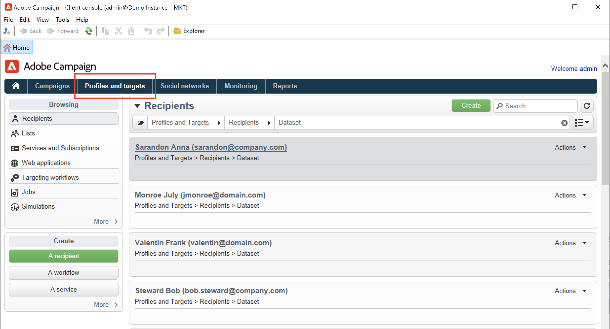

# 手動建立設定檔{#create-profiles-manual}

若要填入Campaign資料庫，您可以 [匯入設定檔](import-profiles.md) 或手動新增，如下所述。

若要手動建立收件者，請遵循下列步驟：

1. 瀏覽至 **[!UICONTROL Profiles and targets]** 標籤並選取 **[!UICONTROL Recipients]** 類別。

   

   依預設，收件者會儲存在 **[!UICONTROL Profiles and Targets > Recipients]** 樹狀結構的節點。 您也可以從此檢視建立收件者。

1. 按一下 **[!UICONTROL Create button]**.
1. 輸入設定檔的資料。

   

   進一步瞭解中的收件者內建表單 [此頁面](view-profiles.md#edit-a-profiles).

1. 按一下 **[!UICONTROL Save]**：設定檔會新增至Campaign的預設收件者資料夾。
