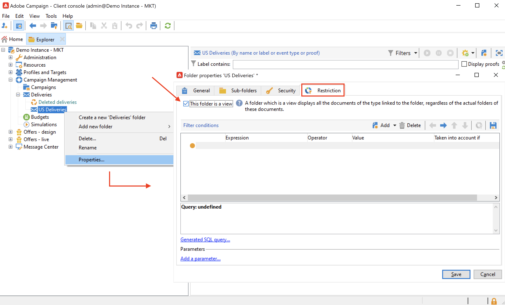

# 管理資料夾和檢視 {#folders-and-views}

Campaign資料夾是瀏覽器樹狀結構中的節點。 根據它們的型別，它們包含特定型別的資料。

檢視是一種特定的資料夾，不包含任何資料，但顯示實際儲存在相同型別之其他資料夾中的資料。 例如，如果您將傳送資料夾轉換為檢視，此資料夾會顯示所有傳送。 然後可以篩選此資料。

>[!NOTE]
>
>為了將檢視與標準資料夾區分開來，它們的名稱會以淺藍色顯示，而非黑色。

請注意，您可以指派許可權給檔案夾，以限制對特定資料的存取。 [了解更多](#restrict-access-to-a-folder)

## 使用資料夾時的最佳實務{#best-practices-folders}

* **使用內建資料夾**，讓參與專案的每個人都能更輕鬆地使用、維護及疑難排解應用程式。 避免建立收件者、清單、傳遞等的自訂資料夾結構，但使用標準資料夾，例如&#x200B;**管理**、**設定檔與目標**、**行銷活動管理**。

* **建立子資料夾**，例如，將您的技術工作流程儲存在內建資料夾： **[!UICONTROL Administration > Production > Technical Workflows]**&#x200B;下，並按工作流程型別建立子資料夾。

* **定義並套用命名慣例**，例如，您可以按字母順序命名工作流程，讓工作流程按執行順序排序，例如：

  A1 — 匯入收件者，從10:00開始；
A2 — 匯入票證，11:00開始。

## 建立資料夾{#create-a-folder}

若要建立資料夾，請在現有資料夾上按一下滑鼠右鍵，並使用內容功能表。

若要建立與您選取的資料夾相同的資料夾型別，請選擇內容功能表中的第一個選項。 例如，從[收件者]資料夾中，選取&#x200B;**[!UICONTROL Create a new 'Recipients' folder]**。

您可以視需要拖放新資料夾以整理Campaign檔案總管樹狀結構。

若要建立其他型別的資料夾，請在現有資料夾上按一下滑鼠右鍵，然後選取&#x200B;**[!UICONTROL Add new folder]**。 您可以根據要儲存的資料，建立所有型別的資料夾。

>[!CAUTION]
>
>這些變更會套用至所有Campaign使用者。

## 將資料夾轉換為檢視{#turn-a-folder-to-a-view}

檢視是一種特定的資料夾，不包含任何資料，但顯示實際儲存在相同型別之其他資料夾中的資料。

您可以將任何資料夾轉換為檢視，但資料夾必須是空的。 將資料夾轉換為檢視時，會刪除資料夾中儲存的任何資料。

>[!IMPORTANT]
>
>不應將現成資料夾轉換為檢視。

>[!CAUTION]
>
>檢視會顯示資料並提供存取權，即使資料並未實際儲存在檢視資料夾中亦然。 操作員若要存取內容，必須在來源資料夾中有適當的許可權，至少是讀取存取權。
>
>若要授予檢視的存取權而不授予其來源資料夾的存取權，請勿授予來源資料夾之父節點的讀取存取權。

在下列範例中，我們將建立一個新資料夾，以根據其內部名稱僅顯示美國的傳送。

1. 建立&#x200B;**[!UICONTROL Deliveries]**&#x200B;資料夾，並將其命名為&#x200B;**US傳遞**。
1. 以滑鼠右鍵按一下此資料夾並選取&#x200B;**[!UICONTROL Properties...]**。
1. 在&#x200B;**[!UICONTROL Restriction]**&#x200B;索引標籤中，選取&#x200B;**[!UICONTROL This folder is a view]**。 然後資料庫中的所有傳遞都會顯示。

   

1. 從視窗中央區段的查詢編輯器定義篩選條件：資料夾中僅顯示與篩選對應的傳送。

   

   >[!NOTE]
   >
   >瞭解如何在[此頁面](create-filters.md#advanced-filters)中設計查詢

>[!CAUTION]
>
>管理[異動訊息](../send/transactional.md)事件時，**[!UICONTROL Real time events]**&#x200B;或&#x200B;**[!UICONTROL Batch events]**&#x200B;資料夾不得在執行例項上設定為檢視，因為這樣可能會導致許可權問題。

## 組織您的資料夾{#organize-your-folders}

依預設，新資料夾會新增到階層的頂端。

瀏覽資料夾屬性的&#x200B;**子資料夾**&#x200B;索引標籤，以組織其子資料夾。

您可以使用右側的箭頭行動資料夾，或選取&#x200B;**[!UICONTROL Sort the sub-folders in alphabetical order]**&#x200B;選項以自動排序。

## 篩選資料夾中的資料{#filter-data-in-a-folder}

若要篩選儲存在資料夾中的資料，請存取資料夾屬性並選取限制標籤。

例如，下列資料夾將僅包含具有電子郵件地址且其來源未標籤為「外部」的連絡人 — 或空白。

## 限制資料夾的存取權{#restrict-access-to-a-folder}

使用檔案夾的許可權來組織和控制Campaign資料的存取。 在[本節](../start/folder-permissions.md)中進一步瞭解資料夾的許可權。
