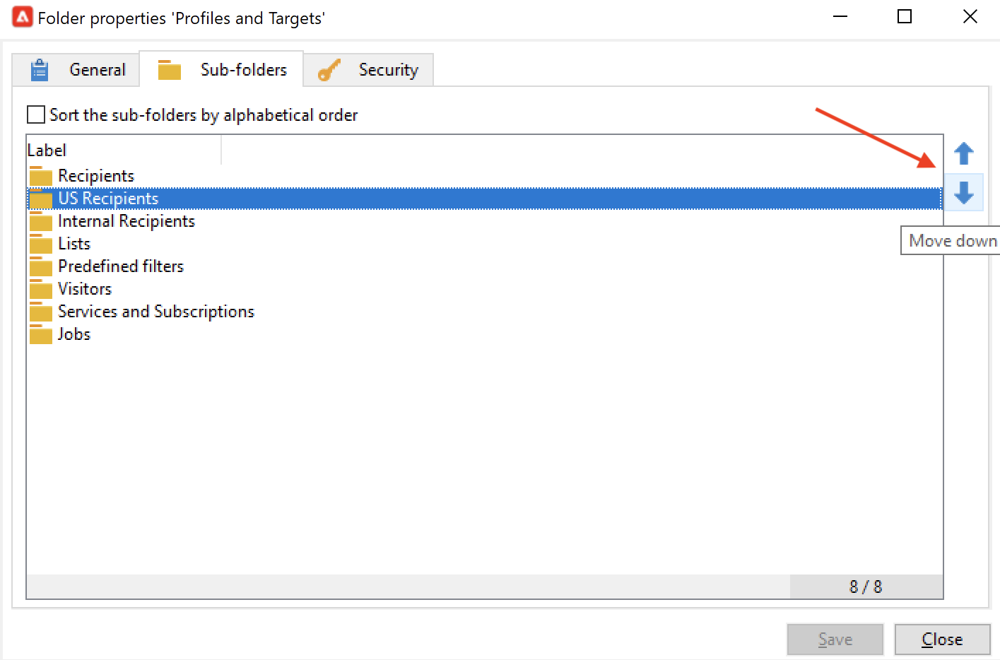

# 管理資料夾和檢視 {#folders-and-views}

促銷活動資料夾是瀏覽器樹狀結構中的節點。 根據其類型，它們包含特定類型的資料。

檢視是特定資料夾，不含任何資料，但會顯示實際儲存在相同類型其他資料夾中的資料。 例如，如果您將傳送資料夾轉換為檢視，此資料夾會顯示所有傳送。 然後可以篩選此資料。

>[!NOTE]
>為了區分視圖和標準資料夾，它們的名稱以淺藍色顯示，而非黑色。

請注意，您可以指派權限給資料夾，以限制對特定資料的存取。 [了解更多](#restrict-access-to-a-folder)

## 使用資料夾時的最佳實務{#best-practices-folders}

* **使用內建資料夾** 讓參與項目的每個人都能更輕鬆地使用、維護和排除應用程式故障。 避免為收件者、清單、傳遞等建立自訂資料夾結構，但請使用標準資料夾，例如 **管理**, **設定檔與目標**, **行銷活動管理**.

* **建立子資料夾**，例如，將技術工作流程儲存在內建資料夾下： **[!UICONTROL Administration > Production > Technical Workflows]**，並根據工作流類型建立子資料夾。

* **定義並套用命名慣例**&#x200B;例如，您可以按字母順序為工作流程命名，讓工作流程以執行順序顯示，例如：

   A1 — 匯入收件者，從10:00開始；A2 — 匯入票證，從11:00開始。

## 建立資料夾{#create-a-folder}

若要建立資料夾，請以滑鼠右鍵按一下現有資料夾，然後使用內容功能表。

若要建立與您選取的資料夾類型相同的資料夾，請在內容功能表中選取第一個選項。 例如，在「收件者」資料夾中，選取 **[!UICONTROL Create a new 'Recipients' folder]**.

您可以拖放新資料夾，以視需要組織Campaign檔案總管樹狀結構。

要建立其他類型的資料夾，請按一下右鍵現有資料夾並選擇 **[!UICONTROL Add new folder]**. 您可以根據要儲存的資料建立所有類型的資料夾。

>[!CAUTION]
>這些變更會套用至所有Campaign使用者。

## 將資料夾轉換為檢視{#turn-a-folder-to-a-view}

檢視是特定資料夾，不含任何資料，但會顯示實際儲存在相同類型其他資料夾中的資料。

您可以將任何資料夾轉換為檢視，但資料夾必須為空白。 將資料夾轉換為視圖時，資料夾中儲存的任何資料都會被刪除。

>[!CAUTION]
>
>視圖顯示資料並提供對資料的訪問，即使資料未實際儲存在視圖資料夾中。 若要存取內容，運算子必須在來源資料夾中擁有適當的權限，至少具有讀取存取權。
>
>要授予對視圖的訪問權而不授予對其源資料夾的訪問權，請勿授予對源資料夾的父節點的讀訪問權。

在下列範例中，我們將根據傳送的內部名稱，建立新資料夾，以僅顯示美國傳送。

1. 建立 **[!UICONTROL Deliveries]** 資料夾，並將其命名 **美國交付**.
1. 按一下右鍵此資料夾並選擇 **[!UICONTROL Properties...]**.
1. 在 **[!UICONTROL Restriction]** 索引標籤中，選取 **[!UICONTROL This folder is a view]**。之後，資料庫中的所有傳送都會顯示。

   

1. 從視窗中央區段的查詢編輯器中定義篩選條件：資料夾中只會顯示與篩選器對應的傳送。

   

   >[!NOTE]
   >
   >了解如何在 [本頁](create-filters.md#advanced-filters)

>[!CAUTION]
>
>管理 [異動訊息](../send/transactional.md) 事件、 **[!UICONTROL Real time events]** 或 **[!UICONTROL Batch events]** 資料夾不得設為執行例項的檢視，因為這可能會導致權限問題。

## 組織資料夾{#organize-your-folders}

依預設，會在階層頂端新增資料夾。

瀏覽 **子資料夾** 頁簽，以組織其子資料夾。

您可以在右側移動帶有箭頭的資料夾，或選取 **[!UICONTROL Sort the sub-folders in alphabetical order]** 選項自動排序。

## 篩選資料夾中的資料{#filter-data-in-a-folder}

要篩選儲存在資料夾中的資料，請訪問資料夾屬性並選擇「限制」頁簽。

例如，以下資料夾將僅包含具有電子郵件地址且其來源未標幟為「外部」或空白的聯絡人。

## 限制對資料夾的訪問{#restrict-access-to-a-folder}

使用資料夾的權限來組織及控制對Campaign資料的存取。

若要編輯特定Campaign資料夾的權限，請遵循下列步驟：

1. 按一下右鍵資料夾，然後選取 **[!UICONTROL Properties...]**.
1. 瀏覽至 **[!UICONTROL Security]** 頁簽查看此資料夾上的授權。

   

* 結束日期 **授權群組或運算子**，按一下 **[!UICONTROL Add]** 按鈕，然後選擇組或運算子以分配此資料夾的授權。
* 結束日期 **禁止組或操作員**，按一下 **[!UICONTROL Delete]** 並選擇要刪除此資料夾授權的組或運算子。
* 結束日期 **選取指派給群組或運算子的權限**，選擇組或運算子，選擇要授予的訪問權限，然後取消選擇其他訪問權限。

### 傳播權限 {#propagate-permissions}

要傳播授權和訪問權限，請選擇 **[!UICONTROL Propagate]** 選項。

然後，此窗口中定義的授權將應用於當前節點的所有子資料夾。 您始終可以為每個子資料夾過載這些授權。

>[!NOTE]
>
>取消勾選 **[!UICONTROL Propagate]** 資料夾的選項不會清除子資料夾的選項：您必須為每個子資料夾明確清除它。

### 授予所有運算子的存取權 {#grant-access-to-all-operators}

在 **[!UICONTROL Security]** 頁簽，選擇 **[!UICONTROL System folder]** 允許所有運算子的存取權（無論其權限為何）。

如果清除了此選項，則必須將運算子（或其組）顯式添加回授權清單中，以使其具有訪問權限。
