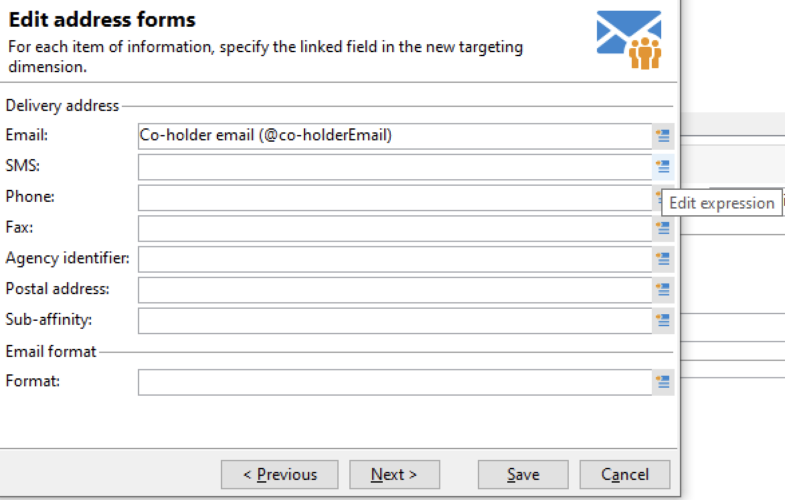

# 使用目標對應{#gs-target-mappings}

根據預設，電子郵件和簡訊傳遞範本的目標為&#x200B;**[!UICONTROL Recipients]**。 因此，它們的目標對應使用&#x200B;**nms:recipient**&#x200B;資料表的欄位。

對於推播通知，預設的目標對應是連結到收件者資料表的&#x200B;**訂閱者應用程式(nms:appSubscriptionRcp)**。

您可以針對傳遞使用其他目標對應，或建立新的目標對應。

## 內建目標對應 {#ootb-mappings}

Adobe Campaign隨附下列內建目標對應：

| 名稱 | 使用至 | 結構描述 |
|---|---|---|
| 收件者 | 傳遞給收件者（內建收件者表格） | nms:recipient |
| 訪客 | 傳遞給已透過轉介（病毒式行銷）針對例如收集設定檔的訪客。 | mns:visitor |
| 訂閱 | 傳遞給已訂閱資訊服務（例如電子報）的收件者 | nms:subscription |
| 訪客訂閱 | 傳遞給訂閱資訊服務的訪客 | nms:visitorSub |
| 運算子 | 傳遞給Adobe Campaign操作者 | nms:operator |
| 外部檔案 | 透過包含傳遞所需所有資訊的檔案傳遞 | 沒有連結的結構描述，沒有輸入目標 |
| 訂閱者應用程式 | 傳遞給已訂閱應用程式的收件者 | nms:appSubscriptionRcp |

## 建立目標對應 {#new-mapping}

您也可以建立目標對應。 例如，在下列情況下，您可能需要新增自訂目標對應：

* 您使用自訂收件者表格，
* 您可以設定與目標對應畫面上內建目標維度不同的篩選維度。

在[此頁面](../dev/custom-recipient.md)中進一步瞭解自訂收件者表格。

Adobe Campaign目標對應建立精靈會協助您建立使用自訂目標對應所需的所有結構描述。

1. 從Adobe Campaign總管瀏覽至&#x200B;**[!UICONTROL Administration]** `>` **[!UICONTROL Campaign Management]** `>` **[!UICONTROL Target mappings]**。

1. 建立新的目標對應，並選取您的自訂結構描述作為目標維度。

   

1. 表示儲存設定檔資訊的欄位：姓氏、名字、電子郵件、地址等。

   

1. 指定資訊儲存的引數，包括可輕鬆識別的擴充功能結構描述的尾碼。

   

   您可以選擇是否要儲存排除專案(**excludelog**)、包含訊息(**broadlog**)或是在個別的資料表中。

   您也可以選擇是否要管理此傳遞對應(**trackinglog**)的追蹤。

1. 然後選取要考慮的擴充功能。 擴充功能型別取決於您的Campaign設定和附加元件。

   

   按一下&#x200B;**[!UICONTROL Save]**&#x200B;按鈕以啟動傳遞對應建立：所有連結表格都會根據選取的引數自動建立。
