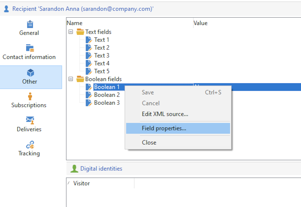
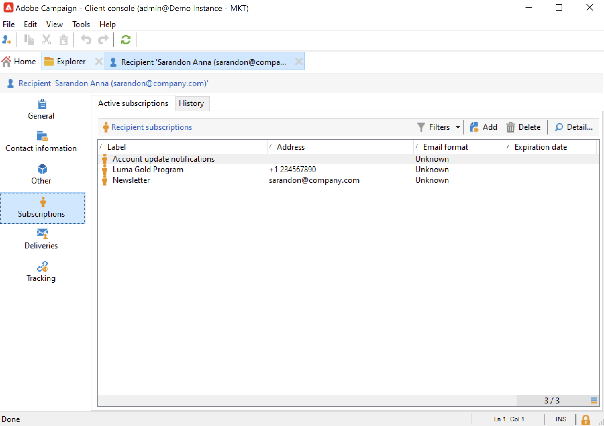

# 檢視現有的設定檔{#view-profiles}

瀏覽至&#x200B;**[!UICONTROL Profiles and targets]**&#x200B;以存取儲存在Adobe Campaign資料庫中的收件者。

從這個頁面，您可以[建立新收件者](create-profiles.md)、編輯現有收件者並存取其設定檔詳細資料。

如需進階設定檔操控，請從Adobe Campaign首頁的&#x200B;**[!UICONTROL Explorer]**&#x200B;連結存取Campaign樹狀結構。

>[!CAUTION]
>
>內建的收件者畫面是透過XML結構描述及其相關表單來定義。 XML結構描述儲存在Adobe Campaign總管樹狀結構的&#x200B;**[!UICONTROL Administration > Configuration > Data schemas]**&#x200B;節點中。 只有資深使用者可以變更這些結構描述。
>

## 編輯輪廓{#edit-a-profiles}

選取設定檔，以在新的索引標籤中顯示詳細資訊。

有關設定檔的資料會分組在索引標籤中。 這些標籤及其內容取決於您的特定設定和已安裝的套件。

對於典型的內建收件者，您可以存取下列標籤：

* **[!UICONTROL General]**，適用於所有一般設定檔資料。 其中特別包含姓氏、名字、電子郵件地址、電子郵件格式等。

  此索引標籤也會儲存設定檔的&#x200B;**選擇退出**&#x200B;旗標：選取&#x200B;**[!UICONTROL No longer contact (by any channel)]**&#x200B;選項時，設定檔會列入封鎖清單。 例如，如果收件者按一下電子報中的取消訂閱連結，此資訊會新增至聯絡資料。 任何頻道（電子郵件、直接郵件等）不再以這類收件者為目標。 如需詳細資訊，請參閱[此頁面](../send/quarantines.md)。

* **連絡資訊**，其中包含所選設定檔的直接郵件地址。

  您可以在此畫面中檢查位址的品質索引，以及該位址包含多少錯誤。 此資訊由直接郵件提供者根據先前傳遞期間發現的錯誤數直接使用，並且無法手動變更。

* **其他**，適用於可以根據您的需求進行個人化及填入的特定欄位。

  使用&#x200B;**[!UICONTROL Field properties…]**&#x200B;內容功能表來變更欄位名稱並定義其格式。

  

  輸入新設定，如下所示：

  

  檢查UI中的更新：

  

  >[!CAUTION]
  >變更會套用至所有收件者。
  >

* **訂閱**，適用於所有使用中的服務訂閱。 使用&#x200B;**歷程記錄**&#x200B;索引標籤來存取此連絡人的訂閱與取消訂閱詳細資料。

  

  在本節](../start/subscriptions.md)中進一步瞭解訂閱[。

* 針對所選設定檔的所有傳遞記錄，**傳遞**。 使用此索引標籤來存取連絡人的行銷記錄：透過所有管道傳送到設定檔的所有傳遞動作的標籤、日期和狀態。

* **追蹤**，針對所選設定檔的所有追蹤記錄。 此資訊用於追蹤傳送後的設定檔行為。 此索引標籤顯示傳送中追蹤的所有URL的累積總數。 清單可設定，通常包含：點選的URL、點選的日期和時間，以及包含URL的檔案

  在本節](../start/tracking.md)中進一步瞭解追蹤[。
