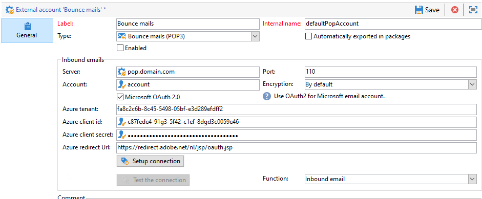

# 設定外部帳戶

Adobe Campaign 隨附一組預先定義的外部帳戶。若要設定與外部系統的連線，您可以建立新的外部帳戶。

技術流程（例如技術工作流程或宣傳工作流程）會使用外部帳戶。例如，在工作流程中設定檔案傳輸，或與任何其他應用程式(Adobe Target、Experience Manager等)進行資料交換時，您需要選取外部帳戶。

您可以從Adobe Campaign存取外部帳戶 **[!UICONTROL Explorer]**:瀏覽 **[!UICONTROL Administration]** `>` **[!UICONTROL Platform]** `>` **[!UICONTROL External accounts]**.

>[!CAUTION]
>* 作為「受管Cloud Services」用戶，外部帳戶是按Adobe配置的，不能修改。

>
>* >在 [企業(FFDA)部署](../architecture/enterprise-deployment.md)，特定 **[!UICONTROL Full FDA]** (ffda)外部帳戶管理Campaign本機資料庫和雲端資料庫([!DNL Snowflake])。
>

## 促銷活動專用外部帳戶

Adobe Campaign會使用下列技術帳戶來啟用及執行特定程式。

### 退回郵件 {#bounce-mails-external-account}

>[!NOTE]
自Campaign v8.3起，即可使用POP3功能的Microsoft Exchange Online OAuth 2.0驗證。若要檢查您的版本，請參閱 [本節](../start/compatibility-matrix.md#how-to-check-your-campaign-version-and-buildversion).

此 **退回郵件** 外部帳戶指定用於連接到電子郵件服務的外部POP3帳戶。 所有為POP3訪問配置的伺服器都可用於接收返回郵件。

進一步了解傳入電子郵件(位於 [本頁](https://experienceleague.adobe.com/docs/campaign/automation/workflows/wf-activities/event-activities/inbound-emails.html).

若要設定 **[!UICONTROL Bounce mails (defaultPopAccount)]** 外部帳戶：

* **[!UICONTROL Server]** - POP3伺服器的URL。

* **[!UICONTROL Port]** - POP3連接埠號。 預設埠為110。

* **[!UICONTROL Account]**  — 使用者名稱。

* **[!UICONTROL Password]**  — 用戶帳戶密碼。

* **[!UICONTROL Encryption]**  — 選擇的加密類型 **[!UICONTROL By default]**, **[!UICONTROL POP3 + STARTTLS]**, **[!UICONTROL POP3]** 或 **[!UICONTROL POP3S]**.

   此 **退回郵件** 外部帳戶指定用於連接到電子郵件服務的外部POP3帳戶。 所有為POP3訪問配置的伺服器都可用於接收返回郵件。

* **[!UICONTROL Function]**  — 傳入電子郵件或SOAP路由器

>[!CAUTION]
使用Microsoft OAuth 2.0設定POP3外部帳戶前，您必須先在Azure入口網站中註冊應用程式。 如需關於此項目的詳細資訊，請參閱此[頁面](https://docs.microsoft.com/en-us/azure/active-directory/develop/quickstart-register-app){target="_blank"}.

若要使用Microsoft OAuth 2.0設定POP3外部，請檢查 **[!UICONTROL Microsoft OAuth 2.0]** 選項並填寫下列欄位：

* **[!UICONTROL Azure tenant]**  — 可在 **要點** Azure入口網站中應用程式概述的下拉式清單。

* **[!UICONTROL Azure Client ID]**  — 在 **要點** Azure入口網站中應用程式概述的下拉式清單。

* **[!UICONTROL Azure Client secret]**  — 可在 **用戶端密碼** 欄 **憑證與機密** Azure門戶中的應用程式菜單。

* **[!UICONTROL Azure Redirect URL]**  — 可在 **驗證** Azure門戶中的應用程式菜單。 結尾應為下列語法 `nl/jsp/oauth.jsp`，例如 `https://redirect.adobe.net/nl/jsp/oauth.jsp`.

   輸入不同的憑證後，您可以按一下 **[!UICONTROL Setup the connection]** 完成外部帳戶配置。

### 路由 {#routing}

此 **[!UICONTROL Routing]** 外部帳戶可讓您根據安裝的套件，設定Adobe Campaign中可用的每個管道。

>[!CAUTION]
此 **[!UICONTROL Internal email delivery routing]** (defaultEmailBulk)外部帳戶 **不能** 在Adobe Campaign v8中啟用。

### 執行實例 {#execution-instance}

在交易式訊息傳送的內容中，執行例項會連結至控制例項並加以連結。 交易式訊息範本會部署至執行例項。 進一步了解訊息中心架構，位於 [本頁](../architecture/architecture.md#transac-msg-archi).

## 訪問外部系統外部帳戶

* **外部資料庫(FDA)** - **外部資料庫** 類型外部帳戶是用來透過同盟資料存取(FDA)連線至外部資料庫。 深入了解同盟資料存取(FDA)選項，位於 [本節](../connect/fda.md).

   與Adobe Campaign v8相容的外部資料庫列於 [相容性矩陣](../start/compatibility-matrix.md)

* **Twitter** - **Twitter** 輸入外部帳戶可用來將Campaign連線至您的twitter帳戶，以代表您發佈訊息。 深入了解Twitter整合，位於 [本節](../connect/ac-tw.md).

## Adobe解決方案整合外部帳戶

* **Adobe Experience Cloud** - **[!UICONTROL Adobe Experience Cloud]** 外部帳戶是實作AdobeIdentity Management服務(IMS)以連線至Adobe Campaign。 進一步了解AdobeIdentity Management服務(IMS)，位於 [本節](../start/connect.md#connect-ims).

* **網站分析** - **[!UICONTROL Web Analytics (Adobe Analytics)]** 外部帳戶可用來設定從Adobe Analytics到Adobe Campaign的資料傳輸。 深入了解Adobe Campaign - Adobe Analytics在 [本頁](../connect/ac-aa.md).

* **Adobe Experience Manager** - **[!UICONTROL AEM]** 外部帳戶可讓您直接在Adobe Experience Manager中管理電子郵件傳送的內容以及表單。 深入了解Adobe Campaign - Adobe Analytics在 [本頁](../connect/ac-aem.md).

## CRM連接器外部帳戶

* **Microsoft Dynamics CRM** - **[!UICONTROL Microsoft Dynamics CRM]** 外部帳戶可讓您將Microsoft Dynamics資料匯入和匯出至Adobe Campaign。 深入了解Adobe Campaign - Microsoft Dynamics CRM整合，位於 [本頁](../connect/ac-ms-dyn.md).

* **Salesforce.com** - **[!UICONTROL Salesforce CRM]** 外部帳戶可讓您將Salesforce資料匯入和匯出至Adobe Campaign。 深入了解Adobe Campaign - Salesforce.com CRM整合，位於 [本頁](../connect/ac-sfdc.md).

## 傳輸資料外部帳戶

這些外部帳戶可用來匯入或匯出資料至Adobe Campaign，使用 **[!UICONTROL Transfer file]** 工作流程活動。 深入了解 **檔案傳輸** 在 [本頁](https://experienceleague.adobe.com/docs/campaign/automation/workflows/wf-activities/event-activities/file-transfer.html).

* **FTP和SFTP** - **FTP** 外部帳戶可讓您設定及測試對Adobe Campaign以外之伺服器的存取權。 若要設定與外部系統（例如用於檔案傳輸的SFTP或FTP伺服器898）的連線，您可以建立自己的外部帳戶。

   若要這麼做，請在此外部帳戶中指定用來建立與SFTP或FTP伺服器連線的位址和憑證。

* **Amazon Simple Storage Service(S3)** - **AWS S3** 連接器可用來匯入或匯出資料至Adobe Campaign，使用 **[!UICONTROL Transfer file]** 工作流程活動。 當您設定此新外部帳戶時，您必須提供下列詳細資訊：

   * **[!UICONTROL AWS S3 Account Server]**:伺服器的URL，填入如下：   `<S3bucket name>.s3.amazonaws.com/<s3object path>`

   * **[!UICONTROL AWS access key ID]**:了解如何在 [Amazon檔案](https://docs.aws.amazon.com/general/latest/gr/aws-sec-cred-types.html#access-keys-and-secret-access-keys){target="_blank"}.

   * **[!UICONTROL Secret access key to AWS]**:了解如何在中找到您的AWS秘密存取金鑰 [Amazon檔案](https://aws.amazon.com/fr/blogs/security/wheres-my-secret-access-key/){target="_blank"}.

   * **[!UICONTROL AWS Region]**:進一步了解AWS地區： [Amazon檔案](https://aws.amazon.com/about-aws/global-infrastructure/regions_az/){target="_blank"}.

   * 此 **[!UICONTROL Use server side encryption]** 核取方塊可讓您以S3加密模式儲存檔案。 了解如何在 [Amazon檔案](https://docs.aws.amazon.com/general/latest/gr/aws-sec-cred-types.html#access-keys-and-secret-access-keys){target="_blank"}.

* **Azure Blob儲存** - **Azure** 外部帳戶可用來匯入或匯出資料至Adobe Campaign，使用 **[!UICONTROL Transfer file]** 工作流程活動。 若要設定 **Azure** 外部帳戶才能與Adobe Campaign搭配使用，您需要提供下列詳細資料：

   * **[!UICONTROL Server]**:Azure Blob儲存伺服器的URL。

   * **[!UICONTROL Encryption]**:之間的加密類型 **[!UICONTROL None]** 或 **[!UICONTROL SSL]**.

   * **[!UICONTROL Access key]**:了解如何找到您的 **[!UICONTROL Access key]** in [Microsoft檔案](https://docs.microsoft.com/en-us/azure/storage/common/storage-account-keys-manage?tabs=azure-portal){target="_blank"}.
