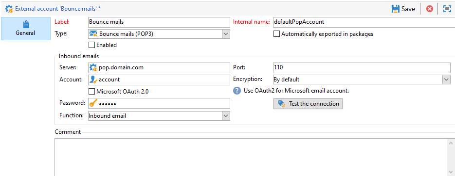

# 設定外部帳戶 {#config-external-accounts}

Adobe Campaign 隨附一組預先定義的外部帳戶。若要設定與外部系統的連線，您可以建立新的外部帳戶。

技術流程（例如技術工作流程或宣傳工作流程）會使用外部帳戶。例如，在工作流程中或與任何其他應用程式(Adobe Target、Experience Manager等)進行資料交換時，您需要選取外部帳戶。

您可以從Adobe Campaign **[!UICONTROL Explorer]**&#x200B;存取外部帳戶：瀏覽至&#x200B;**[!UICONTROL Administration]** `>` **[!UICONTROL Platform]** `>` **[!UICONTROL External accounts]**。

>[!CAUTION]
>
>* 作為Managed Cloud Services使用者，外部帳戶已由Adobe針對您的執行個體進行設定，且不得修改。
>
>* 在[企業(FFDA)部署](../architecture/enterprise-deployment.md)的內容中，特定的&#x200B;**[!UICONTROL Full FDA]** (ffda)外部帳戶管理Campaign本機資料庫與雲端資料庫([!DNL Snowflake])之間的連線。
>

## 促銷活動特定外部帳戶 {#ac-external-accounts}

Adobe Campaign使用下列技術帳戶來啟用及執行特定流程。

### 退回郵件 {#bounce-mails-external-account}

>[!NOTE]
>
>自Campaign v8.3開始，即可使用適用於POP3功能的Microsoft Exchange Online OAuth 2.0驗證。若要檢查您的版本，請參閱[本節](../start/compatibility-matrix.md#how-to-check-your-campaign-version-and-buildversion)。
>

**退回郵件**&#x200B;外部帳戶指定要用來連線至電子郵件服務的外部POP3帳戶。 所有設定為POP3存取的伺服器都可以用來接收傳回郵件。

在[此頁面](https://experienceleague.adobe.com/docs/campaign/automation/workflows/wf-activities/event-activities/inbound-emails.html){target="_blank"}中進一步瞭解傳入電子郵件。

若要設定&#x200B;**[!UICONTROL Bounce mails (defaultPopAccount)]**&#x200B;外部帳戶：

* **[!UICONTROL Server]** - POP3伺服器的URL。

* **[!UICONTROL Port]** - POP3連線埠號碼。 預設連線埠為110。

* **[!UICONTROL Account]** — 使用者名稱。

* **[!UICONTROL Password]** — 使用者帳戶密碼。

* **[!UICONTROL Encryption]** — 選擇的加密型別，介於&#x200B;**[!UICONTROL By default]**、**[!UICONTROL POP3 + STARTTLS]**、**[!UICONTROL POP3]**&#x200B;或&#x200B;**[!UICONTROL POP3S]**&#x200B;之間。

  **退回郵件**&#x200B;外部帳戶指定要用來連線至電子郵件服務的外部POP3帳戶。 所有設定為POP3存取的伺服器都可以用來接收傳回郵件。

* **[!UICONTROL Function]** — 傳入電子郵件或SOAP路由器

>[!CAUTION]
>
>使用Microsoft OAuth 2.0設定POP3外部帳戶之前，您必須先在Azure入口網站中註冊應用程式。 如需詳細資訊，請參閱此[頁面](https://docs.microsoft.com/en-us/azure/active-directory/develop/quickstart-register-app){target="_blank"}。
>

若要使用Microsoft OAuth 2.0設定POP3外部連結，請核取&#x200B;**[!UICONTROL Microsoft OAuth 2.0]**&#x200B;選項並填寫下列欄位：

* **[!UICONTROL Azure tenant]** - Azure ID (或目錄（租使用者） ID)可以在Azure入口網站應用程式概觀的&#x200B;**Essentials**&#x200B;下拉式清單中找到。

* **[!UICONTROL Azure Client ID]** — 使用者端ID (或應用程式（使用者端） ID)可以在Azure入口網站應用程式概觀的&#x200B;**Essentials**&#x200B;下拉式清單中找到。

* **[!UICONTROL Azure Client secret]** — 使用者端密碼識別碼可在Azure入口網站應用程式的&#x200B;**憑證與密碼**&#x200B;功能表的&#x200B;**使用者端密碼**&#x200B;欄中找到。

* **[!UICONTROL Azure Redirect URL]** — 可在Azure入口網站應用程式的&#x200B;**驗證**&#x200B;功能表中找到重新導向URL。 它應該以下列語法`nl/jsp/oauth.jsp`結束，例如`https://redirect.adobe.net/nl/jsp/oauth.jsp`。

  輸入不同的認證後，您可以按一下&#x200B;**[!UICONTROL Setup the connection]**&#x200B;完成外部帳戶設定。

### 路由 {#routing}

**[!UICONTROL Routing]**&#x200B;外部帳戶可讓您根據安裝的套件，設定Adobe Campaign中可用的每個管道。

在[本節](../architecture/architecture.md#split)中進一步瞭解外部帳戶管理和傳遞執行。

### 執行執行個體 {#execution-instance}

在交易式訊息環境中，執行例項會連結至控制例項並加以連結。 將異動訊息範本部署至執行例項。 在[此頁面](../architecture/architecture.md#transac-msg-archi)中進一步瞭解Message Center架構。

## 存取外部系統外部帳戶 {#external-syst-external-accounts}

* **外部資料庫(FDA)** - **外部資料庫**&#x200B;型別的外部帳戶是用來透過同盟資料存取(FDA)連線到外部資料庫。 在[本節](../connect/fda.md)中進一步瞭解同盟資料存取(FDA)選項。

  與Adobe Campaign v8相容的外部資料庫列在[相容性矩陣](../start/compatibility-matrix.md)中

* **X （先前稱為Twitter）** - **Twitter**&#x200B;型別外部帳戶可用來將Campaign連線至您的X帳戶，以代表您張貼訊息。 在[本節](../connect/ac-tw.md)中進一步瞭解X整合。

## Adobe解決方案整合外部帳戶 {#adobe-integration-external-accounts}

* **Adobe Experience Cloud** - **[!UICONTROL Adobe Experience Cloud]**&#x200B;外部帳戶用於實作Adobe Identity Management Service (IMS)以連線至Adobe Campaign。 在[本節](../start/connect.md#logon-to-ac)中進一步瞭解Adobe Identity Management服務(IMS)。

* **網站分析** - **[!UICONTROL Web Analytics (Adobe Analytics)]**&#x200B;外部帳戶用於設定從Adobe Analytics到Adobe Campaign的資料傳輸。 在[此頁面](../connect/ac-aa.md)中進一步瞭解Adobe Campaign - Adobe Analytics整合。

* **Adobe Experience Manager** - **[!UICONTROL AEM]**&#x200B;外部帳戶可讓您直接在Adobe Experience Manager中管理電子郵件傳遞的內容以及表單。 在[此頁面](../connect/ac-aem.md)中進一步瞭解Adobe Campaign - Adobe Analytics整合。

## CRM聯結器外部帳戶 {#crm-external-accounts}

* **Microsoft Dynamics CRM** - **[!UICONTROL Microsoft Dynamics CRM]**&#x200B;外部帳戶可讓您將Microsoft Dynamics資料匯入及匯出至Adobe Campaign。 在[此頁面](../connect/ac-ms-dyn.md)中進一步瞭解Adobe Campaign - Microsoft Dynamics CRM整合。

* **Salesforce.com** - **[!UICONTROL Salesforce CRM]**&#x200B;外部帳戶可讓您將Salesforce資料匯入及匯出至Adobe Campaign。 深入瞭解Adobe Campaign - Salesforce.com CRM整合於[此頁面](../connect/ac-sfdc.md)。

## 傳輸資料外部帳戶 {#transfer-data-external-accounts}

這些外部帳戶可用來匯入或匯出資料至Adobe Campaign （使用&#x200B;**[!UICONTROL Transfer file]**&#x200B;工作流程活動）。 深入瞭解[此頁面](https://experienceleague.adobe.com/docs/campaign/automation/workflows/wf-activities/event-activities/file-transfer.html){target="_blank"}工作流程中的&#x200B;**檔案傳輸**。

* **FTP和SFTP** - **FTP**&#x200B;外部帳戶可讓您設定並測試對Adobe Campaign外部伺服器的存取權。 若要設定與外部系統（例如用於檔案傳輸的SFTP或FTP伺服器898）的連線，您可以建立自己的外部帳戶。

  若要這麼做，請在此外部帳戶中指定用來建立與SFTP或FTP伺服器連線的位址和認證。

  >[!NOTE]
  >
  >從版本8.5開始，您現在可以在設定SFTP外部帳戶時，使用私密金鑰安全地驗證。 [進一步瞭解金鑰管理](https://experienceleague.adobe.com/docs/control-panel/using/sftp-management/key-management.html){target="_blank"}。

* **Amazon Simple Storage Service (S3)** - **AWS S3**&#x200B;聯結器可用來使用&#x200B;**[!UICONTROL Transfer file]**&#x200B;工作流程活動將資料匯入或匯出至Adobe Campaign。 當您設定此新外部帳戶時，您必須提供下列詳細資訊：

   * **[!UICONTROL AWS S3 Account Server]**：您伺服器的URL，填入如下：   `<S3bucket name>.s3.amazonaws.com/<s3object path>`

   * **[!UICONTROL AWS access key ID]**：在[AWS檔案](https://docs.aws.amazon.com/general/latest/gr/aws-sec-cred-types.html#access-keys-and-secret-access-keys){target="_blank"}中瞭解如何尋找您的Amazon存取金鑰ID。

   * **[!UICONTROL Secret access key to AWS]**：在[AWS檔案](https://aws.amazon.com/fr/blogs/security/wheres-my-secret-access-key/){target="_blank"}中瞭解如何尋找Amazon的秘密存取金鑰。

   * **[!UICONTROL AWS Region]**：在[AWS檔案](https://aws.amazon.com/about-aws/global-infrastructure/regions_az/){target="_blank"}中進一步瞭解Amazon地區。

   * **[!UICONTROL Use server side encryption]**&#x200B;核取方塊可讓您以S3加密模式儲存檔案。 在[Amazon檔案](https://docs.aws.amazon.com/general/latest/gr/aws-sec-cred-types.html#access-keys-and-secret-access-keys){target="_blank"}中瞭解如何尋找存取金鑰ID和機密存取金鑰。

* **Azure Blob儲存體** - **Azure**&#x200B;外部帳戶可用來使用&#x200B;**[!UICONTROL Transfer file]**&#x200B;工作流程活動將資料匯入或匯出至Adobe Campaign。 若要設定&#x200B;**Azure**&#x200B;外部帳戶以搭配Adobe Campaign使用，您必須提供下列詳細資料：

   * **[!UICONTROL Server]**： Azure Blob儲存伺服器的URL。

   * **[!UICONTROL Encryption]**：加密型別介於&#x200B;**[!UICONTROL None]**&#x200B;或&#x200B;**[!UICONTROL SSL]**&#x200B;之間。

   * **[!UICONTROL Access key]**：在[Microsoft檔案](https://docs.microsoft.com/en-us/azure/storage/common/storage-account-keys-manage?tabs=azure-portal){target="_blank"}中瞭解如何尋找您的&#x200B;**[!UICONTROL Access key]**。
